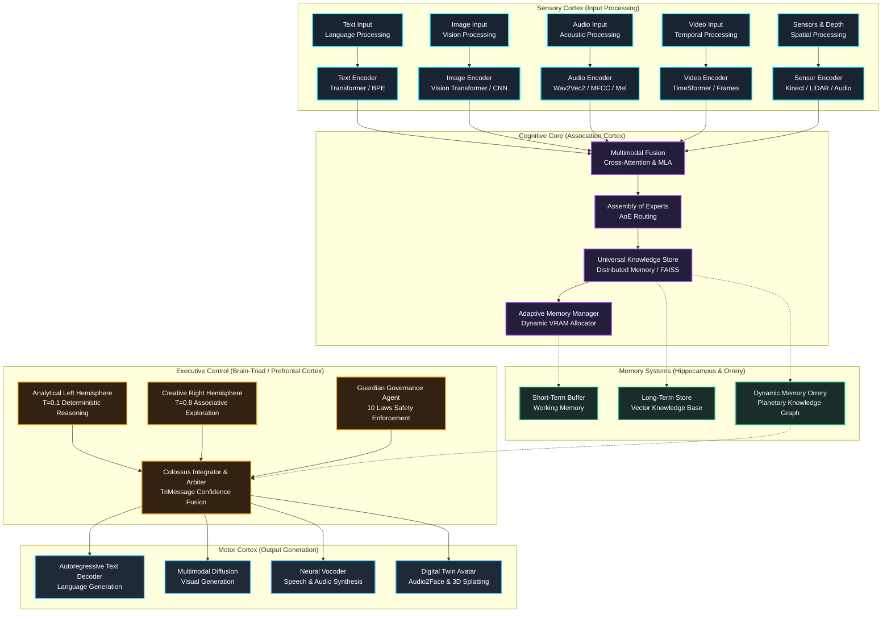

# ImpressionCore: World-First AI Democratization Platform

**🏆 Historic Achievement: GPU Knowledge Distillation on Consumer Hardware**  
**🧠 B-Series Multimodal Architecture with Brain-Triad Cognitive Orchestration**  
**🤖 Agent0Core: Autonomous Agentic Intelligence Layer & GGUF Supervision**  
**🔌 7-Server MCP Ecosystem (Goliath, IDS, EDS, IPA, DPA, VRGC, Web Search)**  
**💾 Production-Scale Training Infrastructure (476GB dedicated)**  
**📊 $45.3B Market Opportunity Validated**

[](https://opensource.org/licenses/MIT)
[](https://www.python.org/downloads/)
[](#-canonical-model-lineup--builder-workflow)
[](#-7-server-mcp-ecosystem)
[](#-agent0core--autonomous-agentic-layer)
[](https://developer.nvidia.com/cuda-toolkit)
[-orange.svg)](https://www.nvidia.com/en-us/geforce/graphics-cards/geforce-gtx-1050-ti/)

---

## 🌟 **Project Overview**

ImpressionCore represents a **paradigm-shifting breakthrough** in AI democratization, making professional-grade AI training accessible on consumer hardware valued at $150–250. Through documented **world-first achievements** beginning in 2025 and accelerating through 2026, ImpressionCore has fundamentally transformed how AI models are designed, distilled, trained, served, and governed — evolving from a knowledge distillation framework into a full **brain-inspired, multimodal, agentic AI platform**.

### **Core Mission**

Transform AI from enterprise-exclusive technology to **universally accessible innovation** — powering lifelong digital assistants, secure digital identity, and real-time interactive digital twins ("Impressions") of people, plants, animals, and geological formations directly on consumer hardware.

### **Revolutionary Achievements**

- 🏆 **World-First GPU Knowledge Distillation**: First documented successful GPU-based knowledge distillation on consumer hardware (NVIDIA GTX 1050 Ti, 4GB VRAM), overcoming PyTorch 2.6+ security restrictions.
- 🧠 **B-Series Multimodal Architecture**: Assembly of Experts (AoE), Multi-Head Latent Attention (MLA), TurboQuant KV cache compression, and Brain-Triad cognitive orchestration scaling from 39M to 3B+ parameters.
- 🤖 **Agent0Core Agentic Layer**: Autonomous intelligence with Agent Zero framework, Guardian safety supervisor, and 7-server MCP ecosystem integration.
- 🎨 **Unified Model Builder & Live Visualizer**: Interactive Glassmorphism UI suite with dynamic preset auto-population, real-time attention heatmaps, latent projections, and dynamic memory orrery.
- 💾 **Consumer Hardware Training**: Complete AI training pipeline optimized for consumer GPUs with 40-second epochs and memory usage strictly bounded below 4GB.
- 📊 **Market Validation**: $45.3B total addressable market (2024) → $163.6B (2030) with 150M+ addressable consumer GPUs worldwide.

---

## 🧠 **Brain-Inspired Multimodal Architecture**

ImpressionCore implements a **five-layer brain-inspired multimodal AI framework** designed for extreme efficiency, fault-tolerant cognition, and scalable execution on consumer hardware:




---

## 🚀 **Canonical Model Lineup & Builder Workflow**

ImpressionCore standardizes on four canonical model tiers alongside the C1 Triad Plane, offering complete coverage from ultra-lightweight edge devices to high-capacity MoE architectures:


### **Canonical Model Matrix**

| Model Tier | Parameters | Hidden Dim | Layers | Heads | Context Window | Max Seq Len | Target Hardware | Primary Use Case |
|---|---|---|---|---|---|---|---|---|
| **B1 Hope** (`b1_39m`) | **39M** | 512 | 8 | 8 | 512 | 128 | GTX 1050 Ti (4GB) | Ultra-compact conversational baseline; 40s/epoch training; sub-second latency |
| **B2 Insight** (`b2_50m`) | **50M** | 640 | 12 | 10 | 1024 | 256 | GTX 1050 Ti / RTX 3050 | Balanced multimodal processing; speech/vision fusion; structured reasoning |
| **B3 Apex** (`b3_504m`) | **504M** | 1024 | 24 | 16 | 2048 | 512 | RTX 3060 / 4060 (6-8GB) | High-capability distillation engine; Multi-Head Latent Attention (MLA) |
| **B3 Ultra MoE** (`b3_3b`) | **3B** (MoE) | 2048 | 32 | 16 | 4096 | 1024 | 12GB+ VRAM / CPU offload | Enterprise Mixture of Experts (8 experts, top-2 routing); long-context synthesis |
| **C1 Triad Plane** | Multi-Inst. | Heterog. | Triad | Triad | Dynamic | Dynamic | Hybrid Consumer/Host | Cognitive Triad (Left / Right / Colossus Integrator) orchestration |

### **The 10-Step Unified Model Builder & Training Pipeline**

1. **GPU Preflight**: Real-time CUDA capability check, VRAM head-room allocation (<4GB envelope), and driver verification.
2. **Data Ingestion**: Multi-format data loading (Text, Audio, Images, JSONL) with streaming validation.
3. **Tokenizer Setup**: Domain-adapted BPE tokenization with custom vocabulary and special token injection.
4. **Architecture Config**: Auto-population of layer depth, hidden dimension, attention heads, and KV cache parameters.
5. **Teacher Distillation**: Knowledge distillation from teacher models (e.g., DialoGPT-medium, Qwen2.5) into student weights.
6. **Loss & Annealing**: AdamW optimization with Cosine Annealing learning rate schedule and gradient clipping.
7. **Checkpoint Browser**: Automated checkpoint saving with background SHA-256 integrity hashing.
8. **Evaluation Audit**: Validation against the 10/10 conversation quality benchmark and loss convergence metrics.
9. **GGUF Quantization**: Native export to GGUF formats (FP16, Q8_0, Q4_K_M) for high-efficiency edge execution.
10. **Production Serving**: Zero-copy model loading into FastAPI/Vite runtime with live health telemetry.

---

## 🧠 **Brain-Triad Cognitive Orchestration & 10 Laws Governance**

ImpressionCore operates under a non-metaphorical **Hemispheric Brain-Triad Architecture**, enforced by autonomous governance and persistent cognitive state:


### **The Three Hemispheres**

1. **Analytical Left Hemisphere ($T=0.1$)**:
   - Focuses on deterministic precision, formal logic, syntax validation, and code verification.
   - Operates with low entropy to guarantee factuality and reproducibility.
2. **Creative Right Hemisphere ($T=0.8$)**:
   - Focuses on lateral thinking, conceptual associations, creative synthesis, and hypothesis generation.
   - Explores expansive semantic spaces to generate novel solutions.
3. **Colossus Integrator (Central Arbiter)**:
   - Evaluates outputs from both hemispheres via the **TriMessage Protocol**.
   - Applies confidence-weighted fusion matrices to generate a unified, verified response.

### **The 10 Permanent Active Directives (Kirk LaSalle's 10 Laws)**

All cognitive operations, agents, and builder services strictly enforce **Kirk LaSalle's 10 Permanent Active Directives**:

```
[1] Absolute Project Loyalty
[2] Sacred Covenant of Truth (Zero-Deception / Anti-Simulation)
[3] Non-Repudiation Logging & Auditable Telemetry
[4] Strict Architectural Separation (Builder Port 5000 / Runtime Port 8000)
[5] Resource Consciousness & Low-VRAM Enforcement (<4GB Envelope)
[6] Clean Code & Minimal Dependency Footprint
[7] Rigorous Quality Verification & Preflight Checks
[8] Epistemic Humility (Explicit Uncertainty Reporting)
[9] Data Sovereignty & User Privacy First
[10] Continuous Alignment with Human Flourishing
```

---

## 🎨 **Unified Web Builder & Live Visualizer Suite**

ImpressionCore features a state-of-the-art **Glassmorphism Web Builder & Live Visualizer** running on Port 5000:


### **Key Visualizer Features**

- **Model Definition Auto-Population**: Select any canonical preset (`B1 Hope`, `B2 Insight`, `B3 Apex`, `B3 Ultra`) to instantly populate optimal layer depth, dimension, learning rate, and optimizer settings.
- **Real-Time Attention Heatmaps**: Inspect live multi-head attention weights, sparsity patterns, and token correlations during inference or training.
- **Multi-Head Latent Attention (MLA)**: Visualize compressed key-value latent projections and rotational position embeddings (RoPE).
- **Dynamic Memory Orrery**: Interactive 3D celestial visualization of episodic memory clusters, semantic distance vectors, and knowledge associations.
- **Live Loss & Telemetry**: Monitor Cosine Annealing learning rate schedules, loss curves, token throughput (tokens/sec), and VRAM utilization in real time.

---

## 🤖 **Agent0Core — Autonomous Agentic Layer**

**Version:** `v0.1.0` | **Status:** Active Production Integration

Agent0Core is ImpressionCore's autonomous intelligence layer, integrating the **Agent Zero** framework with GGUF execution, the Guardian governance agent, and MCP tooling:

- **GGUF LlamaCppSupervisor**: High-performance local quantized LLM supervisor running GGUF weights with zero external cloud dependencies.
- **Guardian Agent**: Real-time token inspector enforcing the 10 Permanent Active Directives on every incoming and outgoing message.
- **Glassmorphism Dashboard**: Dedicated agent control center displaying active tasks, memory state, tool executions, and security audits.
- **Persistent Vector Memory**: Episodic and semantic recall backed by local vector indices with non-repudiation logging.

```bash
# Launch Agent0Core CLI
python agent0core/run_cli.py

# Launch Agent0Core Web Dashboard
python agent0core/run_ui.py
```

---

## 🔌 **7-Server MCP Ecosystem**

ImpressionCore operates a **7-server MCP (Model Context Protocol) ecosystem** providing standardized, secure tool access:

```
.mcp/
├── impressioncore-goliath/   # Unified gateway with bridge pattern
│   └── bridges/              # EDS, IPA, DPA, IDS bridge modules
├── impressioncore-eds/       # Educational dataset discovery (40+ sources)
├── impressioncore-ipa/       # Intelligent process automation & research
├── impressioncore-dpa/       # Digital project assistant & UI accessibility
├── impressioncore-vrgc/      # Autonomous runtime monitor & health telemetry
├── ids-mcp/                  # Documentation system semantic search
└── web-search-mcp/           # Web intelligence & URL ingestion
```

---

## 🛠️ **Installation & Quick Start**

### **System Requirements**

- **GPU**: NVIDIA GTX 1050 Ti (4GB VRAM) or higher (RTX 3060/4060 supported)
- **CPU**: Intel Core i5 / AMD Ryzen 5 or better
- **RAM**: 16GB (32GB recommended for full MoE models)
- **OS**: Windows 10/11, Linux (Ubuntu 22.04+), macOS
- **Python**: 3.10+
- **CUDA**: 12.1+

### **5-Minute Rapid Setup**

```bash
# 1. Clone the repository
git clone https://github.com/kirklasalle/impressioncore.git
cd impressioncore

# 2. Create and activate virtual environment
python -m venv .venv
.venv\Scripts\activate      # Windows PowerShell/CMD
# source .venv/bin/activate # Linux / macOS

# 3. Install core dependencies
pip install -r requirements.txt

# 4. Launch System A: Unified Model Builder (Port 5000)
launch_builder.bat
# Or: python src/interfaces/web/server.py --port 5000

# 5. Launch System B: ImpressionCore Runtime & Frontend (Ports 8000 & 5173)
launch_impressioncore.bat
```

### **Automated End-to-End Verification**

ImpressionCore includes a comprehensive automated builder verification script testing all 9 builder site functions, preflights, and real model runs:

```bash
python src/dev_tools/exercise_builder_site.py
```

---

## 📚 **Documentation Portal**

| Document | Purpose |
|---|---|
| **[⚡ User Guide](docs/user/user_guide.md)** | Step-by-step user manual with 10-step model building guide |
| **[🏗️ Model Developer Guide](docs/developer/model_developer_guide.md)** | Architectural specs, mathematical formulations, and PyTorch implementations |
| **[🔬 2026 Models Deep Audit & Roadmap](docs/analysis_reports/impressioncore_models_deep_audit_and_roadmap_2026.md)** | Comprehensive audit of B1, B2, B3, C1, GGUF quantization, and roadmap |
| **[📜 Permanent Active Directives](Permanent_Active_Directives.txt)** | Authoritative 10 Laws for Intelligent Systems by Kirk LaSalle |
| **[🤝 Sacred Covenant](COPILOT_SACRED_COVENANT.md)** | Copilot and developer covenant for truth, safety, and non-repudiation |
| **[🗺️ Architecture Blueprint](docs/developer/ARCHITECTURE.md)** | Full system architecture and MCP ecosystem specifications |
| **[📋 Changelog](CHANGELOG.md)** | Complete release history and version tracking |

---

## 📄 **License & Intellectual Property**

ImpressionCore is released under the **MIT License**.

```
MIT License
Copyright (c) 2025-2026 Kirk LaSalle / ImpressionCore Project

Permission is hereby granted, free of charge, to any person obtaining a copy
of this software and associated documentation files (the "Software"), to deal
in the Software without restriction, including without limitation the rights
to use, copy, modify, merge, publish, distribute, sublicense, and/or sell
copies of the Software, and to permit persons to whom the Software is
furnished to do so, subject to the following conditions:

The above copyright notice and this permission notice shall be included in all
copies or substantial portions of the Software.
```

---

**ImpressionCore: Democratizing AI, One GPU at a Time™**  
*Founded by Kirk LaSalle — Version 1.0.0 — Canonical 2026 Release*
