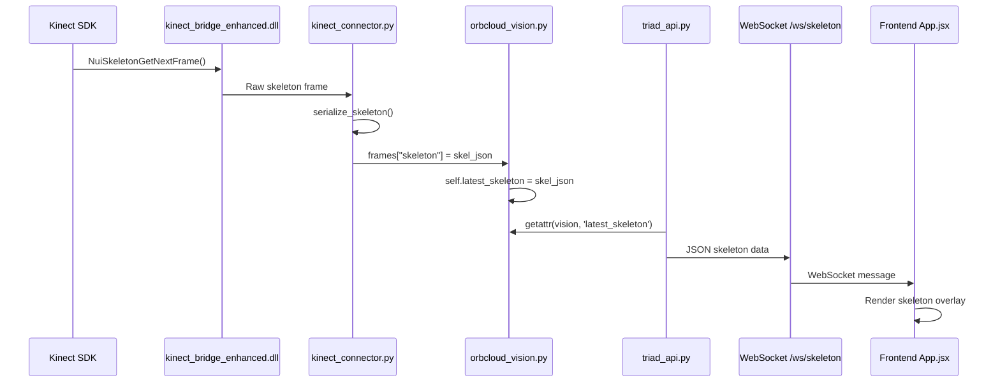
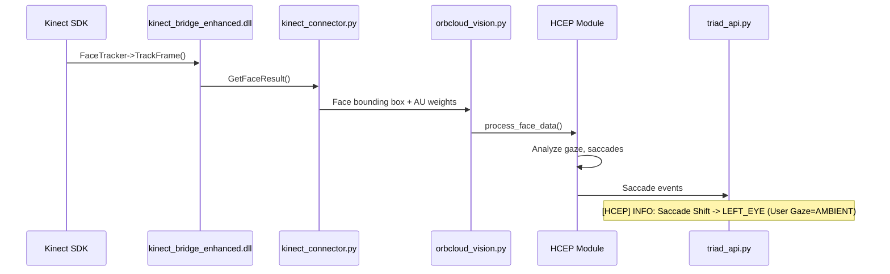

# Vision System Reference Documentation

> **Last Updated**: 2026-01-18
> **Status**: ✅ Fully Operational (Face Tracking + Skeleton Tracking + HCEP)

---

## System Architecture Overview

```mermaid
graph TD
    A[Kinect Hardware] --> B[kinect_bridge_enhanced.dll]
    B --> C[kinect_connector.py]
    C --> D[orbcloud_vision.py]
    D --> E[triad_api.py]
    E --> F[Frontend App.jsx]
    
    subgraph "Native C++ Bridge"
        B
    end
    
    subgraph "Python Orchestration"
        C
        D
    end
    
    subgraph "API Layer"
        E
    end
    
    subgraph "WebSocket Streams"
        G[/ws/skeleton]
        H[/v1/vision/stream]
        I[/v1/vision/faces]
    end
    
    E --> G
    E --> H
    E --> I
```

---

## Key Files and Their Roles

| File | Location | Purpose |
|------|----------|---------|
| `kinect_bridge_enhanced.dll` | `d:\Projects\impressioncore\bin\` | Native C++ bridge for Kinect SDK. Handles face tracking, skeleton, audio. |
| `kinect_connector.py` | `src/orchestrator/` | Python wrapper for the C++ DLL. Manages streams, face tracking init, skeleton serialization. |
| `orbcloud_vision.py` | `src/orchestrator/` | High-level vision orchestrator. Camera probing, frame buffering, HCEP integration. |
| `sensory_intelligence.py` | `src/orchestrator/` | WMI device discovery, hardware refresh cycles. |
| `triad_api.py` | `src/interfaces/` | FastAPI endpoints. WebSocket for skeleton, MJPEG for video. |
| `App.jsx` | `src/interfaces/web_client/src/` | Frontend. Skeleton overlay rendering, video feed display. |

---

## Initialization Flow

### 1. Backend Startup Sequence

```
1. uvicorn starts triad_api.py
2. Triad Instance initializes
3. OrbCloudVision.open() called
   └── SensoryIntelligence discovery scan
   └── WMI enumeration (166 devices typical)
4. Xbox 360 Kinect hardware scan
   └── KinectConnector created
   └── kinect_bridge_enhanced.dll loaded
   └── NuiInitialize(C+D+S) called
5. Streams opened:
   └── Color: YUV @ 640x480
   └── Depth: 320x240
   └── Skeleton: NuiSkeletonTrackingEnable()
6. Face tracking initialization
   └── ShutdownFaceTracking() (clear stale state)
   └── InitFaceTracking(640, 480, model_path)
   └── If 0x80070002: Retry with NULL path
7. Temporal Visual Buffer thread started
8. Hardware checklist complete → READY
```

### 2. Critical Log Messages (Success Path)

```log
[VISION] INFO: Scanning for Xbox 360 Kinect hardware...
Kinect Bridge loaded from d:\Projects\impressioncore\bin\kinect_bridge_enhanced.dll
Kinect SDK reports 1 sensor(s) available.
Kinect NuiInitialize Success: Full (C+D+S)
Kinect Color Locked: YUV @ 640x480 (Buffer=4)
Kinect Depth Stream Opened: 320x240
Kinect Skeleton Tracking Enabled
[KinectBridge] Face Tracking shutdown
[KinectBridge] InitFaceTracking: 640x480
[KinectBridge] Face Tracking initialized successfully
Native Face Tracking initialized (640x480)
Checklist Complete. Status: READY
```

---

## Common Issues and Fixes

### Issue 1: Face Tracking Init Failed: 0x80070002

**Symptom**: `[KinectBridge] FaceTracker Init FAILED: 0x80070002`

**Cause**: SDK cannot find FaceTrackData.dll or model files in the specified path.

**Solution**: The system automatically retries with NULL path, allowing the SDK to find models in its default location.

```python
# In kinect_connector.py, init_face_tracking()
if res_mask == 0x80070002 and model_path is not None:
    logger.info("Retrying Face Tracking initialization with NULL path...")
    result = self.bridge.InitFaceTracking(width, height, None)
```

---

### Issue 2: Face Tracking Re-Init Failed: 0x00000001

**Symptom**: Hardware refresh cycles cause `Face Tracking init failed: 0x00000001`

**Cause**: The C++ FaceTracker object in the DLL remains in a partially initialized state from a previous session when a new KinectConnector is created.

**Solution**: Call `ShutdownFaceTracking()` before re-initialization.

```python
# In kinect_connector.py, init_face_tracking() - ADDED FIX
try:
    self.bridge.ShutdownFaceTracking()
    logger.debug("Face Tracking: Shutdown previous session before re-init")
except Exception:
    pass  # May not have been initialized, that's OK
```

**File**: `d:\Projects\impressioncore\src\orchestrator\kinect_connector.py` (lines 237-243)

---

### Issue 3: Skeleton Data Not Transmitting

**Symptom**: Frontend skeleton overlay shows nothing despite Kinect being connected.

**Cause**: `self.skeleton_enabled` was `False` in `kinect_connector.py`, or `NuiSkeletonTrackingEnable` failed silently.

**Solution**: Added explicit logging to verify skeleton tracking enablement.

```python
# In kinect_connector.py, open() method
try:
    hr = k10.NuiSkeletonTrackingEnable(None, 0)
    if hr == S_OK:
        self.skeleton_enabled = True
        logger.info("Kinect Skeleton Tracking Enabled")
    else:
        logger.warning(f"Kinect Skeleton Tracking Enable failed: 0x{hr & 0xFFFFFFFF:08X}")
except Exception as e:
    logger.warning(f"Kinect Skeleton Tracking Enable exception: {e}")
```

**Verification**: Look for `Kinect Skeleton Tracking Enabled` in logs.

---

### Issue 4: Slow Camera Probe at Startup

**Symptom**: Backend takes 30+ seconds to start, logs show probing indices 0-31.

**Cause**: OpenCV probes all camera indices even when Kinect is already detected.

**Solution**: Early-exit after 10 consecutive failures if specialized hardware detected.

```python
# In orbcloud_vision.py, _probe_cameras()
if self._probe_failures >= 10 and has_specialized:
    sensory_intel.log_trace("Stopping probe: 10 consecutive failures + specialized hardware detected")
    break
```

**File**: `d:\Projects\impressioncore\src\orchestrator\orbcloud_vision.py` (lines 354-361)

---

### Issue 5: Face Tracking Retry Counter Not Resetting

**Symptom**: After initial failures, face tracking never works even after conditions improve.

**Cause**: `face_tracking_retry_count` was only incremented, never reset on success.

**Solution**: Reset counter to 0 on successful initialization.

```python
# In kinect_connector.py, init_face_tracking()
if result == 0:
    self.face_tracking_initialized = True
    self.face_tracking_retry_count = 0  # Reset retry counter on success
    logger.info(f"Native Face Tracking initialized ({width}x{height})")
    return True
```

**File**: `d:\Projects\impressioncore\src\orchestrator\kinect_connector.py` (line 257)

---

## Data Flow: Skeleton Tracking



### Skeleton Data Format

```json
{
  "timestamp": 1737216500.123,
  "skeletons": [
    {
      "tracking_id": 12345,
      "tracking_state": "tracked",
      "joints": {
        "head": {"x": 0.1, "y": 0.5, "z": 2.0, "state": "tracked"},
        "shoulder_center": {"x": 0.0, "y": 0.3, "z": 2.1, "state": "tracked"},
        // ... 20 joints total
      }
    }
  ]
}
```

---

## Data Flow: Face Tracking + HCEP



### HCEP States

| Gaze State | Meaning |
|------------|---------|
| `SCREEN` | User looking at monitor |
| `AMBIENT` | User looking elsewhere in room |
| `FACE_CENTER` | Neutral forward gaze |
| `LEFT_EYE`, `RIGHT_EYE` | Saccade target |
| `MOUTH` | Saccade target |

---

## C++ Bridge Function Signatures

Located in `kinect_bridge_enhanced.dll`:

```cpp
// Face Tracking
extern "C" __declspec(dllexport) HRESULT InitFaceTracking(int width, int height, const char* modelPath);
extern "C" __declspec(dllexport) void ShutdownFaceTracking();
extern "C" __declspec(dllexport) HRESULT ProcessFace(void* colorData, void* depthData);
extern "C" __declspec(dllexport) void GetFaceResult(FaceResult* result);

// Skeleton
// (Uses standard Kinect SDK NuiSkeletonGetNextFrame)

// Audio (Kinect 4-mic array)
extern "C" __declspec(dllexport) HRESULT InitAudioCapture(int sampleRate, int channels);
extern "C" __declspec(dllexport) int GetAudioData(void* buffer, int bufferSize);
```

---

## Verification Checklist

Use this checklist when debugging vision system issues:

- [ ] **Kinect Hardware**: Is sensor connected and powered? (check Device Manager for "Kinect for Windows")
- [ ] **DLL Loaded**: Look for `Kinect Bridge loaded from d:\Projects\impressioncore\bin\kinect_bridge_enhanced.dll`
- [ ] **NuiInitialize**: Look for `Kinect NuiInitialize Success: Full (C+D+S)`
- [ ] **Color Stream**: Look for `Kinect Color Locked: YUV @ 640x480`
- [ ] **Depth Stream**: Look for `Kinect Depth Stream Opened: 320x240`
- [ ] **Skeleton Tracking**: Look for `Kinect Skeleton Tracking Enabled`
- [ ] **Face Tracking**: Look for `Native Face Tracking initialized (640x480)`
- [ ] **HCEP Active**: Look for `[HCEP] INFO: Saccade Shift -> ...`
- [ ] **WebSocket Connected**: Look for `Skeleton WebSocket client connected. Total: 1`
- [ ] **Frontend Badge**: "SKELETON TRACKED" badge visible in UI

---

## Environment Requirements

| Requirement | Value |
|-------------|-------|
| Python | 3.10+ |
| Kinect SDK | v1.8 (Xbox 360 Kinect) |
| OS | Windows 10/11 |
| DLL Location | `d:\Projects\impressioncore\bin\kinect_bridge_enhanced.dll` |
| FaceTrackData.dll | Must be in SDK path or `bin/` directory |

---

## Recovery Procedures

### Full Vision System Reset

1. Stop backend (Ctrl+C)
2. Unplug Kinect USB
3. Wait 5 seconds
4. Replug Kinect USB
5. Restart backend: `python -m src.interfaces.triad_api`

### Face Tracking Won't Initialize

1. Check that FaceTrackData.dll exists in `C:\Program Files\Microsoft SDKs\Kinect\Developer Toolkit v1.8.0\Redist\x64\`
2. If missing, reinstall Kinect Developer Toolkit
3. Alternative: Copy FaceTrackData.dll to `d:\Projects\impressioncore\bin\`

### Skeleton Overlay Not Rendering

1. Open browser DevTools (F12)
2. Check Console for WebSocket errors
3. Verify `/ws/skeleton` connection in Network tab
4. Confirm skeleton data JSON is being received

---

## Related Conversations

| Date | Conversation ID | Topic |
|------|-----------------|-------|
| 2026-01-16 | d3b5451b-d1a2-4133-ae75-0e462b421f1d | Integrate Native Face Tracking |
| 2026-01-13 | ceee2451-bd86-405f-a0f3-2b99e65c92ed | Implement Amethyst Skeletal Tracking |
| 2026-01-12 | 9addbfc0-b9dc-4c31-8b6d-8a766c6263f0 | Kinect HCEP Avatar Stream |
| 2026-01-11 | dccb44bb-7e4a-4a63-9352-42f2186f65bb | Kinect Integration and Debugging |

---

## Changelog

| Date | Change |
|------|--------|
| 2026-01-18 | Added ShutdownFaceTracking() call before re-init to fix 0x00000001 error |
| 2026-01-18 | Added face_tracking_retry_count reset on success |
| 2026-01-18 | Added skeleton tracking enablement logging |
| 2026-01-18 | Added camera probe early-exit optimization |
| 2026-01-18 | Removed DBClick mode references from frontend |
