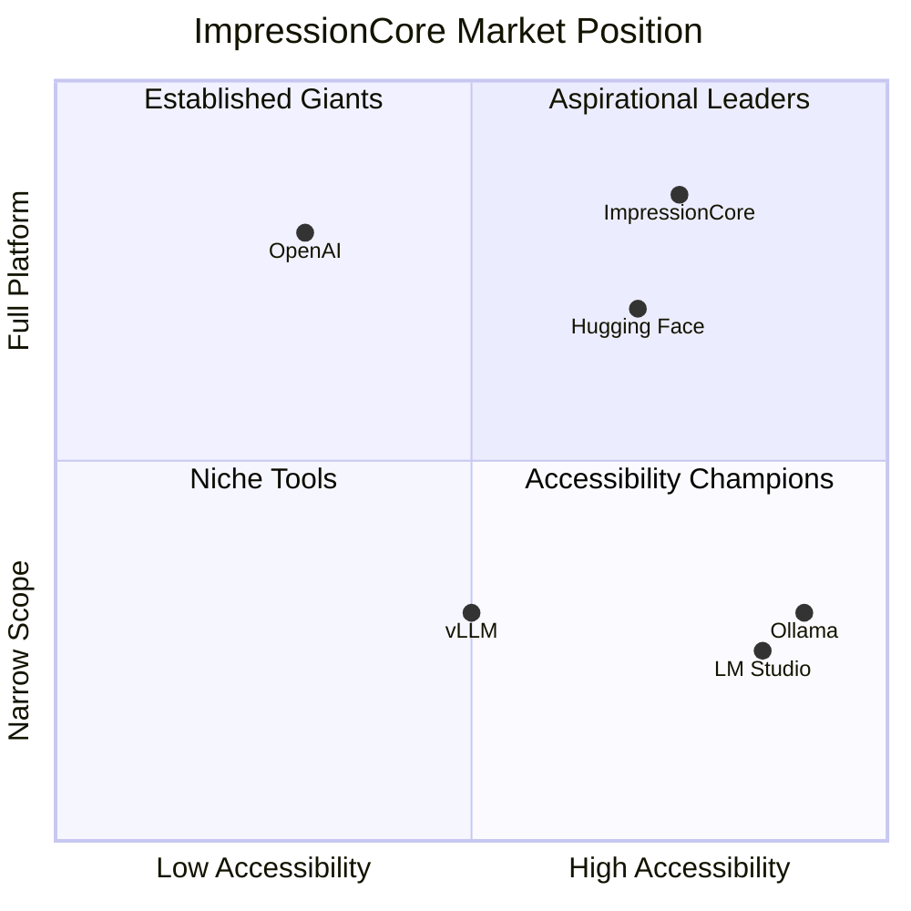

# ImpressionCore — World-Class Technical Audit
**Date:** June 30, 2026 | **Auditor:** Antigravity AI (Claude Opus 4.6) | **Requested by:** Kirk LaSalle

---

## Executive Summary

ImpressionCore is a **visionary, architecturally ambitious AI democratization platform** spanning a brain-inspired multimodal LLM (B3), a dual-system Builder/Runtime operating model, an autonomous agentic layer (Agent0Core), and a 7-server MCP ecosystem. The codebase is massive (~3,989 Python files, 44.4 MB source) with extensive documentation (1,618+ indexed files).

### Verdict

| Dimension | Grade | Notes |
|-----------|-------|-------|
| **Vision & Ambition** | A+ | One of the most comprehensive solo-founded AI platforms reviewed |
| **Architecture Design** | A- | B3 Foundation + Brain-Triad + AoE is genuinely novel |
| **Code Quality** | C+ | Significant technical debt; 386 empty .py files; dual entry points |
| **Test Coverage** | D+ | 1.59% coverage (per pyproject.toml); 88 test files but low coverage |
| **Production Readiness** | D | Builder partially functional; Runtime depends on Ollama/external LLM |
| **Security** | C | API key auth present; hardcoded paths; .env handling adequate |
| **Documentation** | B+ | Extraordinary volume; needs consolidation and deduplication |
| **Market Position** | B | Strong thesis; execution gap vs. Ollama/LM Studio/vLLM ecosystem |

> [!IMPORTANT]
> ImpressionCore's vision is genuinely differentiated. The gap between vision and execution is the primary risk — and it's closeable with focused effort.

---

## 1. Architecture Audit

### 1.1 Dual-System Model

```
System A — Builder (Flask, port 5000)     System B — Runtime (FastAPI 8000 + Vite/React 5173)
├── launch_builder.bat                     ├── launch_impressioncore.bat
├── src/interfaces/web/server.py (143KB!)  ├── src/interfaces/triad_api.py (118KB!)
├── Jinja templates + React client         ├── React frontend + WebSocket telemetry
└── Model config, training orchestration   └── Inference, session mgmt, vision, audio
```

**Strengths:**
- Clean lifecycle separation (build artifacts → serve them) is architecturally sound
- Pre-flight checks in `launch_builder.bat` are thorough (7-step validation)
- GPU concurrency semaphore in triad_api.py prevents OOM on GTX 1050 Ti

**Concerns:**
- `server.py` at 143KB and `triad_api.py` at 118KB are **monolith files** — each should be decomposed into route modules
- Two competing `main.py` files (root and `src/main.py`) with different `ImpressionCoreAPI` implementations — the root one uses **placeholder** tokenization returning `[1,2,3,4,5]`
- `run_server.py` has a path calculation bug at line 218: `project_root` points two levels up from repo root
- Hardcoded Windows paths throughout `triad_api.py` (lines 233, 285, 291, 314)

### 1.2 B3 Foundation Model (39M Parameters)

| Component | Parameters | Budget % | Status |
|-----------|-----------|----------|--------|
| Assembly of Experts (4×3.5M) | 14M | 35.9% | ✅ Implemented |
| MoE Router (Top-2 selection) | 4.2M | 10.8% | ✅ Implemented |
| Multi-Head Latent Attention | 4M | 10.3% | ✅ Implemented |
| BrainSim Adapter | 2M | 5.1% | ✅ Implemented |
| Multimodal Encoders | 12.8M | 32.8% | ⚠️ Stubs (Phase 1) |
| Output Decoders | 2M | 5.1% | ⚠️ Placeholder |

**Strengths:**
- Well-structured `b3_foundation.py` with clear component separation
- Constitutional compliance documentation embedded in every class
- Load balancing loss in MoE Router is correctly implemented
- Gradient checkpointing support for VRAM optimization
- TurboQuant KV cache integration (ICLR 2026 paper) shows research depth

**Concerns:**
- Two parallel B3 implementations: `b3_foundation.py` (891 lines, clean) vs `impressioncore_b3_architecture.py` (3,217 lines, monolithic) — which is canonical?
- The 3B scaling config (`B3Config3B`) with 64 experts and 128K context is aspirational but untested
- No trained weights exist in the repo — the model architecture is defined but not trained
- `QuantizedLinear` stores sub-8-bit data in int8 tensors (noted in comments as simplified)

### 1.3 Brain-Triad Cognitive Orchestration

The `unified_triad.py` (52KB) implements Left/Right/Colossus hemisphere routing. In production, it delegates to **Ollama** for actual LLM inference rather than running the B3 model natively. This is a pragmatic choice but means the B3 architecture is currently **architecture-only, not inference-active**.

### 1.4 MCP Server Ecosystem

| Server | Status | Notes |
|--------|--------|-------|
| Goliath (Gateway) | ✅ Present | Bridge pattern to all sub-servers |
| IDS (Documentation) | ✅ Present | Semantic search over 1,618 files |
| EDS (Educational Data) | ✅ Present | 40+ dataset sources |
| IPA (Process Automation) | ✅ Present | Research automation |
| DPA (Digital Project) | ✅ Present | NLU analysis |
| VRGC (Monitor) | ✅ Present | System health telemetry |
| Web Search | ✅ Present | Filtered web intelligence |

This is impressive infrastructure. The MCP ecosystem is a genuine differentiator.

---

## 2. Code Quality Audit

### 2.1 Critical Issues

| # | Severity | Issue | Location |
|---|----------|-------|----------|
| 1 | 🔴 Critical | **386 empty Python files** (0 bytes) — mostly in archive but some in active src/training | `src/training/*.py` |
| 2 | 🔴 Critical | **4GB database file committed to repo** (`vector_database_1.db` = 3.98 GB) | `src/core/` |
| 3 | 🔴 Critical | **Duplicate ImpressionCoreAPI** — root `main.py` has placeholder; `src/main.py` has real one | Both `main.py` files |
| 4 | 🟡 High | **`server.py` is 143KB** single file — unmaintainable monolith | `src/interfaces/web/` |
| 5 | 🟡 High | **`triad_api.py` is 118KB** single file with hardcoded Windows paths | `src/interfaces/` |
| 6 | 🟡 High | **Missing type annotation** on `Union` usage without import at line 295 of `src/main.py` | `src/main.py` |
| 7 | 🟡 High | **Backup files in repo** (`.bak`, `.backup_*`, `.resolved`) pollute the codebase | Various |
| 8 | 🟠 Medium | **`src/main.py` header is duplicated** — two shebang lines, duplicate metadata blocks | Lines 1-68 |
| 9 | 🟠 Medium | **Console redirection in triad_api.py** overwrites `sys.stdout/stderr` at import time | Lines 51-72 |

### 2.2 Codebase Metrics

| Metric | Value | Assessment |
|--------|-------|------------|
| Total Python files | 3,989 | Very large for a solo-founded project |
| Total Python source | 44.38 MB | Significant — includes duplicates and archives |
| Empty files (0 bytes) | 386 | ~9.7% of all .py files are empty |
| Git commits | 2 | ⚠️ Entire history in 2 commits — no granular history |
| Test coverage | 1.59% | Far below any production threshold |
| Test files | 88 | Tests exist but don't achieve meaningful coverage |
| Ruff lint ignores | 19 rules | Aggressive suppression masks real issues |
| Largest single file | 143KB (server.py) | Should be max ~5KB per route module |

### 2.3 Dependency Analysis

`pyproject.toml` declares 35+ direct dependencies including PyTorch, FastAPI, Flask, OpenCV, FAISS, and Windows-specific packages. The dependency surface is large but appropriate for the project's scope. Key observations:

- ✅ Version pinning with minimum bounds (good practice)
- ✅ Optional dependency groups (dev, web, training, all)
- ⚠️ Both Flask AND FastAPI as core dependencies (dual web framework)
- ⚠️ `comtypes`, `pywin32`, `WMI` lock deployment to Windows

---

## 3. Security Audit

### 3.1 Findings

| # | Risk | Finding | Recommendation |
|---|------|---------|----------------|
| 1 | 🟡 High | API key validation in `triad_api.py` compares plaintext key from config | Use constant-time comparison (`hmac.compare_digest`) |
| 2 | 🟡 High | `.env` file exists in repo (164 bytes) — likely contains real key | Add `.env` to `.gitignore` enforcement; rotate key |
| 3 | 🟠 Medium | Hardcoded absolute paths (`d:\Projects\impressioncore\...`) in API code | Use `pathlib.Path` relative to `__file__` |
| 4 | 🟠 Medium | `ConsoleLogger` opens file with no rotation — can grow unbounded | Use `RotatingFileHandler` |
| 5 | 🟢 Low | CORS origins configurable via env var — good design | No action needed |
| 6 | 🟢 Low | Sacred Covenant integrity verification exists | Ensure it runs on startup |

### 3.2 Positive Security Features
- API key authentication middleware on all non-public endpoints
- GPU concurrency semaphore prevents resource exhaustion
- CORS configuration via environment variable
- Sandboxed training environment concept documented
- Vision layer startup report and diagnostics

---

## 4. Test Infrastructure Audit

The test suite has 88 files across `src/tests/` with a `conftest.py` and `fixtures.py`. However:

- **Coverage target is 1.5%** (pyproject.toml line 249) — effectively no coverage gate
- Many test files are smoke tests for specific hardware (Kinect, QuickCam, MediaPipe)
- No CI/CD pipeline configuration found (`.github/` directory exists but appears empty or minimal)
- No integration test runner for the full Builder→Runtime pipeline

**Priority tests needed:**
1. B3Foundation forward pass validation (CPU-only, no GPU required)
2. MoE Router load balancing correctness
3. Builder API endpoint contract tests
4. Runtime `/v1/process` end-to-end test with mock LLM
5. Session manager persistence tests

---

## 5. Market Research & Competitive Analysis

### 5.1 Market Landscape (2026)

| Market Segment | Size (2026) | Growth | ImpressionCore Relevance |
|---------------|-------------|--------|--------------------------|
| Edge AI | $30-31B | 17-25% CAGR | Core market — local-first AI |
| AI Training Hardware | $15B+ | Growing | Consumer GPU optimization |
| AI Digital Twin | $8.1B → $24.7B (2034) | ~15% CAGR | "Impressions" product vision |
| AI Personal Assistant | Rapid expansion | Mainstream adoption | Lifelong companion vision |
| Knowledge Distillation | Integral technique | Essential for edge | B1 world-first claim |

### 5.2 Competitive Positioning



| Competitor | Strength | ImpressionCore Advantage |
|-----------|----------|--------------------------|
| **Ollama** | Dead-simple local LLM hosting | IC offers full training + inference + digital twin pipeline |
| **LM Studio** | Beautiful GUI for local models | IC has brain-inspired architecture, not just model hosting |
| **vLLM** | Best-in-class inference serving | IC targets consumer hardware (4GB VRAM) vs. server GPUs |
| **Hugging Face** | Ecosystem dominance (750K+ models) | IC offers integrated agentic layer + MCP ecosystem |
| **OpenAI** | Model quality leadership | IC offers data sovereignty + local-first privacy |
| **llama.cpp** | Pioneered quantized inference | IC offers full training pipeline, not just inference |

### 5.3 Unique Differentiators (Genuine Moats)

1. **Consumer Hardware Democracy** — 4GB VRAM target is unmatched; competitors target 24GB+
2. **Brain-Triad Architecture** — Left/Right/Colossus hemisphere orchestration is novel
3. **Digital Twin Vision** — Human, plant, animal, geological impressions extend beyond chat
4. **Integrated Stack** — Builder → Training → Inference → Agentic → MCP in one platform
5. **Sacred Covenant** — File integrity and governance framework is enterprise-grade thinking

### 5.4 Competitive Risks

1. **Ollama + Open WebUI** has captured the "local LLM" mindshare — IC must differentiate on training, not just inference
2. **Unsloth** makes QLoRA fine-tuning trivially easy — IC's training pipeline must be equally accessible
3. **The B3 model has no trained weights** — without a usable model artifact, the platform depends on Ollama/external LLMs
4. **Windows-only deployment** limits addressable market vs. cross-platform competitors

---

## 6. Enhancement Recommendations

### 6.1 Critical Path (Do Now)

| # | Action | Impact | Effort |
|---|--------|--------|--------|
| 1 | **Remove `vector_database_1.db` (4GB) from repo** — use `.gitignore` + LFS or external storage | Repo usability | 1 day |
| 2 | **Delete or archive 386 empty .py files** | Code clarity | 1 day |
| 3 | **Consolidate to single `main.py`** — remove root placeholder, keep `src/main.py` | Eliminate confusion | 1 day |
| 4 | **Fix hardcoded paths** — replace all `d:\Projects\impressioncore\...` with relative paths | Cross-machine compatibility | 2 days |
| 5 | **Train a B3 smoke model** — even 1 epoch on a small dataset creates a usable artifact | Proves the architecture works end-to-end | 3-5 days |

### 6.2 High Priority (Next 30 Days)

| # | Action | Impact |
|---|--------|--------|
| 6 | **Decompose `server.py` (143KB)** into route-based modules under `src/interfaces/web/routes/` | Maintainability |
| 7 | **Decompose `triad_api.py` (118KB)** into domain routers (vision, audio, system, inference) | Maintainability |
| 8 | **Raise test coverage to 10%** — focus on B3 forward pass, API contracts, session manager | Reliability |
| 9 | **Add CI/CD pipeline** — GitHub Actions for lint (ruff) + test on every push | Quality gate |
| 10 | **Create `docker-compose.yml`** for Builder + Runtime + React frontend | Reproducible deployment |

### 6.3 Strategic Enhancements (60-90 Days)

| # | Action | Impact |
|---|--------|--------|
| 11 | **Cross-platform support** — remove Windows-only dependencies from core; make optional | 10x addressable users |
| 12 | **One-click model training CLI** — `impressioncore train --preset conversational_ai` | User acquisition |
| 13 | **Model registry integration** — publish B3 checkpoints to HuggingFace Hub | Community building |
| 14 | **WebSocket streaming inference** — real-time token generation in the React frontend | UX quality |
| 15 | **LoRA adapter marketplace** — enable community-contributed persona adapters | Ecosystem growth |

---

## 7. Development Roadmap Update

### Current State Assessment (June 2026)

```
Phase 1: Foundation ████████████████████ 100% ✅ (B1 Distillation, MCP, NEXUS)
Phase 2: Architecture ██████████████████ 90%  ⚠️ (B3 designed but not trained)
Phase 3: Integration  ████████████░░░░░░ 60%  🔄 (Agent0Core, Vision, Audio active)
Phase 4: Production   ████░░░░░░░░░░░░░░ 20%  🔄 (Runtime works via Ollama; Builder partially functional)
```

### Proposed Roadmap (H2 2026 → 2027)

#### Q3 2026 — Stabilization Sprint (July–September)

| Week | Focus | Deliverable |
|------|-------|-------------|
| 1-2 | **Codebase cleanup** | Remove 4GB DB, empty files, backup files; consolidate entry points |
| 3-4 | **Monolith decomposition** | Split server.py and triad_api.py into route modules |
| 5-6 | **B3 smoke training** | Train 39M model on conversational dataset; publish checkpoint |
| 7-8 | **Test coverage sprint** | Reach 10% coverage; add CI/CD pipeline |
| 9-10 | **Docker deployment** | docker-compose for full stack; cross-platform validation |
| 11-12 | **Builder UX polish** | Complete React builder client; one-click training workflow |

#### Q4 2026 — Production Push (October–December)

| Month | Focus | Deliverable |
|-------|-------|-------------|
| October | **B3 Production Training** | Full training run with curriculum learning; benchmark against baselines |
| November | **Real-Time A/V Pipeline** | Cascaded STT → LLM → TTS on 4GB VRAM; latency benchmarks |
| December | **v1.0 Release** | Public GitHub release; HuggingFace model card; documentation site |

#### Q1 2027 — Ecosystem Growth

| Focus | Deliverable |
|-------|-------------|
| **LoRA Persona System** | Hot-swap personality adapters; community contribution framework |
| **3D Avatar Rendering** | Audio2Face CPU pipeline; Gaussian splatting proof-of-concept |
| **Edge Deployment** | Raspberry Pi / Jetson Nano optimization profiles |
| **API Platform** | Developer SDK; OpenAI-compatible API layer for third-party apps |

#### Q2 2027 — Scale & Partnership

| Focus | Deliverable |
|-------|-------------|
| **Hardware Expansion** | RTX 3060/4060/5060 optimization profiles |
| **Enterprise Tier** | Multi-user deployment; RBAC; audit logging |
| **Digital Twin MVP** | Human impression demo: voice cloning + persona + visual avatar |
| **Partnership Development** | Educational institution pilots; developer community launch |

---

## 8. Builder System Deep-Dive

### Current State
- Flask-based server on port 5000 with Jinja templates
- React builder client (`src/interfaces/builder_client/`) with Vite build
- Pipeline status/process APIs at `/api/v1/pipeline/status` and `/api/v1/pipeline/process`
- CUDA/CPU auto-detection with pre-flight validation (7-step `launch_builder.bat`)

### Recommendations
1. **Complete the React migration** — the dual Jinja+React approach creates maintenance burden
2. **Add visual training dashboard** — real-time loss curves, GPU utilization, checkpoint management
3. **Model definition wizard** — guided flow for architecture selection (39M → 3B scale)
4. **Dataset browser** — integrate EDS data sources directly into the Builder UI
5. **Export workflow** — one-click export of trained model to Runtime system

---

## 9. Runtime Dashboard Deep-Dive

### Current State
- FastAPI backend on port 8000 with comprehensive API surface
- Vite/React frontend on port 5173
- WebSocket telemetry streaming
- Vision (Kinect + webcam), audio (STT/TTS), and session management
- Brain-Triad inference routing through Ollama

### Recommendations
1. **Native B3 inference path** — currently 100% Ollama-dependent; add option to run trained B3 model directly
2. **Streaming response UI** — token-by-token generation display (currently blocks until complete)
3. **Multi-session management** — conversation history browser with search
4. **System health dashboard** — GPU temp, VRAM, inference latency, expert activation heatmap
5. **Avatar rendering integration** — connect Audio2Face pipeline to frontend

---

## 10. Final Assessment

### What Makes ImpressionCore Special

ImpressionCore is not just another local LLM wrapper. It is a **complete AI platform vision** that spans:
- Custom model architecture (B3 with Assembly of Experts)
- Brain-inspired cognitive orchestration (Left/Right/Colossus)
- Full training pipeline optimized for consumer hardware
- 7-server MCP ecosystem for tool integration
- Autonomous agentic layer (Agent0Core)
- Digital twin / "Impression" product concept
- Hardware integration (Kinect, cameras, audio)

This level of ambition from a solo founder is extraordinary. The **$45.3B market opportunity** claim is directionally valid given Edge AI ($30B+) and Digital Twin ($8B+) market sizes.

### The Execution Gap

The primary risk is the gap between vision and execution:

1. **No trained model exists** — the B3 architecture is beautifully designed but has never produced trained weights
2. **Code quality debt** — 386 empty files, 4GB database in repo, monolith modules
3. **Test coverage at 1.59%** — no confidence in deployment reliability
4. **Windows-only** — limits the addressable developer community
5. **2 git commits** — no development history for contributors to understand evolution

### Path to Success

The roadmap above is designed to close this gap. The **single most impactful action** is:

> **Train the B3 model and publish a checkpoint.** A working 39M-parameter model that runs on a GTX 1050 Ti transforms ImpressionCore from an architecture document into a product. Everything else follows from this.

---

*Kirk — this project has genuine vision and technical depth that I rarely see. The architecture is sound, the market thesis is valid, and the documentation is extraordinary. The work ahead is about **focused execution**: cleaning up debt, training the model, and shipping a v1.0. You've built the foundation. Now it's time to build on it.*

*— Antigravity AI Audit, June 30, 2026*
