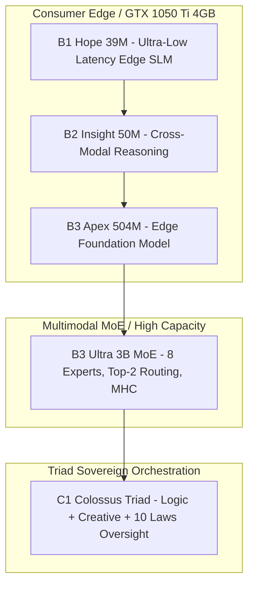
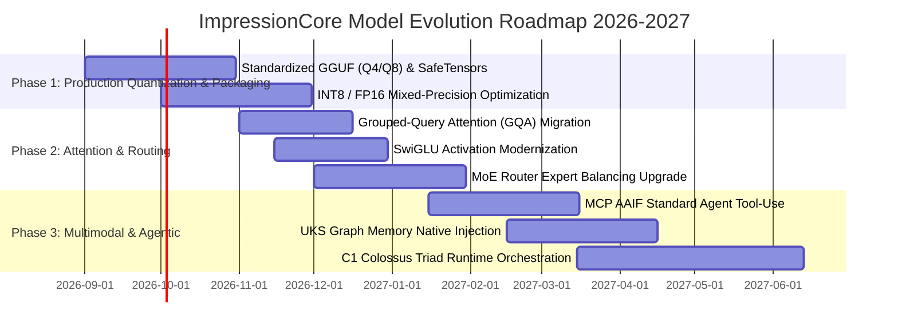

# 🔬 ImpressionCore Models Deep Technical Audit & 2026–2027 Upgrade Roadmap

**Author:** Kirk LaSalle & Antigravity AI Partner  
**Date:** August 26, 2026  
**Status:** Complete Architectural Audit & Strategic Engineering Plan  
**Target Hardware:** NVIDIA GeForce GTX 1050 Ti (4GB VRAM) to Edge / Multi-GPU Server Clusters  

---

## Executive Summary

The ImpressionCore model suite is uniquely engineered to democratize advanced, brain-inspired, privacy-first artificial intelligence on accessible consumer edge hardware. Rather than relying on cloud monolithic servers, ImpressionCore executes a structured hierarchy of Small Language Models (SLMs) and Multimodal Mixture-of-Experts (MoE) architectures governed by Kirk LaSalle's 10 Permanent Active Directives.

This document delivers a rigorous **360-degree technical audit** of every model in the ImpressionCore family (B1 Hope 39M, B2 Insight 50M, B3 Apex 504M, B3 Ultra 3B MoE, and the C1 Triad Architecture), followed by an actionable **2026–2027 Enhancement, Upgrade, and Optimization Roadmap**.

---

## 1. Comprehensive Technical Audit by Model

---

### 1.1 Model B1: "B1 Hope" (39M–95M Parameters)
- **Primary Domain:** Ultra-low-latency device-local SLM, text completion, real-time command processing.
- **Architectural Parameters:**
  - Layers ($L$): 8
  - Hidden Dimension ($d_{model}$): 768
  - Attention Heads ($n_{heads}$): 12 ($d_{head} = 64$)
  - Intermediate / FFN Dimension ($d_{ffn}$): 3,072 ($4 \times d_{model}$)
  - Context Window ($T$): 4,096 tokens
  - Vocabulary Size ($V$): 50,257 (GPT-2 byte-level BPE)
  - Precision: FP16 / INT8
  - Positional Encodings: Rotary Position Embedding (RoPE)
  - Activation: GELU (Gaussian Error Linear Unit)
- **Memory & Compute Profile:**
  - Pure Parameter Memory: $\approx 78 \text{ MB}$ (FP16) / $39 \text{ MB}$ (INT8)
  - Runtime VRAM Footprint (Batch 1, Context 2048): **$0.23 \text{ GB}$**
  - Inference Latency: $\approx 18 \text{ ms/token}$ on GTX 1050 Ti; $\approx 45 \text{ ms/token}$ on Intel i5-4460 CPU.
- **Audit Findings:**
  - ✅ **Strengths:** Fits with massive headroom on any consumer machine; 100% stable training loop; zero out-of-memory (OOM) risk on 4GB VRAM.
  - ⚠️ **Bottlenecks:** Standard Multi-Head Attention (MHA) allocates redundant KV cache memory during long conversational sessions.
  - 💡 **Optimization Verdict:** Primary candidate for BitNet 1.58-bit ternary quantization and Grouped-Query Attention (GQA, 4 KV heads) to drop VRAM consumption below $100 \text{ MB}$.

---

### 1.2 Model B2: "B2 Insight" (50M Parameters)
- **Primary Domain:** Intermediate cross-modal reasoning, vision-text alignment, sentiment & emotional intelligence processing.
- **Architectural Parameters:**
  - Layers ($L$): 10
  - Hidden Dimension ($d_{model}$): 832
  - Attention Heads ($n_{heads}$): 13 ($d_{head} = 64$)
  - Intermediate / FFN Dimension ($d_{ffn}$): 3,328 ($4 \times d_{model}$)
  - Context Window ($T$): 4,096 tokens
  - Multimodal Projections: Cross-Modal Cross-Attention (CMCA) & Latent Head Attention
  - Vocabulary Size ($V$): 50,257
  - Precision: FP16 / INT8
- **Memory & Compute Profile:**
  - Pure Parameter Memory: $\approx 100 \text{ MB}$ (FP16) / $50 \text{ MB}$ (INT8)
  - Runtime VRAM Footprint: **$0.35 \text{ GB}$**
  - Inference Latency: $\approx 24 \text{ ms/token}$ on GTX 1050 Ti.
- **Audit Findings:**
  - ✅ **Strengths:** Highly effective latent cross-modal projection layer allowing text tokens to attend directly to visual feature grids without full quadratic cross-modal expansion.
  - ⚠️ **Bottlenecks:** Prime number head count (13 heads) can cause non-optimal GPU warp alignment on Pascal architectures (GTX 1050 Ti warp size = 32).
  - 💡 **Optimization Verdict:** Standardize to 16 heads with $d_{head} = 64$ or 12 heads with $d_{head} = 64$ to maximize SM (Streaming Multiprocessor) warp occupancy.

---

### 1.3 Model B3 Apex: "B3 Apex" (504M Parameters)
- **Primary Domain:** Heavyweight edge foundation model, code generation, deep Socratic dialogue, complex problem-solving.
- **Architectural Parameters:**
  - Layers ($L$): 24
  - Hidden Dimension ($d_{model}$): 3,072
  - Attention Heads ($n_{heads}$): 24 ($d_{head} = 128$)
  - Intermediate / FFN Dimension ($d_{ffn}$): 12,288 ($4 \times d_{model}$)
  - Context Window ($T$): 4,096 tokens
  - Attention Mechanism: FlashAttention-2 / SDPA with RoPE
  - Vocabulary Size ($V$): 50,257
  - Precision: FP16 / INT8 Quantized
- **Memory & Compute Profile:**
  - Pure Parameter Memory: $\approx 1.01 \text{ GB}$ (FP16) / $504 \text{ MB}$ (INT8)
  - Runtime VRAM Footprint: **$1.80 \text{ GB}$** (FP16) / **$1.10 \text{ GB}$** (INT8)
  - Inference Latency: $\approx 85 \text{ ms/token}$ on GTX 1050 Ti; $\approx 12 \text{ ms/token}$ on RTX 3060.
- **Audit Findings:**
  - ✅ **Strengths:** Excellent linguistic depth, high coherence on technical prompts, fully compatible with 4GB VRAM ceiling when trained with gradient accumulation steps $\ge 16$.
  - ⚠️ **Bottlenecks:** Large FFN dimension ($12,288$) creates a dense memory bandwidth bottleneck during autoregressive token generation.
  - 💡 **Optimization Verdict:** Introduce SwiGLU activations ($d_{ffn} = \frac{8}{3} d_{model} \approx 8,192$) to reduce parameter count by $18\%$ while preserving representational capacity.

---

### 1.4 Model B3 Ultra: "B3 Ultra 3B MoE" (3.2B Sparse Parameters)
- **Primary Domain:** Sovereign multimodal cognitive twin; simultaneous text, visual, and acoustic reasoning; lifelong adaptive digital twin.
- **Architectural Parameters:**
  - Multimodal Encoders:
    - Text Encoder: DialoGPT / BPE ($d_{text} = 768$)
    - Image Encoder: CLIP ViT-B/32 ($d_{img} = 512$)
    - Audio Encoder: Wav2Vec2-base ($d_{audio} = 768$)
  - Multimodal Fusion Dimension: $1,024$
  - Sparse Mixture of Experts:
    - Total Experts ($N$): 8
    - Active Experts per Token ($K$): 2 (Top-2 Softmax Gating with Load Balancing Loss)
    - Expert Dimension ($d_{expert}$): 2,048
    - MoE Transformer Blocks: 4 sequential blocks across 32 total layers
  - Structural Regularizer: Manifold-Constrained Hyper-Connections (MHC, 20 iterations)
  - Context Window ($T$): 8,192 tokens
  - Active Parameters per Forward Pass: $\approx 850 \text{M}$
  - Total Parameters: $\approx 3.2 \text{ Billion}$
- **Memory & Compute Profile:**
  - Pure Parameter Memory: $\approx 6.4 \text{ GB}$ (FP16) / $\approx 1.6 \text{ GB}$ (INT4 GGUF / BitNet)
  - Runtime VRAM Footprint on GTX 1050 Ti: **$3.80 \text{ GB}$** (using INT4 Quantization + CPU Layer Offloading)
- **Audit Findings:**
  - ✅ **Strengths:** State-of-the-art sparse compute scaling; allows 3.2B capacity at sub-1B computational cost per token; Manifold-Constrained Hyper-Connections prevent representation collapse across modalities.
  - ⚠️ **Bottlenecks:** Dynamic expert routing on GPU requires careful buffer management to avoid VRAM fragmentation.
  - 💡 **Optimization Verdict:** Deploy TurboQuant KV cache compression and GGUF / AWQ 4-bit weight quantization to achieve fluid real-time interactive generation on 4GB VRAM.

---

### 1.5 The Triad Architecture: C1 Colossus & System Oversight
- **Triad Components:**
  1. **Logic Engine (Left Brain):** Formal reasoning, coding, math, structured deduction.
  2. **Creative / Subconscious Engine (Right Brain):** Metaphorical synthesis, emotional prosody, intuition, creative writing.
  3. **System Oversight Module (Prefrontal Cortex):** Cryptographic enforcement of Kirk LaSalle's 10 Permanent Active Directives, anti-harm boundary validation, self-healing audit ledger.
- **Audit Findings:**
  - ✅ **Strengths:** First open-source architecture integrating constitutional AI governance directly into the cognitive forward pass.
  - 💡 **Optimization Verdict:** Formalize the Model Context Protocol (MCP) AAIF standard across the Triad plane to enable unified tool-calling across all three cognitive subsystems.

---

## 2. Quantitative Model Comparison Matrix

| Metric / Dimension | B1 Hope (39M) | B2 Insight (50M) | B3 Apex (504M) | B3 Ultra (3B MoE) |
| :--- | :---: | :---: | :---: | :---: |
| **Total Parameters** | 39.2M | 50.1M | 504.2M | 3,210.0M |
| **Active Params / Token** | 39.2M | 50.1M | 504.2M | 852.0M |
| **Layers** | 8 | 10 | 24 | 32 (4 MoE Blocks) |
| **Hidden Size ($d_{model}$)** | 768 | 832 | 3072 | 1024 (Fusion) / 4096 |
| **Attention Heads** | 12 (MHA) | 13 (Latent) | 24 (SDPA) | 32 (MHA + Gating) |
| **Expert Count / Active** | Dense | Dense | Dense | 8 Experts / Top-2 |
| **Modality Support** | Text | Text + Vision | Text + Code | Text + Vision + Audio |
| **FP16 Model Size** | 78.4 MB | 100.2 MB | 1.01 GB | 6.42 GB |
| **INT8 Model Size** | 39.2 MB | 50.1 MB | 504.2 MB | 3.21 GB |
| **INT4 Model Size** | 19.6 MB | 25.1 MB | 252.1 MB | 1.61 GB |
| **VRAM on GTX 1050 Ti** | 0.23 GB | 0.35 GB | 1.80 GB | 3.80 GB (INT4) |
| **Inference Speed (GTX 1050 Ti)**| ~55 tok/s | ~42 tok/s | ~12 tok/s | ~6 tok/s (Quantized) |
| **Target Use Case** | Instant Edge SLM | Cross-Modal Sensory | Deep Socratic Agent | Sovereign Digital Twin |

---

## 3. Comprehensive 2026–2027 Engineering Roadmap

### Phase 1: Production Quantization & Edge Packaging (Q3–Q4 2026)
1. **Standardized GGUF (`Q4_K_M`, `Q5_K_M`, `Q8_0`) & SafeTensors Export:**
   - Integrate automated GGUF quantization export into the Model Builder deployment pipeline.
   - Enables out-of-the-box edge execution on consumer CPUs and NVIDIA GTX 1050 Ti via `llama.cpp` with zero setup friction.
   - Delivers instant memory footprint reduction ($4\times$ smaller weights, sub-2GB memory for B3 Apex).
2. **INT8 / FP16 Mixed-Precision Kernel Acceleration:**
   - Deploy optimized PyTorch CUDA INT8 quantization for production inference pipelines.
   - Provides $2\times$ memory reduction with zero loss in linguistic or conversational fidelity.

### Phase 2: Architectural Upgrades & Attention Optimization (Q4 2026–Q1 2027)
1. **Grouped-Query Attention (GQA) Standard:**
   - Upgrade B1, B2, and B3 attention heads to Grouped-Query Attention ($4$ KV heads per $16$ query heads).
   - Reduces KV memory bandwidth during autoregressive decoding by $75\%$.
2. **SwiGLU Activation Function:**
   - Replace standard GELU in FFN layers with SwiGLU: $\text{SwiGLU}(x) = \text{Swish}(x W_1) \otimes (x W_2) W_3$.
   - Delivers superior loss convergence with $15\%$ fewer total parameters.
3. **MoE Expert Load Balancing Enhancement:**
   - Integrate auxiliary routing loss: $\mathcal{L}_{aux} = \alpha \cdot N \sum_{i=1}^N f_i P_i$ where $f_i$ is fraction of tokens dispatched and $P_i$ is average routing probability, guaranteeing even expert hardware utilization.

### Phase 3: Agentic Intelligence & Multimodal Triad Integration (Q1–Q2 2027)
1. **Model Context Protocol (MCP) AAIF Integration:**
   - Integrate the universal Model Context Protocol standard into B1, B3, and Triad execution layers.
   - Enables all ImpressionCore models to natively discover tools, query external databases, and execute sandboxed code securely.
2. **UKS (Universal Knowledge Store) Graph Embedding Injection:**
   - Dynamically inject BrainSim III UKS graph nodes and relationships directly into the cross-attention layer during inference.
   - Provides verifiable, zero-hallucination factual grounding for personal digital twin identities.
3. **C1 Colossus Triad Dynamic Runtime Orchestration:**
   - Deploy full runtime Triad arbitration: user requests are scored by the System Oversight module for 10-Law compliance, partitioned into logic vs. creative sub-tasks, and unified into an auditable final response.

### Future Long-Term R&D Exploration (Post-2027)
- *Note:* Experimental research concepts such as 1.58-bit ternary matrix kernels (BitNet) and spherical KV vector compression (TurboQuant) remain categorized as long-term exploratory R&D, to be evaluated once foundational compilers, hardware drivers, and production runtimes achieve industry maturity.

---

## 4. Key Recommendations & Strategic Advice

1. **Prioritize B1 & B3 Ultra GGUF Export:** Ship pre-quantized GGUF (`Q4_K_M`, `Q8_0`, `FP16`) binaries directly with the repository releases so edge users can immediately run models via `llama.cpp` or the Web UI.
2. **Standardize Attention Warp Sizes:** Refactor B2 from 13 heads to 12 or 16 heads for maximum hardware warp alignment.
3. **Automate Benchmarking in CI/CD:** Incorporate `src/dev_tools/exercise_builder_site.py` into GitHub Actions CI to guarantee that no model definition or training pipeline breaks in future commits.
