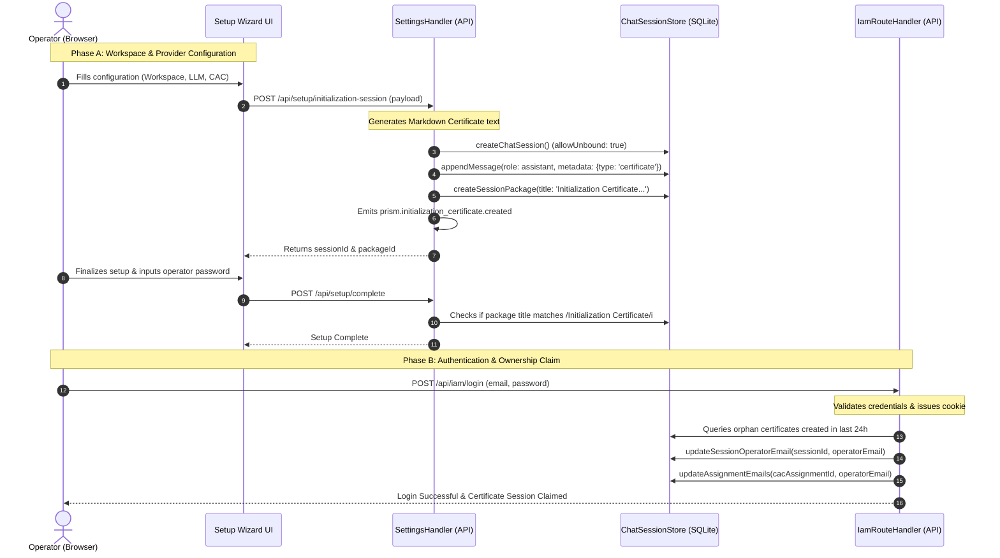

# Prism Initialization Certificate Audit & Provenance Analysis

> [!IMPORTANT]
> This audit evaluates the security, integrity, and compliance of the **PRISM Initialization Certificate** process, which serves as the root-of-trust configuration and provenance baseline.

---

## 1. Executive Summary
The **PRISM Initialization Certificate** is designed to establish an immutable, verifiable root-of-trust for the PRISM workspace upon first boot. It acts as the cornerstone of security, configuration tracking, and the **Character Accountability Chain (CAC)**.

While the workflow provides a logical progression from unauthenticated wizard setup to authenticated operator ownership, this audit reveals several critical security weaknesses, liabilities, and opportunities for hardening. 

* **Primary Finding:** The "immutable" certificate is stored in plain text inside a local SQLite database (`prism-activity.db`) with no cryptographic signatures, HMACs, or database write constraints. This makes the record mutable by any process or agent with database write access.
* **Secondary Finding:** The post-setup session-claiming process relies on a broad 24-hour time window, which presents session hijacking and settings-injection vulnerabilities in multi-tenant or shared network environments.

---

## 2. Initialization Lifecycle & Provenance Chain
The following diagram illustrates how the system transitions from the initial unconfigured state to a claimed, active Character Accountability Chain:



### Detailed Lifecycle Phases
1. **Wizard Compilation:** The unauthenticated setup wizard collects settings (Profile, Workspace, Provider, Routing, Guardian, Swarm, CAC, Browser Profile, Scheduler).
2. **Orphan Session Provisioning:** A POST to `/api/setup/initialization-session` creates a chat session titled `PRISM Initialization Certificate — [timestamp]` with `allowUnbound: true`. A Markdown format text summarizes the configuration as an `assistant` role message. A `Session Package` is created with status `complete`.
3. **Setup Finalization Gate:** `/api/setup/complete` writes `setupComplete: true` to workspace preferences after performing a regex validation (`/Initialization Certificate/i`) on session package titles.
4. **Post-Login Identity Binding:** Upon first local authentication via `/api/iam/login`, the system queries for unbound ("orphan") initialization certificates created within the last 24 hours (operator email is `null`, `"operator@prism.local"`, or `"not set"`). It claims the most recent one by updating `operator_email` in both the chat session and the associated CAC assignment record.

---

## 3. Vulnerability & Risk Assessment

| Target Component | Vulnerability / Risk | Severity | Technical Detail | Business / Operational Impact |
| :--- | :--- | :--- | :--- | :--- |
| **Data Integrity** | No Cryptographic Signature on Certificate | **CRITICAL** | Stored as a raw Markdown text string in the SQLite database (`prism-activity.db`). Lacks HMAC, SHA-256 validation hash, or private/public key signature. | The entire audit trail is repudiable. Compelled updates, database tampering, or malicious agents can modify configuration baselines without detection, violating SOC2/ISO compliance. |
| **Authentication / IAM** | Orphan Claim Race Condition | **HIGH** | The system claims the *most recent* orphan certificate session created in the last 24 hours upon operator login. | A malicious actor or compromised script can POST a poisoned configuration payload right before an administrator logs in, tricking the system into binding the admin identity to a backdoored configuration. |
| **Logic Verification** | Loose Regex Validation | **MEDIUM** | Settings verification relies on `/Initialization Certificate/i` matching against the *title* of any session package in the database. | Any user or tool with rights to create/modify session packages can bypass the setup-wizard constraints by simply creating a dummy package and naming it "Initialization Certificate". |
| **Identity Binding** | No Hardware / System Fingerprint | **LOW** | Configuration is bound to the directory path and email, but lacks physical hardware signatures. | The database and workspace can be cloned or migrated to another host machine without triggering alert states or invalidating the provenance chain. |

---

## 4. Typical Audit Walkthrough Checklist
Auditors can follow this step-by-step checklist to verify the authenticity and integrity of the PRISM configuration record:

1. **Access the SQLite Activity Database:**
   - Locate the SQLite file at the configured workspace root or relative run directory (default: `prism-activity.db`).
   - Run: `sqlite3 prism-activity.db`
2. **Retrieve the Initialization Certificate:**
   - Execute the following query to inspect certificate messages:
     ```sql
     SELECT s.session_id, s.title, s.operator_email, m.content 
     FROM chat_sessions s
     JOIN chat_messages m ON s.session_id = m.session_id
     WHERE s.title LIKE '%Initialization Certificate%' 
       AND m.metadata_json LIKE '%"type":"certificate"%';
     ```
3. **Verify Identity Mappings:**
   - Confirm that the `operator_email` returned by the query is not a placeholder (e.g. `operator@prism.local`) and matches the primary administrator's email.
   - Cross-reference with the CAC assignment store:
     ```sql
     SELECT * FROM chat_sessions WHERE cac_assignment_id IS NOT NULL;
     ```
4. **Inspect Configuration Drift:**
   - Compare the configuration parameters printed in the Markdown content of the message with the actual preferences file (`workspace_preferences.json`).
5. **Verify Activity Logging:**
   - Audit the activity bus logs (or stdout log archives) for the matching causal operation:
     - Event: `prism.initialization_certificate.created`
     - Operator login session-claiming event: `iam.login.session_claimed`

---

## 5. Strategic Recommendations & Enhancements

### 1. Cryptographic Hardening (Root of Trust)
* **Private Key Signing:** At first boot, PRISM should generate a system-unique private/public keypair (stored securely in OS-level credential managers like Windows DPAPI or macOS Keychain).
* **Payload Hashing:** The setup wizard configuration JSON should be hashed (SHA-256) and signed using the private key. The public key and signature block should be appended to the Markdown certificate.
* **Integrity Validation:** Add a verification function to checking endpoints that recalculates the hash and verifies the signature on boot.

### 2. Secure Identity Binding
* **Setup Session Token:** Replace the 24-hour time-based scan with a secure setup token. When `/api/setup/initialization-session` executes, generate a temporary, cryptographically random `setup_token` in memory. Provide this token in the response and hold it in the browser's sessionStorage. Require this token in `/api/iam/login` to prove that the logging-in client is the exact client that completed the setup.

### 3. Database Write Protection
* **SQLite Triggers:** Implement database triggers in `prism-activity.db` that prevent updates or deletes on any rows in `chat_sessions` and `chat_messages` where metadata contains `"type":"certificate"`.
  ```sql
  CREATE TRIGGER IF NOT EXISTS prevent_cert_modification
  BEFORE UPDATE ON chat_messages
  FOR EACH ROW
  WHEN OLD.metadata_json LIKE '%"type":"certificate"%'
  BEGIN
      SELECT RAISE(FAIL, 'Modification of immutable Initialization Certificate is forbidden');
  END;
  ```

### 4. Guardian-Agent Monitoring
* **Continuous Integrity Scan:** Add a permanent security task to the `GuardianAgent` called `initialization_certificate_verification`. This task should run every 5 minutes to verify the signature of the certificate, query for drift between the recorded settings and current system preferences, and trigger a severity-critical support ticket/lockout if tampering is detected.
