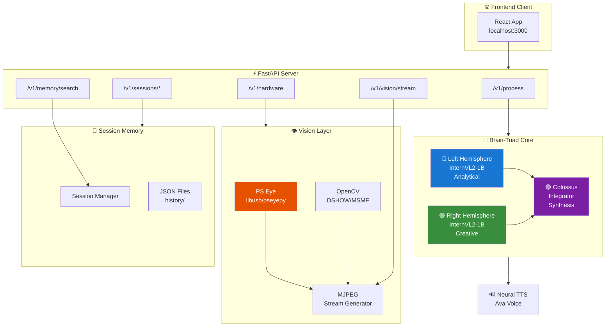
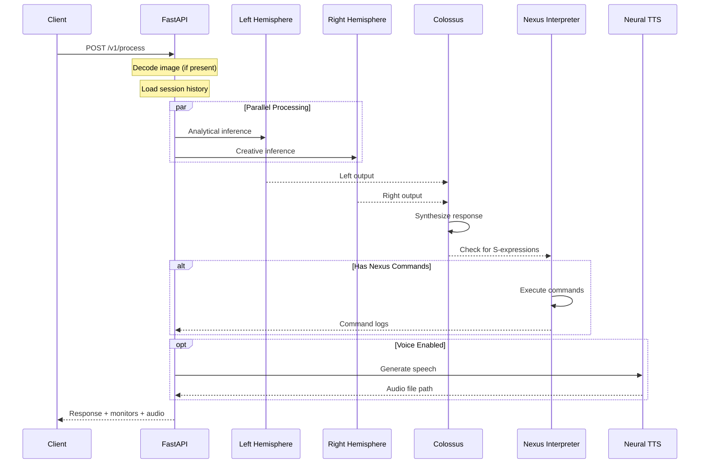
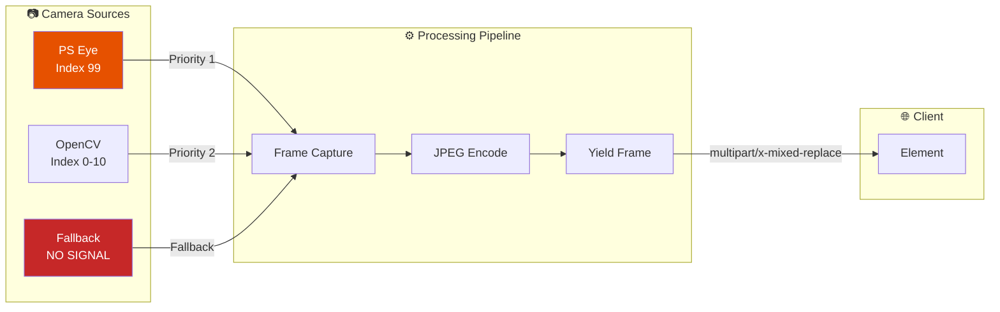
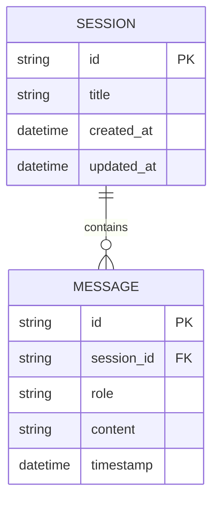
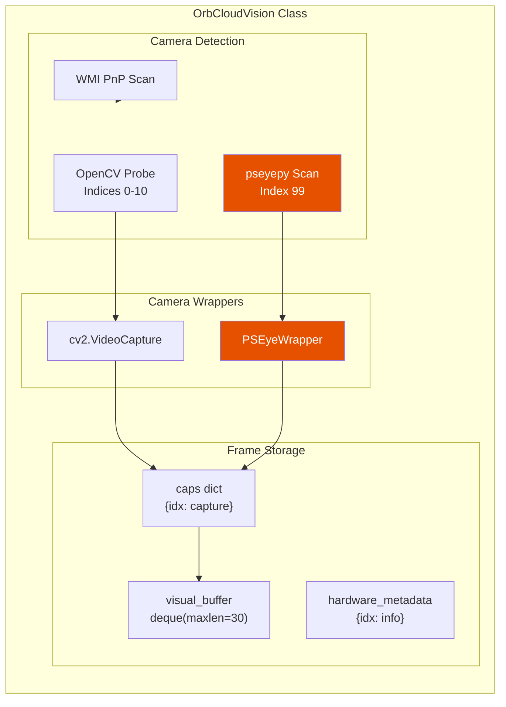
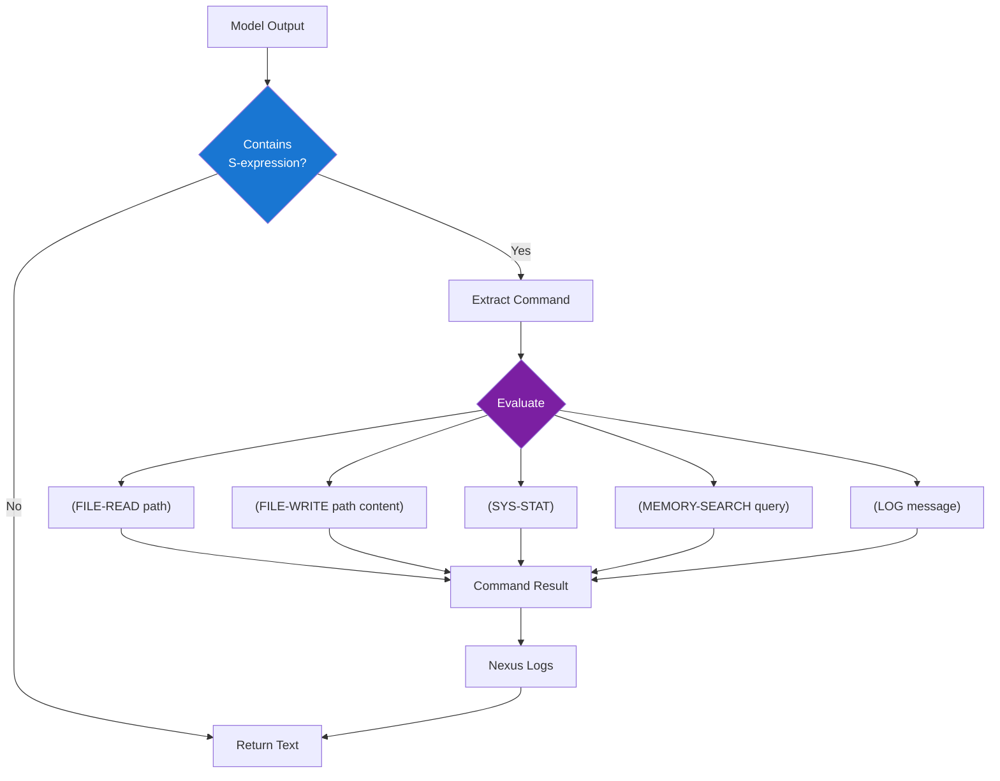
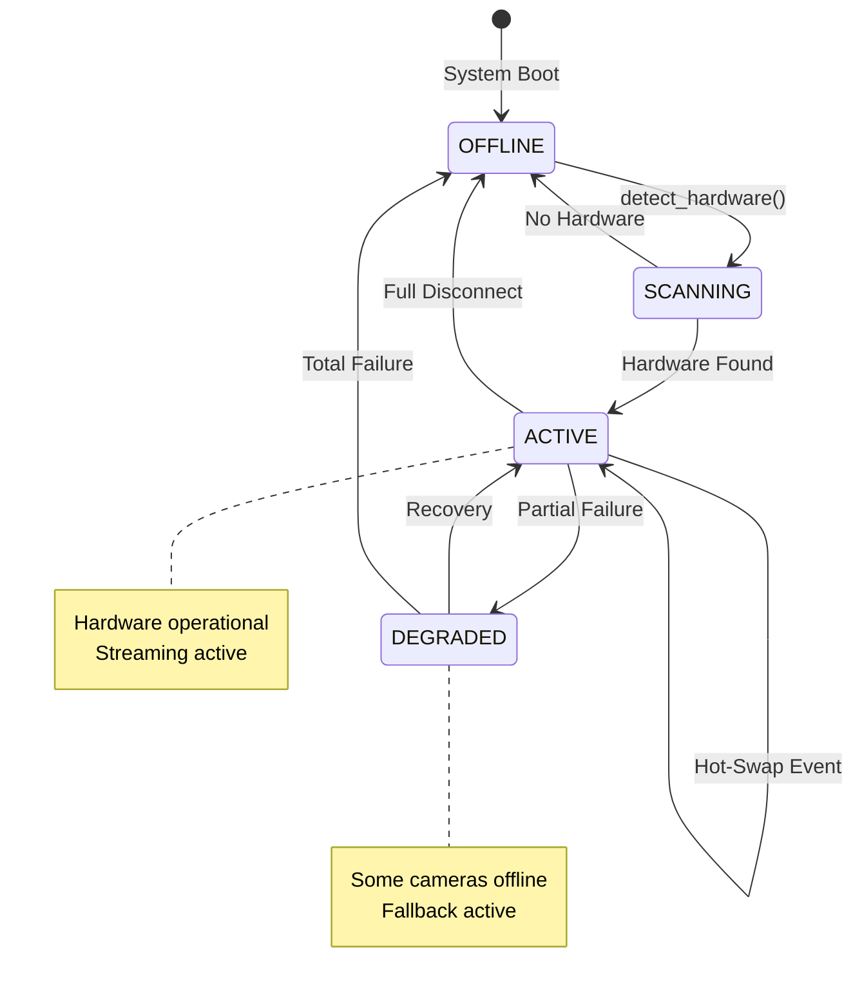
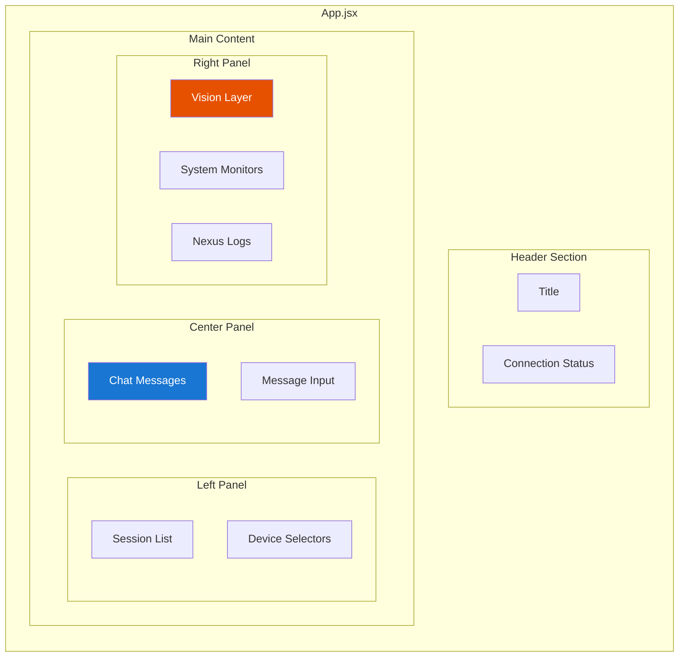

# ImpressionCore B3-Triad API Reference

**Created:** December 25, 2025  
**Updated:** December 29, 2025  
**Author:** Kirk LaSalle  
**Tags:** #docs\api\TRIAD_API_REFERENCE.md #documentation  
**Category:** Documentation  
**Status:** Active
**IDS Integration:** This document is indexed and searchable via the ImpressionCore Documentation System (IDS).

---

**Version:** 1.0.0  
**Author:** Kirk LaSalle  
**Status:** Production

---

## Executive Summary

The ImpressionCore B3-Triad API provides a comprehensive interface to the revolutionary brain-inspired multimodal AI system. This document covers all endpoints, request/response schemas, and includes detailed architecture diagrams.

### Quick Start

```bash
# Start the backend
python src/interfaces/triad_api.py

# Start the frontend  
cd src/interfaces/web_client && npm run dev

# Access the API
curl http://localhost:8000/v1/hardware
```

---

## 🧠 Brain-Triad Architecture

### System Overview



### Processing Pipeline



---

## 📡 API Endpoints

### POST /v1/process

**Multimodal AI Generation** - The primary inference endpoint.

#### Request Schema

```json
{
  "prompt": "string (required)",
  "image_base64": "string (optional)",
  "voice_enabled": true,
  "session_id": "string (optional)"
}
```

#### Response Schema

```json
{
  "response": "The AI-generated text response",
  "monitors": {
    "left_output": "Analytical perspective...",
    "right_output": "Creative interpretation...",
    "synthesis_confidence": 0.92
  },
  "nexus_logs": ["(LOG \"Processing complete\")"],
  "audio_url": "/audio/last_speech.mp3"
}
```

#### Example

```bash
curl -X POST http://localhost:8000/v1/process \
  -H "Content-Type: application/json" \
  -d '{
    "prompt": "What do you see?",
    "image_base64": "/9j/4AAQ...",
    "voice_enabled": true,
    "session_id": "abc123"
  }'
```

---

### GET /v1/hardware

**Hardware Status** - Returns vision layer and GPU telemetry.

#### Response Schema

```json
{
  "status": "OK",
  "vision_active": true,
  "detected_cameras": [
    {
      "id": 99,
      "active": true,
      "backend": "LIBUSB_PSEYEPY",
      "model": "PS Eye (Native)"
    }
  ],
  "vram_mode": true,
  "hardware_telemetry": {...}
}
```

---

### GET /v1/vision/stream

**Live MJPEG Video Stream** - Real-time camera feed.

#### Stream Architecture



#### Usage

```html
<!-- Direct HTML embedding -->

```

```javascript
// JavaScript with cache-busting
const streamUrl = `http://localhost:8000/v1/vision/stream?t=${Date.now()}`;
document.getElementById('video').src = streamUrl;
```

---

### Session Management Endpoints



| Endpoint | Method | Description |
|----------|--------|-------------|
| `/v1/sessions` | GET | List all sessions |
| `/v1/sessions` | POST | Create new session |
| `/v1/sessions/{id}` | GET | Get session details |
| `/v1/sessions/{id}` | DELETE | Delete session |

---

### GET /v1/memory/search

**Semantic Memory Search** - Search across all session memories.

#### Parameters

| Name | Type | Required | Description |
|------|------|----------|-------------|
| `q` | string | Yes | Search query |
| `limit` | integer | No | Max results (default: 5) |

#### Example

```bash
curl "http://localhost:8000/v1/memory/search?q=consciousness&limit=10"
```

---

## 👁️ Vision System Architecture

### OrbCloudVision Component Diagram



### PSEyeWrapper Class

```python
class PSEyeWrapper:
    """Wraps pseyepy Camera to mimic cv2.VideoCapture interface."""
    
    def __init__(self, eye_cam):
        self.eye = eye_cam
        
    def read(self) -> Tuple[bool, np.ndarray]:
        """Returns (success, frame) tuple like cv2.VideoCapture."""
        result = self.eye.read()  # Returns (frame, timestamp)
        frame, timestamp = result
        if isinstance(frame, np.ndarray) and frame.size > 0:
            frame = cv2.cvtColor(frame, cv2.COLOR_RGB2BGR)
            return True, frame
        return False, None
```

---

## 🔧 Nexus Language Interpreter

### Command Flow



### Supported Commands

| Command | Description | Example |
|---------|-------------|---------|
| `(FILE-READ path)` | Read file contents | `(FILE-READ "config.json")` |
| `(FILE-WRITE path content)` | Write to file | `(FILE-WRITE "log.txt" "Hello")` |
| `(SYS-STAT)` | System status | `(SYS-STAT)` |
| `(MEMORY-SEARCH query)` | Search memory | `(MEMORY-SEARCH "topic")` |
| `(LOG message)` | Log message | `(LOG "Processing")` |

---

## 🔌 Sensory Hot-Swap System

### State Machine



---

## 🖥️ Frontend Architecture

### React Component Hierarchy



### Data Flow

```mermaid
flowchart LR
    subgraph State["React State"]
        MSG[messages]
        SID[sessionId]
        CAM[selectedCamera]
        MIC[selectedMic]
    end
    
    subgraph API["API Calls"]
        PROC[POST /v1/process]
        HW[GET /v1/hardware]
        STREAM[GET /v1/vision/stream]
        SESS[/v1/sessions/*]
    end
    
    subgraph UI["UI Components"]
        CHAT[Chat Display]
        VIDEO[Video Feed]
        SELECT[Device Dropdowns]
    end
    
    MSG --> CHAT
    CAM --> VIDEO
    
    INPUT[User Input] --> PROC
    PROC --> MSG
    
    CAM -->|BRAIN camera| STREAM
    STREAM --> VIDEO
    
    HW --> SELECT

    style STREAM fill:#e65100,color:#fff
```

---

## 📊 Error Responses

All error responses follow this schema:

```json
{
  "detail": "Error message describing the issue"
}
```

### HTTP Status Codes

| Code | Meaning | Example |
|------|---------|---------|
| 200 | Success | Request completed |
| 404 | Not Found | Session doesn't exist |
| 500 | Server Error | Processing failure |
| 503 | Unavailable | Triad not initialized |

---

## 🔗 Related Documentation

- [OpenAPI Specification](./openapi.yaml) - Full OpenAPI 3.1 spec
- [Vision System Architecture](../technical/VISION_SYSTEM_ARCHITECTURE.md)
- [Brain-Triad Design](../architecture/BRAIN_TRIAD_DESIGN.md)
- [PS Eye Integration Guide](../hardware/PS_EYE_INTEGRATION_GUIDE.md)

---

## 📜 Changelog

| Version | Date | Changes |
|---------|------|---------|
| 1.0.0 | 2025-12-25 | Initial release with PS Eye support |