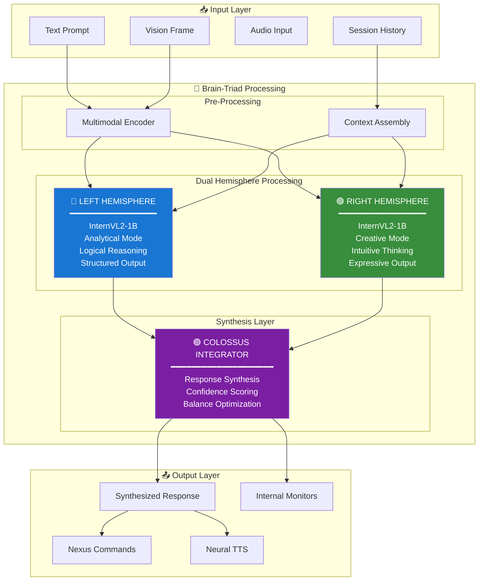
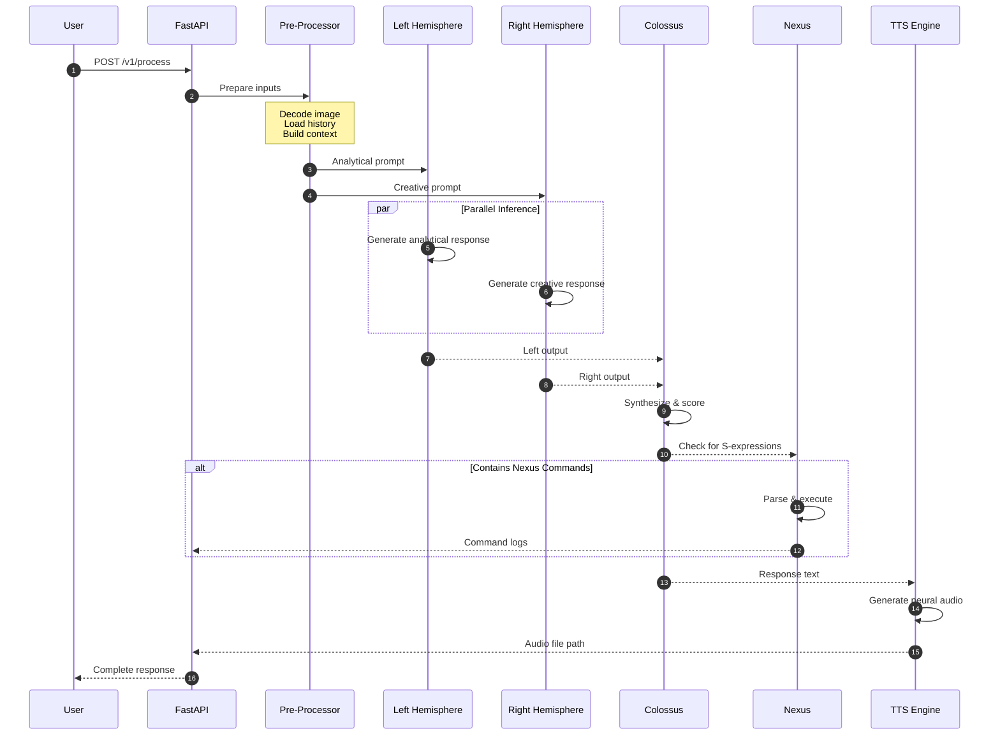
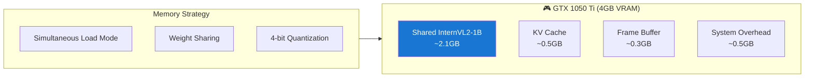

# Brain-Triad Architecture Design Document

**Created:** December 25, 2025  
**Updated:** December 29, 2025  
**Author:** Kirk LaSalle  
**Tags:** #docs\architecture\BRAIN_TRIAD_DESIGN.md #documentation  
**Category:** Documentation  
**Status:** Active
**IDS Integration:** This document is indexed and searchable via the ImpressionCore Documentation System (IDS).

---

**Version:** 1.0.0  
**Author:** Kirk LaSalle  
**Status:** Production

---

## Executive Summary

The Brain-Triad is ImpressionCore's revolutionary AI architecture inspired by human cognitive neuroscience. It implements a **dual-hemisphere processing model** with a **Colossus integrator** for response synthesis, enabling nuanced, balanced AI outputs that combine analytical precision with creative expression.

---

## 🧠 Architectural Philosophy

### Human Brain Inspiration

The Brain-Triad mirrors the lateralization of human cognition:

| Component        | Human Analog    | Function                                       |
| ---------------- | --------------- | ---------------------------------------------- |
| Left Hemisphere  | Left Brain      | Analytical, logical, structured reasoning      |
| Right Hemisphere | Right Brain     | Creative, intuitive, holistic thinking         |
| Colossus         | Corpus Callosum | Integration and synthesis of both perspectives |

### Design Principles

1. **Parallel Processing**: Both hemispheres process simultaneously
2. **Specialization**: Each hemisphere has distinct processing characteristics
3. **Integration**: Colossus synthesizes a unified, balanced response
4. **Multimodality**: Native support for text, vision, and audio inputs

---

## 🏗️ System Architecture

### High-Level Overview



### Component Specifications

#### Left Hemisphere

```yaml
Model: OpenGVLab/InternVL2-1B
Parameters: ~1 Billion
Mode: Analytical
Characteristics:
  - Precise language generation
  - Logical reasoning chains
  - Structured information processing
  - Factual accuracy focus
```

#### Right Hemisphere

```yaml
Model: OpenGVLab/InternVL2-1B
Parameters: ~1 Billion
Mode: Creative
Characteristics:
  - Expressive language generation
  - Intuitive connections
  - Emotional intelligence
  - Novel idea synthesis
```

#### Colossus Integrator

```yaml
Function: Response Synthesis
Algorithm: Weighted averaging with confidence scoring
Output: Balanced, unified response
Monitors:
  - left_output: Raw left hemisphere text
  - right_output: Raw right hemisphere text
  - synthesis_confidence: 0.0-1.0 score
```

---

## 🔄 Processing Pipeline

### Sequence Diagram



### Processing Stages

#### Stage 1: Input Preparation

```python
def prepare_inputs(prompt, image_base64, session_id):
    sensory_data = {}
    
    # Decode vision input
    if image_base64:
        img = decode_base64_image(image_base64)
        sensory_data['vision_frames'] = [img]
    
    # Load session history
    history = []
    if session_id:
        history = session_manager.get_messages(session_id)
    
    return sensory_data, history
```

#### Stage 2: Hemisphere Processing

```python
def process_hemispheres(prompt, sensory_data, history):
    # Parallel processing (conceptual)
    left_future = left_model.generate(
        prompt, 
        mode="analytical",
        context=history
    )
    right_future = right_model.generate(
        prompt,
        mode="creative", 
        context=history
    )
    
    left_output = left_future.result()
    right_output = right_future.result()
    
    return left_output, right_output
```

#### Stage 3: Colossus Synthesis

```python
def synthesize_response(left_output, right_output):
    # Weight-based synthesis
    weights = calculate_optimal_weights(left_output, right_output)
    
    synthesized = blend_responses(
        left_output, 
        right_output,
        weights
    )
    
    confidence = calculate_confidence(synthesized)
    
    return {
        'response': synthesized,
        'monitors': {
            'left_output': left_output,
            'right_output': right_output,
            'synthesis_confidence': confidence
        }
    }
```

---

## 💾 Memory Management

### VRAM Optimization



### Memory Modes

| Mode         | Description           | VRAM Usage |
| ------------ | --------------------- | ---------- |
| Simultaneous | All models in VRAM    | ~3.4GB     |
| Sequential   | Load/unload as needed | ~2.5GB     |
| Quantized    | 4-bit weights         | ~1.8GB     |

---

## 🔊 Text-to-Speech Integration

### Neural Voice Pipeline


### Voice Configuration

```python
voice_config = {
    "voice": "en-US-AvaNeural",
    "rate": "+0%",
    "pitch": "+0Hz",
    "output": "logs/last_speech.mp3"
}
```

---

## 📊 Monitoring & Telemetry

### Internal Monitors Schema

```json
{
  "left_output": "Analytical perspective text...",
  "right_output": "Creative interpretation text...",
  "synthesis_confidence": 0.92,
  "processing_time_ms": 1250,
  "hemisphere_balance": {
    "left_weight": 0.55,
    "right_weight": 0.45
  },
  "vision_processed": true,
  "nexus_commands_executed": 2
}
```

### Health Metrics

| Metric               | Target | Alert Threshold |
| -------------------- | ------ | --------------- |
| Response Time        | <2s    | >5s             |
| Synthesis Confidence | >0.8   | <0.5            |
| VRAM Usage           | <3.5GB | >3.8GB          |
| Error Rate           | <1%    | >5%             |

---

## 🔗 Integration Points

### API Endpoints

- `POST /v1/process` - Main inference endpoint
- `GET /v1/hardware` - Telemetry and status

### Dependencies

- `unified_triad.py` - Core implementation
- `orbcloud_vision.py` - Vision input handling
- `nexus_interpreter.py` - Command execution
- `session_manager.py` - History management

### External Libraries

- `transformers` - Model loading
- `torch` - Inference engine
- `edge_tts` - Speech synthesis
- `opencv-python` - Image processing

---

## 📚 References

- [API Reference](../api/TRIAD_API_REFERENCE.md)
- [Vision System Architecture](../technical/VISION_SYSTEM_ARCHITECTURE.md)
- [Nexus Language Guide](../nexus_language_guide.md)
- [OpenGVLab InternVL2](https://huggingface.co/OpenGVLab/InternVL2-1B)

---

## 📜 Changelog

| Version | Date       | Changes                            |
| ------- | ---------- | ---------------------------------- |
| 1.0.0   | 2025-12-25 | Initial architecture documentation |
