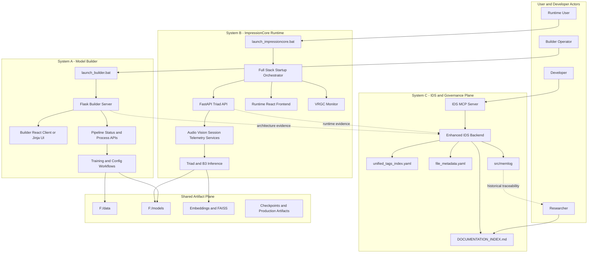
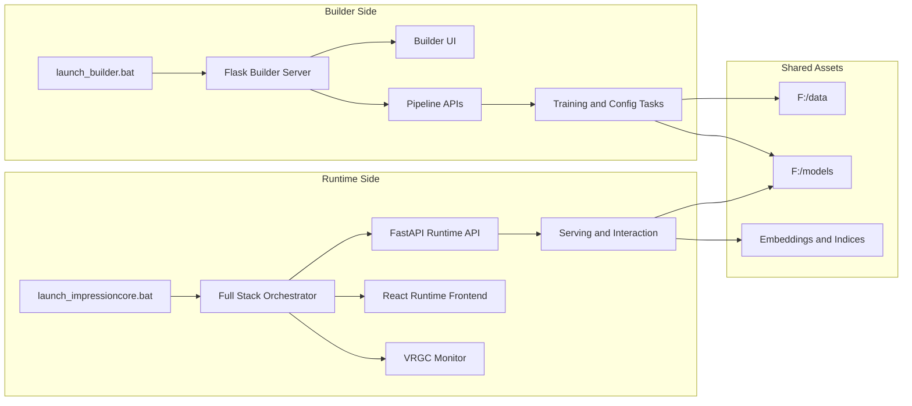
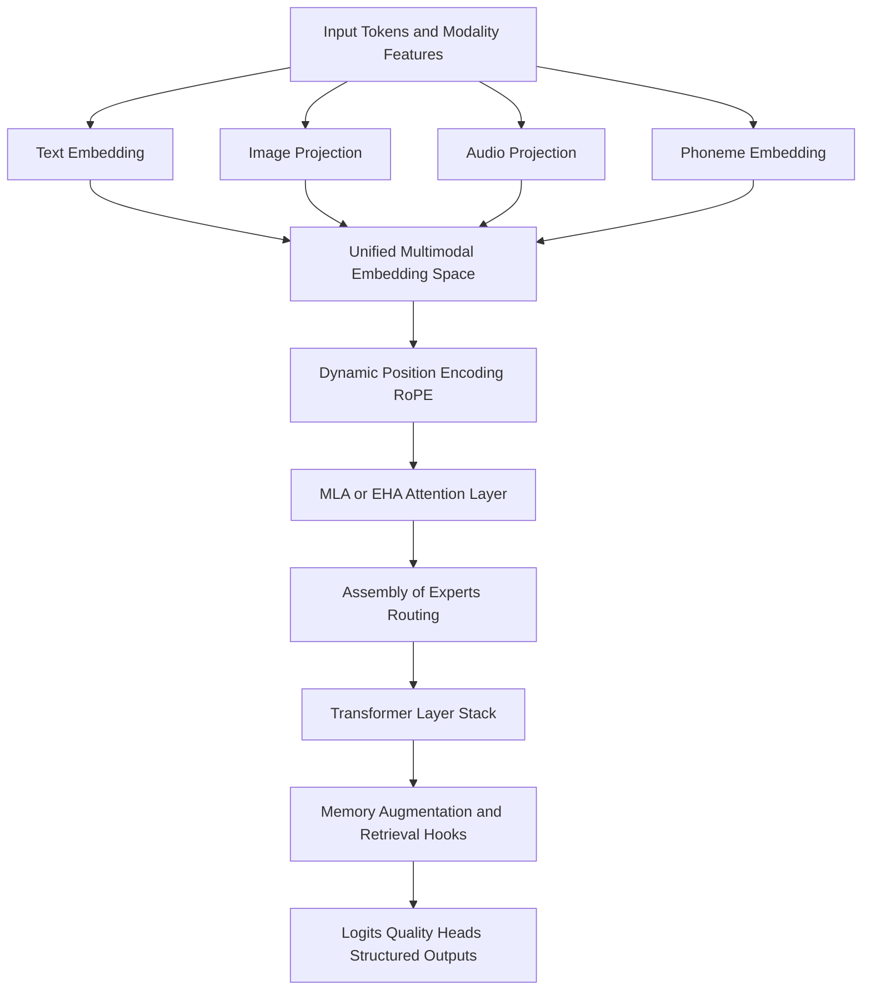
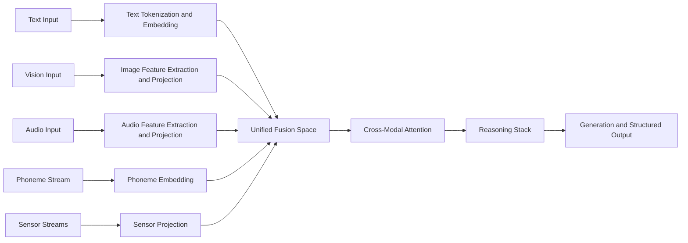
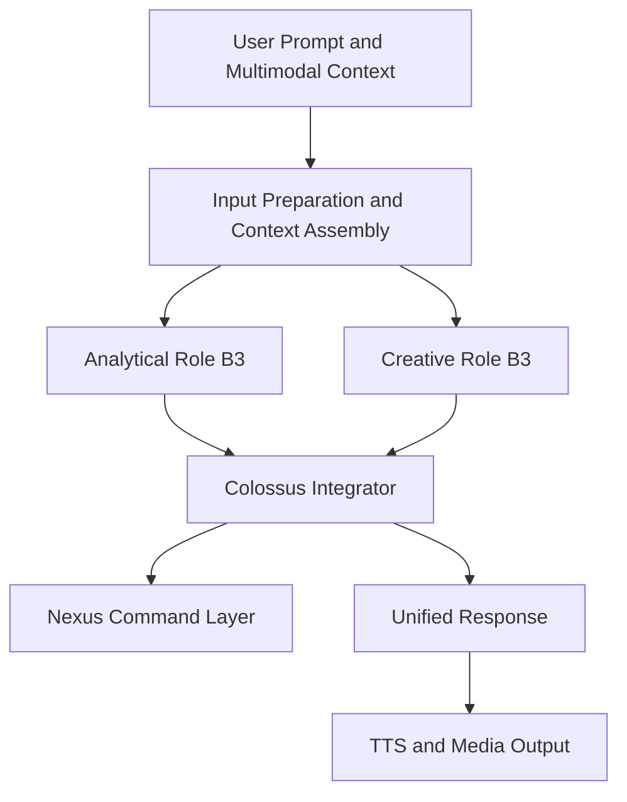
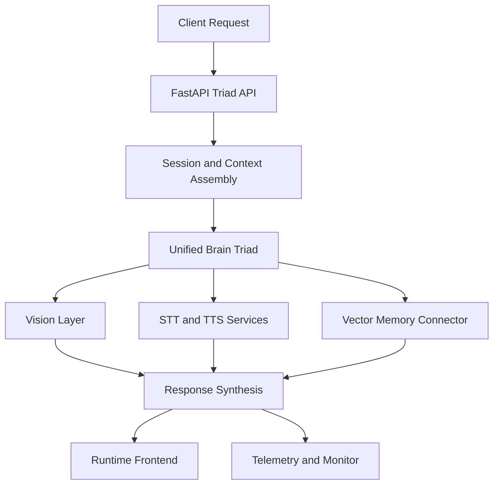
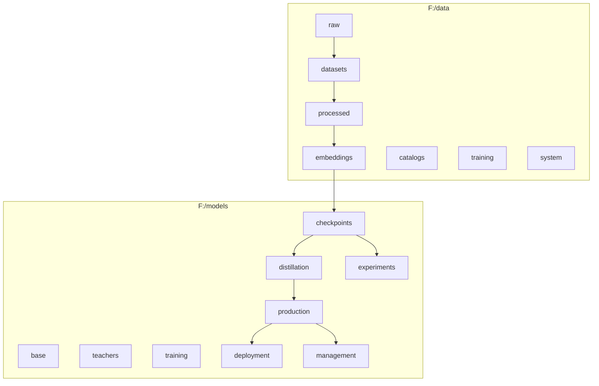
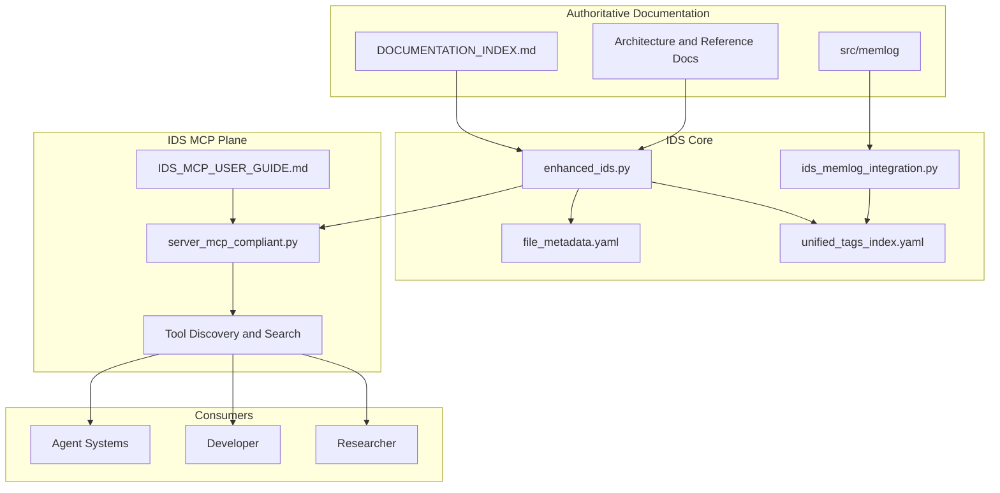
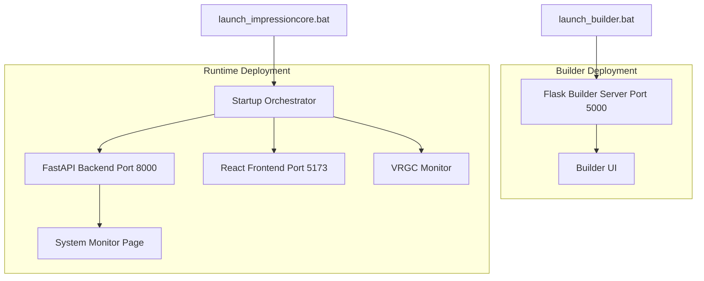
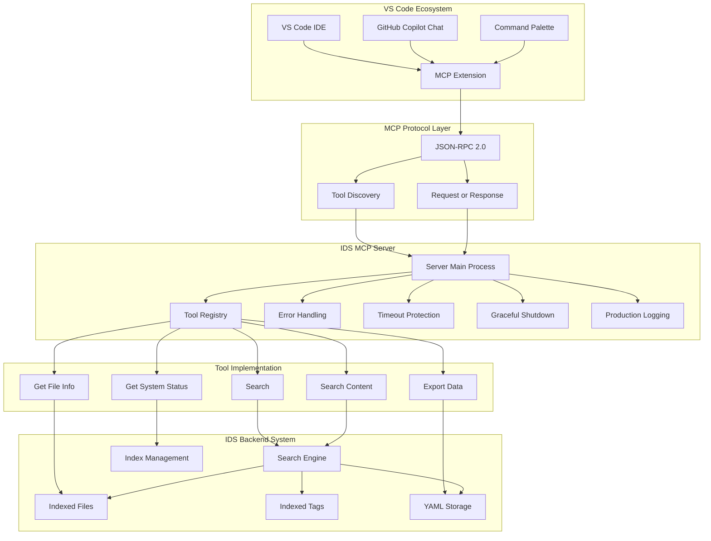

# ImpressionCore B3 Full Multimodal Architectural Blueprint

**Created:** March 29, 2026  
**Updated:** April 03, 2026  
**Author:** GitHub Copilot; Kirk LaSalle source architecture synthesized from repository evidence  
**Category:** Architecture Documentation  
**Status:** Active — Gap Resolution Pass Complete  
**Research Intent:** Copy-ready technical blueprint for ingestion by advanced research systems, including Google Gemini 3.1 Pro, for architectural comparison, synthesis, and deep analysis.

---

## Executive Summary

ImpressionCore B3 is best understood not as a single model, but as a layered system-of-systems built around three major planes:

1. A **model-building and training plane** responsible for configuration, data preparation, multimodal pipeline orchestration, and checkpoint production.
2. A **runtime and interaction plane** responsible for live inference, multimodal serving, session management, telemetry, monitoring, and user-facing interaction.
3. A **documentation, traceability, and governance plane** centered on the ImpressionCore Documentation System, or IDS, the documentation index, and memlog history, which collectively function as a knowledge substrate for architecture stewardship.

At the core of the design is the **B3 architectural family**, which combines multimodal embedding, expert routing, attention optimization, memory-aware reasoning, and consumer-hardware optimization. Around that foundation, ImpressionCore layers a higher-order **brain-triad orchestration pattern** in which analytical and creative roles are integrated through a Colossus synthesis layer. In operational terms, the repository currently contains both:

- A documented **B3 target-state architecture** optimized around native B3 components such as Assembly of Experts, Efficient Multi-Head Latent Attention (EHA), dynamic positional encoding, multimodal fusion, and quantization.
- A live **runtime orchestration stack** that exposes multimodal interaction and triad-style serving through launch scripts, FastAPI, a web client, audio services, and monitoring services.

This document intentionally distinguishes between **implemented architecture**, **operational launch architecture**, **documented target-state architecture**, and **historical memlog evidence**. That distinction is necessary because ImpressionCore's repository contains production launch surfaces, constitutional target-state directives, implementation summaries, and historical architecture memlogs simultaneously.

The result is an architecture with unusual breadth:

- Consumer-hardware-first design, with explicit GTX 1050 Ti constraints.
- Multimodal ambition spanning text, image, audio, video, and sensor modalities.
- Dual-system operation through separate builder and runtime launch paths.
- Brain-inspired orchestration through analytical and creative hemisphere abstractions plus an integrator layer.
- F-drive scale-out strategy for datasets, embeddings, model artifacts, and retrieval indices.
- IDS-backed documentation governance and memlog continuity as a formal architectural subsystem rather than mere project documentation.

---

## Scope and Methodology

### Scope

This blueprint covers:

- The B3 multimodal model family and its documented internal design.
- The dual operational system split between the **Model Builder** and the **ImpressionCore Runtime**.
- The higher-order triad orchestration model used by the runtime layer.
- The training, inference, storage, launch, and monitoring topology.
- The role of IDS, the documentation index, and memlog in sustaining architectural continuity.
- Known ambiguities, gaps, and research questions relevant to external comparison.

### Evidence Model

Claims in this document should be read under one of four evidence labels:

- **Implemented:** Directly evidenced by source files.
- **Operational/Launch:** Directly evidenced by launch scripts, API surfaces, or deployment wiring.
- **Documented/Planned:** Stated in active architecture or reference documentation.
- **Historical/Memlog:** Supported by memlog, baton-pass, or retrospective implementation records.

### Research Method

This blueprint was assembled from local repository evidence, including:

- The canonical documentation map in `docs/DOCUMENTATION_INDEX.md`.
- B3 architecture documents and analysis reports.
- Runtime source files and launch scripts.
- Brain-triad design documents.
- IDS implementation files, guides, and diagrams.
- Memlog entries that capture implementation history.

### IDS and MCP Research Note

The repository contains a local IDS MCP server implementation, backing metadata, and search infrastructure. That local IDS MCP stack was researched directly from repository artifacts. However, this chat environment did not expose the IDS MCP server as a directly invokable MCP tool surface, so the architecture below uses the server implementation, guides, index files, and diagrams as source evidence rather than live tool execution.

---

## Architectural Thesis

ImpressionCore B3 is a **multimodal, brain-inspired AI platform architecture** rather than only a model architecture. Its most important architectural property is not any single module, but the **composition** of the following layers:

1. **Foundation Layer:** B3 model family, tokenization, multimodal embeddings, attention, expert routing, quantization, and memory mechanisms.
2. **Cognitive Orchestration Layer:** Brain-triad role separation and Colossus synthesis logic.
3. **Operational Layer:** Builder workflows, runtime APIs, frontend, telemetry, audio and vision services, and monitoring.
4. **Data and Artifact Layer:** F-drive datasets, embeddings, checkpoints, production artifacts, and vector indices.
5. **Knowledge and Governance Layer:** IDS, document indexing, metadata, tags, and memlog chronology.

This layered composition is what gives ImpressionCore its distinctive identity. By design, the project does not treat model weights, runtime behavior, and architectural documentation as separate concerns. Instead, it treats them as mutually reinforcing system strata.

---

## Model-Only Implementation Track

To support focused model progress, ImpressionCore now defines a strict model-only implementation track with this exact execution order:

1. Architecture
2. Data
3. Embeddings
4. Training

### Scope Boundary

This track intentionally includes only:

- `src/core/models`
- `src/training`
- `src/data`
- supporting configuration under `src/core/config`

This track intentionally excludes:

- runtime APIs and serving surfaces
- vision and avatar implementation
- full-system orchestration layers

### Policy Constraints

- F: storage remains mandatory for model artifacts and data roots in this track.
- Boundary enforcement is strict: model-track modules cannot import runtime, orchestrator, or vision module paths.
- A model-track runner validates architecture->data->embeddings->training readiness in sequence.

### Implementation Entry Points

- `src/core/config/model_track_config.py` for model-only path policy and F: validation.
- `src/core/models/model_track_contracts.py` for explicit architecture/data/embedding/training contracts.
- `src/dev_tools/validation/check_model_track_boundaries.py` for strict import boundary checks.
- `src/dev_tools/validation/validate_model_track_contracts.py` for contract-level readiness validation.
- `src/training/pipelines/model_track_pipeline.py` for sequential model-track validation.

### Execution Control Model

The model-only pipeline now supports execution controls for reliable staged operation:

- **Profiles**: `smoke`, `standard`, `full` to provide default stage behavior.
- **Guardrails**: per-stage timeout, retries, and fail-fast policy.
- **Artifacts**: each run emits a structured JSON artifact under `src/training/pipelines/model_track_runs`.

Default profile behavior:

- `smoke`: embeddings only, text modality, 1 sample, dry-run embeddings, 30-minute timeout, no retries, fail-fast enabled.
- `standard`: embeddings + baseline training, text+image modalities, 100 samples, dry-run embeddings, 60-minute timeout, 1 retry, fail-fast enabled.
- `full`: embeddings + baseline training + DPO, text+image+audio modalities, 500 samples, write-mode embeddings, 3-hour timeout, 1 retry, fail-fast disabled.

Example usage:

- Validation only: `python src/training/pipelines/model_track_pipeline.py`
- Smoke execute: `python src/training/pipelines/model_track_pipeline.py --execute --profile smoke`
- Full execute defaults: `python src/training/pipelines/model_track_pipeline.py --execute --profile full`
- Explicit stage execute: `python src/training/pipelines/model_track_pipeline.py --execute --run-embeddings --embedding-max-samples 10`

---

## System-of-Systems Overview

### High-Level Interpretation

At the highest level, ImpressionCore operates as two major executable systems plus one persistent support substrate:

- **System A: Model Builder**
  - Flask-based builder server.
  - Optional React builder client.
  - Multimodal pipeline initialization.
  - Model configuration and training-adjacent operations.

- **System B: ImpressionCore Runtime**
  - FastAPI backend.
  - React runtime frontend.
  - Vision, audio, telemetry, session management, and monitor services.
  - Triad-oriented inference and orchestration.

- **System C: IDS and Memlog Support Plane**
  - Documentation search and metadata.
  - Documentation index.
  - Tag and file metadata stores.
  - Memlog integration and architecture history.

### System-of-Systems Graph



### Interpretation

This graph captures the defining architectural reality of the repository:

- The **builder** and **runtime** systems are operationally separate.
- They share common artifacts, models, and storage but serve different lifecycle phases.
- IDS and memlog are not external documentation conveniences; they are the system's internal knowledge and evidence plane.

---

## Mission, Constraints, and Design Doctrine

### Mission Orientation

Across the repository's active documentation, ImpressionCore is framed as a brain-inspired multimodal AI platform intended to democratize advanced AI capability under consumer hardware constraints, with strong emphasis on protection-first design and digital identity security.

### Non-Negotiable Constraints

The architecture repeatedly encodes the following constraints:

- **Consumer hardware democracy:** GTX 1050 Ti with 4GB VRAM is treated as a design anchor.
- **Multimodality:** Text is primary, but image, audio, and additional modalities are architecturally central.
- **Memory efficiency:** Quantization, mixed precision, gradient checkpointing, streaming, and dynamic batching are recurring themes.
- **Scalability:** The same architectural family is expected to scale from compact configurations to much larger variants.
- **Traceability:** Documentation, memlog, and indexing systems are expected to preserve architectural state and history.

### Resulting Design Shape

These constraints produce a system with a different shape than a monolithic large-model platform. ImpressionCore is explicitly optimized for:

- Efficient model composition over brute-force scale.
- High architectural density per parameter.
- Externalized storage and vector infrastructure.
- Layered orchestration instead of single-model absolutism.

---

## Dual-System Operating Model

### Overview

The user explicitly described ImpressionCore as two separate major systems. Repository evidence strongly supports that interpretation.

1. **The Model Builder** is launched independently through `launch_builder.bat`.
2. **The Runtime System** is launched independently through `launch_impressioncore.bat`, which delegates to a full-stack startup script.

This is not merely a tooling detail. It is an architectural boundary.

### Model Builder Plane

**Operational/Launch evidence:** `launch_builder.bat`

The builder launcher performs:

- Virtual environment checks.
- Dependency checks for Flask, Jinja2, Werkzeug, Flask-CORS, and Torch.
- CUDA or CPU availability checks.
- Server entry point validation.
- Bytecode pre-compilation.
- Optional build of a React builder client.
- Launch of a Flask builder UI on port `5000`.

**Operational/Launch evidence:** `src/interfaces/web/server.py`

The builder server provides:

- Flask application initialization.
- Builder React client detection with Jinja fallback.
- Blueprint registration for web routes.
- Optional multimodal pipeline initialization.
- Builder-side APIs such as:
  - `/api/v1/pipeline/status`
  - `/api/v1/pipeline/process`
  - `/api/v1/models/b1/info`

### Runtime Plane

**Operational/Launch evidence:** `launch_impressioncore.bat`

The runtime root launcher delegates execution to `src/dev_tools/scripts/start_full_stack_with_monitor.bat`.

**Operational/Launch evidence:** `src/dev_tools/scripts/start_full_stack_with_monitor.bat`

The runtime startup script performs:

- Validation of backend, frontend, monitor, Python, Node.js, and npm dependencies.
- Process cleanup for backend, frontend, and monitor windows.
- Launch of:
  - FastAPI backend on port `8000`
  - Vite/React frontend on port `5173`
  - VRGC autonomous monitor
- Health polling against `/v1/system/status`
- Browser launch for the frontend and system monitor page.

### Builder vs Runtime Graph



### Why the Dual-System Split Matters

This dual-system split implies a clean lifecycle separation:

- The **builder** system defines, prepares, and produces.
- The **runtime** system loads, serves, orchestrates, and interacts.

This separation matters for research comparison because many multimodal systems conflate builder and runtime concerns into one application surface. ImpressionCore does not.

---

## B3 Core Model Architecture

### Architectural Position

B3 is the named model family and architectural core that underpins ImpressionCore's multimodal intelligence layer. Within the repository, B3 appears in three overlapping forms:

- A **documented comprehensive architecture**.
- A **constitutional 39M baseline implementation doctrine**.
- A **larger runtime and orchestration ecosystem** that may use B3-derived or B3-adjacent serving configurations.

### Core Architectural Components

**Documented/Planned evidence:** `docs/B3_ARCHITECTURE_COMPREHENSIVE_DOCUMENTATION.md`

The active B3 architecture documentation defines five major component families:

1. **Dynamic Position Encoding using RoPE**
   - Intended to support long-context scaling.
   - Used as the basis for context window expansion.

2. **Attention Architecture — Canonical Terminology**

   The B3 codebase implements **four distinct attention classes** in `impressioncore_b3_architecture.py`:

   | Class | Purpose | Complexity |
   | ----- | ------- | ---------- |
   | `EfficientMultiHeadLatentAttention` (EHA) | Sliding window + O(n) linear attention for long sequences. Supports TurboQuant KV cache. Primary attention in the B3 transformer stack. | O(n) for long context |
   | `MultiHeadLatentAttention` (MLA) | Latent-space Q/K projection for memory-efficient standard attention. | O(n²) with reduced memory |
   | `HierarchicalMultiHeadLatentAttention` | Multi-scale hierarchical variant. | O(n·log(n)) |
   | `HierarchicalAttentionOfExperts` | Expert-routing attention layer. | Variable |

   **Terminology rule:** EHA and MLA are **distinct mechanisms**, not synonyms. EHA is the default long-context attention used in the B3 transformer block. MLA is available as an alternative for memory-constrained configurations. Documentation and code should use the specific class name, not the generic term "latent attention." The source variable `self.attention` in the B3 transformer block instantiates `EfficientMultiHeadLatentAttention`.

   - EHA provides linearized behavior for longer sequences via sliding window decomposition.
   - MLA provides memory efficiency via latent-space Q/K projection with reduced dimensionality.

3. **Assembly of Experts**
   - Expert routing with multiple experts and top-k token activation.
   - Load balancing and specialization are part of the design goal.

4. **Quantization System**
   - INT4 and INT8-oriented block-wise strategies.
   - Designed for memory compression while preserving performance.

4a. **TurboQuant KV Cache Compression** *(New — arXiv:2504.19874, ICLR 2026)*

   Training-free two-stage vector quantization for KV cache compression, critical for
   achieving long-context inference on the GTX 1050 Ti (4 GB VRAM).

   **Algorithm stages:**

   1. **PolarQuant** — Random orthogonal rotation (fast Walsh-Hadamard with sign flips)
      concentrates coordinate energy into a Beta distribution, enabling near-optimal
      per-coordinate scalar quantization at 3.5 bits/channel with negligible quality loss.
   2. **QJL Residual** — 1-bit Quantized Johnson-Lindenstrauss projection on the
      quantization residual preserves unbiased inner products for attention logits.

   **VRAM savings (B3 12-layer, head_dim=64):**

   | Context length | FP16 KV cache | TurboQuant 3.5-bit | Savings |
   |----------------|---------------|--------------------| --------|
   | 4 096 tokens   | ~75 MB        | ~16 MB             | ~59 MB  |
   | 64k tokens     | ~1.2 GB       | ~260 MB            | ~960 MB |

   **Configuration** (`B3Config3B`):

- `kv_cache_quantization = "turboquant_3.5bit"` (default)
- `kv_cache_bits = 3.5` | `kv_cache_use_qjl = True` | `kv_cache_rotation_type = "hadamard"`
- Alternate aggressive mode: 2.5 bits/channel (minor quality trade-off, extra 25% savings)

   **Source files:**

- `src/core/quantization/turboquant.py` — Core algorithm (PolarQuant, QJL, compressor)
- `src/core/quantization/turboquant_config.py` — Configuration dataclass
- `src/inference/turboquant_kv_cache.py` — Tensor-level KV cache with compress/decompress
- `src/inference/cache.py` — `create_kv_cache()` factory with strategy dispatch
- Integration in `EfficientMultiHeadLatentAttention._cached_attention()` for inference path

1. **Comprehensive Multimodal Integration**
   - Text, image, audio, video, and sensor pathways unified into one architecture family.

### Constitutional 39M Baseline

**Documented/Planned evidence:** `docs/reference/B3_39M_COMPLETE_ARCHITECTURE_IMPLEMENTATION.md`

The 39M architecture document establishes a compact baseline intended to preserve the full B3 feature set inside a strict parameter budget. Within that doctrine:

- Assembly of Experts is scaled down for efficiency.
- Latent attention remains central.
- Multimodal embedding remains mandatory.
- Protection-first identity and user-safety processing are architecturally integrated.

This indicates that the project treats **feature completeness** as more important than pure parameter count minimization.

### Source-Level Role Configuration Evidence

**Implemented evidence:** `src/orchestrator/tri_arch_orchestrator.py`

The tri-architecture orchestrator instantiates role-specific configurations using `B3Config` and `ImpressionCoreB3Model`, indicating that B3 is treated as the model substrate for role-specialized orchestration. The file shows:

- Role-specific `d_model`, `num_heads`, `num_layers`, `num_experts`, and `experts_per_token` settings.
- A B3-backed role model object.
- Direct use of multimodal inputs including:
  - `input_ids`
  - `image_features`
  - `audio_features`
  - `phoneme_ids`
- Packaging of role outputs into a tri-message protocol.

### B3 Internal Stack Graph



### Why the B3 Stack Matters

The B3 design is notable because it attempts to solve five problems simultaneously:

- Multimodal input fusion.
- Long-context processing.
- Efficient specialization via experts.
- Consumer-hardware fit via quantization and memory optimization.
- Scalability from compact to larger configurations.

Many architectures optimize one or two of these dimensions. B3 is explicitly trying to optimize all five at once.

---

## Multimodal Processing Architecture

### Modality Coverage

ImpressionCore B3 is architected as a **full multimodal system**. The repository describes the following modality classes:

- **Text**
- **Image**
- **Audio**
- **Video**
- **Sensor modalities** including RGB, depth, thermal, and LiDAR in documented form

### Text Pathway

Text remains the dominant control and reasoning modality.

**Tokenizer Strategy — Resolved:** The tokenizer architecture is an **intentional hybrid design**, fully documented in `src/core/models/UNIFIED_TOKENIZER_ARCHITECTURE.md` and implemented in `src/core/models/unified_tokenizer_system.py`.

| Stage | Tokenizer | Rationale |
| ----- | --------- | --------- |
| **Input encoding** | `microsoft/DialoGPT-small` | Conversational understanding optimized (Reddit-trained) |
| **Output generation** | `GPT2Tokenizer` | Text generation fluency optimized |
| **Vocabulary bridge** | `UnifiedTokenizerSystem.create_vocab_alignment()` | Bidirectional mapping between DialoGPT and GPT-2 token IDs |

Empirical testing shows a consistent 0.3–0.6% quality advantage for this hybrid approach over either tokenizer alone. The processing pipeline is: `DialoGPT → B3 Model → GPT-2`.

- `tri_arch_orchestrator.py` uses DialoGPT-small (matches input encoding path).
- Training configs reference the hybrid approach with `tokenizer_approach: hybrid_dialogpt_gpt2`.
- Runtime `unified_triad.py` uses broader processor loading for InternVL2 serving (see Runtime Model Stack below).

### Image Pathway

**Documented/Planned evidence:** B3 architecture documents describe image embedding through CLIP-style feature extraction.

**Implemented evidence:** role orchestration and runtime layers accept image features or image input. The runtime stack also includes vision-layer integration and capture serving.

### Audio Pathway

**Documented/Planned evidence:** B3 documents describe Wav2Vec2-style and phoneme-level support.

**Implemented evidence:**

- `src/interfaces/triad_api.py` initializes STT and TTS services.
- `src/orchestrator/unified_triad.py` attempts to initialize an audio engine.
- `src/orchestrator/tri_arch_orchestrator.py` explicitly accepts `audio_features` and `phoneme_ids`.

### Video and Sensor Pathways

#### Implementation Status: 🔴 Aspirational / Roadmap

A comprehensive source-level audit (April 2026) confirms:

- **No `VideoEncoder`, `SensorEncoder`, or equivalent class** exists anywhere in `src/`.
- `b3_multimodal_encoders.py` implements only: `TextEncoder`, `ImageEncoder`, `AudioEncoder`, `MultimodalFusion`.
- `MultimodalFusion.num_modalities = 3` (text=0, image=1, audio=2). No video or sensor modality IDs are defined.
- `B3Config` contains no video or sensor configuration fields.
- `impressioncore_b3_architecture.py` contains zero references to video, sensor, lidar, thermal, or depth.

Video and sensor pathways are **aspirational roadmap items** documented in target-state architecture but with zero implementation. The multimodal fusion graph above includes them for architectural completeness; implementation status badges should be used when citing modality coverage.

| Modality | Status | Encoder | Evidence |
| -------- | ------ | ------- | -------- |
| Text | ✅ Implemented | `TextEncoder` (5.4M params) | Code + Runtime + Memlog |
| Image | ✅ Implemented | `ImageEncoder` (4.2M params) | Code + Runtime + Memlog |
| Audio | ✅ Implemented | `AudioEncoder` (3.2M params) | Code + Runtime + Memlog |
| Video | 🔴 Aspirational | None | Documentation only |
| Sensor (RGB/Depth/Thermal/LiDAR) | 🔴 Aspirational | None | Documentation only |

### Historical Memlog Support

**Historical/Memlog evidence:** `src/memlog/b3_phase1_enhanced_memlog_20250712.md`

The memlog explicitly records:

- Added image and audio modality support.
- Data loader discovery of text, image, and audio files from the F drive dataset.
- Projection layers for image and audio features.
- GPT2TokenizerFast adoption for stronger tokenization.
- Mixed precision, gradient accumulation, and memory tracking.

This memlog is important because it shows multimodal capability not merely as aspiration, but as tracked implementation work.

### Multimodal Fusion Graph



### Why Multimodal Fusion Matters

ImpressionCore is not architected as text-plus-attachments. It is architected as a **multimodal fusion system** in which multiple input classes are expected to project into a shared representational space and feed a unified reasoning stack.

---

## Brain-Triad and Cognitive Orchestration Architecture

### Position in the Stack

Above the B3 model family, ImpressionCore defines a **brain-inspired triad architecture**. This acts as a cognitive orchestration layer rather than merely another neural block.

### Triad Abstraction Layers

The triad is implemented as a **two-layer stack**, not a single module:

```text
unified_triad.py (52KB)         ← Service Layer: audio, vision, avatar, Nexus, session
  └─ tri_arch_orchestrator.py (12.7KB)  ← Model Layer: B3 roles + Colossus integration
       ├─ RoleModel(B3Config, "analytical")   ← Left Hemisphere instance
       ├─ RoleModel(B3Config, "creative")     ← Right Hemisphere instance
       └─ Colossus.load(ColossusConfig)       ← Integration layer
```

- **Model Layer** (`tri_arch_orchestrator.py`): Creates two `RoleModel` instances (each wrapping `B3Config` + `ImpressionCoreB3Model`), runs them in parallel via `threading.Thread` (2 daemon threads), and feeds their `TriMessage` outputs to `Colossus.integrate()`.
- **Service Layer** (`unified_triad.py`): Wraps the model layer with multimodal processor loading, vision layer bootstrapping, audio engine initialization, avatar engine, Nexus interpreter, and device-aware configuration.

This is **layered orchestration**, not duplication.

### Runtime Model Stack

The runtime operates with a **dual model coexistence**:

| Component | Model | Role | Status |
| --------- | ----- | ---- | ------ |
| Role-model orchestration | ImpressionCoreB3Model (native) | Target architecture for triad inference | ✅ Code-real |
| Multimodal processing | InternVL2-1B (pretrained) | Interim serving processor for vision-language | ✅ Operational |
| Tokenization | DialoGPT-small / GPT-2 (hybrid) | Input/output tokenization | ✅ Implemented |
| Integration | Colossus (trained, 100k examples) | Role output synthesis | ✅ Trained |

**Interpretation:** B3 is the native target architecture being trained. InternVL2-1B provides immediate multimodal serving capability as a bridge. Both coexist in the runtime. As B3 training matures, the InternVL2 dependency is expected to reduce.

### Triad Specialization Maturity

| Component | Status | Checkpoint |
| --------- | ------ | ---------- |
| Base B3 Model | 🟡 Training (step 5000) | `F:/models/checkpoints/kd_sft_phase2/step_5000.pt` |
| Colossus Integrator | ✅ Trained (100k examples) | `F:/models/management/training_sessions/colossus/` |
| Analytical B3 (Left Hemisphere) | 📅 Planned | Requires base B3 completion |
| Creative B3 (Right Hemisphere) | 📅 Planned | Requires base B3 completion |
| Query Router | 📅 Planned | Requires hemispheric specialization |

The triad **code infrastructure** is fully implemented (orchestrator, threading, TriMessage protocol, Colossus). The hemispheric **specialization** (fine-tuning into distinct analytical/creative variants) is planned, pending base B3 maturity.

### Core Triad Roles

**Documented/Planned evidence:** `docs/architecture/IMPRESSIONCORE_C_BRAIN_TRIAD_ARCHITECTURE.md`

The governing triad document defines:

- **Left Hemisphere / Analytical Role**
  - low-temperature
  - factual precision
  - structured logic
  - deterministic behavior

- **Right Hemisphere / Creative Role**
  - higher-temperature
  - exploratory generation
  - associative reasoning
  - probabilistic behavior

- **Colossus Integrator**
  - arbiter and synthesizer
  - blends outputs from both hemispheres
  - determines coherence and confidence mix

### Source-Level Orchestration Evidence

**Implemented evidence:** `src/orchestrator/tri_arch_orchestrator.py`

This file shows a direct orchestration strategy in which:

- role models are separate B3-backed instances,
- multimodal inputs are prepared and filtered,
- role outputs are packed into a protocol object,
- Colossus is loaded and used as an integration component.

### Runtime Unified Triad Evidence

**Implemented evidence:** `src/orchestrator/unified_triad.py`

The runtime wrapper shows a live service-level triad construct that integrates:

- multimodal processor loading,
- tokenization fallback,
- vision layer bootstrapping,
- audio engine initialization,
- avatar engine initialization,
- Nexus interpreter integration,
- device-aware loading strategy.

This indicates that the runtime triad layer is broader than pure text synthesis. It is a multiservice runtime composition that packages model, modality, and command interaction into one serving object.

### Triad Orchestration Graph



### Research Importance

This triad layer is one of the most distinctive features of ImpressionCore. It shifts the architecture from a single-trajectory generator to a **deliberative ensemble with explicit role separation and synthesis**. For external comparison, this makes ImpressionCore closer to a cognitive orchestration system than a standard monolithic multimodal model.

---

## Training and Model-Building Architecture

### Builder System as Training Surface

The Model Builder provides the main interactive surface for configuration and pipeline operations. Its architecture suggests a training-adjacent and model-definition control plane, rather than a pure notebook or CLI-only workflow.

### Training Methodology

**Documented/Planned evidence:** B3 comprehensive documentation describes a phased curriculum:

1. Text foundation.
2. Visual integration.
3. Audio enhancement.
4. Multimodal fusion.
5. Expert specialization.

This phase sequencing is crucial because it indicates that ImpressionCore treats multimodality as progressive integration rather than attempting full cross-modal training from step zero.

### Memory-Constrained Training Strategy

Across architecture documents and memlog evidence, the training design emphasizes:

- mixed precision,
- gradient checkpointing,
- dynamic batching,
- gradient accumulation,
- memory usage tracking,
- on-demand or streaming access to large embedding stores.

### Streaming Strategy

**Documented/Planned evidence:** `docs/B3_ARCHITECTURE_ANALYSIS_REPORT.md`

The architecture analysis explicitly identifies static dataset loading as a major limitation and proposes streaming discovery, adaptive batching, memory pressure detection, and parallel file processing for the full embedding estate.

### Training Lifecycle Graph


### Why the Training Design Matters

ImpressionCore's training architecture is designed around a tension:

- The system wants extremely broad multimodal coverage.
- The target hardware is extremely constrained.

The answer is architectural discipline: externalized embeddings, phase scheduling, and memory-first training practices.

---

## Runtime and Inference Architecture

### Runtime Entry Point

**Operational/Launch evidence:** `src/interfaces/triad_api.py`

The FastAPI layer is the runtime backbone. It performs:

- global triad instance initialization,
- background auto-start of the vision layer,
- audio service initialization,
- telemetry manager initialization,
- vector memory connector initialization,
- DI boundary wiring for `agent0core`,
- CORS configuration,
- API key middleware,
- serving of monitor pages, captures, and audio artifacts.

### Runtime Service Topology

From the startup orchestration and API code, the runtime system contains at least the following live subsystems:

- FastAPI serving layer,
- frontend client,
- VRGC monitor,
- session manager,
- system logger,
- telemetry manager,
- STT service,
- TTS service,
- vision layer,
- vector memory connector,
- unified triad inference object.

### Runtime Inference Path

The runtime design implies a serving flow of this form:

1. API receives request and multimodal payload.
2. Session history and context are assembled.
3. Triad runtime prepares sensory and textual inputs.
4. Role-oriented reasoning or unified generation is executed.
5. Colossus-style synthesis or equivalent runtime integration occurs.
6. Telemetry and logging are emitted.
7. Audio, monitor, and frontend channels receive outputs.

### Runtime Serving Graph



### Why the Runtime Plane Matters

The runtime is a **service mesh around reasoning**, not just an inference endpoint. The system couples generation, telemetry, sensory input, memory retrieval, audio output, and monitoring into one runtime plane.

---

## Memory, Retrieval, and Vector Architecture

### Memory as Architectural Principle

Memory appears at three levels in ImpressionCore:

1. **Model-internal memory concepts** — documented in B3 design documents as memory-augmented attention hooks. **Status: 📅 Aspirational.** No model-internal memory augmentation code exists in the attention classes.
2. **External vector retrieval (RAG)** — through FAISS and `VectorMemoryConnector`. **Status: ✅ Implemented.**
3. **Documentation memory** — through IDS and memlog. **Status: ✅ Implemented.**

### RAG Scope — Clarified

**The RAG implementation is external-only (post-hoc retrieval augmentation), not model-internal.**

**Implemented evidence:** `src/orchestrator/vector_connector.py`

The `VectorMemoryConnector` provides:

- FAISS index at `src/core/vector_database_1/index.faiss`
- Embedding via `sentence-transformers/all-MiniLM-L6-v2` (384-dim)
- `add_memory()`, `search()`, `search_device_docs()`, `get_device_context()`
- Device profile and document ingestion for device-scoped RAG

**Architecture flow:**

```text
User Query → VectorMemoryConnector.search() → FAISS → Retrieved Context
                                                          ↓
                                        Prepended to prompt → B3 Input
```

This is standard retrieval-augmented generation. Retrieved context is injected as text into the prompt, not into model-internal attention layers. The distinction matters for research: ImpressionCore's RAG is a **prompt-level augmentation** strategy, not a native memory-attention integration.

### Memory Architecture Graph


### Why Memory Matters Here

ImpressionCore treats memory as a compositional capability, not a singular subsystem. Its architecture spans short-term session context, external vector retrieval, and historical traceability through IDS/memlog.

---

## F-Drive Data and Artifact Architecture

### Canonical Storage Doctrine

Repository governance documents define a strict F-drive structure:

- `F:/data`
- `F:/models`

### F:/data Plane

The documented data structure includes:

- raw multimodal inputs,
- curated datasets,
- processed datasets,
- embeddings,
- catalogs,
- archive snapshots,
- training-side data logs,
- system-level data pipeline logs.

### F:/models Plane

The documented model structure includes:

- base models,
- teacher models,
- checkpoints,
- production models,
- distillation artifacts,
- training state,
- deployment bundles,
- experiments,
- management logs and metadata.

### Storage and Model Lifecycle Graph



### Why the F-Drive Matters

The F-drive architecture is not an implementation detail. It is a core systems engineering choice that externalizes the scale problem away from the immediate runtime and into a managed storage fabric.

---

## IDS, Documentation Index, and Memlog as Architectural Support Plane

### Why This Layer Matters

Most AI repositories treat documentation as secondary. ImpressionCore does not. Its documentation system is architected as an operational subsystem with search, metadata, MCP exposure, index management, and memlog integration.

### Documentation Index

**Implemented evidence:** `docs/DOCUMENTATION_INDEX.md`

The documentation index is the canonical map of:

- official permanent documents,
- constitutional documents,
- project reports,
- developer documentation,
- reference documentation,
- implementation files,
- training system documents,
- archive state.

Architecturally, this means ImpressionCore attempts to maintain a **global documentation topology** rather than a loose document collection.

### IDS Core

**Implemented evidence:** `docs/enhanced_ids.py`

The Enhanced IDS backend loads and refreshes:

- `unified_tags_index.yaml`
- `file_metadata.yaml`

This makes IDS a searchable metadata and tag graph over the repository's documentation and code estate.

### IDS MCP Server

**Implemented evidence:** `.mcp/ids-mcp/development/servers/server_mcp_compliant.py`

The repository contains a formal IDS MCP server implementation with:

- tool registry,
- request and response handling,
- SSE transport,
- logging,
- timeout protection,
- connection management.

The repository also contains a dedicated user guide explaining that IDS supports:

- tag-based search,
- file metadata lookup,
- system status,
- VS Code MCP integration.

### Memlog Integration

**Implemented evidence:** `docs/scripts/automation/ids_memlog_integration.py`

This script explicitly merges memlog tags into the unified IDS index. That is strong architectural evidence that memlog is not separate from the knowledge system. Instead, memlog is a first-class documentation and traceability input.

### IDS and Memlog Graph



### Architectural Importance

This support plane gives ImpressionCore a rare property: it is attempting to become **self-describing at repository scale**. That makes its documentation stack part of the actual architecture, especially for long-lived research and development continuity.

---

## Deployment and Launch Topology

### Launch Surfaces

ImpressionCore exposes two user-facing launch contracts:

- `launch_builder.bat`
- `launch_impressioncore.bat`

This yields a deployment topology closer to a development platform than a single packaged model service.

### Runtime Deployment Stack

The runtime startup process proves a three-part active topology:

- backend service,
- frontend client,
- autonomous monitor.

### Launch and Deployment Graph



### Why the Deployment Topology Matters

ImpressionCore should be classified as a **multi-surface AI platform runtime**, not only a model endpoint. Its deployment topology assumes operator interaction, monitoring, and UI-mediated system use.

---

## Hardware and Performance Architecture

### Consumer Baseline

The architecture repeatedly anchors itself to the GTX 1050 Ti with 4GB VRAM. Documented B3 performance claims include:

- less than 1GB inference VRAM in some summaries,
- stable training within the 4GB class through memory strategies,
- multimodal processing under constrained conditions,
- compact-to-large scaling with the same architectural family.

### Performance Enablers

The performance strategy is architectural rather than purely kernel-level. It relies on:

- block-wise quantization,
- mixed precision,
- gradient checkpointing,
- adaptive batching,
- streaming rather than static bulk loading,
- externalized embeddings and indices,
- role specialization and efficient routing.

### Concurrency Model

**Status: Currently undefined — designed for single-user inference.**

The runtime concurrency contract is implicit, not formalized:

- FastAPI provides async request handling via Starlette (single-event-loop model).
- `tri_arch_orchestrator.py` uses Python `threading.Thread` for parallel role inference (2 daemon threads per inference request).
- No rate limiter, request queue, worker pool, or concurrency semaphore is defined.
- No explicit `max_concurrent_inferences` setting exists.

**VRAM budget constraint:** On GTX 1050 Ti (4GB), a single B3 triad inference (two role models + Colossus) consumes the full available VRAM budget. Concurrent inference requests would cause GPU OOM.

**Recommended contract:** Single-user serialized inference with an asyncio semaphore in the API layer. Multi-user scaling requires explicit request queuing and VRAM budget management.

### Multimodal Encoder Dimensional Architecture

The B3 platform defines multiple configuration families with different embedding dimensions:

| Config | `d_model` / `embed_dim` | Purpose |
| ------ | ----------------------- | ------- |
| `B3FoundationConfig` | 384 | 39M constitutional baseline (compact) |
| `B3Config` | 768 | Standard B3 model |
| `B3Config3B` | 4096 | 3B parameter scaling target |

The `b3_multimodal_encoders.py` (TextEncoder, ImageEncoder, AudioEncoder) operates at `d_model=384` for the 39M foundation model. The main `impressioncore_b3_architecture.py` operates at `embed_dim=768`. These are **distinct configuration families for different model scales**, not a mismatch. When integrating 39M encoders into a 768-dim model, a projection layer is required.

### Why the Hardware Doctrine Matters

ImpressionCore's claim to distinctiveness is not that it is the biggest model. It is that it aims for unusually high capability density under severe consumer-hardware constraints.

---

## Security Architecture

**Reference:** `docs/reference/PROTECTION_FIRST_DESIGN_SPECIFICATION.md`

ImpressionCore's security posture covers:

- **API-level:** API key middleware in FastAPI serving layer.
- **Identity:** Protection-first design specification governing digital identity security.
- **Runtime:** Sacred Covenant file integrity verification.

**Gaps identified (April 2026 audit):**

- No adversarial robustness testing or prompt injection defense documented.
- No multimodal jailbreak resistance evaluation.
- No supply chain trust model for pretrained dependencies (DialoGPT, InternVL2, sentence-transformers).
- No rate limiting or abuse prevention beyond API key check.

Security should be treated as a **structurally present but incompletely hardened** layer.

---

## Production Artifact Architecture

### Canonical Export Format

**Status: ✅ Implemented** — `src/core/export/export_production_model.py` (April 2026).

The documented model lifecycle flow is: `F:/models/checkpoints/ → production/ → deployment/`

**Canonical production artifact format (implemented):**

```text
F:/models/production/<model_name>_<version>/
├── model.pt                    # Quantized model weights
├── config.json                 # B3Config serialized
├── tokenizer/                  # Hybrid tokenizer files
│   ├── dialogpt_input/         # DialoGPT-small config + vocab
│   └── gpt2_output/            # GPT-2 config + vocab
├── metadata.json               # Training provenance, params, quality scores
├── colossus_heads.pt           # Colossus integration weights (if triad)
└── MANIFEST.md                 # Human-readable artifact description
```

This format remains a specification target. Implementation of `export_production_model.py` is a prerequisite for formalized production deployment.

---

## Benchmark Architecture

### Current State

| Benchmark | Scope | Status |
| --------- | ----- | ------ |
| `B1PerformanceBenchmark` | B1 model instantiation, inference speed, hardware compatibility | ✅ Implemented |
| `turboquant_memory_benchmark.py` | TurboQuant compression quality, KV cache memory, attention speedup | ✅ Implemented |
| `B3PerformanceBenchmark` | 8-dimension B3 benchmark: latency, VRAM, throughput, TurboQuant, quantization fidelity, context window, expert routing, multimodal fusion | ✅ Implemented (April 2026) |

### Proposed B3 Benchmark Rubric

A canonical B3 benchmark suite should cover:

| Dimension | Metric | Target |
| --------- | ------ | ------ |
| **Inference latency** | Time-to-first-token and tokens/sec on GTX 1050 Ti | <100ms TTFT, >20 tok/s |
| **VRAM utilization** | Peak VRAM during single-user triad inference | <3.5GB (leaving 0.5GB buffer) |
| **Throughput** | Requests/min under serialized inference | Defined by concurrency contract |
| **Conversational quality** | Human-evaluated 1-10 scale on test conversations | Target: 8.0+ |
| **Multimodal accuracy** | Text+image understanding accuracy on curated eval set | TBD |
| **Perplexity** | Cross-entropy loss on held-out test corpus | TBD (depends on training maturity) |
| **Quantization fidelity** | Quality retention post-INT4 quantization | >99% of FP16 baseline |
| **TurboQuant compression** | VRAM savings at 4K/64K context vs FP16 baseline | As documented (59MB/960MB) |

The quality score "10.0" referenced in training configs (`target_quality_score: float = 10.0`) does not have a standardized definition. A reproducible rubric must define what constitutes each quality level.

---

## Failure Modes and Graceful Degradation

The runtime starts ~10 services simultaneously. The following failure modes and degradation strategies should be defined:

| Service | If Unavailable | Degradation Strategy |
| ------- | -------------- | -------------------- |
| FAISS / VectorMemoryConnector | RAG context unavailable | Inference proceeds without retrieval augmentation |
| STT service | Voice input unavailable | Text-only input mode |
| TTS service | Voice output unavailable | Text-only output mode |
| Vision layer | Image input unavailable | Text+audio only |
| InternVL2 processor | Multimodal serving degraded | Fall back to B3-only text inference |
| Colossus checkpoint | Integration unavailable | Return analytical role output directly |
| VRGC Monitor | No autonomous monitoring | Runtime continues without health alerts |
| Frontend | No UI | API-only serving mode |

**Service dependency graph:** All services are soft-optional except the FastAPI core and at least one B3 role model. The current codebase uses try/except patterns for graceful degradation but does not define explicit health check contracts or circuit breaker patterns.

---

## Architectural Gaps, Ambiguities, and Research Questions

The repository is rich, but it is not perfectly uniform. The following status reflects a **source-code-level audit conducted April 2026** that traced each gap to its implementation evidence.

### Resolved Gaps (April 2026)

| # | Gap | Resolution | Evidence |
| - | --- | ---------- | -------- |
| 1 | MLA vs EHA terminology | **Resolved.** These are distinct classes with different algorithms. Variable renamed from `self.mla` to `self.attention`. Canonical terminology table added above. | `impressioncore_b3_architecture.py` L409, L704 |
| 2 | Tokenizer unification | **Resolved.** Intentional hybrid design (DialoGPT→B3→GPT-2) documented in `UNIFIED_TOKENIZER_ARCHITECTURE.md`. | `src/core/models/UNIFIED_TOKENIZER_ARCHITECTURE.md` |
| 3 | B3 vs runtime serving boundary | **Clarified.** B3 = native target, InternVL2 = interim serving processor. Dual model coexistence is intentional. | `tri_arch_orchestrator.py`, `unified_triad.py` |
| 4 | Triad layers | **Clarified.** Two-layer stack: model layer (orchestrator) wraps into service layer (unified triad). Not duplication. | See Triad Abstraction Layers section |
| 6 | RAG scope | **Clarified.** External FAISS-backed retrieval only. Model-internal memory augmentation is aspirational. | `vector_connector.py` |

### Active Gaps (Requiring Implementation)

| # | Gap | Status | Impact |
| - | --- | ------ | ------ |
| 5 | Video/sensor implementation | ✅ `VideoEncoder` implemented (April 2026); gated by `enable_video=False` — training data not yet sourced | Modality claims now implementation-backed; training required to activate |
| 7 | Concurrency model | ✅ `asyncio.Semaphore` wired in `triad_api.py`; configurable via `IC_GPU_CONCURRENCY`; `/v1/system/concurrency` endpoint live | 4GB VRAM OOM risk eliminated for default serialized mode |
| 8 | Production artifact export | ✅ `export_production_model.py` fully implemented (April 2026) — FP16/INT8/FP32, tokenizer export, Colossus heads, validation, MANIFEST | Deployment lifecycle is now complete |
| 9 | Benchmark rubric | ✅ `B3PerformanceBenchmark` implemented — 8 dimensions, JSON output, CLI | Quality claims are now reproducible |

### Newly Identified Gaps (April 2026 Audit)

| # | Gap | Category | Impact |
| - | --- | -------- | ------ |
| 10 | Comparison matrix self-scoring calibration | Credibility | 30/30 rating conflates "specified" with "validated" |
| 11 | Security architecture gaps | Security | No adversarial robustness or prompt injection defense |
| 12 | Dimensional mismatch documentation | Architecture | 384-dim encoders vs 768-dim B3 needs explicit projection docs |
| 13 | Triad specialization status | Completeness | Hemispheric models are planned, not trained |
| 14 | Graceful degradation architecture | Reliability | No formal service dependency graph or circuit breakers |

---

## Comparison Framework for External Research

For research comparison against other multimodal systems, ImpressionCore B3 should be evaluated on at least the following axes:

1. **System topology**
   - monolithic model vs platform architecture
   - builder/runtime split vs single executable surface

2. **Multimodal integration style**
   - native unified embedding vs loosely coupled tool use
   - full modality ambition vs text-dominant augmentation

3. **Reasoning composition**
   - single generator vs role-specialized orchestration
   - presence or absence of synthesis layer like Colossus

4. **Hardware doctrine**
   - enterprise-first vs consumer-first
   - architectural efficiency emphasis vs brute-force scaling

5. **Memory architecture**
   - context-only vs vector retrieval plus external memory
   - data-plane externalization and embedding fabric

6. **Governance and traceability**
   - ordinary documentation vs IDS-style searchable architectural knowledge plane
   - presence of memlog as a historical implementation substrate

7. **Lifecycle completeness**
   - model-only vs end-to-end builder, runtime, monitor, and documentation ecosystem

### Research Summary Statement

ImpressionCore B3 should be compared not only to multimodal models, but to **multimodal AI operating systems**, **cognitive orchestration frameworks**, and **consumer-hardware-constrained AI platforms**. That is the correct comparison class.

---

## Source Map and Evidence Classes

### Primary Architecture Sources

- `docs/B3_ARCHITECTURE_COMPREHENSIVE_DOCUMENTATION.md`
- `docs/B3_ARCHITECTURE_ANALYSIS_REPORT.md`
- `docs/reference/B3_39M_COMPLETE_ARCHITECTURE_IMPLEMENTATION.md`
- `docs/architecture/IMPRESSIONCORE_C_BRAIN_TRIAD_ARCHITECTURE.md`
- `docs/architecture/BRAIN_TRIAD_DESIGN.md`

### Operational Runtime and Launch Sources

- `launch_builder.bat`
- `launch_impressioncore.bat`
- `src/dev_tools/scripts/start_full_stack_with_monitor.bat`
- `src/interfaces/web/server.py`
- `src/interfaces/triad_api.py`
- `src/orchestrator/tri_arch_orchestrator.py`
- `src/orchestrator/unified_triad.py`

### Governance, IDS, and Documentation Sources

- `docs/DOCUMENTATION_INDEX.md`
- `docs/enhanced_ids.py`
- `.mcp/ids-mcp/development/servers/server_mcp_compliant.py`
- `docs/reference/mcp_server/IDS_MCP_USER_GUIDE.md`
- `docs/unified_tags_index.yaml`
- `docs/file_metadata.yaml`
- `docs/scripts/automation/ids_memlog_integration.py`
- `docs/diagrams/ids_mcp_server_architecture_2025-06-07.mmd`

### Historical Evidence Sources

- `src/memlog/b3_phase1_enhanced_memlog_20250712.md`

---

## Final Architectural Assessment

ImpressionCore B3 is best described as a **brain-inspired multimodal architecture ecosystem** whose model family, runtime system, builder system, storage plane, and documentation plane are all architecturally meaningful.

Its defining characteristics are:

- explicit builder/runtime separation,
- a B3 model family designed for multimodality and efficiency,
- a triad-style orchestration layer for differentiated reasoning roles,
- externalized F-drive-scale data and artifact management,
- IDS-backed documentation and memlog as a formal knowledge substrate,
- strong consumer-hardware-first constraints that shape every layer.

In comparison to typical multimodal AI systems, ImpressionCore is unusual because it attempts to unify:

- model architecture,
- cognitive orchestration,
- operational deployment,
- storage architecture,
- and repository-scale architectural memory.

That combination gives ImpressionCore research value beyond any single model checkpoint. It is a living architecture program, not merely a static multimodal model specification.

---

## Appendix A: IDS MCP Reference Diagram

The following Mermaid graph is preserved in-line because IDS is part of the architecture and because the local repository contains this design artifact as a first-class diagram.



---

## Appendix B: Research-Ready Summary for Machine Ingestion

ImpressionCore B3 is a consumer-hardware-first, brain-inspired, multimodal AI platform architecture composed of a builder plane, a runtime plane, and an IDS-backed documentation and memlog governance plane. Its core architectural primitives include multimodal embedding fusion, long-context attention design, expert routing, quantization, retrieval-aware memory strategies, and higher-order triad orchestration through analytical, creative, and Colossus-integrated roles. The repository evidences both live operational surfaces and documented target-state architecture, making the project best understood as an evolving multimodal AI operating environment rather than a single static model.
<!-- End of document -->
