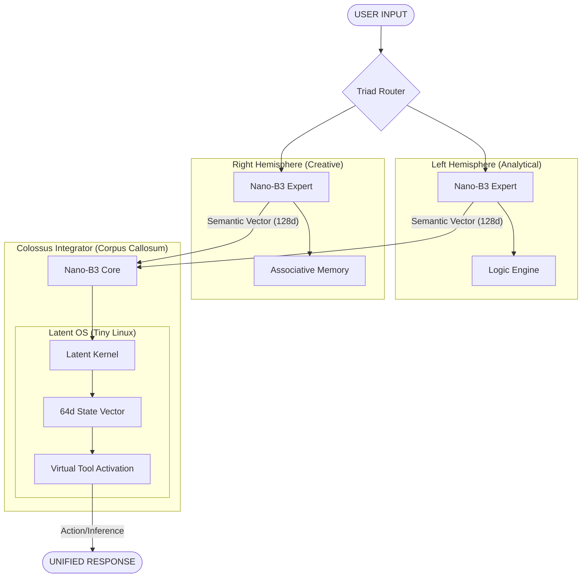

# ImpressionCore Nano-Triad: Latent OS Architecture

**Created:** December 23, 2025  
**Updated:** December 29, 2025  
**Author:** ImpressionCore Team  
**Tags:** #docs\architecture\NANO_TRIAD_ARCHITECTURE_DESIGN.md #documentation  
**Category:** Documentation  
**Status:** Active
**IDS Integration:** This document is indexed and searchable via the ImpressionCore Documentation System (IDS).

---

The Nano-Triad is a biological-inspired AI orchestration pattern designed for high-efficiency "Virtual Modeling" and tool-use on consumer hardware.

## 🏛️ System Overview

## 🐧 The Latent OS Concept

Unlike traditional LLMs that output text token-by-token, the **Nano-Triad Colossus** maintains a persistent "system state" in its latent space.

| Component | Biological Analog | Latent OS Function |
|-----------|-------------------|--------------------|
| **Left Hemisphere** | Analytical Processing | Provides precise instruction sets and logic verification. |
| **Right Hemisphere** | Creative Vision | Provides pattern recognition and "broad-stroke" context. |
| **Colossus** | Corpus Callosum | Integrates BOTH into the **Latent State**. |
| **Latent Kernel** | Cognitive Integration | Models transitions in the virtual state (Simulating Linux registers). |

## 🚀 Efficiency Profile (GTX 1050 Ti)

| Metric | Nano-Triad (3 Units) | Percentage of 4GB VRAM |
|--------|---------------------|------------------------|
| **Weight Footprint** | ~15MB (FP32) | 0.38% |
| **Activations** | ~50MB | 1.25% |
| **K/V Cache** | ~20MB | 0.50% |
| **Total Overhead** | **~85MB** | **~2.1%** |

*This leaves **97.9%** of your memory available for the Main Curriculum B3 model or higher-resolution multimodal buffers.*