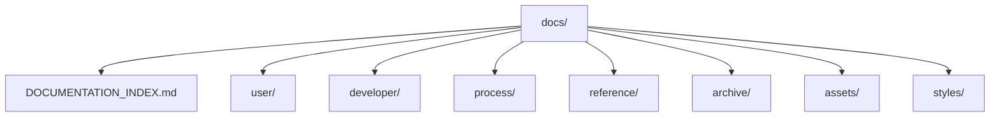

# ⚠️ ARCHIVED FILE

**Created:** May 19, 2025  
**Updated:** December 29, 2025  
**Author:** Kirk LaSalle; GitHub Copilot  
**Tags:** #ids #standardized_header #docs\archive\archive\developer\document_management_automation.md #docs\developer\document_management_automation.md #documentation [developer, documentation, automation, 2025]  
**Category:** Developer Documentation  
**Status:** Active
**IDS Integration:** This document is indexed and searchable via the ImpressionCore Documentation System (IDS).

---

This file has been archived for historical, compatibility, or deprecation reasons. Do not modify or use in active development.

# Document Management Automation

**Created:** October-15-2024  
**Updated:** August-04-2025  
**Author:** ImpressionCore Team  
**Tags:** #docs\developer\document_management_automation.md #documentation  
**Category:** Developer Documentation  
**Status:** Deprecated

---
tags: [developer, documentation, automation, 2025]
Last updated: 2025-05-31
Responsible: @GitHubCopilot
---

## Documentation Analytics & Tag Health

The `doc_analytics.py` script provides maintainers with a quick overview of documentation health, tag usage, and update frequency.

**Features:**

- Reports files missing tags
- Shows tag usage frequency (most/least used tags)
- Lists docs not updated in 60+ days
- Identifies orphaned docs (not referenced in `DOCUMENTATION_INDEX.md`)
- Outputs a summary to the console and to `doc_analytics_report.md`

**Usage:**
```bash
python docs/developer/doc_analytics.py
```
Review the generated `doc_analytics_report.md` for actionable insights.


# ImpressionCore Documentation Management Automation

_Last updated: 2025-05-19_

## Overview

This document describes the automated system for managing, verifying, and maintaining the documentation in the `docs/` directory of ImpressionCore. The goal is to ensure all documentation is accurate, categorized, up-to-date, and easily accessible, supporting world-class software development integrity.


## Directory Structure




## Documentation Viewer Integration

The ImpressionCore Documentation Viewer is the recommended tool for browsing, editing, and verifying all project documentation:

- **Project-wide doc browser**: Instantly browse and open any Markdown file in `docs/` and subdirectories.
- **Tag-based navigation**: View and filter docs by tags (from YAML frontmatter).
- **Section navigation**: Jump to any section in a doc via the navigation tree.
- **Edit/preview toggle**: Seamlessly switch between editing and rendered preview.
- **Keyboard shortcuts**: For fast file operations and navigation.

### Workflow Integration

1. Use the viewer to browse and edit docs as part of your development workflow.
2. Verify tags and structure before committing changes.
3. Use the tag filter to find related docs and ensure consistency.
4. All changes are reflected in `DOCUMENTATION_INDEX.md` and validated by automation scripts.

See [src/tools/doc_viewer/README.md](../../src/tools/doc_viewer/README.md) for usage details.
``` text


### 2. Redundancy and Deprecation Checker (Python)

```python
import os
from datetime import datetime

def find_duplicates(doc_map):
    seen = {}
    duplicates = []
    for category, files in doc_map.items():
        for f in files:
            if f in seen:
                duplicates.append((f, seen[f], category))
            else:
                seen[f] = category
    return duplicates

def move_to_archive(duplicates):
    for f, cat1, cat2 in duplicates:
        src = os.path.join("docs", cat2, f)
        dst = os.path.join("docs", "archive", f)
        os.rename(src, dst)
        with open(dst, "a") as file:
            file.write(f"\n\n> Deprecated and moved to archive on {datetime.now().strftime('%Y-%m-%d')}.\n")
``` text


## LLM Agent Instructions

- Always use `docs/DOCUMENTATION_INDEX.md` as the first-read and context source.
- Categorize new or updated documents into the correct subdirectory.
- Update timestamps and responsible party on every change.
- Move deprecated or superseded docs to `docs/archive/` with a deprecation notice.
- Use automation scripts to check for outdated, redundant, or missing docs and to regenerate the index.
- Do not modify or manage `src/memlog/` (logs only).


## Diagram: Document Lifecycle

```mermaid
sequenceDiagram
    participant User
    participant LLM_Agent
    participant Automation
    participant Maintainer

    User->>LLM_Agent: Add or update document
    LLM_Agent->>Automation: Trigger scan and categorize
    Automation->>Automation: Update index, check health
    Automation->>Maintainer: Notify of issues or required actions
    Maintainer->>LLM_Agent: Approve or request changes
    LLM_Agent->>User: Confirm update and next steps
``` text

---

## Contact

For questions or to report issues, contact the documentation maintainer or project lead.
