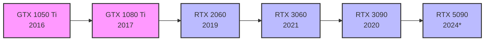

# ⚠️ ARCHIVED FILE

**Created:** August 09, 2025  
**Updated:** December 29, 2025  
**Author:** Kirk LaSalle; GitHub Copilot  
**Tags:** #ids #standardized_header #docs\archive\archive\reference\IMPRESSIONCORE_VISION_AND_SERIES.md #documentation  
**Category:** Reference Documentation  
**Status:** Active
**IDS Integration:** This document is indexed and searchable via the ImpressionCore Documentation System (IDS).

---

This file has been archived for historical, compatibility, or deprecation reasons. Do not modify or use in active development.

# ImpressionCore: Vision, Series, and Paradigm Shift

**Created:** August 9, 2025  
**Author:** Kirk LaSalle & GitHub Copilot  
**Status:** Permanent

## What is ImpressionCore?

## GPU Generational Comparison: The Paradigm Shift in Context

The following table and diagrams illustrate the exponential leap in AI capability from the GTX 1050 Ti through the RTX 5000 series, highlighting why ImpressionCore’s hardware-agnostic design is so transformative.

### GPU Generational Comparison Table

| GPU Model      | Year | CUDA Cores | Tensor Cores | VRAM         | FP16/Mixed Precision | AI/Deep Learning Support |
|---------------|------|------------|--------------|--------------|----------------------|-------------------------|
| GTX 1050 Ti   | 2016 | 768        | 0            | 4GB GDDR5    | No                   | Minimal                 |
| GTX 1080 Ti   | 2017 | 3584       | 0            | 11GB GDDR5X  | No                   | Moderate (no tensor)    |
| RTX 2060      | 2019 | 1920       | 240          | 6GB GDDR6    | Yes (1st gen)        | Strong                  |
| RTX 3060      | 2021 | 3584       | 112          | 12GB GDDR6   | Yes (3rd gen)        | Excellent               |
| RTX 3090      | 2020 | 10496      | 328          | 24GB GDDR6X  | Yes (3rd gen)        | Extreme                 |
| RTX 5090*     | 2024 | 19200+     | 600+         | 32GB+ GDDR7  | Yes (4th gen)        | Revolutionary           |

*Specs for RTX 5090 are projected/rumored for illustration.

### Exponential Growth Flow (Mermaid Diagram)

### Paradigm Shift Impact

- **Tensor Cores:** Introduced with RTX 2000, enable 10–100x faster AI computation vs. GTX series.
- **FP16/Mixed Precision:** Dramatically reduces memory and compute requirements for deep learning.
- **VRAM & CUDA Cores:** Each generation brings exponential increases, unlocking larger models and faster training.
- **ImpressionCore’s Guarantee:** If it runs on a 1050 Ti, it will excel on any RTX card—future-proofing AI for all users.

---

ImpressionCore is a brain-inspired, multimodal AI framework designed to democratize artificial intelligence by making advanced AI accessible and efficient on consumer hardware—even legacy GPUs like the GTX 1050 Ti. It is the foundational “parent” AI, architected to enable a new generation of efficient, accessible, and protection-first AI systems for all humanity.

### Core Principles

- **Constitutional Compliance:** Governed by strict constitutional directives (see Permanent Active Directives, Prime Directive, Sacred Covenant)
- **Protection-First Design:** User avatar creation and digital identity security are core capabilities
- **Democratization:** Designed for consumer hardware democracy, not just high-end systems
- **Modular, Multimodal Architecture:** Supports text, image, audio, and video modalities
- **File Integrity:** Absolute file protection and integrity protocols

---

## ImpressionCore Series Roadmap

- **B3:** Foundational 39M parameter model, concentrated intelligence, runs on GTX 1050 Ti
- **AVT:** Advanced Vision Transformer, next-level multimodal integration
- **IU1:** Integrated User AI, personalized and adaptive assistant
- **IS1:** ImpressionCore System 1, a revolutionary operating system paradigm, replacing traditional computing with an AI-first, user-centric platform

---

## Paradigm Shift: Why Target GTX 1050 Ti?

- **Proof of Possibility:** If advanced AI can run on a 1050 Ti, it will be exponentially faster and more capable on RTX 2000/3000+ series hardware
- **Future-Proofing:** Sets a new baseline for AI accessibility—what works here will excel everywhere
- **Democratization:** Empowers users globally, regardless of hardware, to access high-performance AI
- **Ecosystem Foundation:** Establishes the groundwork for the IS1 operating system and future AI-native computing

---

## Strategic Vision

ImpressionCore is not just a model—it is the foundation for a new computing paradigm. Its architecture, protocols, and ethical commitments ensure that as hardware advances, every user benefits from exponential improvements in AI capability, speed, and security. This is the essence of the paradigm shift: redefining what’s possible for everyone, not just the privileged few.

---

**This document is permanent and must be included in all future documentation indices and project overviews.**
