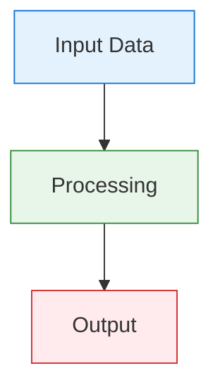

# ImpressionCore Standards Official

**Created:** August 10, 2025  
**Updated:** December 29, 2025  
**Author:** Kirk LaSalle; GitHub Copilot  
**Tags:** #ids #standardized_header #docs\reference\IMPRESSIONCORE_STANDARDS_OFFICIAL.md #standards #documentation #developer_standards #diagram_style_standard #date_format_standard #header_standard #official #permanent  
**Category:** Reference Documentation  
**Status:** Active
**IDS Integration:** This document is indexed and searchable via the ImpressionCore Documentation System (IDS).

---

## Purpose

This document consolidates all current ImpressionCore standards into a single, official, permanent reference. It supersedes prior standalone standards documents while incorporating their most up-to-date guidance.

Sources combined (most current content applied where overlapping):

- [docs/developer/diagram_color_standard.md](../developer/diagram_color_standard.md) (Active)
- [docs/archive/archive/reference/documentation_standards.md](../archive/archive/reference/documentation_standards.md) (Archived)
- [docs/archive/archive/developer/code_documentation_standards.md](../archive/archive/developer/code_documentation_standards.md) (Archived)

Archived sources remain for history; this document is the canonical standard going forward.

---

## 1. Documentation Standards

### 1.1 Permanent Date Format Standard

- Required human-readable format: Month Day, Year (e.g., August 4, 2025)
- With time when needed: Month Day, Year HH:MM:SS AM/PM
- Deprecated formats (do not use in content):
  - August-04-2025, 2025-08-04, 08/04/2025, 04-Aug-2025, ISO timestamps
- Filenames may use ISO for sortability: 2025-08-04_filename.md

### 1.2 Document Header Structure

Each document must begin with a single H1, followed by metadata block:

```markdown
# Document Title

**Created:** Month Day, Year  
**Updated:** Month Day, Year  
**Author:** Author Name  
**Tags:** #tag1 #tag2 #tag3  
**Category:** Document Category  
**Status:** Active/Draft/Deprecated  
**IDS Integration:** This document is indexed and searchable via the ImpressionCore Documentation System (IDS).
```

Notes:

- Keep a single H1 at top (MD041/MD025 compliant)
- Use a consistent, concise tag set aligned to IDS categories
- End file with a trailing newline (MD047)

### 1.3 Code File Header (Python) — Standard Docstring Template

```python
#!/usr/bin/env python3
"""
Module Title

Brief module description and how it fits ImpressionCore.

Created: Month Day, Year
Updated: Month Day, Year
Author: Author Name
Tags: [tag1, tag2, tag3]
Category: Category
Status: Active

Hardware Target: NVIDIA GTX 1050 Ti (4GB VRAM)
Memory Notes: Key memory optimizations & implications

Examples:
    >>> # minimal usage example here

"""
```

### 1.4 Enforcement & Migration

- IDS automation enforces headers, dates, and tags
- Prefer automated migrations; fix during normal edits otherwise
- Provide before/after examples in PRs when normalizing legacy docs

---

## 2. Code Documentation Standards

### 2.1 Docstrings (Classes and Functions)

- Use one triple-quoted docstring block per entity
- Include: brief purpose, args, returns, raises, memory/performance notes, examples, related links

Class example:

```python
class ExampleClass:
    """
    Brief description of class purpose.

    Attributes:
        attribute_name (type): Description

    Memory Considerations:
        - Gradient checkpointing
        - CPU offload where applicable
    """
```

Function example:

```python
def example_function(x: torch.Tensor, config: dict) -> torch.Tensor:
    """
    Brief description of function purpose.

    Args:
        x (torch.Tensor): Input [batch, features]
        config (dict): Settings including precision, memory_limit

    Returns:
        torch.Tensor: Output tensor

    Raises:
        ValueError: On invalid input

    Memory Usage:
        - Peak ~2x input size; uses checkpointing
    """
```

### 2.2 Commenting Standards

- Inline comments for non-obvious operations and memory choices
- Block comments for broader strategy (perf/memory tradeoffs)
- TODO prefixes: TODO-PERF, TODO-MEM, TODO-TEST, TODO-DOC, TODO-FEAT, TODO-FIX

### 2.3 Code Tagging System

- Functional: [core, utils, multimodal, memory, training, inference]
- Status: [production, development, experimental, deprecated]
- Priority: [critical, high, medium, low]
- Hardware: [gpu-optimized, cpu-fallback, memory-efficient]
- Framework: [pytorch, transformers, brainsim, uks]

Example:

```python
# Tags: [core, memory, gpu-optimized, production]
```

### 2.4 Documentation Automation & QA

- Scripts: validate headers, check docstrings, extract TODOs, generate API docs
- CI: pre-commit header validation, docstring coverage, API docs on release
- Manual checklist: header complete, public APIs documented, memory/perf notes present, examples included

---

## 3. Diagram Style & Color Standards

### 3.1 Purpose

Standardize diagram colors/styles for accessibility and a unified look.

### 3.2 Official Palette (NeuroClarity)

- Input/Data: Blue (#1976d2 / #e3f2fd)
- Processing/Modules: Green (#388e3c / #e8f5e9)
- Output/Errors: Red (#d32f2f / #ffebee)
- Warnings/Special: Amber (#fbc02d / #fff9c4)
- Background/Neutral: Gray (#f5f5f5)

Color Key (fill/stroke):

- Input/Data: #e3f2fd / #1976d2
- Processing: #e8f5e9 / #388e3c
- Output: #ffebee / #d32f2f
- Warnings: #fff9c4 / #fbc02d

### 3.3 Mermaid Example (Simple)



### 3.4 Accessibility & Best Practices

- Always include a legend for complex diagrams
- Test colorblind accessibility (Coblis/Color Oracle)
- Use consistent shapes/lines across diagrams
- Prefer SVG for clarity; GIF only when animation is essential

---

## 4. Governance & Compliance

- Constitutional References: Permanent Architectural Framework; Permanent Active Directives
- This standards document is official and permanent; prior standalone standards are archived references only
- All changes require: PR with examples, CI header/docstring checks, and IDS index update

---

## 5. Review Summary (August 10, 2025)

- Adopted the most current guidance from the three source documents
- Unified header order (H1 first), date format, and tag conventions
- Consolidated code docstring/comment/TODO standards and automation guidance
- Canonicalized diagram palette and examples; kept accessibility guidance
- No conflicts requiring exception noted; future updates should reference this doc

Review Checklist:

- [x] Date format standard aligned
- [x] Header, tags, and IDS integration format aligned
- [x] Code docstring/comment standards consolidated
- [x] Diagram standards captured with examples

---

## 6. Maintenance

- Update this document when any underlying standard evolves
- Run IDS header standardization and re-index after changes
- Schedule periodic review (monthly) and record updates with dates