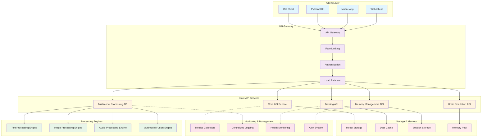

# API Architecture Diagram

**Created:** June 03, 2025  
**Updated:** December 29, 2025  
**Author:** Kirk LaSalle; GitHub Copilot  
**Tags:** #ids #standardized_header #docs\assets\images\api_architecture.md #api #command_line #documentation #memory_management #multimodal #training #web_interface  
**Category:** Documentation  
**Status:** Active
**IDS Integration:** This document is indexed and searchable via the ImpressionCore Documentation System (IDS).

---

This API architecture diagram illustrates the complete API ecosystem, from client interfaces through the API gateway to core services, processing engines, and supporting infrastructure.
