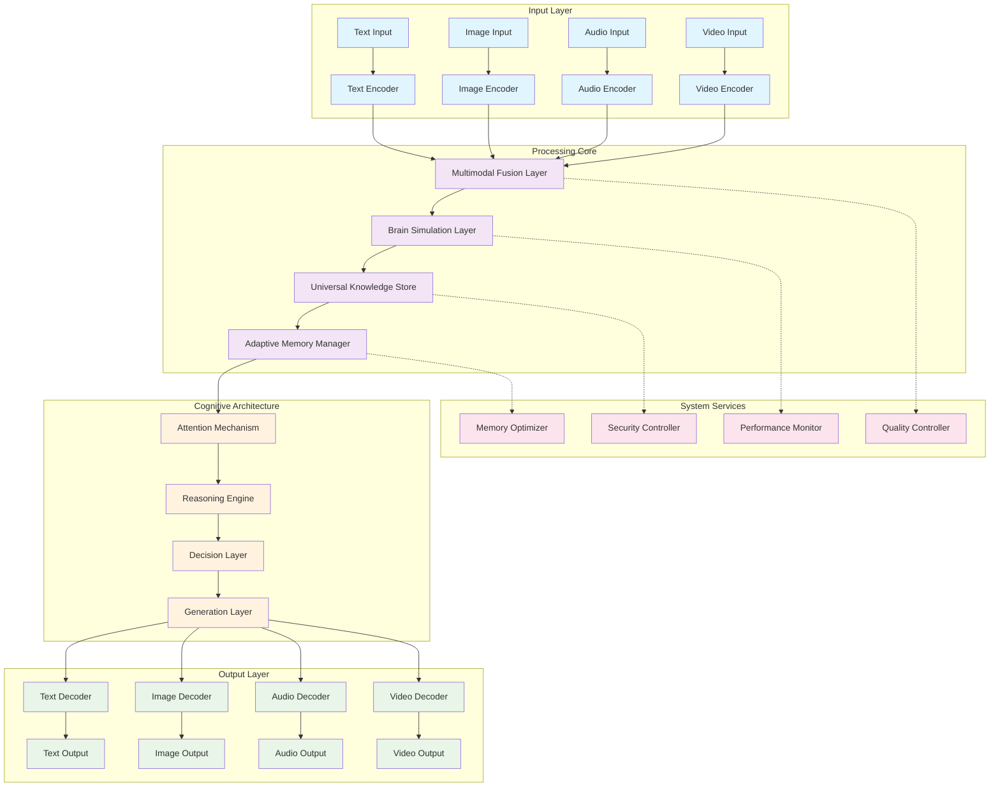

# ImpressionCore Architecture Diagram

**Created:** June 03, 2025  
**Updated:** December 29, 2025  
**Author:** Kirk LaSalle; GitHub Copilot  
**Tags:** #ids #standardized_header #docs\assets\images\architecture.md #attention_mechanism #documentation #memory_management #multimodal #security  
**Category:** Documentation  
**Status:** Active
**IDS Integration:** This document is indexed and searchable via the ImpressionCore Documentation System (IDS).

---

This diagram illustrates the complete ImpressionCore architecture including:

- **Input Layer**: Multi-modal input processing
- **Processing Core**: Brain-inspired processing and memory management
- **Cognitive Architecture**: Attention, reasoning, and decision making
- **Output Layer**: Multi-modal output generation
- **System Services**: Supporting infrastructure and optimization
