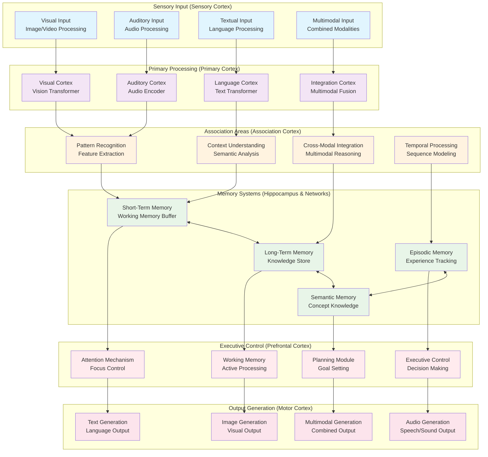

# Brain-Inspired Architecture

**Created:** June 03, 2025  
**Updated:** December 29, 2025  
**Author:** Kirk LaSalle; GitHub Copilot  
**Tags:** #ids #standardized_header #docs\assets\images\brain_inspired_architecture.md #attention_mechanism #documentation #memory_management #multimodal #transformer  
**Category:** Documentation  
**Status:** Active
**IDS Integration:** This document is indexed and searchable via the ImpressionCore Documentation System (IDS).

---

This brain-inspired architecture maps neural processing concepts to AI system components, showing how information flows from sensory input through processing, memory, and executive control to output generation.
