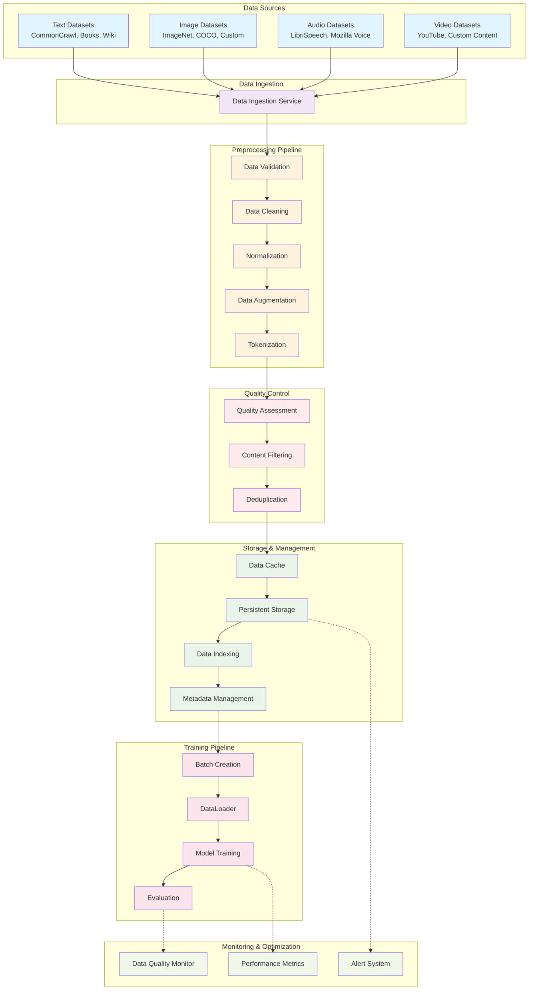

# Data Processing Pipeline Flow

**Created:** June 03, 2025  
**Updated:** December 29, 2025  
**Author:** Kirk LaSalle; GitHub Copilot  
**Tags:** #ids #standardized_header #docs\assets\images\data_processing_pipeline.md #documentation #training #official #permanent  
**Category:** Documentation  
**Status:** Active
**IDS Integration:** This document is indexed and searchable via the ImpressionCore Documentation System (IDS).

---

This comprehensive data flow diagram shows the complete pipeline from raw data sources through preprocessing, quality control, storage, and training phases.