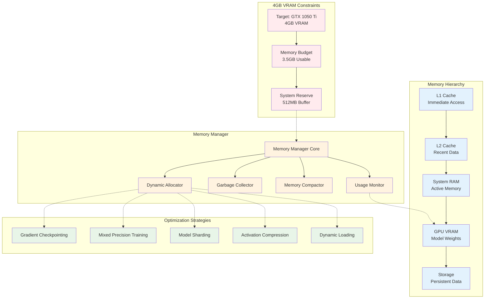

# Memory Optimization Architecture

**Created:** June 03, 2025  
**Updated:** December 29, 2025  
**Author:** Kirk LaSalle; GitHub Copilot  
**Tags:** #ids #standardized_header #docs\assets\images\memory_optimization.md #documentation #gpu_optimization #memory_management #training  
**Category:** Documentation  
**Status:** Active
**IDS Integration:** This document is indexed and searchable via the ImpressionCore Documentation System (IDS).

---

This diagram illustrates the memory optimization architecture designed specifically for consumer hardware with 4GB VRAM constraints.
