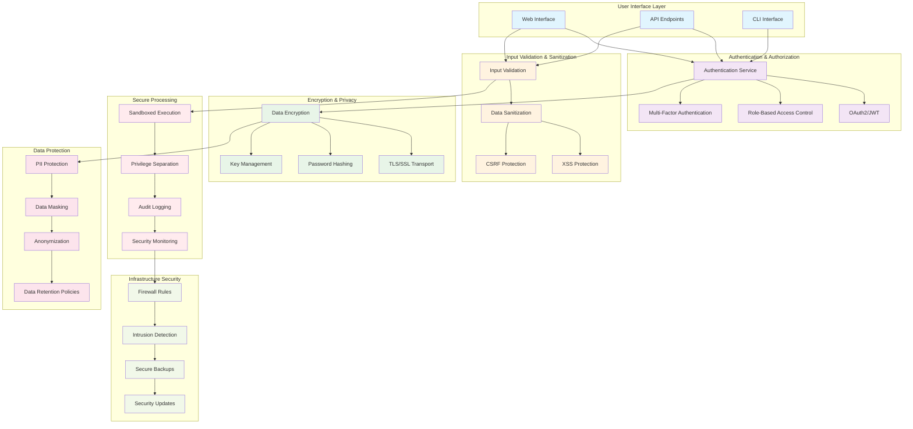

# Security Implementation Architecture

**Created:** June 03, 2025  
**Updated:** December 29, 2025  
**Author:** Kirk LaSalle; GitHub Copilot  
**Tags:** #ids #standardized_header #docs\assets\images\security_architecture.md #api #command_line #documentation #security #web_interface  
**Category:** Documentation  
**Status:** Active
**IDS Integration:** This document is indexed and searchable via the ImpressionCore Documentation System (IDS).

---

This security architecture diagram illustrates the multi-layered approach to security in ImpressionCore, covering all aspects from user authentication to infrastructure protection.
