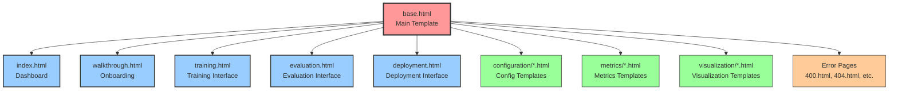

# Template Inheritance Diagram

**Created:** June 03, 2025  
**Updated:** December 29, 2025  
**Author:** Kirk LaSalle; GitHub Copilot  
**Tags:** #ids #standardized_header #docs\assets\images\template_inheritance.md #deployment #documentation #training #web_interface  
**Category:** Documentation  
**Status:** Active
**IDS Integration:** This document is indexed and searchable via the ImpressionCore Documentation System (IDS).

---

This diagram shows how all templates inherit from the base template, ensuring consistent styling and structure across the entire web interface.
