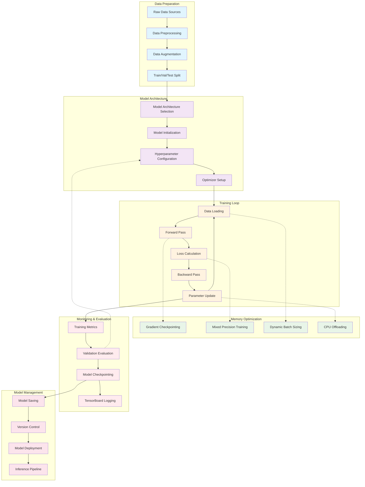

# Training Pipeline Architecture

**Created:** June 03, 2025  
**Updated:** December 29, 2025  
**Author:** Kirk LaSalle; GitHub Copilot  
**Tags:** #ids #standardized_header #docs\assets\images\training_pipeline.md #attention_mechanism #deployment #documentation #inference #memory_management #testing #training #official #permanent  
**Category:** Documentation  
**Status:** Active
**IDS Integration:** This document is indexed and searchable via the ImpressionCore Documentation System (IDS).

---

This training pipeline diagram shows the complete flow from data preparation through training, optimization, monitoring, and model management, with special attention to memory optimization for consumer hardware.