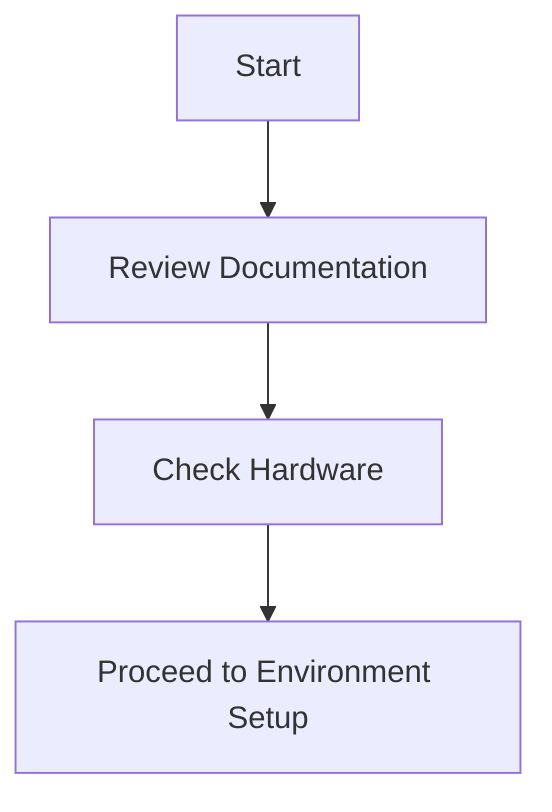
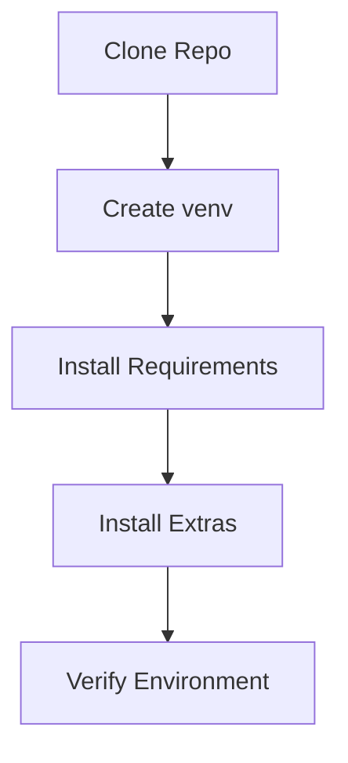
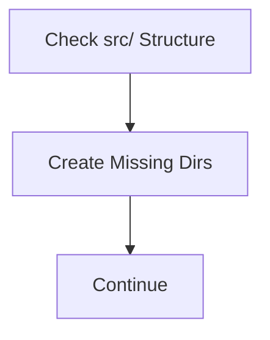
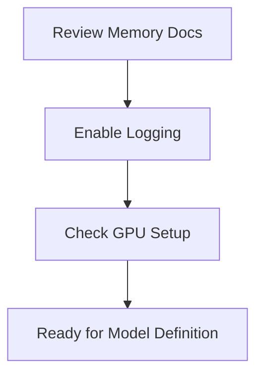
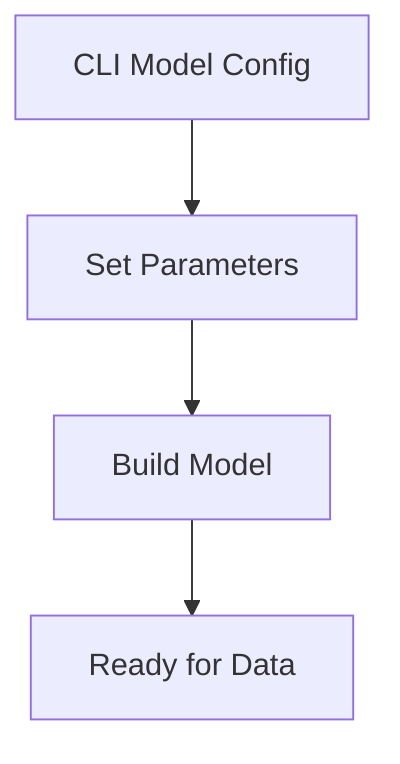
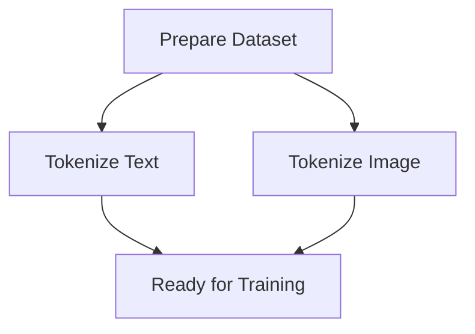
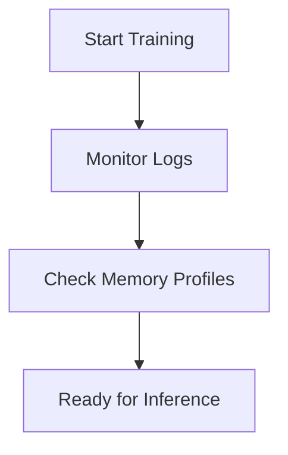
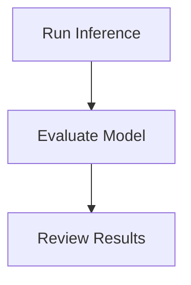
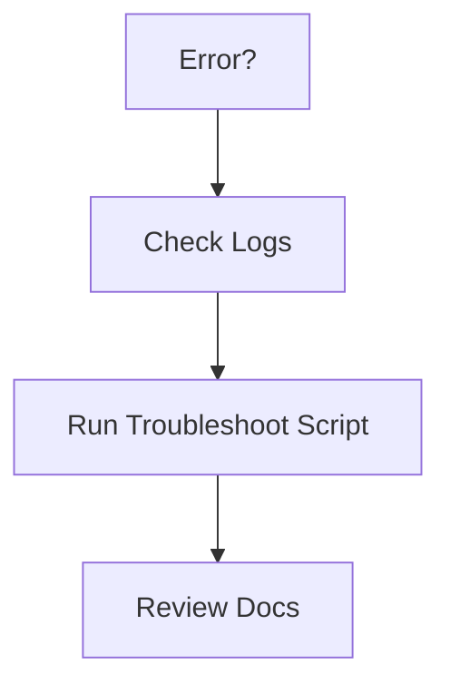
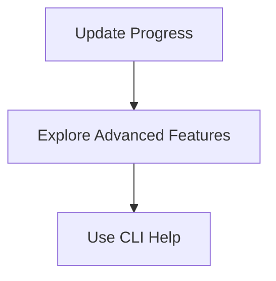

# ImpressionCore-b1 CLI Build Walkthrough

---

## 1. Introduction & Requirements



- **Review Documentation:**
  - Read `docs/ARCHITECTURE.md`, `docs/impressioncore_b1_architecture.md`, `docs/development_roadmap.md`, and `docs/implementation_status.md` for architecture and implementation details.
- **Check Hardware:**
  - Target: NVIDIA GTX 1050 Ti (4GB VRAM) or better.
  - Ensure Python 3.10+ and Bash are available.

---

## 2. Environment Setup



```bash
# 1. Clone the repository
$ git clone <your-repo-url> impressioncore
$ cd impressioncore

# 2. (Optional) Create and activate a virtual environment
$ python -m venv .venv
$ source .venv/bin/activate

# 3. Install core dependencies
$ pip install -r requirements.txt

# 4. (Optional) Install development and advanced features
$ pip install -e ".[dev]"
$ pip install -e ".[brainsim]"
$ pip install -e ".[diffusion]"

# 5. Verify your environment and framework status
$ python getting_started.py
```

---

## 3. Project Structure Check



```bash
# Ensure all required directories exist
$ ls src/core src/data src/models src/training src/inference src/brainsim src/tools
# If any are missing:
$ mkdir -p src/core src/data src/models src/training src/inference src/brainsim src/tools
```

---

## 4. Memory Optimization & GPU Setup



- Review and enable memory optimization as described in `docs/memory_optimization_strategies.md`.
- For GPU setup, see `docs/GPU_SETUP.md` and run any recommended scripts or checks.

---

## 5. Model Definition



```bash
# List available CLI commands
$ python main.py --help

# Example: Build or configure the b1 model
$ python main.py build --model b1
```
- For custom parameters, use CLI flags as described in `docs/api_reference.md` or `main.py --help`.

---

## 6. Data Preparation



```bash
# Tokenize a text file
$ python main.py tokenize --modality text --input-file data/input.txt --output-file data/tokens.txt

# For images:
$ python main.py tokenize --modality image --input-file data/image.png --output-file data/image_tokens.txt
```

---

## 7. Training



```bash
# Start training
$ python main.py train --config configs/b1_train.yaml
```
- Monitor logs in `logs/` and memory profiles in `logs/memory_profiles/`.

---

## 8. Inference & Evaluation



```bash
# Run inference on new data
$ python main.py infer --input-file data/test.txt --output-file results/output.txt

# Evaluate model performance
$ python main.py evaluate --config configs/b1_eval.yaml
```

---

## 9. Troubleshooting



- Check logs in `logs/` and error reports in `src/memlog/`.
- Run the troubleshooting script:
```bash
$ bash troubleshoot.bat
```
- Review `docs/comprehensive_error_handling_plan.md` and `docs/implementation_status.md`.

---

## 10. Documentation & Next Steps



- Update your progress in `docs/next_steps.md`.
- For advanced features, see `docs/advanced-features.md`.
- For further CLI options:
```bash
$ python main.py --help
```

---

**This walkthrough ensures a seamless, CLI-only build and deployment process for ImpressionCore-b1, leveraging all available documentation and best practices.**
