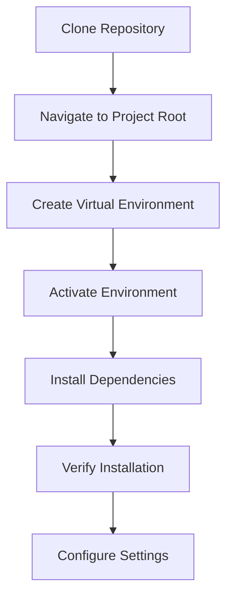
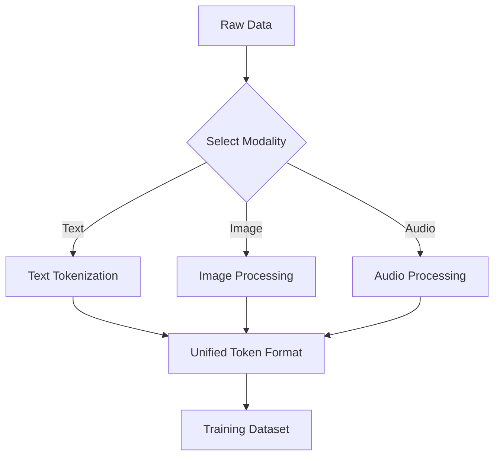
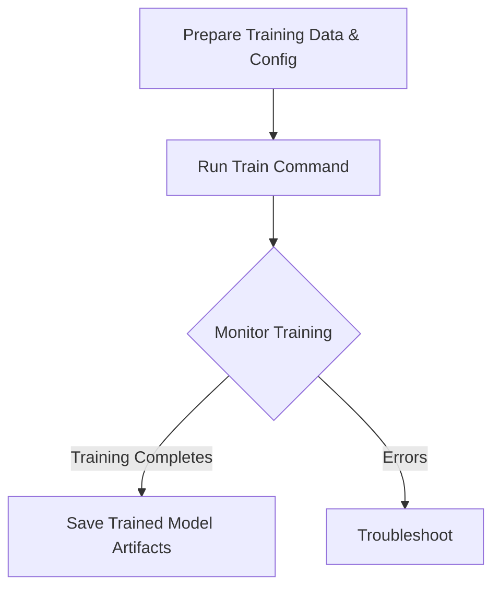

# Cli Build Walkthrough

**Created:** April 26, 2025  
**Updated:** December 29, 2025  
**Author:** Kirk LaSalle; GitHub Copilot  
**Tags:** #ids #standardized_header #docs\developer\cli_build_walkthrough.md #api #attention_mechanism #command_line #cuda #deployment #documentation #gpu_optimization #inference #memory_management #multimodal #performance #testing #tokenization #training #transformer #web_interface [developer, walkthrough, cli, impressioncore-b1, build, comprehensive, 2025]  
**Category:** Developer Documentation  
**Status:** Active
**IDS Integration:** This document is indexed and searchable via the ImpressionCore Documentation System (IDS).

---

title: "ImpressionCore-b1: Comprehensive CLI Build Walkthrough"
tags: [developer, walkthrough, cli, impressioncore-b1, build, comprehensive, 2025]
created: 2025-06-03
modified: 2025-06-03
version: 2.0.0
authors:

  - "Kirk LaSalle"
  - "GitHub Copilot"

responsible: "GitHub Copilot"
status: active
category: developer
priority: high
---

# ImpressionCore-b1: Comprehensive CLI Build Walkthrough

This guide provides a complete step-by-step walkthrough for creating and using ImpressionCore-b1 models through the Command Line Interface (CLI). This includes data preparation, model building, training, inference, and advanced usage scenarios.

## Table of Contents

1. [Prerequisites](#prerequisites)
2. [Environment Setup](#environment-setup)
3. [CLI Overview](#cli-overview)
4. [Data Preparation](#data-preparation)
5. [Model Building](#model-building)
6. [Training Process](#training-process)
7. [Inference and Evaluation](#inference-and-evaluation)
8. [Advanced Features](#advanced-features)
9. [Troubleshooting](#troubleshooting)
10. [Performance Optimization](#performance-optimization)

## Prerequisites

### System Requirements

- **Python**: 3.10+ (3.13 recommended for latest features)
- **GPU**: NVIDIA GTX 1050 Ti (4GB VRAM) minimum, RTX 3060+ recommended
- **RAM**: 16GB minimum, 32GB recommended
- **Storage**: 20GB free space minimum, 50GB recommended (SSD preferred)
- **OS**: Windows 10/11, Ubuntu 20.04+, or macOS 10.15+

### Required Software

```bash
# Verify Python version
python --version

# Verify CUDA installation (if using GPU)
nvidia-smi

# Install Git if not present
git --version
```

## Environment Setup

### Step 1: Repository Setup



```bash
# 1. Clone the ImpressionCore repository
git clone https://github.com/impressioncore/impressioncore.git
cd impressioncore

# 2. Create and activate virtual environment
python -m venv .venv310
source .venv310/bin/activate  # Linux/macOS
.venv310\Scripts\activate     # Windows

# 3. Install dependencies
pip install -r requirements.txt

# 4. Install development dependencies (optional)
pip install -r requirements-dev.txt

# 5. Verify installation
python getting_started.py

# 6. Run environment verification
python -m src.cli.main --version
```

### Step 2: Configuration

```bash
# Create user configuration
cp src/config.json.template src/config.json

# Edit configuration for your hardware
nano src/config.json
```

**Example Configuration:**

```json
{
  "model": {
    "name": "B1UnifiedModel",
    "max_vram_gb": 4.0,
    "enable_memory_optimization": true,
    "mixed_precision": true
  },
  "training": {
    "batch_size": 1,
    "learning_rate": 1e-4,
    "max_epochs": 10
  },
  "inference": {
    "max_sequence_length": 2048,
    "enable_streaming": true
  }
}
```

## CLI Overview

### Available Commands

The ImpressionCore CLI provides comprehensive functionality:

```bash
# View all available commands
python -m src.cli.main --help

# Core commands:
python -m src.cli.main tokenize     # Tokenize input data
python -m src.cli.main build       # Build model architecture
python -m src.cli.main train       # Train models
python -m src.cli.main infer       # Run inference
python -m src.cli.main evaluate    # Evaluate model performance
python -m src.cli.main export      # Export trained models
```

### Command Structure

```bash
python -m src.cli.main <command> [options] [arguments]

# Examples:
python -m src.cli.main tokenize --input data.txt --output tokens.json
python -m src.cli.main build --config build_config.yaml
python -m src.cli.main train --model b1 --data train_data/
```

## Data Preparation

### Multimodal Data Processing

ImpressionCore-b1 supports text, image, and audio data:



### Text Data Preparation

```bash
# Basic text tokenization
python -m src.cli.main tokenize \
  --modality text \
  --input-file data/text_corpus.txt \
  --output-file data/text_tokens.json \
  --max-length 2048

# Advanced text processing with custom tokenizer
python -m src.cli.main tokenize \
  --modality text \
  --input-file data/text_corpus.txt \
  --output-file data/text_tokens.json \
  --tokenizer-config configs/custom_tokenizer.yaml \
  --preprocessing normalize,lowercase,remove_special
```

### Image Data Preparation

```bash
# Image tokenization and preprocessing
python -m src.cli.main tokenize \
  --modality image \
  --input-dir data/images/ \
  --output-file data/image_tokens.json \
  --image-size 256 \
  --preprocessing resize,normalize

# Batch image processing
python -m src.cli.main tokenize \
  --modality image \
  --input-dir data/images/ \
  --output-dir data/processed_images/ \
  --batch-size 32 \
  --parallel-workers 4
```

### Audio Data Preparation

```bash
# Audio tokenization with phoneme extraction
python -m src.cli.main tokenize \
  --modality audio \
  --input-file data/audio.wav \
  --output-file data/audio_tokens.json \
  --sample-rate 16000 \
  --extract-phonemes

# Batch audio processing
python -m src.cli.main tokenize \
  --modality audio \
  --input-dir data/audio_files/ \
  --output-dir data/audio_tokens/ \
  --preprocessing normalize,denoise
```

### Dataset Verification

```bash
# Verify tokenized data
python -m src.cli.main validate-dataset \
  --data-dir data/tokens/ \
  --check-integrity \
  --show-stats

# Preview tokenized data
python -m src.cli.main detokenize \
  --input-file data/text_tokens.json \
  --preview-samples 5
```

## Model Building

### Basic Model Architecture

```bash
# Build default B1 model
python -m src.cli.main build \
  --model b1 \
  --output-dir models/b1_default

# Build with custom configuration
python -m src.cli.main build \
  --model b1 \
  --config configs/b1_large.yaml \
  --output-dir models/b1_large
```

### Advanced Model Configuration

**Create `configs/b1_custom.yaml`:**

```yaml
model:
  name: "B1UnifiedModel"
  architecture:
    hidden_size: 768
    num_layers: 12
    num_attention_heads: 12
    intermediate_size: 3072
  multimodal:
    text_encoder:
      model_type: "transformer"
      vocab_size: 50000
    image_encoder:
      model_type: "vision_transformer"
      patch_size: 16
    audio_encoder:
      model_type: "wav2vec2"
      feature_size: 768
  memory_optimization:
    gradient_checkpointing: true
    mixed_precision: true
    max_vram_gb: 4.0
```

```bash
# Build with custom configuration
python -m src.cli.main build \
  --config configs/b1_custom.yaml \
  --output-dir models/b1_custom \
  --verify-memory-requirements
```

### Model Architecture Validation

```bash
# Validate model architecture
python -m src.cli.main validate-model \
  --model-dir models/b1_custom \
  --check-memory-usage \
  --target-hardware gtx1050ti

# Model information
python -m src.cli.main model-info \
  --model-dir models/b1_custom \
  --show-parameters \
  --show-memory-usage
```

## Training Process

### Basic Training

```bash
# Start training with default settings
python -m src.cli.main train \
  --model-dir models/b1_custom \
  --train-data data/train_tokens/ \
  --val-data data/val_tokens/ \
  --output-dir training_runs/run_001

# Training with specific configuration
python -m src.cli.main train \
  --config configs/training_config.yaml \
  --model-dir models/b1_custom \
  --output-dir training_runs/run_002
```

### Training Configuration

**Create `configs/training_config.yaml`:**

```yaml
training:
  batch_size: 2
  learning_rate: 1e-4
  num_epochs: 10
  gradient_accumulation_steps: 4
  
optimization:
  optimizer: "adamw"
  weight_decay: 0.01
  lr_scheduler: "cosine"
  warmup_steps: 1000

memory:
  max_vram_gb: 4.0
  gradient_checkpointing: true
  mixed_precision: true
  cpu_offload: true

logging:
  log_interval: 100
  save_interval: 1000
  eval_interval: 500
```

### Monitoring Training

```bash
# Monitor training progress
python -m src.cli.main monitor \
  --training-dir training_runs/run_002 \
  --metrics loss,accuracy,memory_usage

# Resume interrupted training
python -m src.cli.main train \
  --resume-from training_runs/run_002/checkpoint_latest \
  --output-dir training_runs/run_002_resumed
```

### Multi-GPU Training

```bash
# Distributed training on multiple GPUs
python -m src.cli.main train \
  --model-dir models/b1_custom \
  --train-data data/train_tokens/ \
  --distributed \
  --num-gpus 2 \
  --output-dir training_runs/distributed_run
```

## Inference and Evaluation

### Basic Inference

```bash
# Text generation
python -m src.cli.main infer \
  --model-dir training_runs/run_002/final_model \
  --input "Generate a story about AI" \
  --modality text \
  --max-length 512

# Image captioning
python -m src.cli.main infer \
  --model-dir training_runs/run_002/final_model \
  --input image.jpg \
  --modality image \
  --task captioning

# Audio transcription
python -m src.cli.main infer \
  --model-dir training_runs/run_002/final_model \
  --input audio.wav \
  --modality audio \
  --task transcription
```

### Batch Inference

```bash
# Process multiple files
python -m src.cli.main infer \
  --model-dir training_runs/run_002/final_model \
  --input-dir data/inference_inputs/ \
  --output-dir results/ \
  --batch-size 4 \
  --parallel-workers 2
```

### Model Evaluation

```bash
# Evaluate on test dataset
python -m src.cli.main evaluate \
  --model-dir training_runs/run_002/final_model \
  --test-data data/test_tokens/ \
  --metrics bleu,rouge,accuracy \
  --output-file evaluation_results.json

# Performance benchmarking
python -m src.cli.main benchmark \
  --model-dir training_runs/run_002/final_model \
  --benchmark-config configs/benchmark.yaml \
  --hardware-profile gtx1050ti
```

## Advanced Features

### Model Export and Deployment

```bash
# Export for deployment
python -m src.cli.main export \
  --model-dir training_runs/run_002/final_model \
  --format onnx \
  --output-dir exports/model_v1_onnx

# Optimize for inference
python -m src.cli.main optimize \
  --model-dir training_runs/run_002/final_model \
  --target-hardware gpu \
  --optimization-level 3 \
  --output-dir optimized_models/
```

### Fine-tuning

```bash
# Fine-tune on specific task
python -m src.cli.main fine-tune \
  --base-model training_runs/run_002/final_model \
  --task-data data/specific_task/ \
  --task-type classification \
  --output-dir fine_tuned_models/task_specific
```

### Custom Plugins

```bash
# Install custom plugin
python -m src.cli.main plugin install custom_processor.py

# Use plugin in processing
python -m src.cli.main tokenize \
  --input data.txt \
  --processor custom_processor \
  --output tokens.json
```

## Troubleshooting

### Common Issues and Solutions

#### Memory Issues

```bash
# Check memory usage
python -m src.cli.main diagnose memory \
  --model-dir models/b1_custom

# Optimize for low memory
python -m src.cli.main build \
  --model b1 \
  --memory-mode ultra_low \
  --max-vram 4.0 \
  --output-dir models/b1_optimized
```

#### Performance Issues

```bash
# Profile model performance
python -m src.cli.main profile \
  --model-dir training_runs/run_002/final_model \
  --input-data data/sample_inputs/ \
  --output-file performance_profile.json

# Hardware-specific optimization
python -m src.cli.main optimize \
  --model-dir models/b1_custom \
  --target-hardware gtx1050ti \
  --optimization-mode speed
```

#### Training Issues

```bash
# Validate training setup
python -m src.cli.main validate-training \
  --config configs/training_config.yaml \
  --data data/train_tokens/ \
  --dry-run

# Debug training issues
python -m src.cli.main train \
  --config configs/training_config.yaml \
  --debug \
  --log-level DEBUG \
  --output-dir debug_training/
```

### Diagnostic Tools

```bash
# System health check
python -m src.cli.main health-check \
  --check-gpu \
  --check-memory \
  --check-dependencies

# Model integrity check
python -m src.cli.main validate-model \
  --model-dir models/b1_custom \
  --check-weights \
  --check-architecture
```

## Performance Optimization

### Hardware-Specific Optimization

```bash
# Optimize for GTX 1050 Ti
python -m src.cli.main optimize \
  --model-dir models/b1_custom \
  --target-hardware gtx1050ti \
  --max-vram 4.0 \
  --enable-all-optimizations

# Benchmark different configurations
python -m src.cli.main benchmark \
  --model-dir models/b1_custom \
  --configurations configs/benchmark_configs/ \
  --output-file benchmark_results.json
```

### Memory Optimization

```bash
# Enable aggressive memory optimization
python -m src.cli.main train \
  --config configs/training_config.yaml \
  --memory-optimization aggressive \
  --gradient-checkpointing \
  --mixed-precision \
  --cpu-offload

# Monitor memory usage during training
python -m src.cli.main train \
  --config configs/training_config.yaml \
  --monitor-memory \
  --memory-alerts \
  --output-dir training_runs/memory_optimized/
```

### Inference Optimization

```bash
# Optimize for fast inference
python -m src.cli.main optimize \
  --model-dir training_runs/run_002/final_model \
  --optimization-target inference_speed \
  --quantization int8 \
  --output-dir optimized_models/fast_inference

# Batch inference optimization
python -m src.cli.main infer \
  --model-dir optimized_models/fast_inference \
  --input-dir data/large_batch/ \
  --batch-size 16 \
  --parallel-workers 4 \
  --streaming-mode
```

## Advanced CLI Features

### Automation and Scripting

```bash
# Create automated pipeline
python -m src.cli.main pipeline \
  --config configs/full_pipeline.yaml \
  --input-data data/raw/ \
  --output-dir results/automated_run/

# Scheduled training
python -m src.cli.main schedule \
  --task train \
  --config configs/training_config.yaml \
  --schedule "0 2 * * *"  # Daily at 2 AM
```

### Logging and Monitoring

```bash
# Advanced logging
python -m src.cli.main train \
  --config configs/training_config.yaml \
  --log-level INFO \
  --log-file training.log \
  --tensorboard-logs \
  --wandb-project impressioncore

# Real-time monitoring
python -m src.cli.main monitor \
  --training-dir training_runs/run_002 \
  --real-time \
  --web-interface \
  --port 8080
```

## Integration with Web Interface

```bash
# Start web server with CLI backend
python -m src.cli.main serve \
  --model-dir training_runs/run_002/final_model \
  --host 0.0.0.0 \
  --port 5000 \
  --enable-api

# API-only mode
python -m src.cli.main api \
  --model-dir training_runs/run_002/final_model \
  --port 8000 \
  --cors-enabled
```

## Best Practices

### Development Workflow

1. **Start Small**: Begin with small datasets and simple configurations
2. **Validate Early**: Always validate data and model architecture before training
3. **Monitor Resources**: Keep track of memory and GPU usage
4. **Save Checkpoints**: Use frequent checkpointing for long training runs
5. **Document Experiments**: Keep detailed logs of configurations and results

### Production Deployment

1. **Optimize Models**: Use quantization and optimization for production
2. **Test Thoroughly**: Validate performance on target hardware
3. **Monitor Performance**: Set up monitoring for production models
4. **Version Control**: Maintain version control for models and configurations

---

**Last Updated**: 2025-06-03  
**Version**: 2.0.0  
**Authors**: Kirk LaSalle, GitHub Copilot  
**Status**: Active and Complete

For additional help, refer to:

- [User Guide](../user/user_guide.md)
- [API Reference](../api/complete_api_reference.md)
- [Troubleshooting Guide](../reference/TROUBLESHOOTING.md)

```bash
python -m src.cli.main tokenize --modality image --input-file path/to/your/image.png --output-file path/to/your/image_tokens.json
```

- Replace `path/to/your/image.png` with the path to your image file.
- Ensure your model configuration and tokenizer support image modality.

You can use `detokenize` to inspect the tokenized output if needed:

```bash
python -m src.cli.main detokenize --modality text --input-file path/to/your/text_tokens.json
```

## 5. Building the ImpressionCore-b1 Model

Once your data is prepared (or you have a plan for data loading during training), you can build the model architecture.

```mermaid
flowchart TD
    A[Define Build Configuration (Optional)] --> B[Run Build Command]
    B --> C[Model Architecture Created]
```

The `build` command initializes and configures the ImpressionCore-b1 model.

```bash
python -m src.cli.main build
```

You can also provide a specific build configuration file:

```bash
python -m src.cli.main build --config path/to/your/build_config.yaml
```

- This configuration file would specify parameters for the B1 model architecture. Refer to project documentation for config file format.

*(**Note**: The `build` command runs `build_cli_automation.py` script. Current known issues: path resolution problems that create nested `src/src` directories and requirements.txt file not found. These issues are being addressed in the June 2025 development cycle.)*

## 6. Training the ImpressionCore-b1 Model

After building the model, the next step is to train it on your prepared data.



The `train` command starts the training process.

```bash
python -m src.cli.main train
```

You can specify a training configuration file, which is highly recommended. This file would detail dataset paths, training parameters (epochs, batch size, learning rate), etc.

```bash
python -m src.cli.main train --config path/to/your/train_config.yaml
```

- Refer to project documentation for the `train_config.yaml` format and options.
- Training can be resource-intensive. Monitor your system's performance (CPU, GPU, memory).
- Logs will typically be output to the console and/or log files. Check these for progress and errors.
- Upon successful completion, the trained model artifacts (weights, etc.) should be saved to a specified directory (usually defined in your training config).

## 7. Using the Trained Model (Future Steps)

Once your ImpressionCore-b1 model is trained, you'll want to use it for inference (making predictions or generating content).

Currently, `src/cli/main.py` does not include direct `infer` or `evaluate` commands. These functionalities might be available through other scripts or APIs within the ImpressionCore framework, or they may be added to the CLI in future updates.

Typically, using a trained model would involve:

1.  Loading the trained model artifacts.
2.  Providing new input data (in the correct tokenized format).
3.  Running an inference process.
4.  Detokenizing the output to get human-readable results.

Refer to the broader ImpressionCore documentation for how to perform inference with trained models.

## 8. Troubleshooting & Tips

- **Dependency Issues**: Ensure all packages in `requirements.txt` are installed correctly in your active virtual environment.
- **Out of Memory (OOM) Errors**: Training large models can be memory-intensive.
    - Reduce `batch_size` in your training configuration.
    - Check if your hardware meets the recommended specifications (see `docs/Hardware Target Specifications`).
    - The CLI offers flags like `--lite-engine` or `--disable-memory-optimizations` (use `python -m src.cli.main --help` to see all options) which might help in constrained environments, though they may impact performance or accuracy.
- **File Not Found Errors**: Double-check all file paths provided to CLI commands. Use absolute paths if relative paths are causing issues.
- **Check Logs**: ImpressionCore scripts usually provide detailed logs. These are invaluable for diagnosing problems.
- **Hardware Optimization**: Review `docs/technical/performance_optimization_guide.md` and `docs/GPU_SETUP.md` (if applicable) for hardware-specific advice.

## 9. Further Steps & Documentation

This walkthrough covers the basic CLI commands for creating an ImpressionCore-b1 model.

- For a complete overview of all project documentation, refer to `docs/DOCUMENTATION_INDEX.md`.
- Explore other documents in the `docs/` directory for deeper insights into specific components, architecture, and advanced features.
- Use the `--help` flag with any CLI command to see its specific options:

  ```bash  python -m src.cli.main <command> --help

  # e.g., python -m src.cli.main tokenize --help

  ```

---

This guide aims to provide a clear path for building your ImpressionCore-b1 model. Happy modeling!
