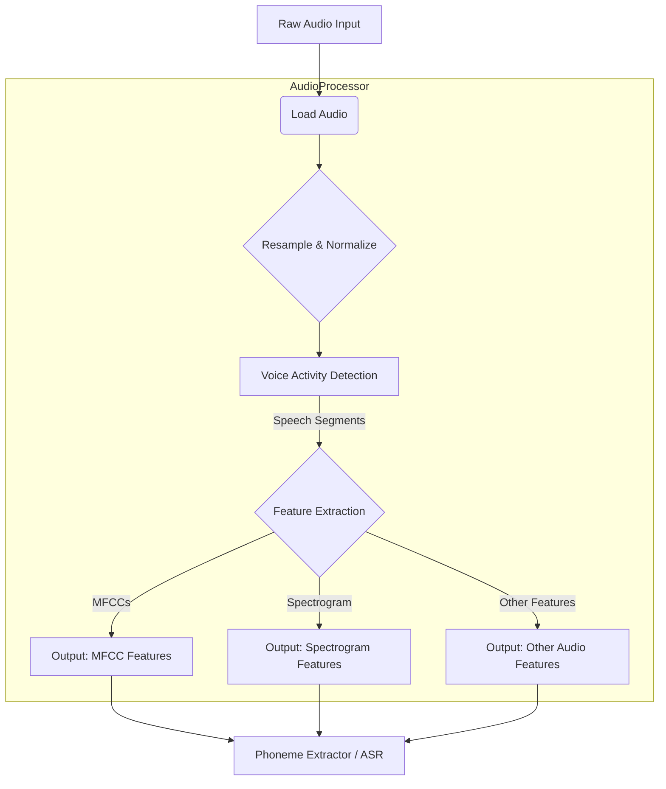

# Audio Processor

**Created:** May 21, 2025  
**Updated:** December 29, 2025  
**Author:** Kirk LaSalle; GitHub Copilot  
**Tags:** #ids #standardized_header #docs\developer\components\audio_processor.md #documentation #memory_management #training #web_interface  
**Category:** Developer Documentation  
**Status:** Active
**IDS Integration:** This document is indexed and searchable via the ImpressionCore Documentation System (IDS).

---

responsible_party: @GitHubCopilot
last_updated: 2025-05-31
---

# Audio Processor Component

## 1. Overview

The Audio Processor component is responsible for ingesting raw audio data, transforming it into suitable formats for various downstream tasks within the ImpressionCore-B1 model, including phoneme extraction, speech-to-text, and emotion recognition. It handles tasks like normalization, feature extraction (e.g., MFCCs, spectrograms), and potentially initial voice activity detection.

This document outlines the canonical design for the `AudioProcessor`.

## 2. Responsibilities

- **Audio Ingestion**: Load audio data from various sources (files, streams).
- **Preprocessing**:
  - Resampling to a consistent sample rate.
  - Normalization of amplitude.
  - Noise reduction (optional, can be a separate pre-processing step).
  - Voice Activity Detection (VAD) to segment speech.
- **Feature Extraction**:
  - Generate Mel-frequency cepstral coefficients (MFCCs).
  - Generate spectrograms (linear or Mel).
  - Potentially other relevant audio features.
- **Output Formatting**: Provide features in a format consumable by downstream modules (e.g., `PhonemeExtractor`, ASR models).

## 3. Architecture

## 4. Detailed Design

### 4.1. Input

- **Raw Audio Data**:
  - Type: File path (e.g., WAV, MP3), byte stream, raw PCM data.
  - Parameters: Sample rate, bit depth, number of channels.

### 4.2. Core Modules

#### 4.2.1. Audio Loader

- **Purpose**: Loads audio from various formats.
- **Libraries**: `librosa`, `soundfile`, `pydub`.
- **Functionality**:
  - Detects audio format.
  - Loads audio into a numerical array (e.g., NumPy array).
  - Handles potential errors during loading.

#### 4.2.2. Preprocessor

- **Purpose**: Standardizes audio characteristics.
- **Functionality**:
  - **Resampling**: Convert audio to a target sample rate (e.g., 16kHz or 22.05kHz) using high-quality resampling algorithms (e.g., `librosa.resample` with `kaiser_best`).
    - *Memory Implication*: Resampling can change array size. Higher sample rates mean more data.
  - **Normalization**: Scale audio amplitude to a standard range (e.g., -1.0 to 1.0 or 0dBFS).
  - **Mono Conversion**: Convert stereo audio to mono if required by downstream models.
    - *Memory Implication*: Reduces data size by half for stereo inputs.
  - **(Optional) Noise Reduction**: Apply basic noise reduction algorithms if significant background noise is present. More advanced noise reduction might be a separate, dedicated component.

#### 4.2.3. Voice Activity Detector (VAD)

- **Purpose**: Identify segments of audio containing speech.
- **Libraries**: `webrtcvad`, `librosa.effects.split`.
- **Functionality**:
  - Outputs start and end timestamps or segments of speech.
  - Helps in focusing processing on relevant audio parts, reducing computation for non-speech segments.
- *Memory Implication*: Can reduce the amount of data processed by downstream components if non-speech segments are discarded or processed differently.

#### 4.2.4. Feature Extractor

- **Purpose**: Convert preprocessed audio segments into feature representations.
- **Functionality**:
  - **MFCCs**:
    - Parameters: `n_mfcc`, `n_fft`, `hop_length`, `win_length`.
    - Libraries: `librosa.feature.mfcc`.
    - Output: 2D array (number of frames x `n_mfcc`).
    - *Memory Implication*: Compact representation, generally memory-efficient.
  - **Spectrograms (Linear/Mel)**:
    - Parameters: `n_fft`, `hop_length`, `win_length`, `n_mels` (for Mel).
    - Libraries: `librosa.stft`, `librosa.feature.melspectrogram`.
    - Output: 2D array (frequency bins x number of frames).
    - *Memory Implication*: Can be larger than MFCCs, especially for high resolution or long durations. Log-Mel spectrograms are common for ASR/TTS.
  - **(Optional) Other Features**: Pitch, zero-crossing rate, spectral contrast, etc., if required by specific models.

### 4.3. Output

- **Feature Sets**:
  - A dictionary or structured object containing the extracted features.
  - Example: `{\"mfccs\": numpy_array, \"mel_spectrogram\": numpy_array, \"duration_ms\": float}`.
- **Metadata**: Sample rate of features, frame hop length, original audio duration.

## 5. Configuration Parameters

- `target_sample_rate`: e.g., 16000 (Hz)
- `use_vad`: boolean (true/false)
- `vad_aggressiveness`: integer (0-3 for `webrtcvad`)
- `feature_types`: list (e.g., `[\"mfcc\", \"mel_spectrogram\"]`)
- `mfcc_params`:
  - `n_mfcc`: e.g., 13 or 20
  - `n_fft`: e.g., 2048
  - `hop_length`: e.g., 512
  - `win_length`: e.g., 2048
- `melspectrogram_params`:
  - `n_mels`: e.g., 80 or 128
  - `n_fft`: e.g., 2048
  - `hop_length`: e.g., 512
  - `win_length`: e.g., 2048
  - `fmin`, `fmax`

## 6. Memory and Performance Considerations

- **Streaming**: For long audio files or live input, implement streaming processing to manage memory. Process audio in chunks.
- **Feature Size**: Be mindful of the size of extracted features, especially spectrograms. Adjust `hop_length` and `n_mels`/`n_fft` to balance resolution and data size.
- **Library Choice**: Use efficient libraries like `librosa` (which uses NumPy) for numerical operations.
- **VAD Efficiency**: Effective VAD can significantly reduce downstream processing load by filtering out silence or non-speech.
- **Batching**: If processing multiple files, batch operations where possible.

## 7. Error Handling

- Invalid audio file format or corrupted files.
- Errors during feature extraction (e.g., very short audio segments).
- Configuration errors.
- Log errors appropriately and provide informative messages.

## 8. Dependencies

- `librosa`
- `numpy`
- `soundfile` (or alternative for loading diverse formats)
- `webrtcvad` (optional, for VAD)
- `pydub` (optional, for format conversion or simple manipulations)

## 9. Future Enhancements

- Integration of more advanced noise cancellation modules.
- Support for a wider range of audio codecs and formats.
- Speaker diarization capabilities.
- On-the-fly data augmentation (noise injection, pitch shifting) for training.

This canonical design provides a foundational AudioProcessor. Specific implementations will reside in `src/core/processors/audio_processor.py` or similar, and will adhere to these principles while allowing for model-specific adjustments.
