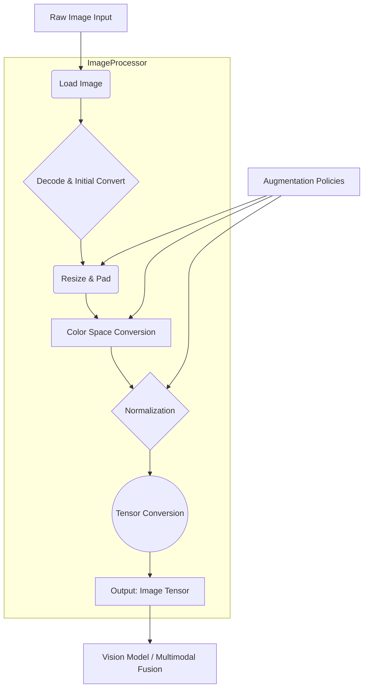

# Image Processor

**Created:** May 21, 2025  
**Updated:** December 29, 2025  
**Author:** Kirk LaSalle; GitHub Copilot  
**Tags:** #ids #standardized_header #docs\developer\components\image_processor.md #documentation #gpu_optimization #inference #memory_management #multimodal #pytorch #testing #training  
**Category:** Developer Documentation  
**Status:** Active
**IDS Integration:** This document is indexed and searchable via the ImpressionCore Documentation System (IDS).

---

responsible_party: @GitHubCopilot
last_updated: 2025-05-31
---

# Image Processor Component

## 1. Overview

The Image Processor component is responsible for ingesting raw image data, transforming it into suitable tensor formats for various downstream tasks within the ImpressionCore-B1 model, such as image understanding, feature extraction for multimodal fusion, and input to generative models. It handles tasks like resizing, normalization, augmentation, and conversion to tensor formats.

This document outlines the canonical design for the `ImageProcessor`.

## 2. Responsibilities

- **Image Ingestion**: Load image data from various sources (files, URLs, byte streams).
- **Preprocessing**:
  - Resizing to a consistent input dimension required by models.
  - Color space conversion (e.g., RGB, Grayscale).
  - Normalization of pixel values (e.g., to [0, 1] range or mean/std normalization).
- **Data Augmentation (primarily for training)**:
  - Random flips, rotations, crops.
  - Color jittering.
  - Other augmentation techniques to improve model robustness.
- **Tensor Conversion**: Convert processed images into tensor formats (e.g., PyTorch tensors, TensorFlow tensors).
- **Output Formatting**: Provide tensors in a format (e.g., `NCHW` - Batch, Channels, Height, Width) consumable by downstream vision models.

## 3. Architecture

## 4. Detailed Design

### 4.1. Input

- **Raw Image Data**:
  - Type: File path (e.g., JPEG, PNG), URL, byte stream, NumPy array, PIL Image.
  - Parameters: Expected color format (e.g., RGB, BGR).

### 4.2. Core Modules

#### 4.2.1. Image Loader

- **Purpose**: Loads images from various sources and formats.
- **Libraries**: `Pillow (PIL)`, `OpenCV (cv2)`, `scikit-image`, `torchvision.io.read_image`.
- **Functionality**:
  - Detects or assumes image format.
  - Loads image into a common intermediate representation (e.g., PIL Image or NumPy array).
  - Handles potential errors (corrupted files, unsupported formats).

#### 4.2.2. Preprocessor

- **Purpose**: Standardizes image characteristics for model consumption.
- **Functionality**:
  - **Resizing/Padding**:
    - Resize image to target dimensions (e.g., 224x224, 512x512) using appropriate interpolation methods (e.g., Bilinear, Bicubic).
    - Handle aspect ratio: either crop, or pad to maintain aspect ratio. Padding value should be configurable (e.g., 0 or mean pixel value).
    - *Memory Implication*: Resizing directly impacts tensor size. Larger images require more memory.
  - **Color Space Conversion**:
    - Ensure image is in the expected color space (e.g., RGB). Convert from BGR (common in OpenCV) or Grayscale if needed.
    - *Memory Implication*: Grayscale reduces channel dimension (e.g., from 3 to 1).
  - **Normalization**:
    - Scale pixel values:
      - To [0, 1] range: `pixel / 255.0`.
      - Mean/Standard Deviation Normalization: `(pixel - mean) / std`. Mean and std values are typically pre-calculated from the training dataset (e.g., ImageNet stats).
    - *Memory Implication*: Minimal, changes values not typically size. Precision (float32 vs float16) can matter.

#### 4.2.3. Data Augmenter (Primarily for Training)

- **Purpose**: Apply random transformations to images to increase dataset variability and improve model generalization.
- **Libraries**: `torchvision.transforms`, `albumentations`, `imgaug`.
- **Functionality (Examples)**:
  - Random horizontal/vertical flips.
  - Random rotations, scaling, translations.
  - Random cropping (e.g., `RandomResizedCrop`).
  - Color jitter (brightness, contrast, saturation, hue).
  - Cutout/Random Erasing.
  - Gaussian blur, noise addition.
- **Control**: Augmentations should be configurable and typically only applied during training, not inference (unless test-time augmentation is used).
- *Memory Implication*: Usually operates in-place or creates temporary augmented versions. Does not increase persistent storage unless augmented datasets are saved.

#### 4.2.4. Tensor Converter

- **Purpose**: Convert the processed image (typically a NumPy array or PIL Image) into a framework-specific tensor.
- **Libraries**: `torch.from_numpy`, `tf.convert_to_tensor`, `torchvision.transforms.ToTensor`.
- **Functionality**:
  - Convert image data to `float32` (common) or `float16` (for memory/performance optimization).
  - Permute dimensions to match model input format (e.g., HWC to CHW for PyTorch).
  - Create a batch dimension if processing single images for batch input.
- *Memory Implication*: Tensor precision (`float32` vs `float16`) directly impacts memory. `float16` (half-precision) can save significant VRAM but requires hardware support and careful handling to avoid numerical instability.

### 4.3. Output

- **Image Tensor**:
  - A tensor representing the processed image(s).
  - Format: Typically `BCHW` (Batch, Channels, Height, Width) for PyTorch/TensorFlow.
  - Data Type: `float32` or `float16`.
- **Metadata (Optional)**: Original image dimensions, applied augmentations (for debugging).

## 5. Configuration Parameters

- `target_size`: tuple (e.g., `(224, 224)`)
- `interpolation_method`: string (e.g., `\"bilinear\"`, `\"bicubic\"`)
- `keep_aspect_ratio`: boolean
- `padding_mode`: string (e.g., `\"constant\"`, `\"reflect\"`)
- `padding_value`: number (e.g., 0)
- `normalization_mean`: list/tuple (e.g., `[0.485, 0.456, 0.406]`)
- `normalization_std`: list/tuple (e.g., `[0.229, 0.224, 0.225]`)
- `to_grayscale`: boolean
- `tensor_format`: string (e.g., `\"CHW\"`, `\"HWC\"`)
- `output_precision`: string (e.g., `\"float32\"`, `\"float16\"`)
- `augmentation_policy` (for training): A dictionary defining augmentation steps and their parameters.

## 6. Memory and Performance Considerations

- **Image Size**: `target_size` is the primary driver of memory usage.
- **Batch Size**: Larger batches increase VRAM usage significantly.
- **Precision**: `float16` can halve VRAM usage for image tensors compared to `float32` but requires careful implementation (mixed-precision training).
- **Efficient Libraries**: Use optimized libraries like `Pillow-SIMD` (faster PIL fork), `OpenCV`, `torchvision.transforms` (often C++ backed).
- **CPU vs GPU Augmentation**: Some augmentations can be performed on CPU to free up GPU resources, but data transfer between CPU and GPU can be a bottleneck. Libraries like NVIDIA DALI can optimize this.
- **Lazy Loading/Processing**: Load and process images on-the-fly, especially for large datasets, to avoid storing all processed images in memory.

## 7. Error Handling

- Invalid image file format or corrupted files.
- Errors during image decoding or processing.
- Configuration errors (e.g., mismatched mean/std for channels).
- Log errors and provide informative messages.

## 8. Dependencies

- `Pillow (PIL)` or `Pillow-SIMD`
- `OpenCV (python-opencv-headless)` (optional, for more advanced operations or different loading capabilities)
- `numpy`
- `torch` (if using PyTorch tensors) or `tensorflow` (if using TensorFlow tensors)
- `torchvision` (if using PyTorch, for transforms and I/O)
- `albumentations` (optional, for advanced augmentations)

## 9. Future Enhancements

- Integration with NVIDIA DALI for high-performance data loading and augmentation on GPU.
- Support for more complex image formats (e.g., TIFF, medical imaging formats like DICOM, if relevant).
- Automated optimal augmentation policy search (e.g., AutoAugment).
- Handling of video frames as sequences of images.

This canonical design provides a foundational ImageProcessor. Specific implementations will reside in `src/core/processors/image_processor.py` or similar.
