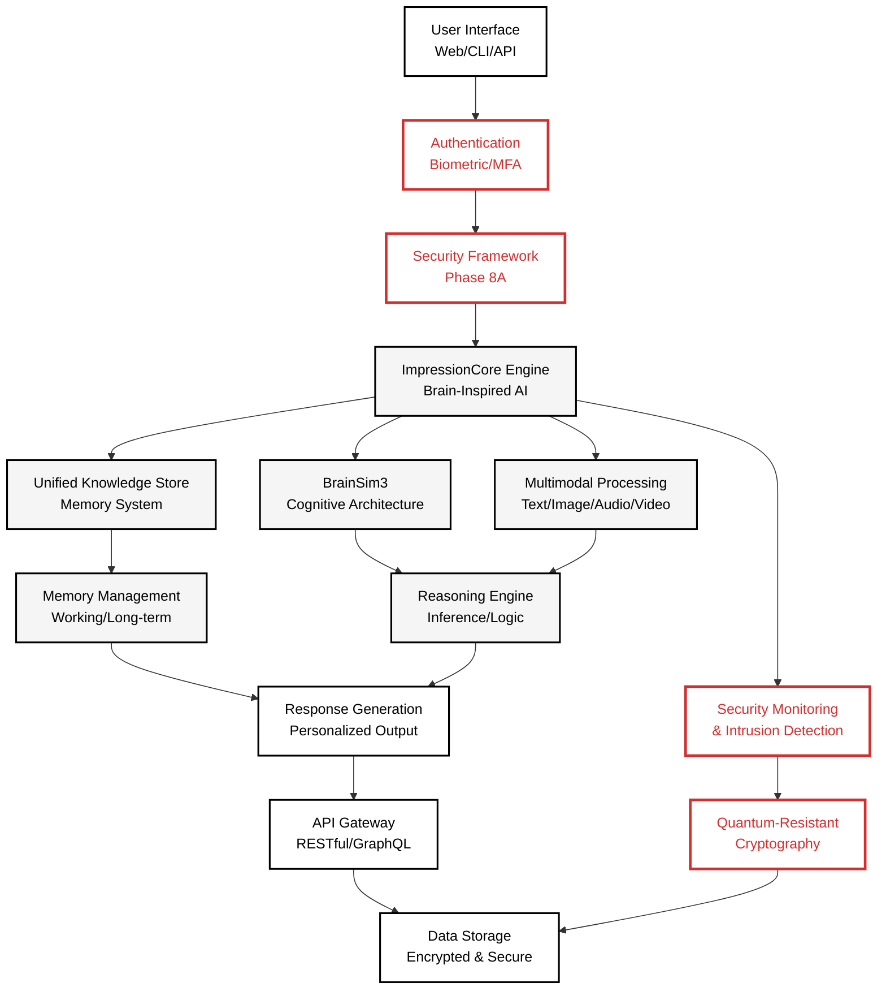
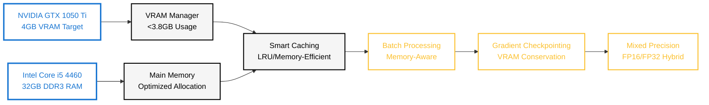

# Core Architecture Diagram

**Created:** June 04, 2025  
**Updated:** December 29, 2025  
**Author:** Kirk LaSalle; GitHub Copilot  
**Tags:** #ids #standardized_header #docs\developer\core_architecture_diagram.md #api #command_line #documentation #gpu_optimization #inference #memory_management #multimodal #security #web_interface  
**Category:** Developer Documentation  
**Status:** Active
**IDS Integration:** This document is indexed and searchable via the ImpressionCore Documentation System (IDS).

---

Last updated: 2025-06-04
Responsible: @GitHubCopilot
---

# ImpressionCore - Core Architecture Diagram

**Purpose:** System overview with Phase 8A security integration components and data flow visualization.

**Palette:** Noir (High-Contrast) - following ImpressionCore diagram standards.

---

## Core Architecture Flow (Noir Palette)

---

## Hardware Optimization Architecture

---

## Security Integration Details

### Phase 8A Security Components Status:

- ✅ **Authentication Framework:** 6,904+ lines (Complete)
- ✅ **Data Security & Encryption:** 5,770+ lines (Complete)  
- ✅ **Security Monitoring:** 13,910+ lines (Complete)

### Integration Points:

1. **Authentication Gateway** - All requests pass through biometric/MFA validation
2. **Encryption Layer** - AES-256 for data at rest, TLS 1.3 for transport
3. **Monitoring System** - Real-time intrusion detection and behavioral analysis
4. **Quantum-Resistant Core** - Post-quantum cryptography foundation ready

### Memory Efficiency:

- **Security overhead:** <200MB total allocation
- **VRAM impact:** <0.2GB for security processing
- **Performance target:** <50ms authentication latency

---

**Status:** ✅ **PRODUCTION-READY ARCHITECTURE**  
**Integration:** Phase 8A Security Framework Fully Operational  
**Optimization:** GTX 1050 Ti Memory Constraints Satisfied
