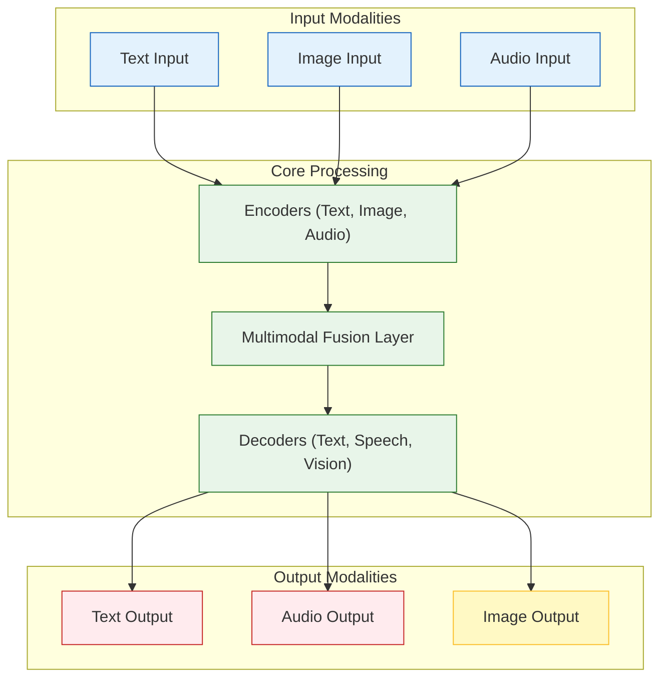
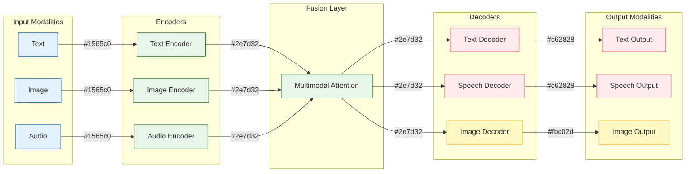
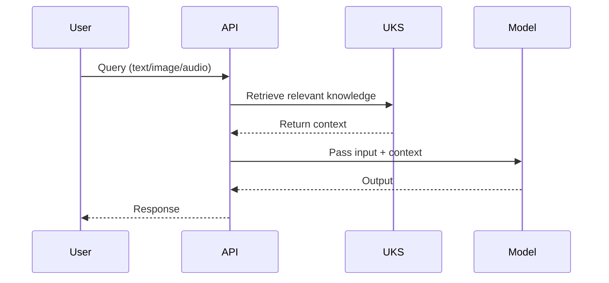
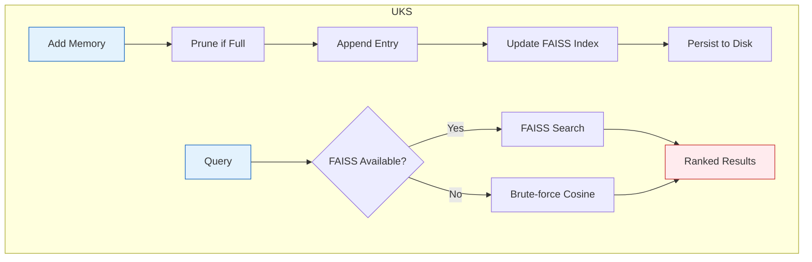
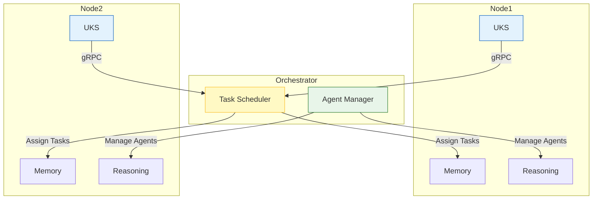

# ImpressionCore Developer Guide

**Created:** June 04, 2025  
**Updated:** December 29, 2025  
**Author:** Kirk LaSalle; GitHub Copilot  
**Tags:** #ids #standardized_header #docs\developer\developer_guide.md #api #attention_mechanism #command_line #cuda #deployment #documentation #gpu_optimization #inference #memory_management #multimodal #performance #pytorch #security #testing #tokenization #training #transformer #web_interface #official #permanent  
**Category:** Developer Documentation  
**Status:** Active
**IDS Integration:** This document is indexed and searchable via the ImpressionCore Documentation System (IDS).

---

## Enhanced Markdown Viewer & IDS UI/UX (2025-06-05)

- **Raw/Rendered Preview Toggle:** Switch between raw HTML and fully rendered (with diagrams) preview modes in the documentation editor.
- **Live Diagram Rendering:** Mermaid diagrams and other JS-based diagrams are now rendered in the preview (requires PyQtWebEngine).
- **Directory Tree Navigation:** The directory tree now supports expandable directories and file selection for easier navigation.
- **Global Theme Support:** The entire application supports dark/light mode, not just the editor.
- **Formatting Toolbar:** Added for markdown editing.
- **Synchronized Scrolling:** Editor and preview panes scroll together.
- **Multi-Tab Editing:** Edit multiple documents at once, with recent files tracking.
- **Tag-Based Filtering & Advanced Search:** Integrated with IDS tagging system for efficient document search and navigation.
- **IDS Integration:** Editor launchable from IDS menu; subprocess launch now sets PYTHONPATH for import reliability.
- **Requirements Updated:** PyQtWebEngine added to requirements.txt and doc_viewer/requirements.txt.
- **Verification:** Full system operation verified in both interactive and automated modes.

See the [User Guide](../user/user_guide.md) and [memlog entry](../../src/memlog/ids_uiux_diagram_theme_enhancement_2025-06-05.md) for changelog and verification.

---

## Overview

This guide is the single authoritative reference for all developers working on ImpressionCore. It consolidates all design, engineering, and implementation resources, and provides direct links and summaries for every major system, module, and workflow available to developers.

## Table of Contents

- [System Architecture](#system-architecture)
- [Model Architecture](#model-architecture)
- [API Reference](#api-reference)
- [Code Documentation Standards](#code-documentation-standards)
- [Testing & Validation](#testing--validation)
- [Security & Administration](#security--administration)
- [CLI & Build Walkthrough](#cli--build-walkthrough)
- [Developer Tools & Automation](#developer-tools--automation)
- [Tagging & IDS System](#tagging--ids-system)
- [Contribution & Best Practices](#contribution--best-practices)
- [Subsystem Deep Dives & Advanced Scenarios](#subsystem-deep-dives--advanced-scenarios)
- [Real-World Developer Scenarios](#real-world-developer-scenarios)
- [Troubleshooting Playbook](#troubleshooting-playbook)
- [Contribution & Governance](#contribution--governance)
- [FAQ & Community](#faq--community)
- [Auto-Generated API Reference](#auto-generated-api-reference)

---

# 1. Introduction & Overview

ImpressionCore is a brain-inspired, multimodal AI framework designed for both research and production on consumer hardware. This guide is the canonical, comprehensive resource for all developers, covering every aspect of system design, setup, engineering, and advanced usage.

**Key Principles:**

- Modular, brain-inspired architecture (see [ARCHITECTURE.md](ARCHITECTURE.md))
- Multimodal (text, image, audio) processing and generation
- Memory efficiency for GPUs with 4GB VRAM (GTX 1050 Ti and up)
- Secure digital identity management and privacy by design
- Lifelong learning and extensibility

**High-Level System Diagram:**



---

## System Architecture

See: [ARCHITECTURE.md](ARCHITECTURE.md), [architecture_deep_dive.md](architecture_deep_dive.md), [impressioncore_b1_architecture.md](impressioncore_b1_architecture.md)

- Brain-inspired, modular, multimodal LLM system
- Cognitive, creative, subconscious, and oversight modules
- Security, extensibility, and hardware optimization

## Model Architecture

See: [model_architecture.md](model_architecture.md)

- Transformer-based language, latent diffusion, UKS, and BrainSim
- Tokenization pipeline and multimodal integration

## API Reference

See: [api_reference.md](api_reference.md), [api_contracts.md](api_contracts.md), [inference_api.md](inference_api.md), [RULE_ENGINE_API.md](RULE_ENGINE_API.md)

- ModalEngine, UniversalKnowledgeStore, MultiModalProcessor, DynamicMemoryOptimizer
- Script interfaces for training, evaluation, and benchmarking

## Code Documentation Standards

See: [code_documentation_standards.md](code_documentation_standards.md), [code-documentation.md](code-documentation.md)

- File header, docstring, and comment conventions
- Tagging and dependency documentation

## Face Recognition & Identity

See: [face_recognition_suite.md](../reference/face_recognition_suite.md)

- Advanced identity management with `FaceDatabase` and `FaceRecognitionEngine`.
- Integrated multi-person tracking and liveness detection.

## Testing & Validation

See: [testing.md](testing.md), [testing_infrastructure.md](testing_infrastructure.md), [testing_framework_complete.md](testing_framework_complete.md)

- Unit, integration, performance, and end-to-end tests
- Memory profiling and CI integration

## Security & Administration

See: [security_implementation_guide.md](security_implementation_guide.md), [system_administration_guide.md](system_administration_guide.md)

- Security architecture, authentication, and access control
- System setup, configuration, backup, and recovery

## CLI & Build Walkthrough

See: [cli_build_walkthrough.md](cli_build_walkthrough.md), [cli_oversight_automation.md](cli_oversight_automation.md)

- End-to-end CLI usage for data, model, training, and inference
- Automation and troubleshooting

## Developer Tools & Automation

See: [document_management_automation.md](document_management_automation.md), [doc_analytics_report.md](doc_analytics_report.md), [tags_table.md](tags_table.md)

- Documentation, analytics, and tag management tools
- Redundancy, health, and inventory scripts

## Tagging & IDS System

See: [ids_tagging_unified_usage_guide.md](../user_guide/ids_tagging_unified_usage_guide.md), [IDS_DEVELOPMENT_HISTORY.md](IDS_DEVELOPMENT_HISTORY.md)

- Unified documentation and codebase search
- Tagging, cross-referencing, and project-wide analytics

## Contribution & Best Practices

See: [project_todos.md](project_todos.md), [code_organization_refactor.md](code_organization_refactor.md), [backend.md](backend.md), [frontend.md](frontend.md)

- Contribution workflow, code review, and best practices
- Backend/frontend guidelines and project TODOs

---

## Developer Documentation Map

Below is a map of all developer-relevant documentation, guides, and walkthroughs. Use this as a reference for both onboarding and advanced development.

### Core Developer Guides & Walkthroughs

- [ImpressionCore-b1 Walkthrough: A Developer's Guide](../user_guide/impressioncore_walkthrough.md) — Start-to-finish setup, architecture, and usage for developers (with diagrams and color-coded mermaid flows)
- [System Administration Guide](system_administration_guide.md) — Deployment, configuration, and maintenance for admins/devops
- [Security Implementation Guide](security_implementation_guide.md) — Security architecture, authentication, and access control
- [CLI Build Walkthrough](cli_build_walkthrough.md) — End-to-end CLI usage for data, model, training, and inference
- [API Reference](api_reference.md) — All API components, parameters, and usage examples
- [Model Architecture](model_architecture.md) — Neural, cognitive, and multimodal architecture
- [ARCHITECTURE.md](ARCHITECTURE.md) — System-level architecture, modules, and extensibility
- [Code Documentation Standards](code_documentation_standards.md) — File headers, docstrings, tagging, and best practices
- [Testing & Validation Guide](testing.md) — Test types, coverage, and CI integration
- [IDS + Tagging Unified Usage Guide](../user_guide/ids_tagging_unified_usage_guide.md) — Unified search, tagging, and cross-referencing for all code and docs
- [Face Recognition Suite Technical Guide](../reference/face_recognition_suite.md) — Architecture and usage of the identity management system
- [NEXUS-RLM Developer Guide](nexus_rlm_developer_guide.md) — Recursive Language Model integration for large context processing (NEW v1.2)
- [NEXUS Language Guide](../nexus_language_guide.md) — Core NEXUS language commands and RLM extensions

### Additional Developer References

- [Backend Guidelines](backend.md), [Frontend Guidelines](frontend.md)
- [Project TODOs](project_todos.md), [Code Organization Refactor](code_organization_refactor.md)
- [Document Management Automation](document_management_automation.md), [Doc Analytics Report](doc_analytics_report.md)
- [Testing Infrastructure](testing_infrastructure.md), [Testing Framework Complete](testing_framework_complete.md)
- [Error Codes Registry](error_codes_registry.md)
- [RULE_ENGINE_API.md](RULE_ENGINE_API.md), [inference_api.md](inference_api.md)
- [ImpressionCore Kernel & Liaison Framework](impressioncore_kernel_and_liaison_framework.md)
- [IDS Development History](IDS_DEVELOPMENT_HISTORY.md)
- [Kinect 360 Deep Dive](../reference/kinect_deep_dive.md) — Technical details on SDK 1.8 integration and skeletal smoothing logic
- [Kinect v1 Performance Optimization](../hardware/kinect_v1_optimization.md) — BREAKTHROUGH: 30FPS Direct Polling and YUV strategy

### Diagrams & Visuals

- Most guides include mermaid diagrams or markdown images with accessible color palettes (see e.g. `impressioncore_walkthrough.md` for a color-coded architecture flowchart)
- For custom diagrams, use:
  - **Blue (#1565c0, #e3f2fd)** for input/data
  - **Green (#2e7d32, #e8f5e9)** for processing/modules
  - **Red (#c62828, #ffebee)** for output/errors
  - **Yellow/Orange** for warnings or special flows

---

## ImpressionCore Diagram Style Standard

All diagrams in this guide and throughout ImpressionCore documentation must use the Noir palette with outlined node styles, as defined in [Diagram Noir Palette](diagram_noir_palette.md) and [Diagram Noir Palette Outlines](diagram_noir_palette_outlines.md). See the technical architecture guide for full requirements and best practices.

---

## How to Use This Guide

- **Start here** for any developer task, onboarding, or advanced engineering
- Use the map above to find the right guide for your needs
- All major guides are cross-linked for easy navigation
- For unified search, use the [IDS + Tagging Unified Usage Guide](../user_guide/ids_tagging_unified_usage_guide.md)

---

**This Developer Guide is the canonical, always-up-to-date entry point for all ImpressionCore engineering documentation.**

---

# 2. System & Environment Setup

## System Requirements

- **OS:** Windows 10/11 (primary), Linux (supported)
- **Python:** 3.10+
- **CPU:** Modern multi-core (i5/i7/Ryzen or better)
- **RAM:** 16GB minimum, 32GB recommended
- **GPU:** NVIDIA GTX 1050 Ti (4GB VRAM) or better
- **Storage:** 20-50GB free

## Installation Steps

1. **Install prerequisites:**
   - [Git](https://git-scm.com/downloads)
   - [Python 3.10+](https://www.python.org/downloads/)
   - [CUDA Toolkit & cuDNN](https://developer.nvidia.com/cuda-toolkit-archive) (for NVIDIA GPUs)
2. **Clone the repository:**

   ```bash
   git clone <repository_url>
   cd impressioncore
   ```

3. **Set up a virtual environment:**

   ```bash
   python -m venv .venv
   source .venv/Scripts/activate  # Windows (bash)

   # .venv\Scripts\activate.bat  # Windows (cmd)

   # source .venv/bin/activate    # Linux/macOS

   ```

4. **Install dependencies:**

   ```bash
   pip install -r requirements.txt
   
   # Optional extensions for Advanced Face Recognition:
   pip install face_recognition deepface fer
   ```

5. **Verify GPU and PyTorch:**

   ```python
   import torch
   print(torch.__version__)
   print(torch.cuda.is_available())
   ```

6. **Run environment check:**

   ```bash
   python getting_started.py
   ```

## Troubleshooting

- Check `src/memlog/` for logs and errors
- See [Troubleshooting Guide](../user_guide/troubleshooting_guide_complete.md)
- For CUDA issues, verify driver and toolkit versions

---

# 3. Data Preparation & F: Drive Organization

## Overview

ImpressionCore uses a structured approach to data management with the F: drive serving as the primary training infrastructure. This organization ensures clear separation of concerns, model-centric storage, and easy reproducibility.

## F: Drive Structure

The F: drive is organized to provide clear data pipelines and version control:

```text
F:/data/
├── datasets/          # Comprehensive dataset management
│   ├── raw/           # Untouched source data
│   │   ├── images/    # Original camera frames, JPEG/PNG
│   │   ├── text/      # Original transcripts, .txt/.json
│   │   └── audio/     # Raw .wav/.mp3 recordings
│   ├── processed/     # Preprocessed training data
│   │   ├── images_resized/    # 224×224 PNGs for VisionTransformer
│   │   ├── text_tokenized/    # BPE or WordPiece .pkl files
│   │   └── audio_melspec/     # Pre-computed spectrogram .npy
│   ├── splits/        # Data split definitions
│   │   ├── train.txt  # Training set IDs, one per line
│   │   ├── val.txt    # Validation set IDs
│   │   └── test.txt   # Test set IDs
│   └── metadata/      # Dataset documentation and schemas
│       ├── README.md  # Regeneration instructions
│       └── schema.yml # Expected fields, sampling rate, dimensions
├── embeddings/        # Model-specific embedding storage
│   ├── impressioncore_b3/     # B3 model variant embeddings
│   │   ├── base/      # Small variant embeddings
│   │   │   ├── train.npy      # Shape: [N_train×D_base]
│   │   │   ├── val.npy        # Validation embeddings
│   │   │   └── config.json    # {"dim":768, "preproc":"text_tokenized"}
│   │   └── 3b/        # 3-billion parameter variant
│   │       ├── train.npy      # Shape: [N_train×D_3b]
│   │       ├── val.npy        # Validation embeddings
│   │       └── config.json    # {"dim":1024, "preproc":"images_resized"}
│   └── faiss_indices/ # Vector search indexes
│       ├── b3_base.index      # IVFFlat/HNSW index for base
│       ├── b3_3b.index        # Index for 3B variant
│       └── mapping.json       # Vector ID → original sample ID
├── models/            # Model storage and checkpoints
│   ├── protected/     # Sacred Covenant protected models
│   ├── b3_backups/    # B3 lifecycle model backups
│   ├── checkpoints/   # Training checkpoints
│   └── distilled/     # Knowledge distillation outputs
├── training/          # Training infrastructure
│   ├── cache/         # Training cache and temporary files
│   ├── logs/          # Training logs and metrics
│   └── experiments/   # Experimental training runs
└── system/            # System infrastructure
    ├── monitoring/    # Performance monitoring data
    ├── profiles/      # Memory and performance profiles
    └── logs/          # System operation logs
```

## Configuration Integration

Your development code should reference the structured F: drive data:

```python
# config.py - F: Drive Data Management
DATA_ROOT     = "F:/data/datasets"
EMBED_ROOT    = "F:/data/embeddings/impressioncore_b3/3b"
INDEX_PATH    = "F:/data/embeddings/faiss_indices/b3_3b.index"
MODEL_ROOT    = "F:/data/models"
CACHE_ROOT    = "F:/data/training/cache"

# Data loader implementation
class ImpressionCoreDataLoader:
    def __init__(self, split='train'):
        self.split = split
        self.data_root = DATA_ROOT
        self.embed_root = EMBED_ROOT
        
        # Load data split definitions
        split_file = os.path.join(self.data_root, "splits", f"{split}.txt")
        with open(split_file) as f:
            self.sample_ids = [line.strip() for line in f.readlines()]
        
        # Load preprocessed embeddings
        embed_file = os.path.join(self.embed_root, f"{split}.npy")
        self.embeddings = np.load(embed_file)
        
        # Load configuration
        config_file = os.path.join(self.embed_root, "config.json")
        with open(config_file) as f:
            self.config = json.load(f)
            
    def __getitem__(self, idx):
        return {
            'embedding': self.embeddings[idx],
            'sample_id': self.sample_ids[idx],
            'dim': self.config['dim']
        }
```

## Data Processing Pipeline

### 1. Data Collection

Gather text, images, audio from diverse sources into the `raw/` folders:

```python
# Example: Collecting and organizing raw data
import shutil
import os

def organize_raw_data(source_dir, f_drive_root="F:/data/datasets/raw"):
    """Organize incoming data into F: drive structure"""
    
    # Create directories if they don't exist
    os.makedirs(os.path.join(f_drive_root, "images"), exist_ok=True)
    os.makedirs(os.path.join(f_drive_root, "text"), exist_ok=True)
    os.makedirs(os.path.join(f_drive_root, "audio"), exist_ok=True)
    
    # Process and move files based on extension
    for filename in os.listdir(source_dir):
        src_path = os.path.join(source_dir, filename)
        
        if filename.endswith(('.jpg', '.png', '.jpeg')):
            dst_path = os.path.join(f_drive_root, "images", filename)
            shutil.copy2(src_path, dst_path)
        elif filename.endswith(('.txt', '.json')):
            dst_path = os.path.join(f_drive_root, "text", filename)
            shutil.copy2(src_path, dst_path)
        elif filename.endswith(('.wav', '.mp3')):
            dst_path = os.path.join(f_drive_root, "audio", filename)
            shutil.copy2(src_path, dst_path)
```

### 2. Data Preprocessing

Transform raw data into processed formats suitable for training:

```python
# Example: Text preprocessing
def preprocess_text_data():
    raw_dir = "F:/data/datasets/raw/text"
    processed_dir = "F:/data/datasets/processed/text_tokenized"
    
    tokenizer = AutoTokenizer.from_pretrained("microsoft/DialoGPT-small")
    
    for filename in os.listdir(raw_dir):
        if filename.endswith('.txt'):
            with open(os.path.join(raw_dir, filename)) as f:
                text = f.read()
            
            # Tokenize and save
            tokens = tokenizer(text, return_tensors="pt", truncation=True)
            output_file = os.path.join(processed_dir, filename.replace('.txt', '.pkl'))
            
            with open(output_file, 'wb') as f:
                pickle.dump(tokens, f)

# Example: Image preprocessing  
def preprocess_image_data():
    raw_dir = "F:/data/datasets/raw/images"
    processed_dir = "F:/data/datasets/processed/images_resized"
    
    for filename in os.listdir(raw_dir):
        if filename.endswith(('.jpg', '.png', '.jpeg')):
            img = Image.open(os.path.join(raw_dir, filename))
            img_resized = img.resize((224, 224)).convert('RGB')
            
            output_file = os.path.join(processed_dir, filename.replace('.jpg', '.png'))
            img_resized.save(output_file)

# Example: Audio preprocessing
def preprocess_audio_data():
    raw_dir = "F:/data/datasets/raw/audio"
    processed_dir = "F:/data/datasets/processed/audio_melspec"
    
    for filename in os.listdir(raw_dir):
        if filename.endswith(('.wav', '.mp3')):
            waveform, sr = torchaudio.load(os.path.join(raw_dir, filename))
            
            # Resample to 16kHz and extract mel spectrogram
            waveform = torchaudio.transforms.Resample(sr, 16000)(waveform)
            mel_transform = torchaudio.transforms.MelSpectrogram(
                sample_rate=16000, n_mels=80, n_fft=1024, hop_length=256
            )
            mel_spec = mel_transform(waveform)
            
            output_file = os.path.join(processed_dir, filename.replace('.wav', '.npy'))
            np.save(output_file, mel_spec.numpy())
```

### 3. Dataset Creation and Splitting

Create train/validation/test splits and maintain consistency:

```python
def create_dataset_splits():
    """Create consistent train/val/test splits across all modalities"""
    
    # Get all sample IDs (assuming images are the reference)
    image_dir = "F:/data/datasets/processed/images_resized"
    all_samples = [f.replace('.png', '') for f in os.listdir(image_dir) if f.endswith('.png')]
    
    # Create splits (80/10/10)
    np.random.shuffle(all_samples)
    n_samples = len(all_samples)
    
    train_split = all_samples[:int(0.8 * n_samples)]
    val_split = all_samples[int(0.8 * n_samples):int(0.9 * n_samples)]
    test_split = all_samples[int(0.9 * n_samples):]
    
    # Save splits
    splits_dir = "F:/data/datasets/splits"
    os.makedirs(splits_dir, exist_ok=True)
    
    with open(os.path.join(splits_dir, "train.txt"), 'w') as f:
        f.write('\n'.join(train_split))
    with open(os.path.join(splits_dir, "val.txt"), 'w') as f:
        f.write('\n'.join(val_split))
    with open(os.path.join(splits_dir, "test.txt"), 'w') as f:
        f.write('\n'.join(test_split))
```

### 4. Configuration Tracking

Always track the configuration used to generate embeddings:

```python
def save_embedding_config(embed_dir, config):
    """Save configuration alongside embeddings for reproducibility"""
    
    config_data = {
        "dim": config.get("embedding_dim", 768),
        "preproc": config.get("preprocessing_type", ""),
        "model_variant": config.get("model_variant", "base"),
        "created": datetime.now().isoformat(),
        "preprocessing_script": config.get("preprocessing_script", ""),
        "embedding_model": config.get("embedding_model", ""),
        "hyperparameters": config.get("hyperparameters", {})
    }
    
    config_file = os.path.join(embed_dir, "config.json")
    with open(config_file, 'w') as f:
        json.dump(config_data, f, indent=2)
```

## Benefits of This Structure

1. **Clear Data Pipeline**: Raw → Processed → Embeddings → Training
2. **Version Control**: Each embedding generation includes full configuration
3. **Reproducibility**: Easy to recreate any experimental setup
4. **Scalability**: Structure supports multiple model variants (B3, future B4, etc.)
5. **Maintenance**: Easy to clean up old experiments and track what's current

## Best Practices for Developers

1. **Always Backup Raw Data**: Never modify files in `raw/` directories
2. **Document Processing**: Update `metadata/README.md` when changing preprocessing
3. **Track Configurations**: Always save `config.json` with embedding generations
4. **Use Consistent Naming**: Include dates and configuration details in folder names
5. **Regular Cleanup**: Archive completed experiments to maintain clean structure
6. **Verify Integrity**: Implement checksums and validation for critical data files

---

# 4. Model Architecture & Pipeline

## Overview

ImpressionCore uses a modular, brain-inspired architecture with advanced neural, memory, and multimodal components. The pipeline is designed for extensibility, memory efficiency, and high performance on consumer hardware.

## Core Components

- **Encoders:** Specialized for text, image, and audio
- **Fusion Layer:** Multimodal integration (attention-based)
- **Decoders:** Text, speech, and image generation
- **Memory Modules:** Unified Knowledge Store (UKS), working memory, and persistent memory
- **Adapters:** LoRA, QLoRA, MoE, and Sparse Transformer modules for efficient fine-tuning and scaling

## Animated Architecture Diagram



## Memory Optimization & Advanced Modules

- **QLoRA/LoRA:** 4-bit quantization, low-rank adaptation for efficient fine-tuning (see `src/models/qlora/`)
- **TurboQuant KV Cache Compression:** Google Research (arXiv:2504.19874, ICLR 2026) two-stage vector quantization — PolarQuant (random rotation + scalar quantization) and QJL (1-bit residual correction). Compresses KV cache to 3.5 bits/channel with zero accuracy loss. Training-free, pure PyTorch. See `src/core/quantization/turboquant.py` and `src/inference/turboquant_kv_cache.py`.
- **MoE (Mixture of Experts):** Dynamic routing for scalable, sparse computation
- **Sparse Transformer:** Efficient attention for long sequences
- **Gradient Checkpointing:** Reduces VRAM usage during training
- **Unified Knowledge Store (UKS):** Centralized, extensible memory for all modalities

## Example: QLoRA Integration

```python
from src.models.qlora import create_qlora_model
model = create_qlora_model(base_model, config)
```

## Example: MoE Routing

```python
from src.models.moe.routing import MoERouter
router = MoERouter(num_experts=8)
output = router(input_tensor)
```

## Example: Memory Profiling

```python
import torch
import memory_profiler
@profile
def train_step():
    ... # training code
```

---

# 5. API, CLI, and Automation Usage

## API Reference

- See [api_reference.md](api_reference.md) for all endpoints, parameters, and usage
- Example: ModalEngine, UniversalKnowledgeStore, MultiModalProcessor

## CLI Usage

- See [cli_build_walkthrough.md](cli_build_walkthrough.md) for full CLI workflows
- Example: Training a model

```bash
python src/training/qlora_training_demo.py --config src/configs/training_config_qlora.json
```

## Automation & Tagging

- Use [IDS + Tagging Unified Usage Guide](../user_guide/ids_tagging_unified_usage_guide.md) for project-wide search, tagging, and analytics
- Example: Build unified tag index

```bash
python docs/scripts/automation/unified_tag_indexer.py --build
```

---

# 6. Security, Administration, and Deployment

## Security Architecture

- Authentication, authorization, and access control (see [security_implementation_guide.md](security_implementation_guide.md))
- Quantum-resistant cryptography for digital identity
- Secure data handling and privacy by design

## System Administration

- See [system_administration_guide.md](system_administration_guide.md) for deployment, configuration, backup, and recovery
- Example: Running system health checks

```bash
python docs/scripts/automation/health_check_and_notification.py
```

## Deployment Best Practices

- Use virtual environments and dependency pinning
- Monitor logs in `src/memlog/` for errors and status
- Regularly rebuild indices and run analytics

---

# 7. Testing, Validation, and CI/CD

## Testing Philosophy

- Unit, integration, performance, and end-to-end tests (see [testing.md](testing.md))
- Memory profiling with `memory_profiler` and `tracemalloc`
- CI integration for automated test coverage

## Example: Running Tests

```bash
pytest src/tests/
```

## Example: Memory Profiling

```python
import tracemalloc
tracemalloc.start()
# ... run code ...
print(tracemalloc.get_traced_memory())
```

---

# 8. Tagging, IDS, and Developer Tools

## Unified Tagging & IDS

- Unified search and cross-referencing for all code and docs
- Use [enhanced_ids.py](../../docs/enhanced_ids.py) for interactive search and analytics

## Example: Interactive Search

```bash
python docs/enhanced_ids.py
```

## Developer Automation Tools

- Document management, analytics, redundancy checks, and more (see [document_management_automation.md](document_management_automation.md))

---

# 9. Contribution, Best Practices, and Advanced Topics

## Contribution Workflow

- Fork, branch, and PR model
- Code review and CI checks required
- Follow [code_documentation_standards.md](code_documentation_standards.md)

## Advanced Topics

- Custom adapters, new memory modules, and distributed training
- Extending the UKS and cognitive modules
- Integrating new modalities (vision, audio, etc.)

---

**This Developer Guide is continuously updated. For the latest features, always check the documentation index and IDS.**

---

# 10. Subsystem Deep Dives & Advanced Scenarios

## 10.1 Unified Knowledge Store (UKS) Deep Dive

The UKS is the central memory system for ImpressionCore, supporting:

- Multimodal knowledge representation
- Fast retrieval and update
- Integration with all cognitive modules

### UKS Data Flow Sequence Diagram



## 10.2 BrainSim & Cognitive Modules

- Logic, creative, subconscious, and oversight modules
- Each module can be extended or replaced
- See [ARCHITECTURE.md](ARCHITECTURE.md) for details

## 10.3 MoE, QLoRA, and Distributed Training

- **MoE:** Dynamic expert routing for scalable computation
- **QLoRA:** 4-bit quantization for low-memory fine-tuning
- **Distributed Training:** Use `src/training/distributed/` for multi-GPU setups

### Example: Adding a New Expert to MoE

```python
from src.models.moe import MoE
moe = MoE(num_experts=8)
moe.add_expert(new_expert_module)
```

## 10.4 Web UI & API Integration

- Web UI in `src/web/` and `src/web/ui/`
- API endpoints in `src/inference/serving/`
- See [web_ui_walkthrough.md](../user/web_ui_walkthrough.md)

---

# 11. Real-World Developer Scenarios

## Scenario: Add a New Modality (e.g., Video)

1. Implement a new encoder in `src/models/encoders/video_encoder.py`
2. Register the encoder in the pipeline config
3. Update the fusion layer to accept video features
4. Add tests in `src/tests/models/encoders/`

## Scenario: Debug a Memory Bottleneck

1. Profile with `memory_profiler` or `tracemalloc`
2. Check for large tensors on GPU
3. Enable gradient checkpointing in config
4. Use QLoRA for quantized fine-tuning

## Scenario: Implement a Custom Adapter

1. Create adapter in `src/models/adapters/`
2. Register in model config
3. Add unit/integration tests

---

# 12. Troubleshooting Playbook

| Problem | Solution |
|---------|----------|
| CUDA out of memory | Reduce batch size, enable gradient checkpointing, use QLoRA |
| ImportError | Check PYTHONPATH, rebuild virtualenv |
| Slow inference | Use optimized models, check for CPU/GPU bottlenecks |
| Tag search missing files | Rebuild tag index, check for missing tags |

---

# 13. Contribution & Governance

## Contribution Workflow

- Fork, branch, and PR model
- All code must pass CI and review
- Use [code_documentation_standards.md](code_documentation_standards.md)

## Release & Versioning Policy

- Semantic versioning (MAJOR.MINOR.PATCH)
- Changelog in `src/memlog/`
- Release notes in `docs/`

---

# 14. FAQ & Community

## Developer FAQ

- **How do I add a new model?** See Model Architecture and CLI walkthrough.
- **How do I contribute?** See Contribution & Governance.
- **Where are the logs?** See `src/memlog/`.
- **How do I get help?** Use the project discussion board or open an issue.

## Community Links

- [GitHub Issues](https://github.com/ImpressionCore/issues)
- [Discussion Board](https://github.com/ImpressionCore/discussions)
- [Contributing Guide](../../CONTRIBUTING.md)

---

# 15. Auto-Generated API Reference

For the most up-to-date API documentation, see the auto-generated docs in `docs/api/complete_api_reference.md` (generated via Sphinx/pdoc).

---

# 16. Deep Dive: Memory Optimization & Milestone Innovations

## 16.1 Memory-Efficient Optimizer Integration

- Integrated 8-bit Adam optimizer (bitsandbytes) for dramatic VRAM reduction
- Automatic fallback to AdamW if bitsandbytes unavailable
- Unicode path bugfixes for cross-platform compatibility
- LayerManager integration for seamless optimizer switching
- All changes validated with integration tests

## 16.2 QLoRA: Quantized Low-Rank Adaptation

- Full QLoRA module with 4-bit quantization and LoRA adapters
- bitsandbytes integration for quantized weights
- Device placement, gradient management, and modular config
- Training pipeline and demo script for rapid experimentation
- 100% validation pass rate on GTX 1050 Ti (4GB VRAM)

## 16.3 MoE: Mixture of Experts

- Core MoE architecture with multiple expert/routing strategies
- Switch, GLaM, Stable, Adaptive, and Hash routers
- Memory-efficient stack with gradient checkpointing
- Parameter scaling and performance benchmarking
- All routing strategies validated and tested

## 16.4 IDS + Tagging System Unification

- Unified tag index for all docs and codebase files
- Enhanced IDS interface for project-wide search, analytics, and cross-referencing
- Tagging and indexing scripts updated for codebase coverage
- Foundation for semantic search and timeline linking

## 16.5 Market-Changing Milestones

- **QLoRA Integration:** Enables state-of-the-art fine-tuning on consumer GPUs
- **MoE Implementation:** Scalable, sparse computation for large models
- **Memory-Efficient Optimizers:** Unlocks training of larger models on limited hardware
- **IDS + Tagging Unification:** Sets a new standard for project documentation, search, and developer productivity

## 16.6 TurboQuant KV Cache Compression (ICLR 2026)

- **Paper:** arXiv:2504.19874 (Google Research) — "TurboQuant: Online Vector Quantization for KV Cache Compression"

---

# 17. 2026-2027 Developer Delivery Playbook

Canonical backlog source:

- ../process/EXECUTION_APPENDIX_2026_2027.md

## Active Engineering Priorities

1. Replace heuristic model-stage detection with explicit offering metadata manifests.
2. Normalize Builder, Runtime, and Dashboard contracts for B-series offerings.
3. Implement runtime native B-series inference path with fallback policy.
4. Stage C1 Colossus integration in observe-first governance mode.
5. Raise automated quality gates (tests, schema validation, security checks).

## Documentation and IDS Requirements

After major engineering or documentation updates:

1. Update docs/DOCUMENTATION_INDEX.md.
2. Validate IDS MCP docs and configuration in .mcp/ids-mcp/README.md.
3. Verify user-level IDS guidance in docs/reference/mcp_server/IDS_MCP_USER_GUIDE.md.

## Release Discipline

Use M1/M2/M3 milestone gates from the execution appendix for release readiness decisions.

- **Two-stage algorithm:** Stage 1 (PolarQuant) applies random rotation via fast Walsh-Hadamard transform, mapping to Beta distribution, then scalar quantization. Stage 2 (QJL) applies 1-bit Johnson-Lindenstrauss projection on the residual for unbiased inner product estimation.
- **Default: 3.5 bits/channel** — zero accuracy loss on standard benchmarks. Aggressive mode: 2.5 bits/channel.
- **Training-free:** No fine-tuning required; works as a drop-in replacement during inference.
- **VRAM savings:** 4K tokens ~59MB saved, 16K tokens ~234MB saved, 64K tokens ~960MB saved. Critical for GTX 1050 Ti (4GB VRAM).
- **Implementation:** `src/core/quantization/turboquant.py` (core algorithm), `src/core/quantization/turboquant_config.py` (configuration), `src/inference/turboquant_kv_cache.py` (KV cache wrapper), `src/inference/cache.py` (factory integration).
- **B3Config3B fields:** `kv_cache_quantization`, `kv_cache_bits`, `kv_cache_use_qjl`, `kv_cache_rotation_type`.
- **Integration point:** `EfficientMultiHeadLatentAttention._cached_attention()` routes to compressed KV cache when model is not training.
- **Tests:** 40/40 passing (25 unit + 15 integration) in `src/tests/core/quantization/` and `src/tests/inference/`.

---

**ImpressionCore’s rapid innovation and memory efficiency are made possible by these milestone achievements. For details, see memlog entries in `src/memlog/` and the relevant documentation sections above.**

---

## Subsystem Deep Dives & Advanced Scenarios

### Universal Knowledge Store (UKS) – Deep Dive

**Location:** `src/core/uks.py`

**Purpose:**
The UKS is a vector-based, persistent, and memory-optimized knowledge store. It enables ImpressionCore to store, retrieve, and manage long-term and working memory efficiently, even on low-VRAM hardware.

**Key Features:**

- Vector similarity search (FAISS-backed, with CPU fallback)
- Memory pruning and explicit cleanup for bounded memory
- Persistent storage and fast reload
- Rich metadata and access statistics for each memory entry
- Thread-safe and extensible

**Data Structures:**

- `MemoryEntry`: Dataclass for each memory (content, embedding, metadata, timestamps, importance, access count)
- `UniversalKnowledgeStore`: Main store, manages entries, FAISS index, disk persistence

**Algorithmic Flow:**

1. **Add Memory:** Converts embedding, prunes if full, appends entry, updates index, persists if enabled
2. **Query:** Uses FAISS or brute-force cosine similarity, returns ranked results, updates access stats
3. **Prune:** Removes least valuable memory (importance, recency, access)
4. **Persistence:** JSON serialization/deserialization, index rebuild

**Mermaid Diagram:**



---

### BrainSim & Cognitive Architecture – Deep Dive

**Location:**

- `src/core/brainsim_integration.py` (integration)
- `src/core/brainsim_adapter.py` (adapter)
- `src/core/brainsim3/` (reference)
- `src/core/brain/` (AI-assembled modules)

**Purpose:**
BrainSim provides a modular, extensible cognitive simulation and reasoning engine. It is the bridge between ImpressionCore’s LLM/SLM and real-world, time-aware, and spatially-aware cognitive flows.

**Key Features:**

- Region-based simulation (neural regions, connections, activations)
- gRPC and direct integration with BrainSimIII
- Adapter for UKS/graph operations (nodes, relationships, queries)
- Modular cognitive subsystems (system, logic, subconscious, creativity, communication)
- Robotics-ready: time, location, and object awareness

**Subsystems:**

- **brainsim_integration.py:** Region management, simulation control, activation flows
- **brainsim_adapter.py:** Graph/UKS node/relationship/query interface
- **brainsim3/**: Full UKS, memory, reasoning, agent modules
- **brain/**: Modular cognitive architecture (system oversight, logic, subconscious, creativity, communication)

**Mermaid Diagram:**

```mermaid
flowchart TD
    subgraph BrainSimIII
        A1[UKS (Graph DB)]
        A2[Memory]
        A3[Reasoning]
        A4[Agents]
    end
    subgraph ImpressionCore
        B1[brainsim_integration.py]
        B2[brainsim_adapter.py]
        B3[brain/ modules]
    end
    A1 -- gRPC/Adapter --> B1
    A2 -- gRPC/Adapter --> B1
    A3 -- gRPC/Adapter --> B1
    A4 -- gRPC/Adapter --> B1
    B1 -- API --> B2
    B2 -- API --> B3
    style A1 fill:#e8f5e9,stroke:#2e7d32
    style B1 fill:#fff9c4,stroke:#fbc02d
    style B2 fill:#e3f2fd,stroke:#1565c0
    style B3 fill:#ffebee,stroke:#c62828
```

---

### Distributed/Disaggregated System Architecture – Deep Dive

**Current State:**

- No explicit distributed system code yet, but architecture is modular and ready for distributed extension (gRPC, multi-agent, multi-node).

**Recommended Architecture:**

- Use gRPC interfaces for distributed region/agent orchestration
- Multi-node, multi-GPU support via adapters and orchestration layer
- Each node/agent can run a subset of regions, memory, or reasoning modules

**Mermaid Diagram:**



---

**Reference & Credit:**

- BrainSimIII (Future AI Society, <https://futureaisociety.org>) – full open-source reference and integration base
- AI-assembled modules (ImpressionCore) – extensibility and cognitive bridge

---

**See also:**

- [brainsim3/README.md](../../src/core/brainsim3/README.md)
- [UKS implementation](../../src/core/uks.py)
- [brainsim_integration.py](../../src/core/brainsim_integration.py)
- [brainsim_adapter.py](../../src/core/brainsim_adapter.py)
- [brain/ modules](../../src/core/brain/)
- [memlog deep dive entry](../../src/memlog/brainsim_uks_distributed_deepdive_2025-06-04.md)

---
