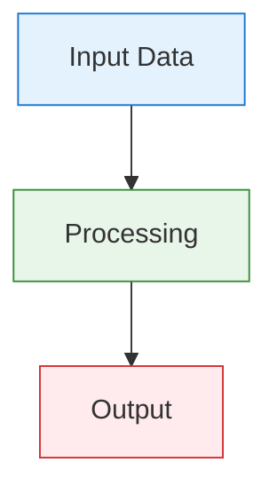
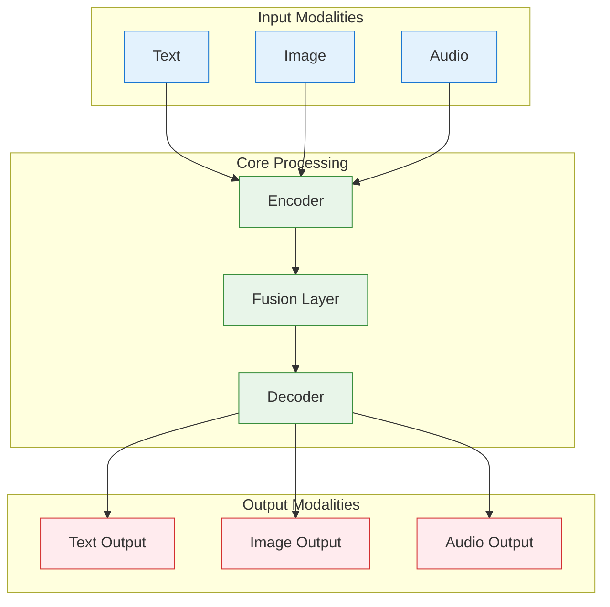
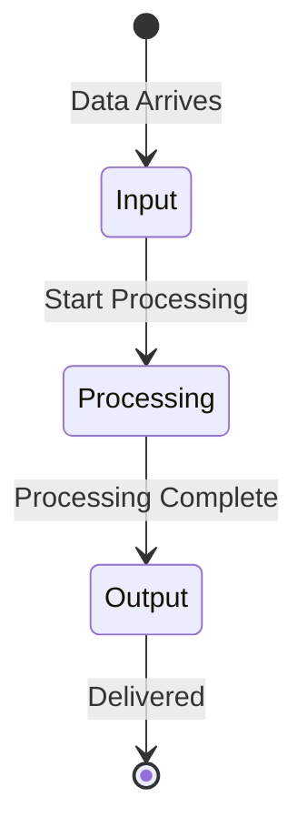

# Diagram Color Standard

**Created:** June 04, 2025  
**Updated:** December 29, 2025  
**Author:** Kirk LaSalle; GitHub Copilot  
**Tags:** #ids #standardized_header #docs\developer\diagram_color_standard.md #documentation #testing #standards #diagram_style_standard #official #permanent  
**Category:** Developer Documentation  
**Status:** Active
**IDS Integration:** This document is indexed and searchable via the ImpressionCore Documentation System (IDS).

---

Note: Canonical standards are consolidated in [ImpressionCore Standards Official](../reference/IMPRESSIONCORE_STANDARDS_OFFICIAL.md).

**Created:** June 04, 2025  
**Updated:** August 09, 2025  
**Author:** ImpressionCore Team  
**Tags:** #docs\developer\diagram_color_standard.md #documentation #testing #official #permanent  
**Category:** Developer Documentation  
**Status:** Active
**IDS Integration:** This document is indexed and searchable via the ImpressionCore Documentation System (IDS).

---

Last updated: 2025-06-04
Responsible: @GitHubCopilot
---

# ImpressionCore Diagram Color Standard & Palette Guide

## Purpose

This document defines the official ImpressionCore color palettes for all diagrams, ensuring accessibility, clarity, and a professional, unified look across all technical and user documentation.

---

## Palette 1: "NeuroClarity" (ImpressionCore Default)

- **Input/Data:** Blue (`#1976d2`, `#e3f2fd`)
- **Processing/Modules:** Green (`#388e3c`, `#e8f5e9`)
- **Output/Errors:** Red (`#d32f2f`, `#ffebee`)
- **Warnings/Special:** Amber (`#fbc02d`, `#fff9c4`)
- **Background/Neutral:** Gray (`#f5f5f5`)

### Color Key

| Role                | Fill      | Stroke    |
|---------------------|-----------|-----------|
| Input/Data          | #e3f2fd   | #1976d2   |
| Processing/Modules  | #e8f5e9   | #388e3c   |
| Output/Errors       | #ffebee   | #d32f2f   |
| Warnings/Special    | #fff9c4   | #fbc02d   |
| Background/Neutral  | #f5f5f5   | -         |

---

## Example Simple Diagram (Mermaid)

---

## Example Advanced Diagram (Mermaid)

---

## Example Animated Diagram (Mermaid State)

---

## Accessibility & Best Practices

- Always use the official palette for all new diagrams.
- Add a color key/legend to complex diagrams.
- Test diagrams for colorblind accessibility (e.g., Coblis, Color Oracle).
- Use consistent shapes and line styles for similar concepts.
- For advanced/animated diagrams, consider SVG or GIF export for presentations.

---

## References

- [Material Design Colors](https://material.io/design/color/the-color-system.html)
- [ColorBrewer](https://colorbrewer2.org/)
- [Coblis Color Blindness Simulator](https://www.color-blindness.com/coblis-color-blindness-simulator/)

---

**This document is the canonical reference for ImpressionCore diagram color standards.**