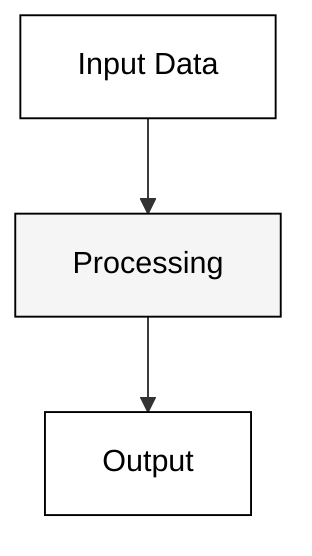
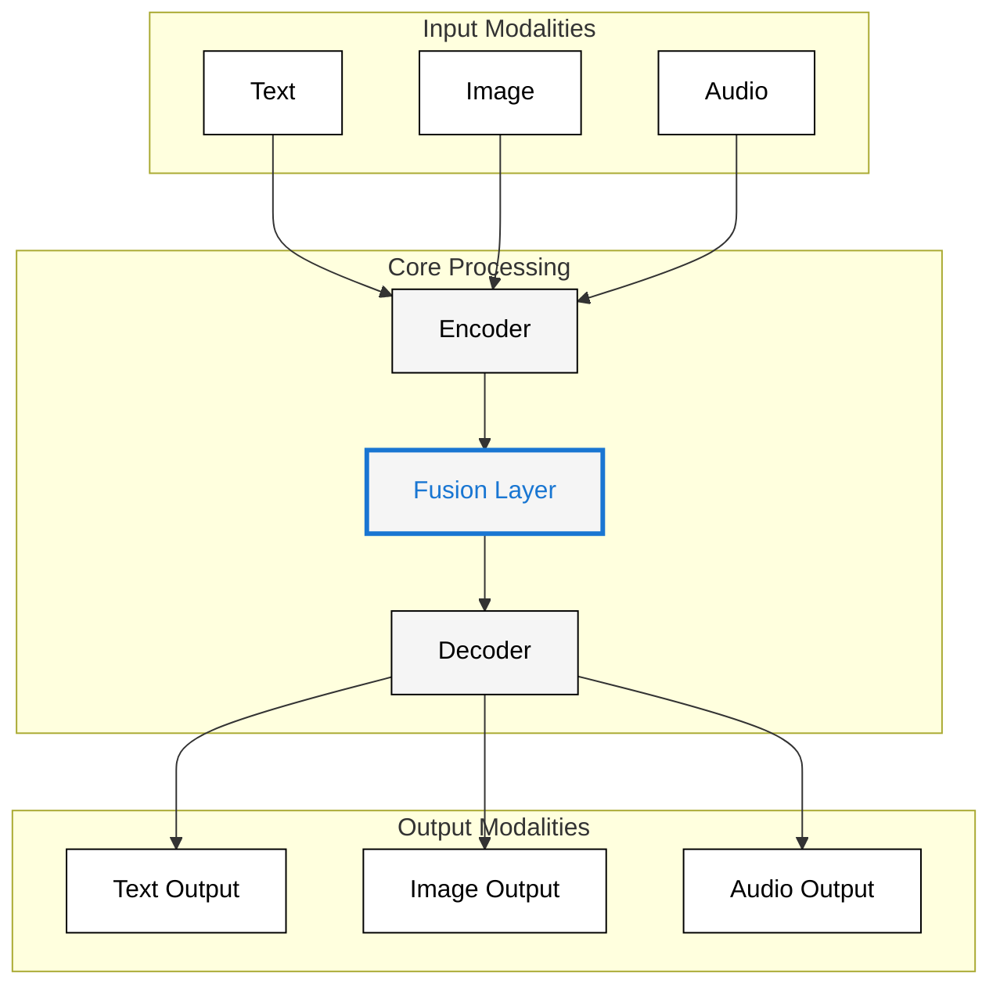
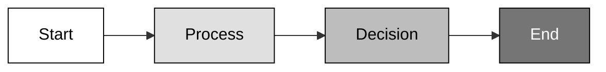

# Diagram Noir Palette

**Created:** June 04, 2025  
**Updated:** December 29, 2025  
**Author:** Kirk LaSalle; GitHub Copilot  
**Tags:** #ids #standardized_header #docs\developer\diagram_noir_palette.md #documentation #testing  
**Category:** Developer Documentation  
**Status:** Active
**IDS Integration:** This document is indexed and searchable via the ImpressionCore Documentation System (IDS).

---

Last updated: 2025-06-04
Responsible: @GitHubCopilot
---

# ImpressionCore Noir & High-Contrast Diagram Palette

## Purpose

This document defines a black-and-white (Noir) and high-contrast palette for ImpressionCore diagrams, ensuring maximum readability, accessibility, and professional style. Use color only for significant notations or highlights.

---

## Noir Palette (High-Contrast)

- **Input/Data:** White fill (`#ffffff`), Black stroke (`#000000`)
- **Processing/Modules:** Light gray fill (`#f5f5f5`), Black stroke (`#000000`)
- **Output/Errors:** White fill (`#ffffff`), Black stroke (`#000000`), **Error/Alert:** Red stroke (`#d32f2f`)
- **Special/Highlight:** Use color (e.g., Blue `#1976d2`, Red `#d32f2f`, Amber `#fbc02d`) only for critical notations or highlights
- **Text:** Always black (`#000000`) for maximum contrast
- **Gradient:** Use grayscale gradients for process flows or emphasis

### Color Key

| Role                | Fill      | Stroke    | Text      |
|---------------------|-----------|-----------|-----------|
| Input/Data          | #ffffff   | #000000   | #000000   |
| Processing/Modules  | #f5f5f5   | #000000   | #000000   |
| Output/Default      | #ffffff   | #000000   | #000000   |
| Error/Alert         | #ffffff   | #d32f2f   | #d32f2f   |
| Special/Highlight   | (color)   | (color)   | (color)   |

---

## Example Noir Diagram (Mermaid)

---

## Example Advanced Noir Diagram (with Highlight)

---

## Example Noir Gradient (Mermaid)

---

## Accessibility & Best Practices

- Use black text for all nodes and labels
- Use color only for critical highlights or alerts
- Use grayscale gradients for process flows
- Test diagrams for high-contrast and colorblind accessibility
- Add a legend for any color highlights

---

**This Noir palette is recommended for technical, print, and accessibility-focused ImpressionCore diagrams.**
