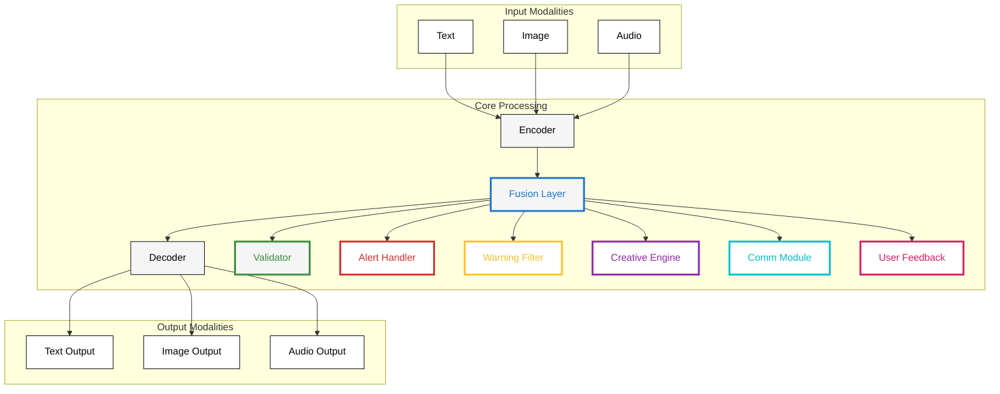

# Diagram Noir Palette Outlines

**Created:** June 04, 2025  
**Updated:** December 29, 2025  
**Author:** Kirk LaSalle; GitHub Copilot  
**Tags:** #ids #standardized_header #docs\developer\diagram_noir_palette_outlines.md #documentation  
**Category:** Developer Documentation  
**Status:** Active
**IDS Integration:** This document is indexed and searchable via the ImpressionCore Documentation System (IDS).

---

Last updated: 2025-06-04
Responsible: @GitHubCopilot
---

# ImpressionCore Noir Palette: Outlined Node Styles Example

## Purpose

This example demonstrates how to use the Noir palette with colored outlines for node emphasis. Each color represents a different type of significance or annotation in ImpressionCore diagrams.

---

## Available Outline Colors & Their Representations

- **Blue (`#1976d2`)**: Data flow, input, or trusted source
- **Green (`#388e3c`)**: Processing, validation, or success
- **Red (`#d32f2f`)**: Error, alert, or critical
- **Amber (`#fbc02d`)**: Warning, caution, or special
- **Purple (`#8e24aa`)**: Cognitive/creative module
- **Cyan (`#00bcd4`)**: Communication, external interface
- **Pink (`#d81b60`)**: User interaction, feedback
- **Black (`#000000`)**: Default/neutral

---

## Example Advanced Noir Diagram with Outlined Nodes

---

## Usage

- Use colored outlines for nodes to indicate their role or status.
- Always include a legend or color key for clarity.
- Keep text black for maximum readability.

---

**This example is the recommended template for advanced ImpressionCore Noir diagrams with outlined node significance.**
