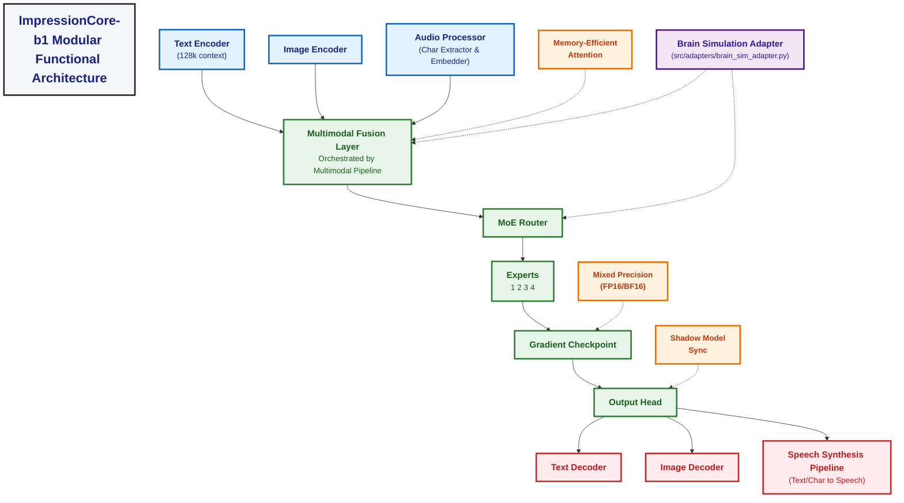

# Impressioncore B1 Architecture

**Created:** April 16, 2025  
**Updated:** December 29, 2025  
**Author:** Kirk LaSalle; GitHub Copilot  
**Tags:** #ids #standardized_header #docs\developer\impressioncore_b1_architecture.md #api #attention_mechanism #deployment #documentation #inference #memory_management #multimodal #performance #pytorch #security #testing #tokenization #training #web_interface  
**Category:** Developer Documentation  
**Status:** Active
**IDS Integration:** This document is indexed and searchable via the ImpressionCore Documentation System (IDS).

---

last_updated: 2025-05-31
responsible_party: @GitHubCopilot
---

# ImpressionCore-b1 Modular Functional Architecture



## Key Architectural Updates (as of 2025-05-27)

This document reflects recent architectural enhancements validated and integrated as per `src/memlog/task_completion_2025-05-24.md`:

1.  **Brain Simulation Adapter Integration**:
    *   The `Brain Simulation Adapter` (implemented in `src/adapters/brain_sim_adapter.py`) has been successfully integrated into the core architecture.
    *   This component provides crucial brain-inspired processing capabilities, interacting with the Multimodal Fusion Layer and MoE Router to enhance contextual understanding and decision-making within the model. It replaces the more conceptual 'Brain-Inspired Hooks' with a concrete, validated adapter.

2.  **Baseline Multimodal Processing Pipeline**:
    *   The core `Multimodal Processing Pipeline` (centered around `src/multimodal/pipeline.py`) has been implemented and forms the backbone of the Multimodal Fusion Layer.
    *   This pipeline orchestrates the ingestion, preprocessing, fusion, and routing of data from various modalities (text, image, audio), ensuring a cohesive flow through the b1 model.

These integrations are reflected in the updated main architecture diagram above and signify key progress in achieving the ImpressionCore-b1 milestone objectives.

## 5. Component Interfaces and Data Contracts (NEW SECTION - 2025-05-23)

### 5.1. Overview

For the ImpressionCore-b1 milestone, well-defined interfaces and data contracts between its various components are crucial for modularity, testability, and future scalability. These contracts specify how different parts of the system (e.g., encoders, fusion layer, decoders) interact, what data they expect, and what data they produce.

### 5.2. Key Documentation

Detailed specifications for these interfaces and data structures are maintained in the following documents:

* **`docs/developer/api_contracts.md`**: This document provides a comprehensive list of API endpoints and data structures for all major components within ImpressionCore-b1. It details the expected inputs, outputs, methods, and signatures for modules like the Text Encoder, Image Encoder, Audio Processor, Multimodal Fusion Layer, MoE components, and various output decoders/pipelines.
* **`docs/developer/impressioncore_b1_multimodal_io.md`**: This document specifically focuses on the data flow and architectural considerations for multimodal input and output. It outlines how different data types (text, image, audio) are ingested, preprocessed, fed into the fusion layer, and how outputs are generated and formatted for each modality. It complements `api_contracts.md` by providing a higher-level view of the data pathways.

Adherence to these contracts is essential for ensuring smooth integration and independent development of ImpressionCore-b1 modules.

---

## Web Server and User Interface Integration (2025-04-19)

### Overview

ImpressionCore-b1 includes a modular web server and user interface designed to streamline model management, inference, and knowledge interaction. The web server is implemented in Flask with support for WebSockets, secure file uploads, and robust logging. The UI, built with Bootstrap, provides a chat interface and a knowledge management panel, serving as a guided walkthrough for users.

### Key Features

* **Model Management:**
  * Models are loaded from disk using PyTorch, with a global cache and thread lock for efficiency and thread safety.
  * The system supports multiple models and exposes endpoints for model metadata and management.

* **API & Routing:**
  * REST and WebSocket endpoints for chat, training, inference, and knowledge management.
  * Secure session and file handling, hardware validation, and integration with training and inference modules.

* **User Interface:**
  * Responsive, menu-driven UI with chat and knowledge management panels.
  * Users can interact with the LLM, add/query knowledge, and follow a guided workflow.

### Integration Points

* The web server interfaces directly with model loading, inference, and training modules in `/src`.
* The UI is designed to be extensible, supporting future steps such as data selection, model configuration, training progress, and evaluation.

### Gaps & Recommendations for Web UI

* **Walkthrough Expansion:** The current menu system covers chat and knowledge management. For "b1" and beyond, it should be expanded to guide users through:
  1. Data selection and upload (for inference with various modalities).
  2. Model selection and basic configuration (e.g., choosing active modalities for "b1" use cases).
  3. Initiating inference tasks (e.g., Text-to-Speech, Image Captioning, Speech-to-Text).
  4. Displaying inference results clearly.
  5. (Post-b1) Training progress and controls.
  6. (Post-b1) Evaluation and benchmarking.
  7. (Post-b1) Model export and deployment.

* **Documentation & "b1" Alignment:**
  * Update API and UI documentation to reflect "b1" specific functionalities and endpoints.
  * Ensure `docs/web_interface.md` clearly outlines the "b1" scope for the web UI and provides guidance for interacting with the implemented multimodal features.
  * Focus on providing a stable interface for demonstrating the core "b1" use cases.

### See Also (Web UI)

* `docs/web_interface.md` for a detailed technical overview and actionable recommendations.

---

## Sound Processing Integration (2025-05-22)

### Sound Processing Overview (Updated)

ImpressionCore-b1 now features significantly enhanced multimodal capabilities through the integration of advanced sound processing functionalities. This includes the `AudioProcessor` for input, leveraging a `PhonemeEmbeddingModule` for character-based sequence extraction and embedding, and a `SpeechSynthesisPipeline` for generating speech from text or character sequences. These components allow for more nuanced understanding and generation of speech.

The current implementation focuses on:

* **Character-based representation:** Using models like Wav2Vec2 (via `PhonemeExtractor`) to derive character sequences from audio, which serve as a proxy for phonemes.
* **Embedding:** Transforming these character sequences into dense vector representations using `PhonemeTokenizer` and `PhonemeEmbedder`.
* **Speech Synthesis:** Generating audible speech from text or character sequences using models like SpeechT5 and a HiFiGAN vocoder (via `PhonemeToSoundSynthesizer` within the `SpeechSynthesisPipeline`).

### Implemented Sound Processing Components

```mermaid
%% ImpressionCore-b1 Sound Processing Flow (2025-05-22)
graph TD
    subgraph Audio Input Processing
        direction LR
        AudioInput[("fa:fa-file-audio Raw Audio<br>(Waveform/File Path)")] --> AP[AudioProcessor]
        AP --> AP_Resample{Resample & Normalize}
        AP_Resample --> PE[PhonemeExtractor<br>(Wav2Vec2-based)]
        PE --> CharSeq["Character Sequence<br>e.g., ['h','e','l','l','o']"]
        CharSeq --> PT[PhonemeTokenizer]
        PT --> TokenIDs["Token IDs<br>e.g., [12, 5, 15, 15, 20]"]
        TokenIDs --> PEM[PhonemeEmbedder<br>(nn.Embedding)]
        PEM --> OutputEmbeds[("fa:fa-wave-square Character Embeddings<br>(Tensor)")]
        CharSeq --> OutputChars[("fa:fa-font Character Sequence<br>(Direct Output)")]
    end

    subgraph Speech Generation
        direction LR
        TextInput[("fa:fa-keyboard Text Input<br>'Hello world'")] --> SSP[SpeechSynthesisPipeline]
        CharInput[("fa:fa-font Character Sequence Input<br>['h','e','l','l','o']")] --> SSP
        SSP --> P2S[PhonemeToSoundSynthesizer<br>(SpeechT5 & HiFiGAN Vocoder)]
        P2S --> AudioOutput[("fa:fa-volume-up Synthesized Speech<br>(Waveform)")]
    end

    style AudioInput fill:#e3f2fd,stroke:#1565c0,stroke-width:2px
    style AP fill:#e3f2fd,stroke:#1565c0,stroke-width:2px
    style PE fill:#e3f2fd,stroke:#1565c0,stroke-width:2px
    style PT fill:#e3f2fd,stroke:#1565c0,stroke-width:2px
    style PEM fill:#e3f2fd,stroke:#1565c0,stroke-width:2px
    style OutputEmbeds fill:#c8e6c9,stroke:#2e7d32,stroke-width:2px
    style OutputChars fill:#c8e6c9,stroke:#2e7d32,stroke-width:2px

    style TextInput fill:#ffebee,stroke:#c62828,stroke-width:2px
    style CharInput fill:#ffebee,stroke:#c62828,stroke-width:2px
    style SSP fill:#ffebee,stroke:#c62828,stroke-width:2px
    style P2S fill:#ffebee,stroke:#c62828,stroke-width:2px
    style AudioOutput fill:#fff9c4,stroke:#f57f17,stroke-width:2px

    linkStyle default stroke-width:2px,fill:none,stroke:grey
```

### Audio Input Processing (Formerly Sound Encoder)

The `AudioProcessor` component (detailed in `src/data/preprocessing/audio.py`) now serves as the primary sound input module. It handles:

* Loading and resampling audio to the target sample rate (e.g., 16kHz).
* Utilizing the `PhonemeExtractor` (from `src/modules/phoneme_embedding/`), which employs a Hugging Face Wav2Vec2-based model to extract character sequences from the audio waveform. These characters act as a foundational representation similar to phonemes.
* Optionally, these character sequences can be passed to the `PhonemeTokenizer` and `PhonemeEmbedder` (also from `src/modules/phoneme_embedding/`) to produce dense vector embeddings.
* The `AudioProcessor` can output either the raw character sequences or their embeddings, which are then fed into the Multimodal Fusion Layer.

### Speech Generation (Formerly Sound Decoder)

The `SpeechSynthesisPipeline` (detailed in `src/inference/pipelines/speech_synthesis_pipeline.py`) is responsible for generating audible speech. It integrates:

* The `PhonemeToSoundSynthesizer` (from `src/modules/phoneme_embedding/`), which uses a Hugging Face SpeechT5 model for text-to-speech conversion and a HiFiGAN model as the vocoder.
* It can accept either plain text strings or lists of characters (representing the output from the `PhonemeExtractor` or similar processes) as input.
* The pipeline manages model loading, input processing, and generation of the final audio waveform.

### Phoneme/Character Processing (Implemented)

The current system implements character-level processing as a stand-in and foundation for more advanced phoneme-based understanding:

* **Character Extraction:** Achieved via ASR models (Wav2Vec2) within the `PhonemeExtractor`.
* **Tokenization & Embedding:** Standard NLP techniques are applied to these character sequences using `PhonemeTokenizer` and `PhonemeEmbedder`.

This approach allows the model to:

* Process and understand spoken content at a granular level.
* Generate intelligible speech from textual or character-based inputs.

Future work will focus on transitioning towards true phoneme recognition and synthesis for enhanced nuance (e.g., accent, emotion) and cross-lingual capabilities.

### Gaps & Recommendations for Sound Processing (Updated)

* **Refinement and Expansion (b1 Focus):**
  * Continue to refine the existing character-based extraction (`PhonemeExtractor`) and synthesis (`SpeechSynthesisPipeline`, `PhonemeToSoundSynthesizer`).
  * Ensure robustness and acceptable quality for "b1" use cases (Text-to-Speech, basic Speech-to-Text via character sequences).
  * Explore lightweight models or configurations if current ones strain the target hardware for these core tasks.
* **True Phoneme Research (Post-b1 Foundation):**
  * Begin research and preliminary investigation into state-of-the-art true phoneme extraction (e.g., G2P models, dedicated phoneme recognizers) and synthesis systems. This will be crucial for moving beyond character-level processing for enhanced nuance post-"b1".
* **Prosody and Emotion (Post-b1):**
  * Defer significant work on prosody and emotion to post-"b1" milestones. Initial "b1" focus is on intelligible speech generation and basic content understanding.
* **Dataset Curation (Post-b1):**
  * Identify or begin curating diverse datasets for future training and fine-tuning of sound processing models, especially for true phoneme systems and expressive speech, in preparation for post-"b1" development.
* **Memory and Performance Profiling (b1 Critical):**
  * Continuously profile the memory footprint and inference speed of all audio components (`AudioProcessor`, `PhonemeExtractor`, `PhonemeEmbedder`, `SpeechSynthesisPipeline`).
  * Aggressively optimize to ensure all "b1" audio-related use cases operate within the NVIDIA GTX 1050 Ti 4GB VRAM limit.
* **Documentation (b1 Deliverable):**
  * Ensure `docs/developer/impressioncore_b1_sound_processing.md` (or a similarly named, consolidated document) is thoroughly updated with the "b1" implementation details, component APIs (referencing `api_contracts.md`), data flows (referencing `impressioncore_b1_multimodal_io.md`), and usage examples for the character-based audio processing and speech synthesis pipelines.

### See Also (Sound Processing)

* `docs/developer/impressioncore_b1_sound_processing.md` for detailed sound processing pipeline information.
* `src/data/preprocessing/audio.py` (for `AudioProcessor`)
* `src/modules/phoneme_embedding/` (for character extraction, tokenization, embedding, and TTS synthesis modules)
* `src/inference/pipelines/speech_synthesis_pipeline.py` (for the end-to-end speech generation pipeline)

---

## 6. Digital Identity Management Core (NEW SECTION - 2025-05-23)

### 6.1. Vision and Purpose

The Digital Identity Management (DIM) Core is a foundational pillar of ImpressionCore, designed to provide users with a secure, private, and portable way to manage their digital identity and interact with AI services. It aims to empower users with control over their personal data and how it's utilized by the ImpressionCore system and potentially federated services in the future.

For the **b1 milestone**, the focus is on establishing the conceptual framework and core principles for the DIM. Actual implementation of cryptographic systems or complex identity protocols is largely out of scope for b1, but the architectural considerations must be laid out.

### 6.2. Core Principles (b1 Focus)

1. **User Sovereignty:** Users own and control their identity data. ImpressionCore acts as a custodian and processor under user consent.
2. **Privacy by Design:** Privacy is a core consideration from the outset. Minimize data collection and ensure data is handled securely.
3. **Security:** While full cryptographic implementation is post-b1, the architecture should anticipate the need for robust security mechanisms (e.g., placeholders for encryption, secure storage considerations).
4. **Portability (Future Goal):** Design with the future possibility of users being able to take their ImpressionCore identity to other compliant systems (conceptual at b1).
5. **Modularity:** The DIM should be a distinct module within ImpressionCore, allowing for future upgrades and integration of advanced identity technologies (e.g., DIDs, VCs) post-b1.

### 6.3. Conceptual Components (b1 Architectural Placeholders)

While detailed implementation is post-b1, the b1 architecture should acknowledge the following conceptual components for the DIM:

* **Identity Store (Conceptual):**
  * **Purpose:** A secure (conceptually) repository for user identity attributes and credentials.
  * **b1 Consideration:** Define what minimal user attributes might be relevant for personalized AI interaction (e.g., user preferences, interaction history - all managed with privacy in mind). No actual storage of sensitive PII in b1 unless strictly necessary and clearly documented with placeholder security.
  * **Data Contract (Placeholder):** Define a schema for user preferences or interaction data that might be stored. (e.g., `{'user_id': '...', 'preferences': {'theme': 'dark'}, 'interaction_log_summary': '...'}`).

* **Authentication Service (Conceptual):**
  * **Purpose:** Verifies the user's identity before granting access to ImpressionCore services or their data.
  * **b1 Consideration:** For b1, this might be a very simple mechanism (e.g., local user profile selection if running locally, or a placeholder for future OAuth/OIDC integration). The key is to acknowledge the *need* for authentication.
  * **API Contract (Placeholder):** `authenticate(user_identifier, credentials) -> session_token`

* **Authorization Service (Conceptual):**
  * **Purpose:** Determines what actions an authenticated user is permitted to perform and what data they can access.
  * **b1 Consideration:** Define basic roles or permissions (e.g., 'user' can access their own data, 'admin' for system maintenance - though admin roles are likely post-b1). Focus on user access to their own generated content and preferences.
  * **API Contract (Placeholder):** `is_authorized(session_token, action, resource) -> bool`

* **Consent Management (Conceptual):**
  * **Purpose:** Manages user consent for data collection, processing, and sharing.
  * **b1 Consideration:** While no active data sharing is planned for b1, the architecture should note that any data used for personalization or improving the AI (even locally) implies user consent. For b1, this might be a general statement in user-facing documentation.

### 6.4. Data Flow and Interactions (Conceptual for b1)

1. **User Onboarding/First Use (Conceptual):**
    * A new user (or first-time local setup) might create a local profile.
    * The DIM (conceptually) establishes a unique identifier for this profile.
    * Basic preferences might be set.

2. **User Interaction with ImpressionCore:**
    * User authenticates (conceptually).
    * ImpressionCore services, when needing personalization or context, query the DIM for relevant (and consented) user data via internal APIs.
    * Example: The Multimodal Fusion Layer might request user's preferred output language (if stored and consented).

### 6.5. Security Considerations for b1 (High-Level)

* **Data Minimization:** Only plan to store data absolutely essential for b1 functionality.
* **Placeholder for Encryption:** Note where sensitive data *would* be encrypted in a production system, even if not implementing encryption in b1.
* **Secure Storage (Conceptual):** If any user-specific data is stored (e.g., local preferences file), note that this would need to be secured in a production environment.

### 6.6. Integration with Other ImpressionCore-b1 Components

* **Multimodal Fusion Layer:** May query DIM for user preferences that affect fusion or output (e.g., preferred language, accessibility settings).
* **Output Decoders/Pipelines:** May receive user-specific parameters from DIM (e.g., preferred voice for TTS).
* **Web UI:** Will interact with Authentication/Authorization services (conceptually) to manage user sessions and access.

### 6.7. Future Evolution (Post-b1)

* Implementation of strong cryptographic methods for identity and data protection.
* Integration with Decentralized Identifiers (DIDs) and Verifiable Credentials (VCs).
* Federated identity options.
* Advanced consent management dashboards.

This section provides the architectural groundwork for the DIM within ImpressionCore-b1, focusing on principles and conceptual components to guide future development.

---
