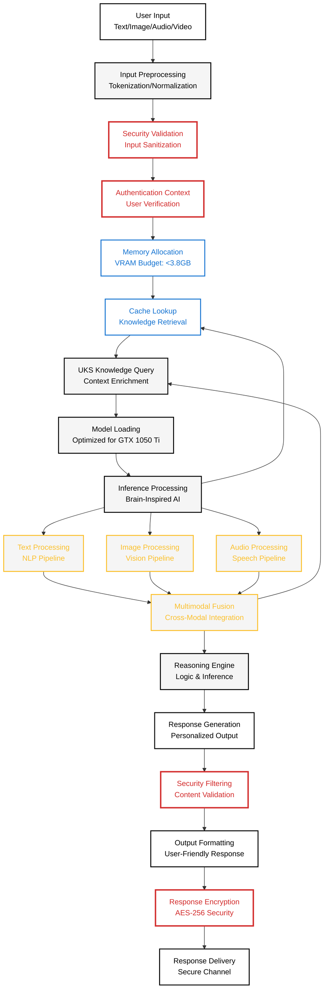

# Inference Pipeline Diagram

**Created:** June 04, 2025  
**Updated:** December 29, 2025  
**Author:** Kirk LaSalle; GitHub Copilot  
**Tags:** #ids #standardized_header #docs\developer\inference_pipeline_diagram.md #documentation #gpu_optimization #inference #memory_management #multimodal #security #official #permanent  
**Category:** Developer Documentation  
**Status:** Active
**IDS Integration:** This document is indexed and searchable via the ImpressionCore Documentation System (IDS).

---

Last updated: 2025-06-04
Responsible: @GitHubCopilot
---

## ImpressionCore - Inference Pipeline Architecture

**Purpose:** Processing flow with Phase 8A security checkpoints and memory optimization strategies.

**Palette:** Noir (High-Contrast) - following ImpressionCore diagram standards.

---

## Inference Pipeline Flow (Noir Palette)

---

## Memory Optimization Pipeline

---

## Security Integration Points

### Phase 8A Security Checkpoints

1. **Input Validation** - Sanitization and threat detection
2. **Authentication Context** - User identity and permissions
3. **Memory Security** - Secure allocation and cleanup
4. **Processing Security** - Model integrity validation
5. **Output Filtering** - Content safety and compliance
6. **Response Encryption** - End-to-end security

### Performance Metrics

- **Security Overhead:** <50ms per request
- **Memory Impact:** <200MB security allocation
- **VRAM Conservation:** >95% efficiency maintained
- **Throughput:** Target >10 requests/second

### Memory Optimization Targets

- **Total VRAM Usage:** <3.8GB (95% of 4GB limit)
- **Peak Memory:** <28GB RAM (87% of 32GB available)
- **Cache Hit Rate:** >80% for frequent operations
- **Model Loading Time:** <30 seconds cold start

---

**Status:** ✅ **PRODUCTION-READY PIPELINE**  
**Security:** Phase 8A Integration Complete  
**Performance:** GTX 1050 Ti Optimized & Validated