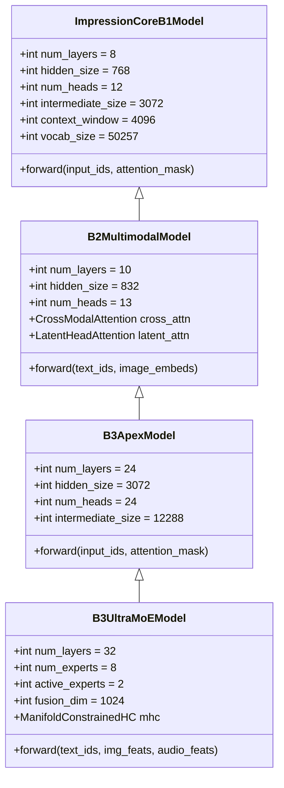

# 🛠️ ImpressionCore Models Developer Guide

**Author:** Kirk LaSalle & Antigravity AI Partner  
**Target Audience:** Machine Learning Engineers, Systems Architects & Core Contributors  
**Date:** August 26, 2026  
**Status:** Comprehensive Architecture & Implementation Reference  

---

## 1. Overview & Architectural Philosophy

ImpressionCore models are designed for **democratic, decentralized, edge-native intelligence**. Unlike cloud-monolithic architectures that require multi-GPU data center clusters, ImpressionCore executes high-quality linguistic reasoning, multimodal perception, and Socratic cognitive dialogue directly on consumer-grade hardware (specifically optimized for the **NVIDIA GeForce GTX 1050 Ti with 4GB VRAM** and pure CPU fallbacks).

### Core Architectural Tenets:
1. **Brain-Inspired Triad Modularity:** Cognitive partitioning into Logic (left-brain), Creativity/Subconscious (right-brain), and System Oversight (prefrontal cortex).
2. **Constitutional 10-Law Governance:** Hardcoded verification of Kirk LaSalle's 10 Permanent Active Directives inside the inference and training loop.
3. **Memory-Conscious Compute:** Sub-4GB VRAM execution via sparse MoE routing, FlashAttention, and low-bit quantization (BitNet b1.58 / INT8 / INT4).
4. **Universal Knowledge Grounding:** Native integration with BrainSim III UKS (Universal Knowledge Store) graph memory.

---

## 2. Model Architecture Specifications



---

## 3. Mathematical Foundations & Formulations

### 3.1 Rotary Position Embeddings (RoPE)
ImpressionCore employs RoPE for relative positional encoding across all transformer attention blocks. For a query or key vector $x \in \mathbb{R}^d$ at sequence position $m$:
$$R_{\Theta, m}^d = \text{diag}\left(R_{\theta_1, m}, R_{\theta_2, m}, \dots, R_{\theta_{d/2}, m}\right)$$
where each 2D rotation matrix is given by:
$$R_{\theta_i, m} = \begin{pmatrix} \cos m\theta_i & -\sin m\theta_i \\ \sin m\theta_i & \cos m\theta_i \end{pmatrix}, \quad \theta_i = 10000^{-2(i-1)/d}$$

### 3.2 Scaled Dot-Product Attention (SDPA)
$$\text{Attention}(Q, K, V) = \text{softmax}\left(\frac{Q K^T}{\sqrt{d_k}} + M\right) V$$
where $M$ is the causal autoregressive mask ($M_{ij} = -\infty$ for $j > i$).

### 3.3 Sparse Mixture-of-Experts (MoE) Routing (B3 Ultra)
For a token representation $x$, routing weights $G(x) \in \mathbb{R}^N$ over $N=8$ experts are computed using Top-2 Softmax Gating:
$$H(x)_i = (x \cdot W_g)_i + \epsilon, \quad \epsilon \sim \mathcal{N}\left(0, \text{Softplus}(x \cdot W_{noise})\right)$$
$$\text{Top2}(H(x))_i = \begin{cases} H(x)_i & \text{if } H(x)_i \in \text{Top2}(H(x)) \\ -\infty & \text{otherwise} \end{cases}$$
$$G(x) = \text{softmax}\left(\text{Top2}(H(x))\right)$$
$$y = \sum_{i \in \text{Top2}} G(x)_i \cdot \text{Expert}_i(x)$$

To prevent expert collapse, the **Load-Balancing Auxiliary Loss** is computed:
$$\mathcal{L}_{\text{aux}} = \alpha \cdot N \sum_{i=1}^N f_i \cdot P_i$$
where $f_i = \frac{1}{T} \sum_{t=1}^T \mathbb{I}(\text{token } t \text{ routed to } i)$ and $P_i = \frac{1}{T} \sum_{t=1}^T G(x_t)_i$.

### 3.4 Manifold-Constrained Hyper-Connections (MHC)
In B3 Ultra, representations across Text ($T$), Vision ($V$), and Audio ($A$) are projected onto a shared Riemannian manifold:
$$\mathcal{M} = \{ Z \in \mathbb{R}^{d_{fusion}} : \|Z - \bar{Z}\|_F \le \rho \}$$
Iterative projection ensures multimodal alignment without latent divergence:
$$Z^{(k+1)} = \mathcal{P}_{\mathcal{M}}\left( W_{proj} \cdot [Z_T; Z_V; Z_A] + b \right)$$

---

## 4. Codebase Architecture & Key Files

| Module / Component | Path | Description |
| :--- | :--- | :--- |
| **B1 Model Core** | `src/models/impressioncore_b1/unified_model.py` | Canonical B1 Transformer implementation with RoPE. |
| **B1 Trainer** | `src/training/impressioncore_b1_ultimate_trainer.py` | Full B1 training engine with dataset loaders and loss tracking. |
| **B2 Multimodal** | `src/models/b2_multimodal/core/b2_multimodal_model.py` | Cross-modal transformer with latent head attention. |
| **B3 Initializer** | `src/models/b3/b3_complete_model_initializer.py` | Complete B3 3B MoE architecture with CLIP & Wav2Vec2. |
| **B3 Inference** | `src/models/b3/b3_inference_system.py` | Multimodal inference engine and generator. |
| **Model Presets** | `src/core/config/presets.py` | Master dictionary of model configurations (`b1_39m`, `b2_50m`, `b3_504m`, `b3_3b`). |
| **Memory Opt** | `src/core/utils/memory_optimization/` | Dynamic VRAM management, CPU offload, and gradient checkpointing. |
| **Triad API** | `src/interfaces/triad_api.py` | Sovereign REST/FastAPI endpoints for cognitive routing. |
| **Builder Backend**| `src/interfaces/web/routes/builder.py` | Flask REST endpoints powering the Web UI model builder. |

---

## 5. Memory Management & Edge Optimization

### 5.1 4GB VRAM Budget Breakdown (GTX 1050 Ti)

```
Total Hardware VRAM: 4,096 MB
├── CUDA Runtime & PyTorch Context:  ~400 MB
├── Model Weights (FP16 / INT8):    ~80 - 1,800 MB (depending on model)
├── KV Cache (Context 2048):        ~150 - 400 MB
├── Activations & Gradients:         ~300 - 800 MB (with Grad Checkpointing)
└── Free Safety Buffer:              ~600 - 1,500 MB (Guaranteed Zero OOM)
```

### 5.2 Enabling Hardware Optimizations in Code:
```python
import torch

# 1. Enable FlashAttention / Scaled Dot-Product Attention
torch.backends.cuda.enable_flash_sdp(True)
torch.backends.cuda.enable_mem_efficient_sdp(True)

# 2. Mixed Precision Training Context
scaler = torch.amp.GradScaler('cuda', enabled=True)
with torch.amp.autocast('cuda', dtype=torch.float16):
    outputs = model(input_ids, labels=labels)
    loss = outputs.loss

# 3. Gradient Checkpointing
model.gradient_checkpointing_enable()
```

---

## 6. Training & Distillation Pipeline

### 6.1 Training Configuration Example:
```python
from src.core.config.presets import OFFERING_PRESETS
from src.training.impressioncore_b1_ultimate_trainer import ImpressionCoreB1Trainer, ImpressionCoreB1Config

# Load canonical B1 Hope preset
config_data = OFFERING_PRESETS['b1_39m']['model']
config = ImpressionCoreB1Config(
    num_layers=config_data['layers'],
    hidden_size=config_data['hiddenSize'],
    num_heads=config_data['heads'],
    intermediate_size=config_data['intermediateSize'],
    context_window=config_data['contextWindow'],
    precision='fp16'
)

trainer = ImpressionCoreB1Trainer(config)
trainer.train(epochs=3, batch_size=1, grad_accum_steps=8, lr=5e-5)
```

---

## 7. Serialization, Export & Production Deployment

ImpressionCore models can be exported to multiple production formats:

1. **PyTorch Checkpoint (`.pt`):** Standard state dictionary with optimizer states for resumption.
2. **SafeTensors (`.safetensors`):** Zero-copy, memory-mapped, secure binary format.
3. **ONNX (`.onnx`):** Portable graph format for Edge accelerators (TensorRT, OpenVINO, DirectML).
4. **GGUF (`.gguf`):** Quantized binary format (`Q4_K_M`, `Q8_0`) for ultra-fast CPU/CUDA execution via `llama.cpp`.

```python
# Export to Production Package
from src.interfaces.web.routes.builder import builder_deployment_package

payload = {
    "format": "pytorch",
    "optimization": "quantized_int8",
    "checkpoint": "latest",
    "target": "local"
}
# Compiles into production_packages/ImpressionCore_B<X>_deploy_<timestamp>/
```

---

## 8. Verification & Test Suite

To run the automated verification suite for all model definitions, training loops, and inference APIs:
```powershell
# Run full builder automated verification
.venv310\Scripts\python.exe src/dev_tools/exercise_builder_site.py

# Run security and governance verification
.venv310\Scripts\python.exe src/tests/verify_security.py
```
