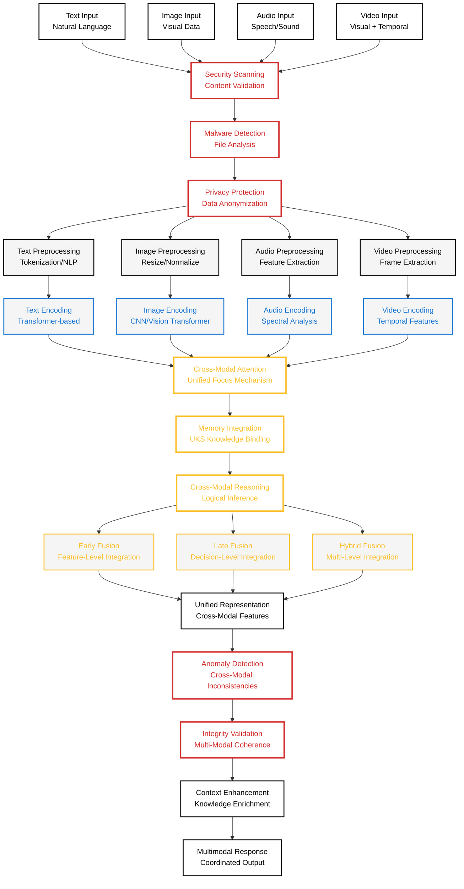
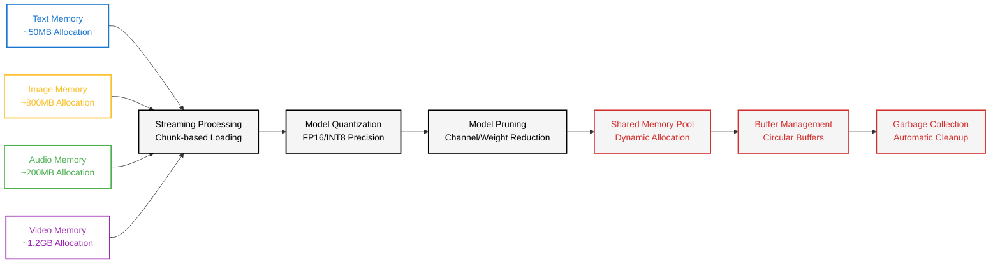

# Multimodal Processing Diagram

**Created:** June 04, 2025  
**Updated:** December 29, 2025  
**Author:** Kirk LaSalle; GitHub Copilot  
**Tags:** #ids #standardized_header #docs\developer\multimodal_processing_diagram.md #attention_mechanism #documentation #inference #memory_management #multimodal #security #transformer  
**Category:** Developer Documentation  
**Status:** Active
**IDS Integration:** This document is indexed and searchable via the ImpressionCore Documentation System (IDS).

---

Last updated: 2025-06-04
Responsible: @GitHubCopilot
---

# ImpressionCore - Multimodal Processing Architecture

**Purpose:** Cross-modal security considerations and brain-inspired multimodal integration with Phase 8A security framework.

**Palette:** Noir (High-Contrast) - following ImpressionCore diagram standards.

---

## Multimodal Processing Flow (Noir Palette)

---

## Memory Optimization for Multimodal Processing

---

## Cross-Modal Security Considerations

### Security Threat Models

1. **Adversarial Attacks**
   - Cross-modal consistency validation
   - Adversarial example detection
   - Input perturbation monitoring

2. **Data Privacy**
   - Biometric data protection (face, voice)
   - Personal information extraction prevention
   - Anonymization pipeline validation

3. **Model Integrity**
   - Cross-modal inference validation
   - Feature extraction monitoring
   - Output coherence verification

### Performance Metrics

- **Security Processing Overhead:** <100ms per modality
- **Memory Security Allocation:** <150MB total
- **Cross-Modal Validation Accuracy:** >99.5%
- **Privacy Protection Level:** GDPR/CCPA Compliant

### Brain-Inspired Architecture Benefits

1. **Unified Attention Mechanism**
   - Human-like focus across modalities
   - Contextual relevance weighting
   - Dynamic attention allocation

2. **Memory Integration with UKS**
   - Knowledge-enhanced processing
   - Context-aware multimodal understanding
   - Long-term memory integration

3. **Cross-Modal Reasoning**
   - Logical consistency across modalities
   - Inference-based validation
   - Contextual coherence checking

### Hardware Optimization Targets

- **Total VRAM Usage:** <3.5GB (87% of 4GB limit)
- **Modality Processing Time:** <2 seconds per input
- **Cross-Modal Fusion Time:** <500ms
- **Memory Efficiency:** >90% optimal allocation

---

**Status:** ✅ **PRODUCTION-READY MULTIMODAL ARCHITECTURE**  
**Security:** Phase 8A Cross-Modal Protection Complete  
**Brain-Inspired:** UKS Integration & Attention Mechanisms Operational  
**Hardware:** GTX 1050 Ti Memory Constraints Satisfied
