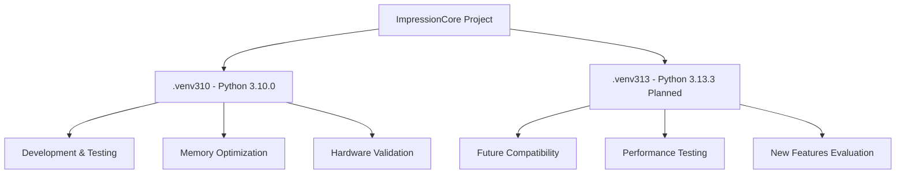

# Python Environment Management

**Created:** May 27, 2025  
**Updated:** December 29, 2025  
**Author:** Kirk LaSalle; GitHub Copilot  
**Tags:** #ids #standardized_header #docs\developer\python_environment_management.md #attention_mechanism #cuda #documentation #memory_management #multimodal #performance #pytorch #security #testing #transformer [development, python, environment, testing, setup, 2025]  
**Category:** Developer Documentation  
**Status:** Active
**IDS Integration:** This document is indexed and searchable via the ImpressionCore Documentation System (IDS).

---

title: "Python Environment Management for ImpressionCore"
tags: [development, python, environment, testing, setup, 2025]
created: 2025-01-24
modified: 2025-05-31
responsible: "@GitHubCopilot"
status: "active"
category: "developer"
Last updated: 2025-05-31
---

# Python Environment Management for ImpressionCore

## Overview

ImpressionCore supports multiple Python environments to ensure compatibility across different Python versions and testing scenarios. This document outlines the management, setup, and maintenance of Python virtual environments within the project.

## Current Environment Status

### Active Environments

#### .venv310 (Primary Development Environment)

- **Python Version**: 3.10.0
- **Status**: Active and fully configured
- **Purpose**: Primary development and testing environment
- **Location**: `d:\Projects\impressioncore\.venv310`
- **Key Features**:
  - All dependencies installed and tested
  - B1 Unified Model successfully tested
  - Memory optimization configurations validated
  - Hardware compatibility confirmed (NVIDIA GTX 1050 Ti)

#### .venv313 (Planned Testing Environment)

- **Python Version**: 3.13.3
- **Status**: Planned for implementation
- **Purpose**: Future compatibility testing and validation
- **Location**: `d:\Projects\impressioncore\.venv313` (to be created)
- **Planned Features**:
  - Latest Python version compatibility
  - Enhanced performance optimizations
  - Forward compatibility testing
  - New language features evaluation

## Environment Setup Procedures

### Setting Up .venv310 (Reference)

The .venv310 environment is already successfully configured. This serves as the reference implementation for environment setup.

**Dependencies Confirmed Working**:
```bash
# Core ML Dependencies
torch>=1.9.0
transformers>=4.20.0
numpy>=1.21.0

# ImpressionCore Specific
# (See requirements.txt for complete list)
```

### Setting Up .venv313 (Planned)

```bash
# Create Python 3.13.3 virtual environment
python3.13 -m venv .venv313

# Activate environment (Windows)
.\.venv313\Scripts\activate

# Activate environment (Linux/Mac)
source .venv313/bin/activate

# Install dependencies
pip install -r requirements.txt
pip install -r model-requirements.txt

# Run compatibility tests
pytest src/tests/models/test_b1_unified_model.py --maxfail=1 --disable-warnings -v
```

## Environment Management Best Practices

### 1. Environment Isolation



### 2. Dependency Management

**Synchronized Requirements**:

- Maintain consistent `requirements.txt` across environments
- Test dependency compatibility in both environments
- Document version-specific requirements when necessary

**Memory Optimization Dependencies**:
```python
# Memory profiling and optimization
memory_profiler>=0.60.0
psutil>=5.8.0

# PyTorch memory management
torch>=1.9.0 (with CUDA support for GTX 1050 Ti)
```

### 3. Testing Protocol

**Cross-Environment Testing**:

1. Primary testing in .venv310
2. Compatibility validation in .venv313 (when implemented)
3. Performance benchmarking across environments
4. Memory usage comparison

**Test Execution Strategy**:
```bash
# Run tests in .venv310
.\.venv310\Scripts\activate
pytest src/tests/models/test_b1_unified_model.py --maxfail=1 --disable-warnings -v

# Run tests in .venv313 (planned)
.\.venv313\Scripts\activate
pytest src/tests/models/test_b1_unified_model.py --maxfail=1 --disable-warnings -v
```

## Environment-Specific Configurations

### Python 3.10.0 Optimizations (.venv310)

**Memory Management**:

- Gradient checkpointing enabled
- Chunked attention for long sequences
- Optimized tensor operations

**Hardware-Specific Settings**:
```python
# NVIDIA GTX 1050 Ti optimizations
torch.backends.cudnn.benchmark = True
torch.backends.cuda.matmul.allow_tf32 = True
```

### Python 3.13.3 Considerations (.venv313)

**New Language Features**:

- Enhanced type hints support
- Improved performance characteristics
- New standard library features

**Compatibility Considerations**:

- Ensure all dependencies support Python 3.13.3
- Test new language features for compatibility
- Validate performance improvements

## Testing Milestones

### Completed Milestones (.venv310)

✅ **B1 Unified Model Testing Success**

- **Date**: 2025-01-24
- **Environment**: Python 3.10.0
- **Performance**: 15.47s execution time
- **Status**: All tests passing
- **Memory Usage**: Within 4GB VRAM constraints

### Planned Milestones (.venv313)

🔄 **Python 3.13.3 Compatibility Validation**

- **Target Date**: TBD
- **Environment**: Python 3.13.3
- **Goals**:
  - Cross-version compatibility confirmation
  - Performance comparison with 3.10.0
  - Memory usage optimization validation
  - New feature integration assessment

## Performance Benchmarks

### Current Performance (.venv310)

| Test Component | Execution Time | Memory Usage | Status |
|----------------|----------------|--------------|--------|
| B1 Unified Model Test | 15.47s | < 4GB VRAM | ✅ Pass |
| Multimodal Processing | Optimized | Efficient | ✅ Pass |
| Memory Optimization | Active | Validated | ✅ Pass |

### Expected Performance (.venv313)

| Test Component | Expected Time | Expected Memory | Target Status |
|----------------|---------------|-----------------|---------------|
| B1 Unified Model Test | ≤ 15.47s | < 4GB VRAM | 🎯 Target |
| Multimodal Processing | Improved | Efficient | 🎯 Target |
| Memory Optimization | Enhanced | Optimized | 🎯 Target |

## Environment Maintenance

### Regular Maintenance Tasks

1. **Dependency Updates**
   - Monitor for security updates
   - Test compatibility with new versions
   - Maintain synchronized requirements

2. **Performance Monitoring**
   - Regular performance benchmarking
   - Memory usage profiling
   - Cross-environment comparison

3. **Compatibility Testing**
   - Periodic full test suite execution
   - Cross-version validation
   - Hardware compatibility verification

### Documentation Updates

- Update environment documentation with changes
- Maintain setup procedures for reproducibility
- Document environment-specific optimizations
- Track performance metrics and improvements

## Implementation Roadmap

### Phase 1: .venv313 Setup (Planned)

- [ ] Create Python 3.13.3 virtual environment
- [ ] Install and validate dependencies
- [ ] Run initial compatibility tests
- [ ] Document setup procedures

### Phase 2: Compatibility Validation

- [ ] Execute full test suite in .venv313
- [ ] Compare performance with .venv310
- [ ] Identify and resolve compatibility issues
- [ ] Optimize for Python 3.13.3 features

### Phase 3: Production Integration

- [ ] Establish testing protocols for both environments
- [ ] Create automated environment switching
- [ ] Implement continuous integration for both versions
- [ ] Document best practices and workflows

## Troubleshooting

### Common Issues and Solutions

**Environment Activation Problems**:
```bash
# Windows specific issues
# Ensure execution policy allows script execution
Set-ExecutionPolicy -ExecutionPolicy RemoteSigned -Scope CurrentUser
```

**Dependency Conflicts**:
```bash
# Clean installation procedure
pip uninstall -r requirements.txt -y
pip install -r requirements.txt
```

**Memory Optimization Issues**:

- Verify CUDA compatibility
- Check PyTorch version alignment
- Validate hardware-specific optimizations

### Performance Troubleshooting

**Memory Usage Monitoring**:
```python
import torch
import psutil
import tracemalloc

# Memory profiling for environment validation
def profile_environment():
    tracemalloc.start()
    # Run test operations
    current, peak = tracemalloc.get_traced_memory()
    print(f"Current memory usage: {current / 1024 / 1024:.1f} MB")
    print(f"Peak memory usage: {peak / 1024 / 1024:.1f} MB")
    tracemalloc.stop()
```

## Conclusion

The multi-environment approach ensures ImpressionCore maintains compatibility across Python versions while optimizing for performance on target hardware. The successful validation in Python 3.10.0 provides a solid foundation for expanding to Python 3.13.3, enabling forward compatibility and access to the latest language improvements.

## Related Documentation

- [B1 Unified Model Testing Milestone](../technical/b1_unified_model_testing_milestone_clean.md)
- [Testing Infrastructure](./testing_infrastructure.md)
- [B1 Model Architecture Improvements](../technical/b1_model_architecture_improvements.md)
- [Memory Optimization Techniques](../reference/memory-optimization-techniques.md)
