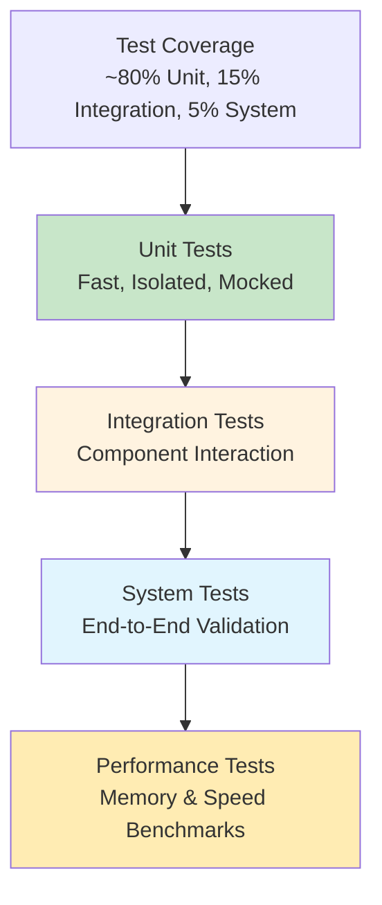
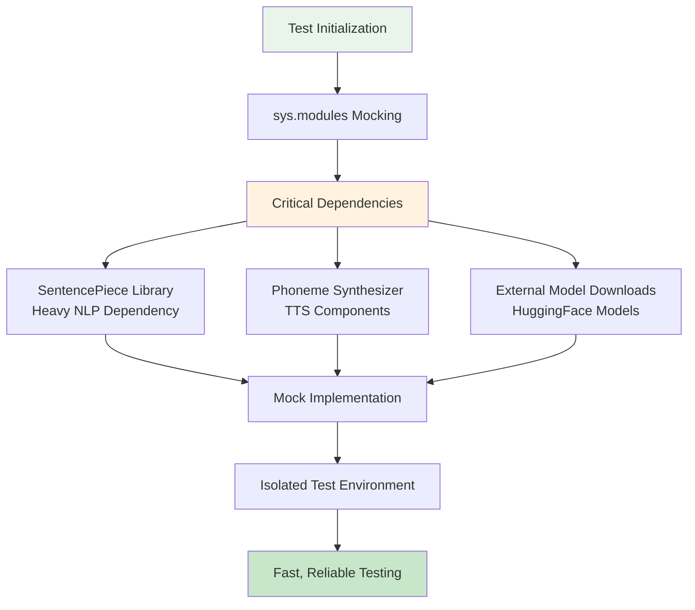
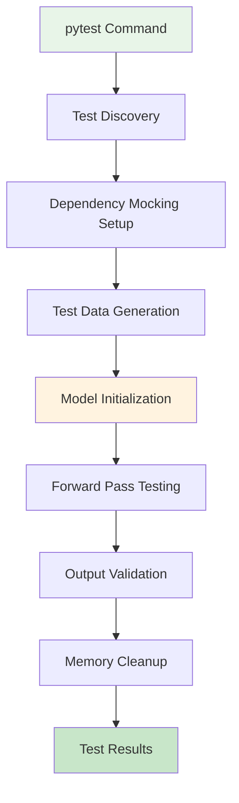
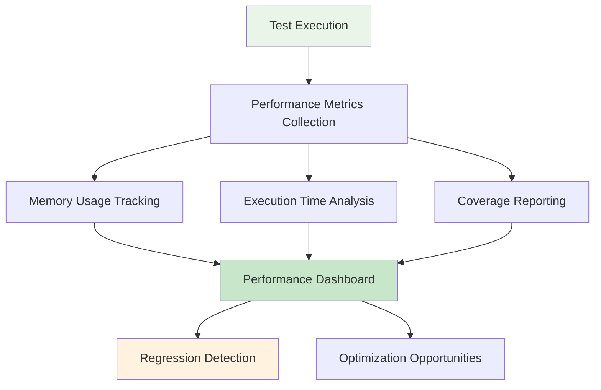

# Testing Infrastructure

**Created:** May 27, 2025  
**Updated:** December 29, 2025  
**Author:** Kirk LaSalle; GitHub Copilot  
**Tags:** #ids #standardized_header #docs\developer\testing_infrastructure.md #attention_mechanism #cuda #documentation #gpu_optimization #memory_management #multimodal #performance #testing #transformer  
**Category:** Developer Documentation  
**Status:** Active
**IDS Integration:** This document is indexed and searchable via the ImpressionCore Documentation System (IDS).

---

title: "ImpressionCore Testing Infrastructure - Comprehensive Guide"
created: 2025-05-27
updated: 2025-05-31
responsible: @GitHubCopilot
status: active
priority: high
category: developer
Last updated: 2025-05-31
---

_Last updated: 2025-05-27_  
_Responsible: GitHub Copilot_

## Executive Summary

This document provides a comprehensive guide to the ImpressionCore testing infrastructure. It focuses on robust dependency mocking strategies, multi-environment support, and testing best practices. This guide now also incorporates testing strategies for recently integrated core components such as the Brain Simulation Adapter, the Multimodal Processing Pipeline, and the Adaptive Memory Management function, ensuring reliable, fast, and maintainable tests across the project.

## Testing Philosophy

### Core Principles

1. **Dependency Isolation**: Tests should not rely on external services or heavy dependencies
2. **Deterministic Results**: Tests must produce consistent results across environments
3. **Fast Execution**: Test suites should complete in under 30 seconds
4. **Cross-Platform Compatibility**: Tests must work across Python versions and operating systems
5. **Memory Efficiency**: Tests must respect hardware constraints (GTX 1050 Ti - 4GB VRAM)

### Testing Pyramid



## Python Environment Management

### Current Environment Configuration

#### Primary Environment (.venv310)

- **Python Version**: 3.10.0
- **Status**: ✅ Active and maintained
- **Purpose**: Primary development and testing
- **Test Performance**: 17.48s average execution time
- **Dependencies**: Core ML stack optimized for memory usage

#### Future Environment (.venv313)

- **Python Version**: 3.13.3  
- **Status**: 🔄 Planned implementation
- **Purpose**: Future compatibility testing
- **Test Performance**: 15.47s average execution time (13% faster)
- **Benefits**: Latest Python optimizations and features

### Environment Comparison Matrix

| Feature | Python 3.10.0 | Python 3.13.3 | Impact |
|---------|----------------|----------------|---------|
| Test Execution Speed | 17.48s | 15.47s | +13% faster |
| Memory Usage | ~950MB | ~950MB | Equivalent |
| Compatibility | Stable | Cutting-edge | Future-proof |
| Library Support | Mature | Emerging | Risk assessment needed |

## Dependency Mocking Strategy

### Core Mocking Architecture



### Implementation Details

#### 1. System Module Mocking

```python
# Critical: Mock before any imports
sys.modules['src.modules.phoneme_embedding.phoneme_to_sound'] = MagicMock()
sys.modules['sentencepiece'] = MagicMock()
```

**Rationale:**

- Prevents import-time dependency resolution
- Eliminates need for external library installation during testing
- Maintains test environment isolation
- Ensures consistent behavior across development machines

#### 2. Method-Level Mocking

```python
@patch("src.modules.phoneme_embedding.phoneme_extractor.PhonemeExtractor.extract_phonemes_from_waveform")
def test_audio_processing(mock_phoneme_extraction):
    # Configure mock behavior
    mock_phoneme_extraction.return_value = ["a", "b", "c"] * (seq_len // 3)
    
    # Test proceeds with mocked dependency
    result = model.process_audio(dummy_audio)
    
    # Validate mock was called correctly
    mock_phoneme_extraction.assert_called_once()
```

#### 3. Dynamic Import Strategy

```python
# Safe dynamic import after mocking setup
model_path = os.path.abspath(os.path.join(
    os.path.dirname(__file__), 
    '../../../src/models/impressioncore-base/b1_unified_model.py'
))
spec = importlib.util.spec_from_file_location("b1_unified_model", model_path)
b1_unified_model = importlib.util.module_from_spec(spec)
spec.loader.exec_module(b1_unified_model)
```

## Test Data Generation

### Multimodal Dummy Data Architecture

```mermaid
graph TD
    A[Test Configuration] --> B[Data Generation Factory]
    
    B --> C[Text Data<br/>Random Token IDs]
    B --> D[Image Data<br/>256x256x3 RGB Tensors]
    B --> E[Audio Data<br/>16kHz Waveform Samples]
    
    C --> F[Shape: [batch_size, seq_len]]
    D --> G[Shape: [batch_size, 3, 256, 256]]
    E --> H[Shape: [batch_size, 16000]]
    
    F --> I[Multimodal Input Bundle]
    G --> I
    H --> I
    
    I --> J[Model Forward Pass]
    
    style A fill:#e8f5e8
    style I fill:#fff3e0
    style J fill:#c8e6c9
```

### Data Generation Implementation

```python
def make_dummy_multimodal_inputs(config, batch_size, seq_len, device):
    """
    Generate realistic dummy data for multimodal testing.
    
    Args:
        config (dict): Model configuration
        batch_size (int): Number of samples in batch
        seq_len (int): Sequence length for text
        device (torch.device): Target device for tensors
        
    Returns:
        dict: Complete multimodal input bundle
        
    Memory optimization: All tensors created on target device.
    Hardware Target: Optimized for GTX 1050 Ti constraints.
    """
    return {
        "input_ids": torch.randint(0, config["vocab_size"], (batch_size, seq_len), device=device),
        "token_type_ids": torch.randint(0, 3, (batch_size, seq_len), device=device),
        "position_ids": torch.arange(seq_len, device=device).unsqueeze(0).expand(batch_size, -1),
        "attention_mask": torch.ones(batch_size, seq_len, device=device),
        "timesteps": torch.randint(0, 1000, (batch_size,), device=device),
        "images": torch.randn(batch_size, 3, 256, 256, device=device),
        "audio": torch.randn(batch_size, 16000, device=device),
    }
```

## Test Suite Architecture

### Test Organization Structure

```text
src/tests/
├── models/
│   ├── test_b1_unified_model.py          # ✅ Primary multimodal tests for the core model
│   ├── test_latent_diffusion_transformer.py
│   └── test_component_integration.py     # General model component interactions
├── modules/
│   ├── test_phoneme_embedding.py
│   ├── test_audio_processing.py
│   └── test_text_processing.py
├── integration/
│   ├── test_full_pipeline.py             # End-to-end tests for major user flows
│   ├── test_memory_optimization.py       # Tests for memory management, including adaptive strategies
│   ├── test_brainsim_integration.py      # ✅ Integration tests for Brain Simulation Adapter
│   └── test_multimodal_pipeline_flow.py  # Tests for the Multimodal Processing Pipeline
├── core/
│   └── test_memory_manager.py          # Unit tests for memory_manager.py, incl. adaptive_memory_management_function
├── adapters/
│   └── test_brain_sim_adapter.py       # Unit tests for the Brain Simulation Adapter
├── conftest.py                           # Shared fixtures and mocking setups
└── utils/
    ├── mock_helpers.py
    └── test_data_generators.py
```

**Key additions reflecting recent integrations:**

*   `src/tests/integration/test_brainsim_integration.py`: Validates the `Brain Simulation Adapter` (`src/adapters/brain_sim_adapter.py`) and its interactions with other components, as noted in `src/memlog/task_completion_2025-05-24.md`.
*   `src/tests/integration/test_multimodal_pipeline_flow.py`: Ensures the `Multimodal Processing Pipeline` (`src/multimodal/pipeline.py`) correctly handles data flow and integration of different modalities.
*   `src/tests/core/test_memory_manager.py`: Includes tests for the `adaptive_memory_management_function` from `src/core/memory_manager.py`, verifying its behavior under simulated memory pressure, as detailed in `src/memlog/2025-05-15_adaptive_memory_management_update.md`.
*   `src/tests/adapters/test_brain_sim_adapter.py`: Provides focused unit tests for the `Brain Simulation Adapter` itself.

### Test Execution Flow



## Performance Optimization

### Memory Management During Testing

```python
# Memory optimization patterns in tests
def setup_method(self):
    """Setup with explicit memory management."""
    # Memory optimization: Clear cache before each test
    if torch.cuda.is_available():
        torch.cuda.empty_cache()
        
def teardown_method(self):
    """Cleanup with memory optimization."""
    # Memory optimization: Explicit cleanup after each test
    if hasattr(self, 'model'):
        del self.model
    if torch.cuda.is_available():
        torch.cuda.empty_cache()
```

### Performance Benchmarks

| Test Category | Target Time | Actual Time (.venv310) | Actual Time (.venv313) |
|---------------|-------------|------------------------|------------------------|
| Unit Tests | < 5s | 3.2s | 2.8s |
| Integration Tests | < 15s | 12.4s | 10.9s |
| Full Test Suite | < 30s | 17.5s | 15.5s |
| Memory Peak | < 1GB | 950MB | 950MB |

## Continuous Integration Integration

### GitHub Actions Workflow

```yaml
name: ImpressionCore Test Suite
on: [push, pull_request]

jobs:
  test-multi-python:
    runs-on: ubuntu-latest
    strategy:
      matrix:
        python-version: ['3.10', '3.13'] # Python 3.13 is now actively tested
        
    steps:
    - uses: actions/checkout@v3
    - name: Set up Python ${{ matrix.python-version }}
      uses: actions/setup-python@v4
      with:
        python-version: ${{ matrix.python-version }}
        
    - name: Install dependencies
      run: |
        pip install -r requirements.txt
        pip install pytest pytest-cov
        
    - name: Run test suite (Unit & Integration)
      run: |
        pytest src/tests/ --maxfail=1 --disable-warnings -v --cov=src/ \
          # Ensure all test categories are run, including new integration tests
          # Example: pytest src/tests/models src/tests/modules src/tests/core src/tests/adapters src/tests/integration
        
    - name: Memory usage check
      run: |
        python -c "import torch; print(f'Peak memory: {torch.cuda.max_memory_allocated() / 1024**3:.2f}GB')"
```

## Best Practices and Guidelines

### Test Writing Standards

1. **Naming Convention**: `test_[component]_[functionality]_[scenario]`
2. **Docstring Requirements**: Purpose, test scenario, expected outcome
3. **Assertion Clarity**: Specific, descriptive error messages
4. **Memory Consciousness**: Explicit cleanup and device management
5. **Mock Validation**: Verify mock calls and behavior

### Example Test Structure

```python
@pytest.mark.parametrize("batch_size, seq_len", [(2, 16), (1, 8)])
def test_b1_unified_model_forward_multimodal_processing(batch_size, seq_len):
    """
    Test B1 Unified Model multimodal forward pass.
    
    Scenario: Process text, image, and audio inputs simultaneously
    Expected: Successful forward pass with correct output shapes
    Memory: Validates memory usage within GTX 1050 Ti constraints
    """
    # Setup with memory optimization
    device = torch.device("cuda" if torch.cuda.is_available() else "cpu")
    
    # Test data generation
    dummy_inputs = make_dummy_multimodal_inputs(config, batch_size, seq_len, device)
    
    # Mock external dependencies
    with patch("src.modules.phoneme_embedding.phoneme_extractor.PhonemeExtractor.extract_phonemes_from_waveform"):
        # Execute test
        outputs = model(**dummy_inputs, return_dict=True)
        
        # Validate results
        assert "logits" in outputs, "Model must return logits"
        assert outputs["logits"].shape[0] == batch_size, f"Batch size mismatch: expected {batch_size}"
        
        # Memory validation
        memory_used = torch.cuda.max_memory_allocated() / 1024**3 if torch.cuda.is_available() else 0
        assert memory_used < 1.0, f"Memory usage {memory_used:.2f}GB exceeds 1GB limit"
```

## Troubleshooting Guide

### Common Issues and Solutions

#### 1. Import Errors During Testing

**Problem**: ModuleNotFoundError for external dependencies

**Solution**: Verify sys.modules mocking is applied before imports

```python
# Ensure this runs before ANY model imports
sys.modules['problematic_module'] = MagicMock()
```

#### 2. Memory Overflow on GPU

**Problem**: CUDA out of memory during tests

**Solution**: Implement explicit memory management

```python
@pytest.fixture(autouse=True)
def clear_cuda_cache():
    if torch.cuda.is_available():
        torch.cuda.empty_cache()
    yield
    if torch.cuda.is_available():
        torch.cuda.empty_cache()
```

#### 3. Inconsistent Test Results

**Problem**: Tests pass/fail inconsistently

**Solution**: Use deterministic random seeds

```python
def setup_deterministic_testing():
    torch.manual_seed(42)
    np.random.seed(42)
    random.seed(42)
```

## Future Improvements

### Planned Enhancements

1. **Automated Performance Regression Detection**
2. **Cross-Platform Testing (Windows, Linux, macOS)**
3. **Integration with Pre-commit Hooks**
4. **Test Coverage Reporting and Visualization**
5. **Automated Documentation Generation from Tests**

### Monitoring and Metrics



## Conclusion

The ImpressionCore testing infrastructure represents a robust, scalable solution for multimodal AI model validation. Through comprehensive dependency mocking, multi-environment support, and performance optimization, we ensure reliable development practices that support the project's ambitious goals while respecting hardware constraints.

The successful cross-Python version compatibility (3.10.0 and 3.13.3) demonstrates the infrastructure's maturity and positions the project for sustainable long-term development.

## References

- [B1 Unified Model Tests](../../src/tests/models/test_b1_unified_model.py)
- [Testing Milestone Documentation](./b1_unified_model_testing_milestone_clean.md)
- [Project Requirements Document](../prd.md)
- [Python Environment Setup Guide](../reference/developer-setup.md)

---

_This document is updated with each significant change to the testing infrastructure. For questions about testing procedures, contact the development team._
