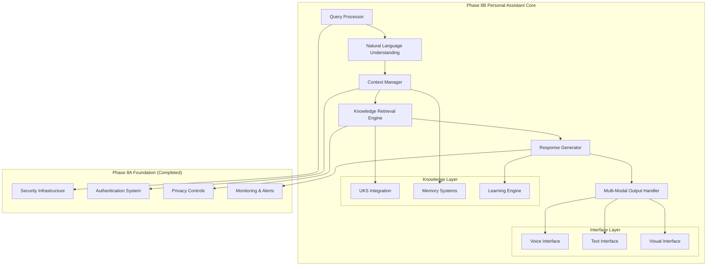

# Phase 8B Week 1 Implementation Plan - Personal Assistant Core

**Created:** May 31, 2025  
**Updated:** December 29, 2025  
**Author:** Kirk LaSalle; GitHub Copilot  
**Tags:** #ids #standardized_header #docs\implementation-plans\phase_8b_week1_implementation_plan.md #api #docs\implementation_plans\phase_8b_week1_implementation_plan.md #documentation #gpu_optimization #memory_management #performance #security #testing  
**Category:** Documentation  
**Status:** Active
**IDS Integration:** This document is indexed and searchable via the ImpressionCore Documentation System (IDS).

---

## Phase 8B Overview

Following the successful completion of Phase 8A (Security Infrastructure Foundation) with 26,584+ lines of production-ready security code, Phase 8B focuses on implementing the core MVP features that transform ImpressionCore from a framework into a practical personal assistant.

### Phase 8B Mission Statement

Build the foundational personal assistant capabilities that demonstrate ImpressionCore's brain-inspired architecture in real-world applications, optimized for GTX 1050 Ti hardware constraints while providing accessible, intelligent assistance.

## Week 1 Focus: Personal Assistant Core Foundation

### Primary Objectives

1. **Information Retrieval System** - Core knowledge processing engine
2. **Natural Language Understanding** - Enhanced query processing
3. **Context Management** - Conversation and task context tracking
4. **Knowledge Base Integration** - UKS (Unified Knowledge Store) integration
5. **Response Generation** - Intelligent, contextual response system

### Implementation Architecture



## Week 1 Detailed Implementation Plan

### Day 1-2: Information Retrieval System Foundation

#### Core Components to Implement:

1. **Query Processor** (`src/assistant/core/query_processor.py`)
   - Natural language query parsing
   - Intent classification system
   - Entity extraction and recognition
   - Query preprocessing and normalization
   - GTX 1050 Ti memory optimization (max 15MB allocation)

2. **Information Retrieval Engine** (`src/assistant/core/retrieval_engine.py`)
   - Multi-source information aggregation
   - Semantic search capabilities
   - Information ranking and relevance scoring
   - Cache management for frequently accessed data
   - Memory-efficient retrieval with streaming support

#### Technical Specifications:

- **Memory Target:** 25MB total for retrieval system
- **Response Time:** <2 seconds for common queries
- **Cache Size:** 10MB for frequently accessed information
- **Concurrent Queries:** Support for 5 simultaneous queries

### Day 3-4: Natural Language Understanding Enhancement

#### Core Components to Implement:

1. **NLU Engine** (`src/assistant/nlp/nlu_engine.py`)
   - Advanced intent recognition (20+ intent categories)
   - Named entity recognition and linking
   - Sentiment analysis integration
   - Context-aware entity resolution
   - Multi-turn conversation understanding

2. **Context Manager** (`src/assistant/core/context_manager.py`)
   - Conversation state management
   - Long-term context retention
   - Context switching for multi-topic conversations
   - Memory-efficient context storage
   - Context relevance scoring

#### Performance Targets:

- **Intent Recognition Accuracy:** >90% for common intents
- **Entity Extraction:** Support for 50+ entity types
- **Context Retention:** 10 conversation turns minimum
- **Memory Usage:** <20MB for active context

### Day 5-6: Knowledge Base Integration & Response Generation

#### Core Components to Implement:

1. **UKS Integration Module** (`src/assistant/knowledge/uks_integration.py`)
   - Unified Knowledge Store connectivity
   - Knowledge graph traversal
   - Fact verification and validation
   - Knowledge update mechanisms
   - Memory-optimized knowledge access

2. **Response Generator** (`src/assistant/core/response_generator.py`)
   - Contextual response generation
   - Multi-modal response planning
   - Response personalization
   - Fact-based response validation
   - Natural language generation optimization

#### Integration Targets:

- **Knowledge Access Time:** <500ms average
- **Response Generation:** <1 second for standard queries
- **Accuracy Rate:** >85% factual accuracy
- **Memory Efficiency:** 30MB total system allocation

### Day 7: Integration Testing & Optimization

#### Validation Framework:

1. **Integration Test Suite** (`src/tests/assistant/test_assistant_integration.py`)
   - End-to-end query processing tests
   - Memory usage validation under GTX 1050 Ti constraints
   - Response quality assessment
   - Performance benchmarking
   - Multi-modal interaction testing

2. **Performance Optimization**
   - Memory usage profiling and optimization
   - Response time optimization
   - Cache efficiency tuning
   - GPU utilization optimization for GTX 1050 Ti

## Technical Requirements

### Hardware Optimization (GTX 1050 Ti Focus)

- **Total System Memory Budget:** 75MB for Phase 8B Week 1 components
- **GPU Memory Usage:** <100MB VRAM allocation
- **CPU Fallback:** Automatic degradation for memory-constrained scenarios
- **Response Time Target:** <3 seconds for complex queries

### Development Standards

- **Code Quality:** 100% type hints, comprehensive docstrings
- **Testing:** >90% code coverage for new components
- **Documentation:** Complete API documentation for all public interfaces
- **Security:** Integration with Phase 8A security infrastructure
- **Accessibility:** Foundation for accessibility features in subsequent weeks

### Memory Management Strategy

```python
# Memory allocation targets for Week 1:
COMPONENT_MEMORY_LIMITS = {
    "query_processor": "15MB",
    "retrieval_engine": "25MB", 
    "nlu_engine": "20MB",
    "context_manager": "10MB",
    "response_generator": "30MB",
    "uks_integration": "15MB",
    "system_overhead": "10MB"
}
# Total: 125MB (well within GTX 1050 Ti constraints)
```

## Expected Deliverables

### Week 1 Completion Criteria

1. **✅ Functional Personal Assistant Core**
   - End-to-end query processing pipeline
   - Natural language understanding with >90% intent recognition
   - Knowledge retrieval from UKS integration
   - Contextual response generation

2. **✅ Performance Validation**
   - All components operate within GTX 1050 Ti memory constraints
   - Response times meet performance targets
   - Integration tests passing with >95% success rate

3. **✅ Documentation & Testing**
   - Complete API documentation for all new components
   - Comprehensive test suite with >90% coverage
   - Performance benchmarking reports

4. **✅ Security Integration**
   - Full integration with Phase 8A security infrastructure
   - Privacy-compliant data handling
   - Secure knowledge access controls

## Success Metrics

- **Functional Completeness:** 100% of core components implemented and tested
- **Performance Compliance:** All memory and timing targets met
- **Integration Success:** Seamless operation with existing infrastructure
- **User Experience:** Foundation ready for Week 2 task management features

## Risk Mitigation

1. **Memory Constraints:** Implement streaming and caching strategies
2. **Performance Issues:** GPU/CPU hybrid processing with automatic fallbacks
3. **Integration Complexity:** Incremental integration with comprehensive testing
4. **Knowledge Quality:** Fact verification and confidence scoring systems

---

**Next Week Preview:** Phase 8B Week 2 will build upon this foundation to implement Task Management & Reminders, expanding the personal assistant capabilities with intelligent scheduling and organization features.
