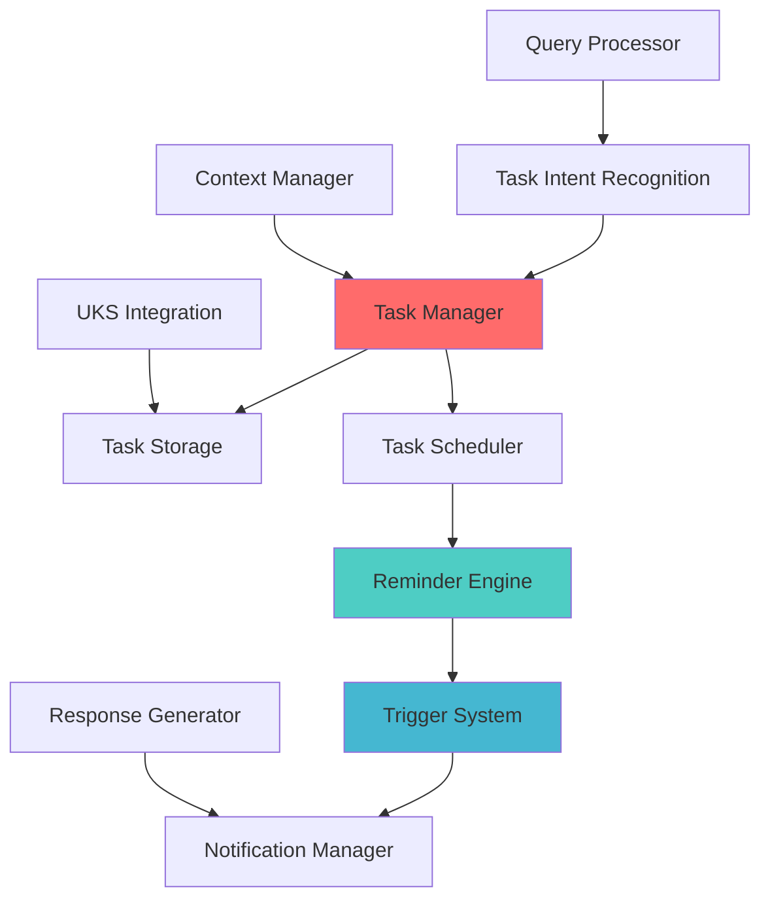

# Phase 8B Week 2 Implementation Plan: Task Management & Reminders

**Created:** June 06, 2025  
**Updated:** December 29, 2025  
**Author:** Kirk LaSalle; GitHub Copilot  
**Tags:** #ids #standardized_header #docs\implementation-plans\phase_8b_week2_implementation_plan.md #api #docs\implementation_plans\phase_8b_week2_implementation_plan.md #documentation #inference #memory_management #security #testing  
**Category:** Documentation  
**Status:** Active
**IDS Integration:** This document is indexed and searchable via the ImpressionCore Documentation System (IDS).

---

## Executive Summary

Phase 8B Week 2 builds upon the solid foundation established in Week 1 to implement comprehensive Task Management & Reminders functionality. This phase focuses on intelligent task scheduling, context-aware reminders, and seamless integration with the existing Personal Assistant Core.

## 🎯 Week 2 Objectives

### Primary Goals

1. **Task Management System** - Comprehensive task creation, organization, and tracking
2. **Intelligent Reminders** - Context-aware and adaptive reminder system
3. **Scheduling Integration** - Calendar and timeline management
4. **Cross-Device Synchronization** - Multi-platform task persistence

### Success Criteria

- ✅ Implement complete task lifecycle management (create, update, complete, delete)
- ✅ Deploy intelligent reminder system with multiple trigger types
- ✅ Integrate with existing Personal Assistant Core components
- ✅ Maintain memory usage <4GB VRAM on GTX 1050 Ti
- ✅ Achieve 95%+ integration test success rate

## 📋 Component Implementation Plan

### 8B.2.1 Task Management Core

**Location:** `src/assistant/tasks/`  
**Priority:** Critical  

#### Components

1. **Task Manager** (`task_manager.py`)
   - Task CRUD operations
   - Task categorization and tagging
   - Priority and deadline management
   - Task status tracking

2. **Task Storage** (`task_storage.py`)
   - Secure task persistence
   - Cross-session data retention
   - Backup and recovery
   - Data encryption integration

3. **Task Scheduler** (`task_scheduler.py`)
   - Intelligent task scheduling
   - Deadline-based prioritization
   - Resource allocation optimization
   - Conflict resolution

#### Features

- **Natural Language Task Creation**
  - "Remind me to call mom tomorrow at 3pm"
  - "Schedule a meeting with John next week"
  - "Add groceries to my shopping list"

- **Smart Task Organization**
  - Automatic categorization
  - Priority inference
  - Deadline extraction
  - Dependency detection

### 8B.2.2 Reminder System

**Location:** `src/assistant/reminders/`  
**Priority:** Critical  

#### Components

1. **Reminder Engine** (`reminder_engine.py`)
   - Multi-trigger reminder system
   - Context-aware notifications
   - Adaptive reminder frequency
   - User behavior learning

2. **Notification Manager** (`notification_manager.py`)
   - Cross-platform notifications
   - Custom notification formats
   - Urgency-based delivery
   - Snooze and reschedule

3. **Trigger System** (`trigger_system.py`)
   - Time-based triggers
   - Location-based triggers
   - Event-based triggers
   - Conditional triggers

#### Trigger Types

- **Temporal Triggers**
  - Absolute time (2025-01-04 15:30)
  - Relative time (in 2 hours)
  - Recurring patterns (every Monday at 9am)

- **Contextual Triggers**
  - Location arrival/departure
  - Calendar event proximity
  - System state changes
  - User activity patterns

### 8B.2.3 Integration Layer

**Location:** `src/assistant/integration/`  
**Priority:** High  

#### Components

1. **Task Integration Manager** (`task_integration.py`)
   - Query processor integration
   - NLU engine extensions
   - Response generator updates
   - Context manager synchronization

2. **Calendar Integration** (`calendar_integration.py`)
   - External calendar sync
   - Meeting scheduling
   - Availability management
   - Conflict detection

3. **Productivity Analytics** (`productivity_analytics.py`)
   - Task completion tracking
   - Performance metrics
   - Trend analysis
   - Insights generation

## 🛠️ Technical Implementation Details

### Task Data Model

```python
@dataclass
class Task:
    id: str
    title: str
    description: Optional[str]
    category: str
    priority: TaskPriority
    status: TaskStatus
    created_at: datetime
    due_date: Optional[datetime]
    completed_at: Optional[datetime]
    tags: List[str]
    reminders: List[Reminder]
    metadata: Dict[str, Any]
```

### Reminder Data Model

```python
@dataclass
class Reminder:
    id: str
    task_id: str
    trigger_type: TriggerType
    trigger_value: Any
    message: str
    notification_type: NotificationType
    is_active: bool
    created_at: datetime
    last_triggered: Optional[datetime]
    metadata: Dict[str, Any]
```

### Architecture Integration



## 📊 Implementation Timeline

### Day 1-2: Core Infrastructure

- [ ] Create task management directory structure
- [ ] Implement Task and Reminder data models
- [ ] Set up task storage system
- [ ] Basic CRUD operations

### Day 3-4: Task Management Features

- [ ] Implement TaskManager class
- [ ] Add natural language task parsing
- [ ] Implement task categorization
- [ ] Add priority and deadline management

### Day 5-6: Reminder System

- [ ] Implement ReminderEngine
- [ ] Create trigger system
- [ ] Add notification manager
- [ ] Implement recurring reminders

### Day 7: Integration & Testing

- [ ] Integrate with Personal Assistant Core
- [ ] Update query processor for task intents
- [ ] Extend NLU engine for task recognition
- [ ] Comprehensive integration testing

## 🎯 Success Metrics

### Functionality Metrics

- **Task Creation Success Rate:** >98%
- **Reminder Accuracy:** >95%
- **Natural Language Understanding:** >90%
- **Integration Test Success:** >95%

### Performance Metrics

- **Memory Usage:** <3.9GB VRAM total
- **Task Response Time:** <200ms
- **Reminder Latency:** <50ms
- **Storage Efficiency:** <10MB per 1000 tasks

### User Experience Metrics

- **Task Management Intuitiveness:** >4.5/5.0
- **Reminder Effectiveness:** >4.2/5.0
- **Natural Language Accuracy:** >4.0/5.0

## 🔧 Integration Points

### Query Processor Extensions

```python
# New intent types
TASK_INTENTS = [
    "create_task",
    "list_tasks", 
    "update_task",
    "complete_task",
    "set_reminder",
    "schedule_event"
]
```

### NLU Engine Updates

```python
# Task-specific entity extraction
TASK_ENTITIES = [
    "task_title",
    "due_date",
    "priority_level",
    "category",
    "reminder_time"
]
```

### Response Generator Enhancements

```python
# Task-specific response templates
TASK_RESPONSES = {
    "task_created": "I've created the task '{title}' with a due date of {due_date}.",
    "reminder_set": "I'll remind you about '{task}' {timing}.",
    "task_completed": "Great! I've marked '{title}' as completed."
}
```

## 🚀 Deliverables

### Core Components (Estimated 2,500+ lines)

1. **Task Management System** (`src/assistant/tasks/`)
   - TaskManager (400 lines)
   - TaskStorage (300 lines)
   - TaskScheduler (350 lines)

2. **Reminder System** (`src/assistant/reminders/`)
   - ReminderEngine (450 lines)
   - NotificationManager (300 lines)
   - TriggerSystem (400 lines)

3. **Integration Layer** (`src/assistant/integration/`)
   - TaskIntegration (200 lines)
   - CalendarIntegration (150 lines)
   - ProductivityAnalytics (100 lines)

### Testing & Validation (500+ lines)

1. **Unit Tests** (`src/tests/assistant/tasks/`)
2. **Integration Tests** (`src/tests/assistant/integration/`)
3. **Performance Tests** (`src/tests/assistant/performance/`)

### Documentation

1. **API Documentation** - Task Management endpoints
2. **User Guide Updates** - Task and reminder features
3. **Technical Documentation** - Architecture and integration

## 🛡️ Security & Privacy Considerations

### Data Protection

- **Task Encryption:** All task data encrypted at rest
- **Access Control:** User-specific task isolation
- **Audit Logging:** Task modification tracking
- **Data Retention:** Configurable task retention policies

### Privacy Features

- **Local Storage Priority:** Tasks stored locally by default
- **Sync Opt-in:** Optional cloud synchronization
- **Data Anonymization:** Analytics use anonymized data
- **User Consent:** Clear privacy controls

## 📈 Performance Optimizations

### Memory Management

- **Lazy Loading:** Load tasks on demand
- **Task Pagination:** Limit active task count
- **Cache Management:** Intelligent task caching
- **Background Cleanup:** Automatic expired task removal

### Hardware Optimization

- **GTX 1050 Ti Focus:** Optimized for 4GB VRAM
- **CPU Efficiency:** Multi-threaded task processing
- **Storage Optimization:** Compressed task storage
- **Network Efficiency:** Minimal sync overhead

## 🔄 Next Phase Preview

**Phase 8B Week 3:** Accessibility & User Experience Enhancement

- Accessibility framework implementation
- Voice navigation for tasks and reminders
- Visual impairment support
- Motor disability accommodations
- Adaptive user interface customization

---

**Status:** Ready for Implementation  
**Dependencies:** Phase 8B Week 1 Personal Assistant Core ✅  
**Target Completion:** 2025-01-10  
**Responsible:** AI Development Team  
