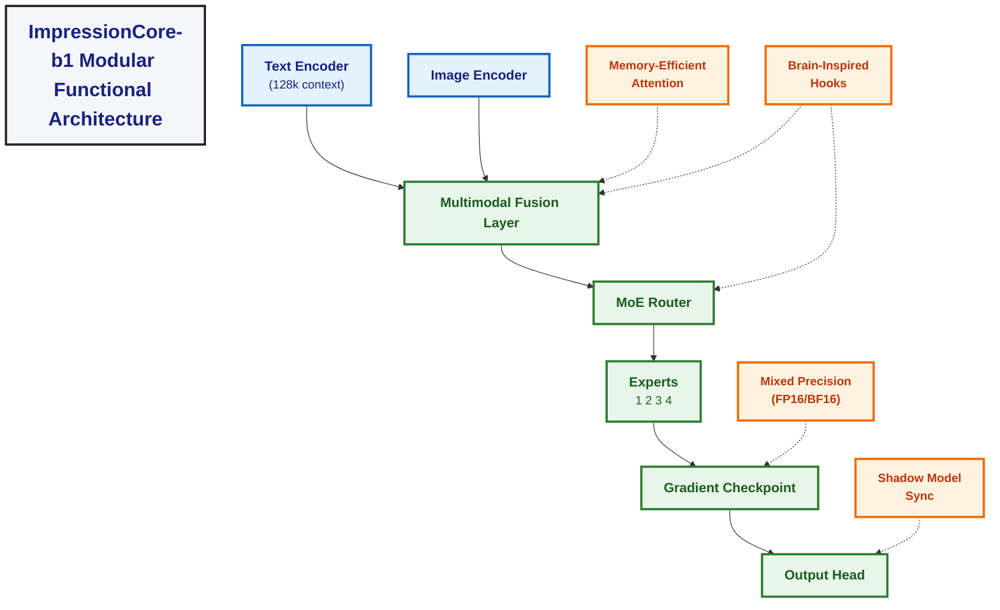

```markdown


## Web Server and User Interface Integration (2025-04-19)

### Overview
ImpressionCore-b1 includes a modular web server and user interface designed to streamline model management, inference, and knowledge interaction. The web server is implemented in Flask with support for WebSockets, secure file uploads, and robust logging. The UI, built with Bootstrap, provides a chat interface and a knowledge management panel, serving as a guided walkthrough for users.

### Key Features
- **Model Management:**
  - Models are loaded from disk using PyTorch, with a global cache and thread lock for efficiency and thread safety.
  - The system supports multiple models and exposes endpoints for model metadata and management.
- **API & Routing:**
  - REST and WebSocket endpoints for chat, training, inference, and knowledge management.
  - Secure session and file handling, hardware validation, and integration with training and inference modules.
- **User Interface:**
  - Responsive, menu-driven UI with chat and knowledge management panels.
  - Users can interact with the LLM, add/query knowledge, and follow a guided workflow.

### Integration Points
- The web server interfaces directly with model loading, inference, and training modules in `/src`.
- The UI is designed to be extensible, supporting future steps such as data selection, model configuration, training progress, and evaluation.

### Gaps & Recommendations
- **Walkthrough Expansion:** The current menu system covers chat and knowledge management. It should be expanded to include:
  1. Data selection and upload
  2. Model configuration (architecture, memory settings)
  3. Training progress and controls
  4. Evaluation and benchmarking
  5. Model export and deployment
- **Documentation:**
  - Update API and UI documentation as new features are added.
  - Maintain a living document (see `docs/web_interface.md`) for technical details and user guidance.

### See Also
- [docs/web_interface.md](web_interface.md) for a detailed technical overview and actionable recommendations.

---
