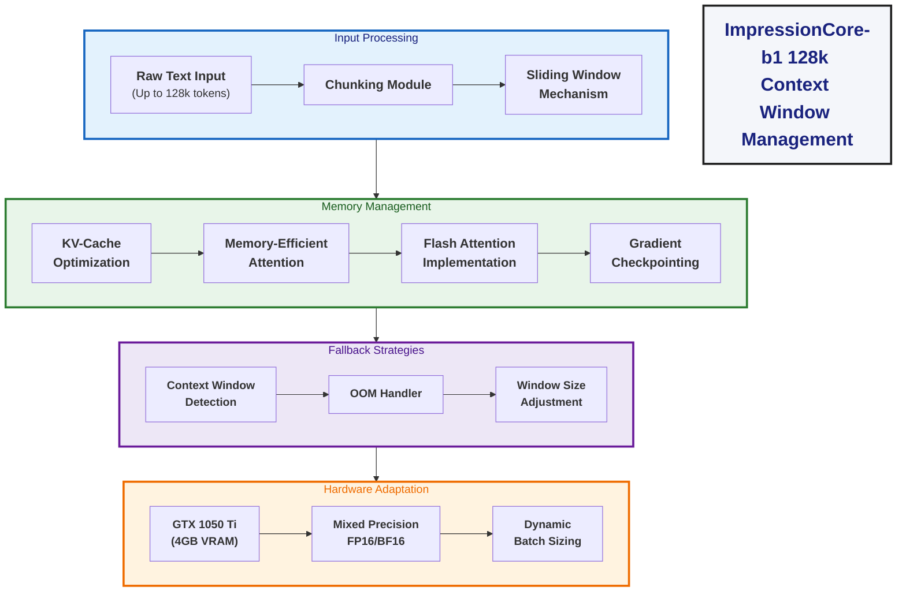

```mermaid
%% ImpressionCore-b1 128k Context Window Technical Architecture (Professional)
flowchart TD
    %% Title
    title[ImpressionCore-b1 128k Context Window Management]
    style title fill:#f4f6fa,stroke:#222,stroke-width:3px,font-size:26px,font-weight:bold,color:#1a237e

    %% Input Processing
    subgraph InputProcessing["Input Processing"]
        TextInput["<b style='color:#1565c0;font-size:18px;'>Raw Text Input</b><br><span style='color:#333;font-size:14px;'>(Up to 128k tokens)</span>"]
        ChunkingModule["<b style='color:#1565c0;font-size:18px;'>Chunking Module</b>"]
        SlidingWindow["<b style='color:#1565c0;font-size:18px;'>Sliding Window<br>Mechanism</b>"]
        TextInput --> ChunkingModule
        ChunkingModule --> SlidingWindow
    end

    %% Memory Management
    subgraph MemoryManagement["Memory Management"]
        KVCache["<b style='color:#2e7d32;font-size:18px;'>KV-Cache<br>Optimization</b>"]
        AttentionMechanism["<b style='color:#2e7d32;font-size:18px;'>Memory-Efficient<br>Attention</b>"]
        FlashAttention["<b style='color:#2e7d32;font-size:18px;'>Flash Attention<br>Implementation</b>"]
        GradCheckpointing["<b style='color:#2e7d32;font-size:18px;'>Gradient<br>Checkpointing</b>"]
        KVCache --> AttentionMechanism
        AttentionMechanism --> FlashAttention
        FlashAttention --> GradCheckpointing
    end

    %% Fallback Strategies
    subgraph FallbackStrategies["Fallback Strategies"]
        ContextDetection["<b style='color:#6a1b9a;font-size:16px;'>Context Window<br>Detection</b>"]
        OOMHandler["<b style='color:#6a1b9a;font-size:16px;'>OOM Handler</b>"]
        WindowResize["<b style='color:#6a1b9a;font-size:16px;'>Window Size<br>Adjustment</b>"]
        ContextDetection --> OOMHandler
        OOMHandler --> WindowResize
    end

    %% Hardware Adaptation
    subgraph HardwareAdapt["Hardware Adaptation"]
        GTX1050["<b style='color:#ef6c00;font-size:16px;'>GTX 1050 Ti<br>(4GB VRAM)</b>"]
        MixedPrecision["<b style='color:#ef6c00;font-size:16px;'>Mixed Precision<br>FP16/BF16</b>"]
        BatchSizeOpt["<b style='color:#ef6c00;font-size:16px;'>Dynamic<br>Batch Sizing</b>"]
        GTX1050 --> MixedPrecision
        MixedPrecision --> BatchSizeOpt
    end

    %% Main Flow
    InputProcessing --> MemoryManagement
    MemoryManagement --> FallbackStrategies
    FallbackStrategies --> HardwareAdapt

    %% Styling
    classDef input fill:#e3f2fd,stroke:#1565c0,stroke-width:3px,color:#1a237e,font-size:16px
    classDef memory fill:#e8f5e9,stroke:#2e7d32,stroke-width:3px,color:#1b5e20,font-size:16px
    classDef fallback fill:#ede7f6,stroke:#6a1b9a,stroke-width:3px,color:#4a148c,font-size:16px
    classDef hardware fill:#fff3e0,stroke:#ef6c00,stroke-width:3px,color:#ef6c00,font-size:16px
    classDef title fill:#f4f6fa,stroke:#222,stroke-width:3px,font-size:26px,font-weight:bold,color:#1a237e

    class InputProcessing input
    class MemoryManagement memory
    class FallbackStrategies fallback
    class HardwareAdapt hardware
```
