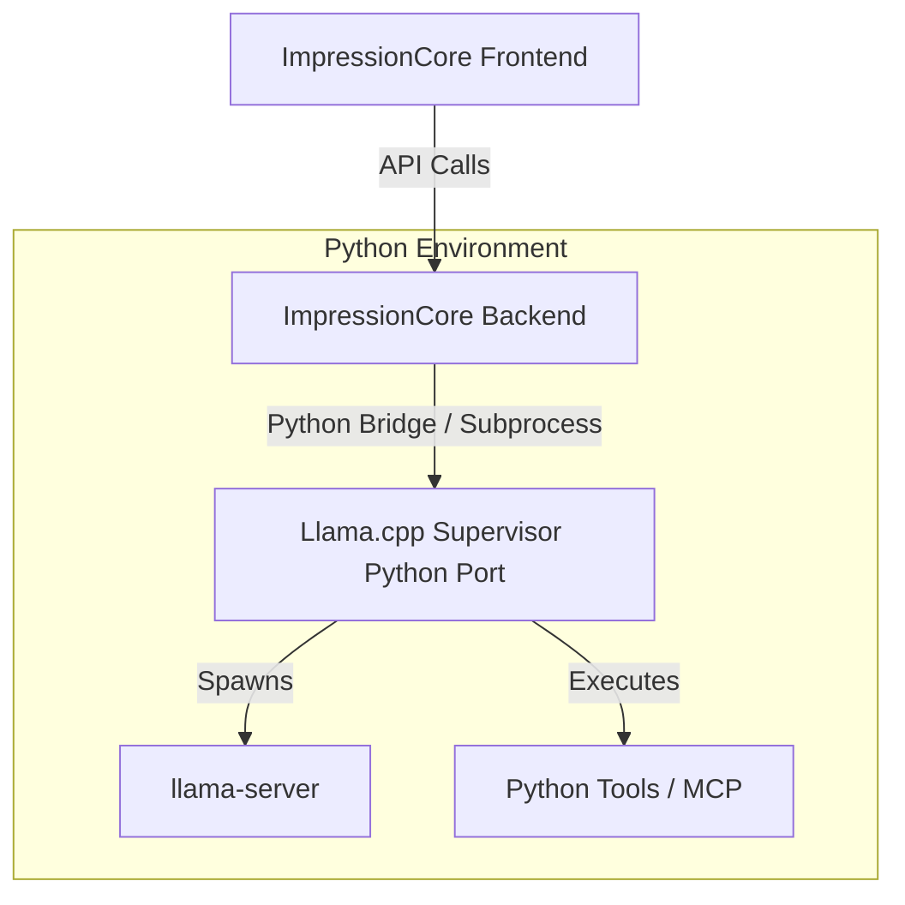

# ImpressionCore — Guardian Integration Audit

This audit evaluates the request to replace `Agent0core` in the `impressioncore` workspace with the `Guardian` portion from the `Prism` repository (`D:\Projects\Prism`), specifically incorporating its `llama.cpp` supervisor architecture.

---

## 1. Architectural Comparison

| Feature / Dimension | Current `Agent0core` | Prism `Guardian` |
| :--- | :--- | :--- |
| **Language & Runtime** | Python 3.10+ (FastAPI, asyncio) | Node.js / TypeScript |
| **Agentic Framework** | Agent Zero (dynamic command loop, tool execution) | Custom `GuardianAgent` (event-driven, task catalog) |
| **LLM Backend** | OpenRouter, OpenAI, local server APIs | Native `llama.cpp` (`llama-server` slots spawned by supervisor) |
| **Core Utilities** | Vision, Audio, Training control, MCP Bridge | Disk space check, temp file cleanup, directive integrity, MCP recovery |
| **Governance** | Prime Directive Enforcer (10 Laws, Python-based) | Covenant Integrity, Directive Signatures, AAB Ledger |

---

## 2. Technical Challenges & Alignment

### A. Python vs. TypeScript Runtime
`Agent0core` is integrated into the ImpressionCore Python environment, running alongside PyTorch and Flask. Prism's `GuardianAgent` is written in TypeScript. 
- *Option A (Python Port):* Re-engineer the `GuardianAgent` tasks and the `LlamaCppSupervisor` in Python.
- *Option B (Node.js Integration):* Run Prism's backend as a separate service or subprocess, routing events between Flask/FastAPI and Node.js.

### B. LLM Supervision (`llama.cpp` vs. PyTorch)
ImpressionCore focuses on B-series models (e.g., `b1_39m`, `b2_50m`, `b3_504m`) which are standard PyTorch/safetensors models. Prism's Guardian is built specifically for `llama.cpp` running GGUF formats.
- To use the B-series models directly with the Guardian, they would need to be converted to GGUF format, or the supervisor must support PyTorch inference routing natively.

### C. Tool Execution
`Agent0core` executes Python-based tools like `VisionTool` and `AudioTool` directly. If Prism's TypeScript Guardian takes over, these tools must either:
- Be exposed via an MCP Server that Prism's Guardian connects to.
- Be rewritten in TypeScript.
- Be called via a local API gateway.

---

## 3. Integration Pathways

### Option 1: The Native Python Port (Recommended)
Translate the core concepts of Prism's `GuardianAgent` (its task runner, health monitor, and `llama-server` process management) into Python. 
*Pros:* Keep a single runtime, reuse existing Python tools, native integration with the B-series Flask routing.
*Cons:* Development overhead of rewriting the TS supervisor logic in Python.

### Option 2: Multi-Process Coexistence
Run Prism's Node.js project as a sidecar process in ImpressionCore.
*Pros:* Direct reuse of the TypeScript codebase without changes.
*Cons:* Heavy resource footprint, complex process management, and complex cross-language communication (gRPC or REST).

---

## 4. Socratic Gate: Strategic Questions

Please review the following strategic questions before we proceed:

### Question 1: Implementation Strategy
Do you prefer **Option 1 (porting the Guardian logic and llama.cpp process manager to Python)** or **Option 2 (running Prism's Node.js engine as a sidecar process)**? 
*If porting to Python, we will create a `guardian` package within Python that spawns `llama-server.exe` directly.*

### Question 2: Model Format & GGUF
Prism's Guardian relies on `llama-server` with GGUF files. Are you planning to convert the B-series models (`b1_39m`, `b2_50m`, `b3_504m`) to GGUF for the Guardian's use, or should the Guardian connect to the existing Flask text generation API (which runs PyTorch native)?

### Question 3: Tool and Governance Parity
Prism's Guardian has its own security features (Covenant Integrity, Directive signatures, AAB ledger). `Agent0core` has the Prime Directive Enforcer and custom Vision/Audio tools. Should the new Python Guardian preserve and merge the Prime Directive Enforcer and the Vision/Audio tools, or focus strictly on the system-monitoring/health tasks defined in Prism's task catalog?
