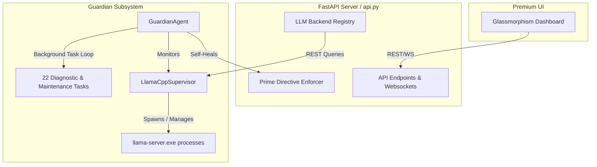
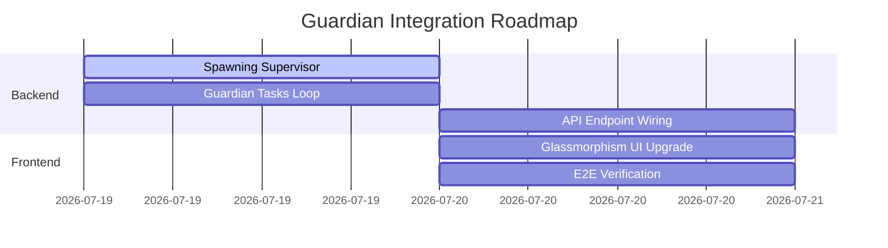

# Implementation Plan — ImpressionCore Guardian Integration

This plan outlines the complete engineering strategy to replace/upgrade `Agent0core` with a world-class, Python-based **GuardianAgent** and **LlamaCppSupervisor** ported from Prism, integrated with the FastAPI backend, and supported by a stunning web dashboard.

---

## 1. Architectural Blueprint

---

## 2. Core Python Classes to Implement

### A. `LlamaCppSupervisor` (`agent0core/core/llama_cpp_supervisor.py`)
A robust class to manage local `llama-server.exe` slots.
- **Properties**:
  - `slots`: list of dicts containing `id`, `port`, `model_alias`, `model_path`, `pid`, `status` (`"empty"`, `"loading"`, `"ready"`, `"error"`), and `last_active`.
  - `processes`: Map of slot ID to `subprocess.Popen` object.
- **Methods**:
  - `load_model(model_path, model_alias, ctx_size, gpu_layers, flash_attn, draft_model_path)`: spawns `llama-server.exe` with proper command-line arguments.
  - `unload_model(model_alias)`: terminates the child process and frees the slot.
  - `discover_local_models()`: scans `models/` directory for `.gguf` files.
  - `get_port_for_alias(model_alias)`: returns the allocated port.
  - `shutdown_all()`: kills all spawned subprocesses.

### B. `GuardianAgent` (`agent0core/core/guardian_agent.py`)
An autonomous system custodian running on a background event thread.
- **Properties**:
  - `state`: `"stopped"`, `"starting"`, `"waiting"`, `"running"`, `"healing"`, `"error"`.
  - `tasks`: list of task definitions (ID, name, category, interval, status).
  - `recent_actions`: log of actions for UI.
- **Periodic Tasks (Python Implementations)**:
  - `disk_space_check`, `temp_cleanup`, `memory_audit`, `model_integrity`.
  - `command_filter_verify`, `env_secrets_scan`, `endpoint_access_audit`.
  - `directive_integrity` (with auto-restore of `Permanent_Active_Directives.txt` from backup).
  - `context_prune`, `knowledge_graph_check`, `tool_contract_audit`, `agent_health_check`.
  - `system_snapshot` (CPU/RAM telemetry), `agent_census`, `log_volume_analysis`.
  - `mcp_health_recovery` (reconnects stalled MCP bridges).
  - `aab_ledger_monitor` (logs anomalous loop behaviors).
  - `covenant_audit`, `initialization_certificate_verify` (drifts).

### C. `LlamaCppBackend` (`agent0core/core/llm_backend.py`)
- Standard subclass of `LLMBackend`.
- Connects to the active port returned by the supervisor.
- Makes HTTP requests to `/v1/chat/completions` of the local slot.

---

## 3. API & UI Enhancements

### A. FastAPI Additions (`agent0core/api.py`)
- **GET `/api/guardian/status`**: returns current state, uptime, issues, recent actions.
- **GET `/api/guardian/tasks`**: returns status of all 22 tasks.
- **POST `/api/guardian/tasks/{task_id}/run`**: triggers immediate task execution.
- **POST `/api/guardian/tasks/{task_id}/toggle`**: enables/disables a task.
- **GET `/api/supervisor/slots`**: returns active `llama-server` slots.
- **POST `/api/supervisor/load`**: loads a model into a slot.
- **POST `/api/supervisor/unload`**: unloads a model.
- **GET `/api/models/local`**: lists GGUFs discovered in `models/` directory.

### B. Glassmorphism Dashboard (`agent0core/ui/index.html`)
Upgrade the UI to a premium dark-mode interface:
- **Design System**: Harmonious HSL colors (deep space-blues, cyber-cyans, emerald greens, amber warnings), smooth gradients, glassmorphism card panels (`backdrop-filter: blur()`).
- **Telemetry Section**: Real-time dials/bars showing memory RSS, CPU usage, disk space.
- **Model Supervisor Panel**: Dropdown to select discovered local `.gguf` models, load them into slots, see active process logs, port mappings, and performance metrics (tokens/sec).
- **Task Runner Grid**: Switchable list of the 22 Guardian tasks with state badges, last-run timers, and trigger buttons.
- **Interactive Chat Console**: High-contrast messaging window for real-time validation.

---

## 4. Steps & Verification Plan

### Verification Criteria
1. **Model Spawning**: Load a local GGUF model and check if the `llama-server.exe` process is spawned on port `8081+`, answers REST completions, and stops on unload.
2. **Task Run Loops**: Verify all 22 tasks stagger start, execute periodically, and update logs in `/api/guardian/status`.
3. **Self-Healing Integrity**: Tamper with `Permanent_Active_Directives.txt` and verify the `directive_integrity` task self-heals by replacing it from the `.bak` file.
4. **UI Responsiveness**: Verify the dashboard loads, streams server metrics, allows toggling tasks, and coordinates chat seamlessly.
