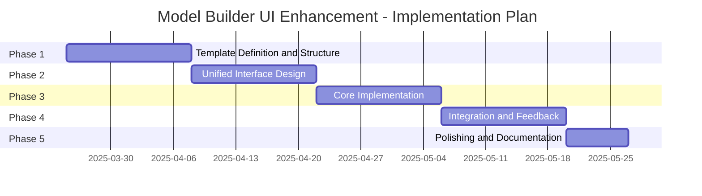
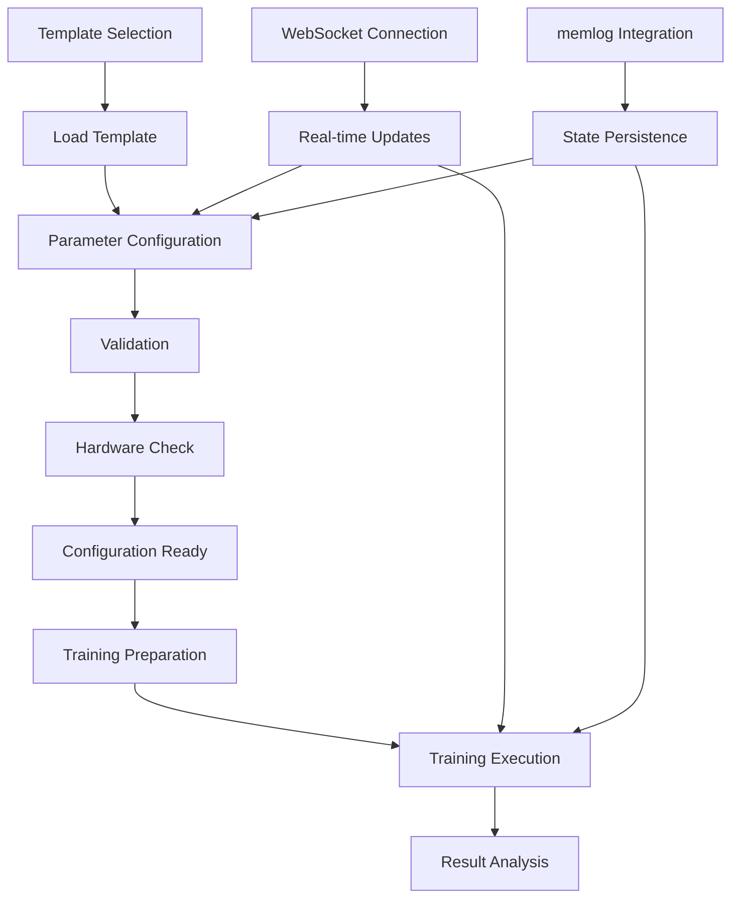

# Model Builder UI Enhancement Plan: Unified Configuration and Training Interface

## Executive Summary

The ImpressionCore Model Builder web frontend will be enhanced with a unified interface that integrates configuration templates and the training pipeline. This plan outlines a comprehensive approach to improve the user experience by reducing context switching, providing template-based model configurations with sensible defaults, and enabling a seamless workflow from configuration to training.

## Table of Contents

1. [Introduction and Vision](#introduction-and-vision)
2. [Current State Assessment](#current-state-assessment)
3. [Objectives and Goals](#objectives-and-goals)
4. [Key Features](#key-features)
5. [Implementation Plan](#implementation-plan)
6. [Technical Specifications](#technical-specifications)
   - [Template Structure and Schema](#template-structure-and-schema)
   - [UI Components and Design](#ui-components-and-design)
   - [Backend Implementation](#backend-implementation)
   - [Data Flow Architecture](#data-flow-architecture)
   - [Integration Points](#integration-points)
7. [Implementation Timeline](#implementation-timeline)
8. [Resources and Requirements](#resources-and-requirements)
9. [Testing Strategy](#testing-strategy)
10. [Post-Implementation Evaluation](#post-implementation-evaluation)

## Introduction and Vision

The Model Builder is a critical component of the ImpressionCore project, enabling users to configure, train, and evaluate AI models. The current implementation, while functional, requires users to navigate between separate interfaces for configuration and training, leading to context switching and potential inconsistencies.

This enhancement plan envisions a unified interface that brings configuration and training workflows together, centered around:

- A split-pane design showing both configuration and training in a single view
- Template-based configuration with sensible defaults for various model types
- Direct parameter mapping between configuration and training settings
- Real-time feedback on configuration choices and their impact on training

The enhanced Model Builder will dramatically improve the user experience, reduce errors in configuration, and accelerate the model development process.

## Current State Assessment

The current Model Builder web frontend has several limitations:

- **Fragmented Workflow**: Users must navigate between separate pages for model definition, training setup, and training monitoring, causing context switching and potential inconsistencies.
- **Limited Configuration Guidance**: No templates or recommended defaults for common model architectures, requiring users to determine appropriate parameters independently.
- **Manual Parameter Translation**: Configuration parameters must be manually translated to training settings, creating opportunities for error.
- **Limited Validation**: Minimal validation of configuration parameters against hardware constraints or interdependencies.
- **Basic UI**: The current Flask-based implementation provides basic functionality but lacks interactive elements for a seamless user experience.

## Objectives and Goals

1. **Reduce Context Switching**: Create a unified interface that displays configuration and training status together.
2. **Simplify Configuration**: Implement model templates with sensible defaults for various model types.
3. **Prevent Configuration Errors**: Add comprehensive validation for parameter interdependencies and hardware constraints.
4. **Streamline Workflow**: Enable direct translation from configuration to training settings.
5. **Improve Visibility**: Provide real-time feedback on configuration impact and training progress.
6. **Enhance Documentation**: Integrate contextual help and documentation within the interface.

## Key Features

### 1. Unified Split-Pane Interface

- Configuration panel and training status visible simultaneously
- Collapsible sections for focusing on specific aspects
- Responsive design that works on various screen sizes

### 2. Template-Based Configuration

- Pre-defined templates for common model architectures
- Categorized templates (transformer, diffusion, multimodal)
- Visual selection interface with information cards

### 3. Interactive Parameter Configuration

- Form controls appropriate to parameter types (sliders, dropdowns, etc.)
- Real-time validation with visual feedback
- Parameter interdependency handling

### 4. Direct Parameter Mapping

- Automatic derivation of training settings from configuration
- Clear indication of relationships between configuration and training parameters
- Explicit mapping definitions within template schema

### 5. Hardware Compatibility Checks

- Real-time evaluation of configuration against available hardware
- Visual indicators for compatibility issues
- Recommendations for parameter adjustments

### 6. Training Integration

- Seamless transition from configuration to training
- Training progress visualization alongside configuration
- Configuration reference during training

### 7. Contextual Documentation

- Integrated help for parameters and options
- Tooltips explaining parameter impacts and relationships
- Links to comprehensive documentation

## Implementation Plan

The implementation will proceed in five phases:



### Phase 1: Template Definition and Structure (Weeks 1-2)

**Goals:**

- Define template categories and schema
- Create initial template definitions
- Establish parameter validation rules

**Tasks:**

1. Research and document common model architectures and their parameters
2. Define template schema with comprehensive metadata
3. Create initial templates for transformer, diffusion, and multimodal models
4. Define parameter interdependencies and validation rules
5. Establish hardware requirement estimations for different configurations

**Deliverables:**

- Template schema documentation
- Initial set of template JSON files
- Parameter validation rule documentation

### Phase 2: Unified Interface Design (Weeks 3-4)

**Goals:**

- Design the unified interface layout
- Create UI mockups and prototypes
- Define component interactions

**Tasks:**

1. Create wireframes for the unified interface
2. Design template selection interface
3. Design parameter configuration controls
4. Create mockups for the split-pane layout
5. Design training status visualization components
6. Define transitions and interactions between interface elements
7. Create interactive prototype for user testing

**Deliverables:**

- Interface wireframes and mockups
- Interactive prototype
- Component interaction specifications

### Phase 3: Core Implementation (Weeks 5-6)

**Goals:**

- Implement the core interface components
- Create backend support for template management
- Implement configuration validation

**Tasks:**

1. Implement Flask routes and templates for unified interface
2. Create template loading and management system
3. Implement template selection UI
4. Build parameter configuration forms
5. Create validation system for parameters
6. Implement configuration preview functionality
7. Add configuration export/import capabilities

**Deliverables:**

- Basic unified interface implementation
- Template selection and configuration functionality
- Configuration validation system
- Parameter manipulation controls

### Phase 4: Integration and Feedback (Weeks 7-8)

**Goals:**

- Integrate with training pipeline
- Implement real-time updates
- Add hardware compatibility checks

**Tasks:**

1. Implement training panel in the unified interface
2. Create WebSocket connections for real-time updates
3. Integrate hardware compatibility checking
4. Implement parameter mapping to training settings
5. Add training progress visualization
6. Implement session persistence with memlog
7. Create notification system for events and errors

**Deliverables:**

- Fully integrated unified interface
- Real-time training status updates
- Hardware compatibility checks
- Parameter mapping implementation
- Session persistence system

### Phase 5: Polishing and Documentation (Week 9)

**Goals:**

- Refine UI based on testing and feedback
- Complete documentation
- Optimize performance

**Tasks:**

1. Address feedback from testing
2. Optimize UI performance
3. Enhance error handling and messaging
4. Create comprehensive documentation
5. Update walkthrough to include unified interface
6. Create video tutorials for common workflows
7. Final testing and quality assurance

**Deliverables:**

- Polished unified interface
- Comprehensive documentation
- Tutorial materials
- Performance optimization report

## Technical Specifications

### Template Structure and Schema

Templates will be stored as JSON files with a comprehensive schema that captures all necessary metadata:

```json
{
  "schema_version": "1.0",
  "template_id": "transformer-base",
  "display_name": "Transformer Base",
  "description": "Standard transformer model suitable for text generation tasks",
  "category": "transformer",
  "icon": "transformer_icon.svg",
  "parameters": {
    "model": {
      "hidden_size": {
        "value": 768,
        "description": "Hidden dimension size of the transformer model",
        "tooltip": "Larger values increase model capacity but require more memory",
        "type": "integer",
        "range": [128, 2048],
        "step": 128,
        "training_impact": "high",
        "hardware_impact": "high",
        "display_order": 1
      },
      "num_layers": {
        "value": 12,
        "description": "Number of transformer layers (encoder/decoder blocks)",
        "tooltip": "More layers allow for processing more complex patterns",
        "type": "integer",
        "range": [1, 24],
        "step": 1,
        "training_impact": "high",
        "hardware_impact": "high",
        "display_order": 2
      },
      "num_heads": {
        "value": 12,
        "description": "Number of attention heads per layer",
        "tooltip": "Multiple heads allow the model to focus on different parts of the input",
        "type": "integer",
        "range": [1, 24],
        "step": 1,
        "training_impact": "medium",
        "hardware_impact": "medium",
        "display_order": 3,
        "related_to": ["hidden_size"],
        "validation": "value % 1 === 0 && hidden_size % value === 0"
      },
      "intermediate_size": {
        "value": 3072,
        "description": "Size of the intermediate layer in the transformer",
        "tooltip": "Usually 4x the hidden_size",
        "type": "integer",
        "range": [256, 8192],
        "step": 256,
        "training_impact": "medium",
        "hardware_impact": "medium",
        "display_order": 4,
        "related_to": ["hidden_size"],
        "validation": "value >= hidden_size"
      }
    },
    "training": {
      "learning_rate": {
        "value": 5e-5,
        "description": "Learning rate for optimizer",
        "tooltip": "Controls how quickly the model adapts to the training data",
        "type": "float",
        "range": [1e-6, 1e-3],
        "log_scale": true,
        "training_impact": "high",
        "hardware_impact": "none",
        "display_order": 1
      },
      "batch_size": {
        "value": 16,
        "description": "Training batch size",
        "tooltip": "Larger batch sizes can speed up training but require more memory",
        "type": "integer",
        "range": [1, 128],
        "step": 1,
        "training_impact": "high",
        "hardware_impact": "high",
        "display_order": 2,
        "hardware_dependent": true
      },
      "epochs": {
        "value": 3,
        "description": "Number of training epochs",
        "tooltip": "More epochs allow for better learning but take longer",
        "type": "integer",
        "range": [1, 100],
        "step": 1,
        "training_impact": "high",
        "hardware_impact": "none",
        "display_order": 3
      }
    },
    "advanced": {
      "attention_dropout": {
        "value": 0.1,
        "description": "Dropout probability for attention weights",
        "tooltip": "Helps prevent overfitting in attention mechanism",
        "type": "float",
        "range": [0.0, 0.5],
        "step": 0.05,
        "training_impact": "low",
        "hardware_impact": "none",
        "display_order": 1,
        "advanced": true
      },
      "hidden_dropout": {
        "value": 0.1,
        "description": "Dropout probability for hidden layers",
        "tooltip": "Helps prevent overfitting in feed-forward networks",
        "type": "float",
        "range": [0.0, 0.5],
        "step": 0.05,
        "training_impact": "low",
        "hardware_impact": "none",
        "display_order": 2,
        "advanced": true
      }
    }
  },
  "training_settings": {
    "recommended_epochs": 3,
    "eval_strategy": "steps",
    "eval_steps": 500,
    "save_strategy": "steps",
    "save_steps": 1000,
    "optimizer": "AdamW",
    "weight_decay": 0.01,
    "lr_scheduler_type": "linear",
    "warmup_ratio": 0.1
  },
  "hardware_requirements": {
    "min_vram": "4GB",
    "recommended_vram": "8GB",
    "vram_calculation": "((hidden_size * hidden_size * 4 * num_layers * 4) / (1024 * 1024 * 1024) + 0.5) GB",
    "scaling_notes": "Memory usage scales quadratically with hidden_size and linearly with num_layers"
  },
  "use_cases": [
    "Text generation",
    "Language modeling",
    "Sequence classification"
  ],
  "caveats": [
    "Training may take several hours on consumer hardware",
    "Large configurations may require GPU with >8GB VRAM"
  ],
  "references": [
    {
      "title": "Attention Is All You Need",
      "url": "https://arxiv.org/abs/1706.03762"
    }
  ]
}
```

**Template Categories:**

1. **Transformer Models**
   - Transformer Nano (4-layer, 256-dim)
   - Transformer Small (6-layer, 512-dim)
   - Transformer Base (12-layer, 768-dim)
   - Transformer Large (24-layer, 1024-dim)

2. **Diffusion Models**
   - Basic Diffusion (UNet backbone)
   - Latent Diffusion (VAE + UNet)
   - Conditional Diffusion (with text conditioning)

3. **Multimodal Models**
   - Vision-Text Encoder
   - Text-Audio Processor
   - Multimodal Transformer

**Parameter Validation Rules:**

1. **Type Validation**
   - Ensure parameters match their declared types
   - Convert string inputs to appropriate types when needed

2. **Range Validation**
   - Check that values fall within specified ranges
   - Apply step constraints for integer parameters

3. **Interdependency Validation**
   - Validate parameters against related parameters
   - Custom validation functions for complex relationships

4. **Hardware Compatibility**
   - Calculate memory requirements based on parameters
   - Compare against available system resources
   - Flag parameters that exceed hardware capabilities

### UI Components and Design

#### 1. Layout Structure

The unified interface will use a flexible split-pane layout:

```
+-----------------------------------------------+
|                  Header Bar                   |
+---------------+-----------------------------+
|               |                             |
|               |                             |
|               |                             |
| Configuration |        Training Status      |
|     Panel     |                             |
|               |                             |
|               |                             |
+---------------+-----------------------------+
|                  Footer Bar                   |
+-----------------------------------------------+
```

- **Header Bar**: Navigation controls, system status, user info
- **Configuration Panel**: Template selection, parameter configuration
- **Training Status Panel**: Training controls, progress visualization, logs
- **Footer Bar**: Hardware info, version info, quick actions

#### 2. Configuration Panel Components

**Template Selection**:

- Visual card-based gallery for template selection
- Filtering by category, hardware compatibility
- Search functionality for finding specific templates
- Quick preview of key template parameters

**Parameter Groups**:

- Collapsible sections for parameter categories (model, training, advanced)
- Progress indicator showing completion status
- Parameter impact indicators showing effect on training/memory

**Parameter Controls**:

- Sliders for numeric parameters with ranges
- Dropdowns for categorical parameters
- Checkboxes for boolean parameters
- Custom controls for specialized parameters
- Real-time validation feedback

**Configuration Actions**:

- Save/load configuration buttons
- Export to YAML/JSON options
- Reset to defaults function
- Template switching with change confirmation

#### 3. Training Panel Components

**Training Controls**:

- Start/pause/stop training buttons
- Checkpoint management controls
- Configuration lock during training

**Progress Visualization**:

- Training progress bar with ETA
- Real-time metric charts (loss, accuracy, etc.)
- Hardware utilization monitors (GPU, memory)

**Training Logs**:

- Real-time log display with filtering
- Error highlighting
- Log search functionality

**Result Preview**:

- Preview of model outputs during/after training
- Quick evaluation results

#### 4. Responsive Design

The interface will adapt to different screen sizes:

- On larger screens: Side-by-side configuration and training panels
- On medium screens: Tabbed interface between configuration and training
- On smaller screens: Stacked panels with collapsible sections

#### 5. Component Interaction

- **Parameter Dependencies**: Changes to one parameter may affect others
- **Hardware Impact**: Parameter changes update hardware requirement estimates
- **Training Connection**: Configuration panel remains visible during training
- **State Persistence**: Interface remembers state between sessions

### Backend Implementation

#### 1. Flask Route Structure

```python
# Core unified interface route
@app.route('/unified_builder')
def unified_builder():
    """Unified model building interface."""
    hardware_info = hardware_check.get_system_info()
    templates = get_available_templates()
    return render_template(
        'unified_builder.html',
        hardware_info=hardware_info,
        templates=templates,
        page_css='css/unified_builder.css'
    )

# Template management routes
@app.route('/api/templates', methods=['GET'])
def list_templates():
    """API endpoint for retrieving available templates."""
    category = request.args.get('category', None)
    templates = get_templates(category=category)
    return jsonify(templates)

@app.route('/api/templates/<template_id>', methods=['GET'])
def get_template(template_id):
    """API endpoint for retrieving a specific template."""
    template = get_template_by_id(template_id)
    if not template:
        return jsonify({'error': 'Template not found'}), 404
    return jsonify(template)

# Configuration validation
@app.route('/api/validate_config', methods=['POST'])
def validate_configuration():
    """API endpoint for validating a configuration."""
    data = request.get_json()
    validation_result = validate_config(data)
    return jsonify(validation_result)

# Hardware compatibility check
@app.route('/api/hardware_compatibility', methods=['POST'])
def check_hardware_compatibility():
    """API endpoint for checking hardware compatibility of a configuration."""
    config = request.get_json()
    hardware_info = hardware_check.get_system_info()
    compatibility = check_config_hardware_compatibility(config, hardware_info)
    return jsonify(compatibility)

# Training management
@app.route('/api/start_training', methods=['POST'])
def start_training():
    """API endpoint for starting model training."""
    config = request.get_json()
    training_id = start_training_process(config)
    return jsonify({'training_id': training_id})

@app.route('/api/training_status/<training_id>', methods=['GET'])
def get_training_status(training_id):
    """API endpoint for getting training status."""
    status = get_training_process_status(training_id)
    return jsonify(status)
```

#### 2. WebSocket Implementation

```python
@sock.route('/ws/unified_status')
def unified_status(ws):
    """WebSocket endpoint for unified status updates."""
    try:
        client_id = request.args.get('client_id', str(uuid.uuid4()))
        register_client(client_id, ws)
        
        while True:
            # Get current configuration and training status
            with status_lock:
                config_status = current_config.copy()
                training_status = current_training_status.copy()
            
            # Send unified status update
            ws.send(json.dumps({
                'config': config_status,
                'training': training_status,
                'hardware': hardware_check.get_system_info(),
                'timestamp': time.time()
            }))
            
            time.sleep(1.0)  # Update frequency
    except Exception as e:
        print(f"WebSocket error: {e}")
    finally:
        unregister_client(client_id)
```

#### 3. Template Management

```python
def get_templates(category=None):
    """Get all available templates, optionally filtered by category."""
    template_dir = os.path.join(app.root_path, 'templates', 'model_templates')
    templates = []
    
    for filename in os.listdir(template_dir):
        if filename.endswith('.json'):
            with open(os.path.join(template_dir, filename), 'r') as f:
                template = json.load(f)
                
                # Filter by category if specified
                if category and template.get('category') != category:
                    continue
                    
                # Add template metadata to list
                templates.append({
                    'id': template.get('template_id'),
                    'name': template.get('display_name'),
                    'description': template.get('description'),
                    'category': template.get('category'),
                    'icon': template.get('icon'),
                    'hardware_requirements': template.get('hardware_requirements')
                })
    
    return templates

def get_template_by_id(template_id):
    """Get a specific template by ID."""
    template_dir = os.path.join(app.root_path, 'templates', 'model_templates')
    template_path = os.path.join(template_dir, f"{template_id}.json")
    
    if not os.path.exists(template_path):
        return None
        
    with open(template_path, 'r') as f:
        return json.load(f)
```

#### 4. Configuration Validation

```python
def validate_config(config):
    """Validate a configuration against its template and hardware constraints."""
    # Get the template this configuration is based on
    template = get_template_by_id(config.get('template_id'))
    if not template:
        return {
            'valid': False,
            'errors': [{'field': 'template_id', 'message': 'Template not found'}]
        }
    
    errors = []
    warnings = []
    
    # Validate each parameter
    for group_name, group in template.get('parameters', {}).items():
        for param_name, param_def in group.items():
            # Get the user-specified value or use the template default
            value = config.get(group_name, {}).get(param_name, param_def.get('value'))
            
            # Type validation
            if param_def.get('type') == 'integer' and not isinstance(value, int):
                try:
                    value = int(value)
                except:
                    errors.append({
                        'field': f"{group_name}.{param_name}",
                        'message': f"Must be an integer"
                    })
            
            # Range validation
            if 'range' in param_def:
                min_val, max_val = param_def['range']
                if value < min_val or value > max_val:
                    errors.append({
                        'field': f"{group_name}.{param_name}",
                        'message': f"Value must be between {min_val} and {max_val}"
                    })
            
            # Custom validation
            if 'validation' in param_def:
                validation_expr = param_def['validation']
                # Create a context with related parameters
                context = {}
                for related_param in param_def.get('related_to', []):
                    for g_name, g in template.get('parameters', {}).items():
                        if related_param in g:
                            context[related_param] = config.get(g_name, {}).get(
                                related_param, 
                                template['parameters'][g_name][related_param].get('value')
                            )
                
                # Evaluate the validation expression
                try:
                    # Simple expressions can be evaluated directly
                    # Complex validations would need a more sophisticated approach
                    valid = eval(validation_expr, {"__builtins__": {}}, context)
                    if not valid:
                        errors.append({
                            'field': f"{group_name}.{param_name}",
                            'message': f"Invalid value based on related parameters"
                        })
                except Exception as e:
                    errors.append({
                        'field': f"{group_name}.{param_name}",
                        'message': f"Validation error: {str(e)}"
                    })
    
    # Hardware compatibility checks
    hardware_info = hardware_check.get_system_info()
    compatibility = check_config_hardware_compatibility(config, hardware_info)
    
    if not compatibility.get('compatible'):
        for issue in compatibility.get('issues', []):
            warnings.append({
                'field': issue.get('parameter', 'hardware'),
                'message': issue.get('message')
            })
    
    return {
        'valid': len(errors) == 0,
        'errors': errors,
        'warnings': warnings,
        'hardware_compatibility': compatibility
    }
```

#### 5. Hardware Compatibility Checking

```python
def check_config_hardware_compatibility(config, hardware_info):
    """Check if a configuration is compatible with available hardware."""
    # Get the template this configuration is based on
    template = get_template_by_id(config.get('template_id'))
    if not template:
        return {
            'compatible': False,
            'issues': [{'message': 'Template not found'}]
        }
    
    issues = []
    
    # Get VRAM information
    available_vram = hardware_info.get('vram_gb', 0)
    
    # Calculate required VRAM using the template's calculation formula
    required_vram = 0
    vram_calculation = template.get('hardware_requirements', {}).get('vram_calculation')
    
    if vram_calculation:
        # Create context with all parameters
        context = {}
        for group_name, group in template.get('parameters', {}).items():
            for param_name, param_def in group.items():
                context[param_name] = config.get(group_name, {}).get(
                    param_name, 
                    param_def.get('value')
                )
        
        # Evaluate the VRAM calculation
        try:
            required_vram = eval(vram_calculation, {"__builtins__": {}}, context)
        except Exception as e:
            issues.append({
                'parameter': 'vram_calculation',
                'message': f"Error calculating VRAM requirement: {str(e)}"
            })
    else:
        # Use minimum VRAM as fallback
        min_vram_str = template.get('hardware_requirements', {}).get('min_vram', '0GB')
        required_vram = float(min_vram_str.replace('GB', ''))
    
    # Check if enough VRAM is available
    if available_vram < required_vram:
        issues.append({
            'parameter': 'vram',
            'message': f"Configuration requires {required_vram:.1f}GB VRAM, but only {available_vram:.1f}GB is available"
        })
    
    return {
        'compatible': len(issues) == 0,
        'available_vram': available_vram,
        'required_vram': required_vram,
        'issues': issues
    }
```

### Data Flow Architecture

The data flow in the unified interface follows this pattern:



**Template Selection Flow**:

1. User selects a template from the gallery
2. System loads template definition from JSON file
3. UI populates configuration panel with template defaults
4. Hardware compatibility is immediately checked

**Parameter Configuration Flow**:

1. User adjusts parameters in the configuration panel
2. Real-time validation occurs for each parameter change
3. Interdependent parameters are updated automatically
4. Hardware compatibility is re-checked with each significant change
5. Configuration state is saved to memlog

**Training Flow**:

1. User initiates training from the configuration panel
2. System translates configuration to training settings
3. Training process starts in a background thread
4. WebSocket connection provides real-time updates
5. Training state is persisted to memlog
6. Training can be paused/resumed with configuration visible

**Persistence Flow**:

1. Configuration state is periodically saved to memlog
2. User can export configuration to JSON/YAML
3. Training checkpoints are saved with configuration metadata
4. Sessions can be resumed from memlog state

### Integration Points

#### 1. Integration with Training Pipeline

```python
def derive_training_settings(config_template, user_config):
    """Derive training settings from configuration template and user customizations."""
    settings = {}
    
    # Base settings from template
    if 'training_settings' in config_template:
        settings.update(config_template['training_settings'])
    
    # Map user configuration to training settings
    for group_name, group in user_config.items():
        for param_name, value in group.items():
            # Check if this parameter directly maps to a training setting
            param_def = config_template.get('parameters', {}).get(group_name, {}).get(param_name, {})
            training_param = param_def.get('training_param')
            
            if training_param:
                settings[training_param] = value
    
    # Adjust based on model parameters
    if 'model' in user_config and 'hidden_size' in user_config['model']:
        # Scale batch size based on model size and available VRAM
        hardware = hardware_check.get_system_info()
        vram_gb = hardware.get('vram_gb', 4)
        hidden_size = user_config['model']['hidden_size']
        
        # Simple heuristic for batch size based on model size and VRAM
        batch_size = max(1, int((vram_gb * 1024) / (hidden_size * 0.5)))
        
        if 'training' in user_config and 'batch_size' not in user_config['training']:
            settings['batch_size'] = batch_size
    
    # Adjust learning rate based on batch size
    if 'batch_size' in settings:
        # Linear scaling rule: lr ∝ batch_size
        base_lr = settings.get('learning_rate', 5e-5)
        base_batch = config_template.get('training_settings', {}).get('batch_size', 16)
        settings['learning_rate'] = base_lr * (settings['batch_size'] / base_batch)
    
    return settings
```

#### 2. Integration with Memlog

```python
def save_state_to_memlog(config, training_status, user_id=None):
    """Save current configuration and training state to memlog."""
    timestamp = datetime.now().strftime('%Y%m%d_%H%M%S')
    
    # Create a state entry with configuration and training status
    state_entry = {
        'timestamp': timestamp,
        'user_id': user_id,
        'configuration': config,
        'training_status': training_status
    }
    
    # Save to memlog state directory
    state_dir = os.path.join('memlog', 'state', 'model_builder')
    os.makedirs(state_dir, exist_ok=True)
    
    state_file = os.path.join(state_dir, f'state_{timestamp}.json')
    with open(state_file, 'w') as f:
        json.dump(state_entry, f, indent=2)
    
    # Update latest state pointer
    latest_file = os.path.join(state_dir, 'latest.json')
    with open(latest_file, 'w') as f:
        json.dump({'latest_state': state_file}, f, indent=2)
    
    return state_file

def load_state_from_memlog(state_id=None, user_id=None):
    """Load configuration and training state from memlog."""
    state_dir = os.path.join('memlog', 'state', 'model_builder')
    
    if state_id:
        # Load specific state
        state_file = os.path.join(state_dir, f'state_{state_id}.json')
    else:
        # Load latest state
        try:
            latest_file = os.path.join(state_dir, 'latest.json')
            with open(latest_file, 'r') as f:
                latest = json.load(f)
            state_file = latest.get('latest_state')
        except:
            return None
    
    if not state_file or not os.path.exists(state_file):
        return None
    
    with open(state_file, 'r') as f:
        state = json.load(f)
    
    # Filter by user if specified
    if user_id and state.get('user_id') != user_id:
        return None
    
    return state
```

#### 3. Integration with Hardware Check

```python
def get_hardware_recommendations(config):
    """Get hardware recommendations based on configuration."""
    # Get the template
    template = get_template_by_id(config.get('template_id'))
    if not template:
        return {
            'recommendations': [
                {'message': 'Could not find template, unable to provide hardware recommendations'}
            ]
        }
    
    # Get current hardware info
    hardware = hardware_check.get_system_info()
    
    recommendations = []
    
    # Calculate VRAM requirements
    vram_calculation = template.get('hardware_requirements', {}).get('vram_calculation')
    context = {}
    for group_name, group in template.get('parameters', {}).items():
        for param_name, param_def in group.items():
            context[param_name] = config.get(group_name, {}).get(
                param_name, 
                param_def.get('value')
            )
    
    try:
        required_vram = eval(vram_calculation, {"__builtins__": {}}, context)
        available_vram = hardware.get('vram_gb', 0)
        
        if available_vram < required_vram:
            # Suggest parameter reductions
            high_impact_params = []
            for group_name, group in template.get('parameters', {}).items():
                for param_name, param_def in group.items():
                    if param_def.get('hardware_impact') == 'high':
                        high_impact_params.append({
                            'group': group_name,
                            'name': param_name,
                            'current_value': config.get(group_name, {}).get(
                                param_name, 
                                param_def.get('value')
                            ),
                            'range': param_def.get('range'),
                            'description': param_def.get('description')
                        })
            
            recommendations.append({
                'type': 'vram',
                'message': f"Configuration requires {required_vram:.1f}GB VRAM, but only {available_vram:.1f}GB is available",
                'high_impact_params': high_impact_params
            })
    except Exception as e:
        recommendations.append({
            'type': 'error',
            'message': f"Error calculating VRAM requirements: {str(e)}"
        })
    
    return {
        'recommendations': recommendations
    }
```

## Implementation Timeline

The implementation will proceed according to the following detailed timeline:

### Phase 1: Template Definition and Structure (Weeks 1-2)

**Week 1**

- Days 1-2: Research model architectures and parameters
- Days 3-4: Design template schema and validation rules
- Day 5: Create template storage structure

**Week 2**

- Days 1-2: Implement initial transformer templates
- Day 3: Implement initial diffusion templates
- Day 4: Implement initial multimodal templates
- Day 5: Test and refine template definitions

### Phase 2: Unified Interface Design (Weeks 3-4)

**Week 3**

- Days 1-2: Create wireframes for unified interface
- Days 3-4: Design template selection interface
- Day 5: Design parameter configuration controls

**Week 4**

- Days 1-2: Create mockups for split-pane layout
- Days 3-4: Design training status visualization components
- Day 5: Create interactive prototype

### Phase 3: Core Implementation (Weeks 5-6)

**Week 5**

- Days 1-2: Implement Flask routes and templates
- Days 3-4: Create template loading and management system
- Day 5: Implement template selection UI

**Week 6**

- Days 1-2: Build parameter configuration forms
- Days 3-4: Create validation system
- Day 5: Implement configuration preview and export

### Phase 4: Integration and Feedback (Weeks 7-8)

**Week 7**

- Days 1-2: Implement training panel
- Days 3-4: Create WebSocket connections
- Day 5: Integrate hardware compatibility checking

**Week 8**

- Days 1-2: Implement parameter mapping to training
- Days 3-4: Add training progress visualization
- Day 5: Implement session persistence with memlog

### Phase 5: Polishing and Documentation (Week 9)

**Week 9**

- Days 1-2: Address feedback and optimize UI
- Days 3-4: Create documentation and tutorials
- Day 5: Final testing and deployment

## Resources and Requirements

### Development Resources

**Personnel**:

- 1-2 Frontend Developers (JavaScript, HTML, CSS)
- 1 Backend Developer (Python, Flask)
- 1 UI/UX Designer
- 1 QA Engineer (part-time)

**Development Environment**:

- Python 3.8+ with Flask, WebSockets
- Modern web browser with JavaScript ES6+ support
- Code editor with HTML/CSS/JavaScript support
- Git version control
- Local development server

**Testing Resources**:

- Multiple hardware configurations for compatibility testing
- Virtualized environments for simulating different setups
- Browser testing tools for cross-browser compatibility

### Technical Requirements

**Backend Requirements**:

- Flask 2.0+ for web server
- Flask-Sock for WebSockets
- JSON and YAML parsing libraries
- Hardware detection libraries
- Access to memlog system

**Frontend Requirements**:

- Modern JavaScript (ES6+)
- Chart.js for visualization
- Bootstrap for CSS framework
- WebSocket support
- Local storage for caching

**Hardware Requirements**:

- Development machines with varying GPU capabilities
- Test environment with limited hardware resources
- Production environment with sufficient resources for concurrent users

## Testing Strategy

### Unit Testing

- Template loading and validation
- Parameter validation rules
- Hardware compatibility checks
- Configuration-to-training mapping

### Integration Testing

- Template selection to configuration flow
- Configuration to training flow
- WebSocket communication
- memlog persistence

### UI Testing

- Responsive design across screen sizes
- Form validation behavior
- Real-time updates
- Browser compatibility

### Usability Testing

- Task completion time measurements
- Error rate tracking
- User satisfaction surveys
- Think-aloud testing sessions

### Performance Testing

- Interface responsiveness under load
- WebSocket message throughput
- Memory usage during long sessions
- Load testing with multiple concurrent users

## Post-Implementation Evaluation

### Success Metrics

1. **Usability Metrics**:
   - Task completion time reduction
   - Error rate reduction
   - User satisfaction scores

2. **Technical Metrics**:
   - Configuration error reduction
   - Training start-to-completion time
   - System resource utilization

3. **Adoption Metrics**:
   - Number of users using templates
   - Template usage distribution
   - Configuration save/load frequency

### Evaluation Process

1. Collect baseline metrics on current interface
2. Implement unified interface
3. Conduct post-implementation usability testing
4. Gather user feedback through surveys
5. Analyze usage patterns and error rates
6. Document improvements and areas for future enhancement

### Continuous Improvement

The unified interface will be continuously improved based on:

- User feedback and feature requests
- Usage analytics
- Performance monitoring
- New model architecture support
- Hardware compatibility updates

## Conclusion

The Model Builder UI Enhancement Plan outlines a comprehensive approach to creating a unified interface that integrates configuration templates with the training pipeline. By implementing this plan, we will significantly improve the user experience, reduce configuration errors, and accelerate the model development process.

The plan balances technical feasibility with user needs, prioritizing the most impactful improvements while maintaining compatibility with the existing system. The phased implementation approach allows for iterative refinement and early feedback incorporation.

Upon completion, the enhanced Model Builder will provide a seamless, template-driven approach to model configuration and training that accommodates users across different experience levels and hardware capabilities.
