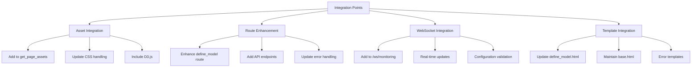

# Model Definition Interface Integration Plan

## Overview
This plan details how to integrate the new model definition interface into the existing server.py structure while preserving all current functionality.



## 1. Asset Management Integration

### Update get_page_assets Function
```python
def get_page_assets(endpoint):
    assets = {
        'css': ['css/style.css'],
        'scripts': []
    }
    
    # Add model definition assets
    if endpoint == 'define_model':
        assets['css'].append('css/model-definition.css')
        assets['scripts'].extend([
            'https://d3js.org/d3.v7.min.js',
            'js/model-definition.js',
            'js/architecture-viz.js'
        ])
    
    # Existing tokenizer assets...
    if endpoint and ('tokenizer' in endpoint):
        # ... existing code ...
    
    return assets
```

### CSS Integration
1. Merge model definition styles into existing style.css
2. Keep specific model visualization styles in model-definition.css
3. Update layout classes to match existing patterns

## 2. Route Enhancement

### Enhance define_model Route
```python
@app.route('/define_model')
def define_model():
    """Enhanced model definition interface"""
    template_configs = {
        'basic-transformer': { ... },
        'moe-architecture': { ... },
        'custom': { ... }
    }
    return render_template_with_assets(
        'define_model.html',
        active_page='define_model',
        template_configs=template_configs
    )
```

### Add API Endpoints
```python
@app.route('/api/model/validate', methods=['POST'])
def validate_model_config():
    """Validate model configuration"""
    try:
        config = request.get_json()
        validation_result = validate_config(config)
        return jsonify(validation_result)
    except Exception as e:
        logger.error(f"Model validation error: {str(e)}")
        return jsonify({
            'status': 'error',
            'message': str(e)
        }), 500
```

## 3. WebSocket Integration

### Add to Monitoring WebSocket
```python
@sock.route('/ws/monitoring')
def handle_monitoring(ws):
    try:
        while True:
            # Existing metrics...
            
            # Add model definition updates
            if current_page == 'define_model':
                model_updates = {
                    'type': 'model_definition',
                    'config_valid': True,
                    'memory_estimate': calculate_memory_requirement(),
                    'visualization_data': get_architecture_data()
                }
                ws.send(json.dumps(model_updates))
            
            time.sleep(1)
    except Exception as e:
        logger.error(f"Monitoring WebSocket error: {str(e)}")
    finally:
        ws.close()
```

## 4. Template Integration

### Define Model Template Updates
1. Keep existing template structure and inheritance
2. Update content section with new interface components
3. Maintain consistent styling and layout
4. Use existing error templates for error handling

## 5. JavaScript Integration

### Model Definition JS
1. Update WebSocket connection to use existing pattern
2. Integrate with monitoring system
3. Use shared utility functions where applicable

### Architecture Visualization
1. Initialize D3.js visualization within existing layout
2. Handle responsive design requirements
3. Match existing color scheme and styling

## 6. Error Handling Integration

### Use Existing Error System
```python
@app.errorhandler(400)
def bad_request_error(error):
    """Handle model configuration validation errors"""
    return render_template_with_assets(
        'errors/400.html',
        active_page='error',
        error=str(error)
    ), 400
```

## Implementation Steps

1. **Asset Integration (Phase 1)**
   - Update get_page_assets
   - Merge CSS files
   - Add required scripts

2. **Route Enhancement (Phase 2)**
   - Modify define_model route
   - Add API endpoints
   - Implement validation logic

3. **WebSocket Updates (Phase 3)**
   - Enhance monitoring WebSocket
   - Add real-time validation
   - Implement visualization updates

4. **Template Updates (Phase 4)**
   - Update define_model.html
   - Ensure proper inheritance
   - Maintain error handling

## Testing Strategy

1. **Integration Tests**
   - Verify asset loading
   - Test WebSocket functionality
   - Validate error handling

2. **UI Tests**
   - Check responsive design
   - Verify visualization rendering
   - Test form validation

3. **Performance Tests**
   - Monitor memory usage
   - Check WebSocket efficiency
   - Validate asset loading speed

## Success Criteria

1. All existing functionality remains intact
2. Model definition interface works seamlessly
3. Real-time updates function properly
4. Error handling works consistently
5. Asset loading is optimized
6. WebSocket communication is reliable