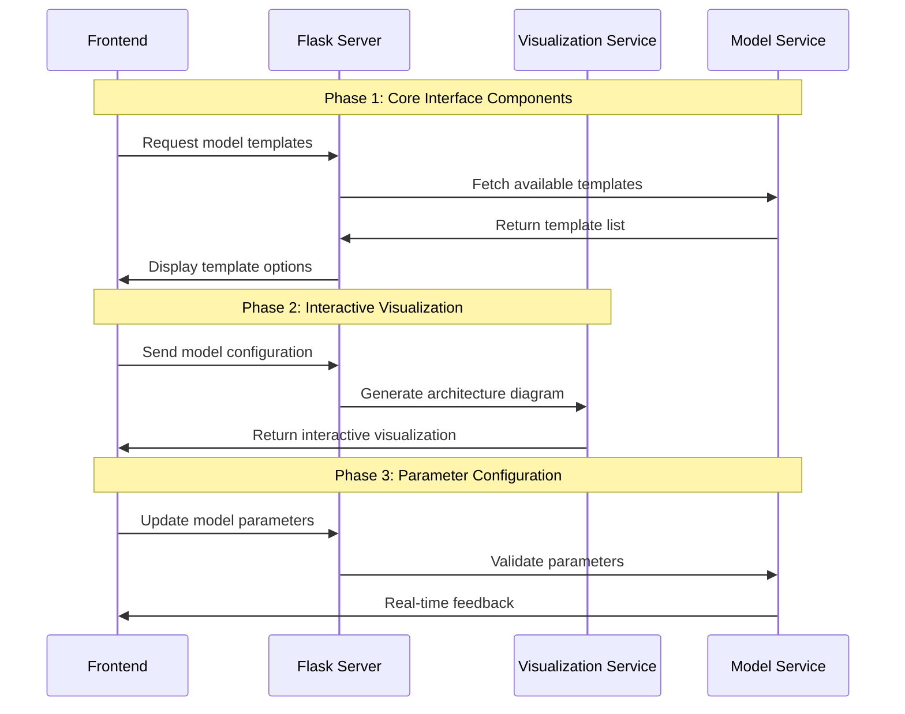
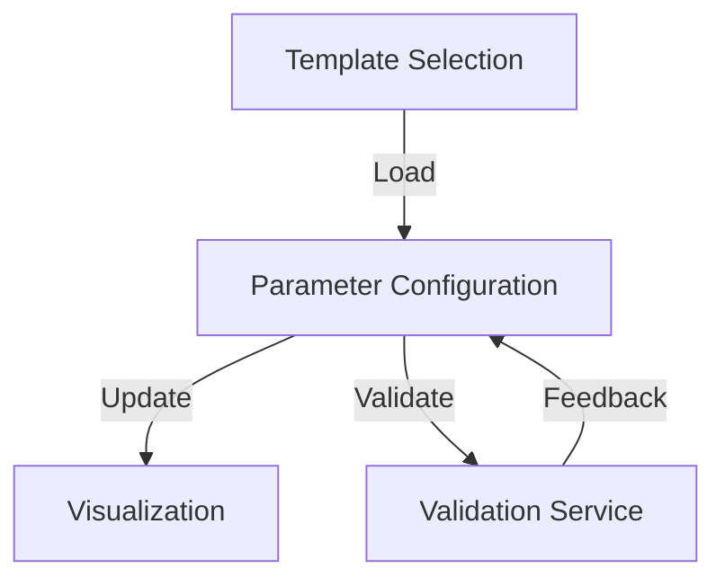

# Model Definition Interface Implementation Plan

## Overview
This plan outlines the implementation of the model definition interface for ImpressionCore's web interface. This is an additive change that preserves all existing functionality while adding new capabilities for model architecture configuration and visualization.

## Implementation Flow



## Implementation Phases

### Phase 1: Core Interface Components
- Add new route `/model-definition` while keeping existing routes intact
- Create new template for model definition interface
- Implement template selection component:
  * Basic transformer
  * MoE architecture
  * Custom configuration option

### Phase 2: Interactive Visualization
- Add visualization panel using D3.js for architecture diagrams
- Implement real-time updates as configurations change
- Add layer-by-layer exploration capability
- Keep visualization separate from existing components

### Phase 3: Advanced Configuration Options
- Add parameter configuration panels for:
  * Layer configuration
  * Attention mechanisms
  * Feed-forward networks
  * Advanced features (LoRA, quantization)
- Implement real-time validation
- Add parameter relationship handling

## Technical Architecture

### New File Structure
```
src/web/
  ├── templates/
  │   └── model_definition.html
  ├── static/
  │   ├── js/
  │   │   ├── model-definition.js
  │   │   └── architecture-viz.js
  │   └── css/
  │       └── model-definition.css
  ├── routes/
  │   └── model_definition.py
```

### New API Endpoints
- `GET /api/model-templates` - Fetch available templates
- `POST /api/validate-configuration` - Validate model parameters
- `POST /api/generate-visualization` - Generate architecture visualization
- `GET /api/parameter-constraints` - Get parameter relationships

### Data Flow


## Integration Points

### Frontend
- New JavaScript modules for template handling and visualization
- D3.js integration for interactive diagrams
- Real-time parameter validation
- WebSocket connection for live updates

### Backend
- New Flask routes for model definition endpoints
- Template management system
- Parameter validation service
- Visualization generation service

## Testing Strategy
- Unit tests for parameter validation
- Integration tests for template loading
- Visual regression tests for diagrams
- End-to-end tests for configuration workflow

## Success Criteria
- Complete model architecture configuration through UI
- Real-time visual feedback on changes
- Successful template loading and customization
- Accurate parameter validation
- Smooth integration with existing components

## Notes
- All new additions will be implemented without modifying existing functionality
- Focus on maintainable and extensible code structure
- Emphasis on user experience and intuitive design
- Clear separation of concerns between components