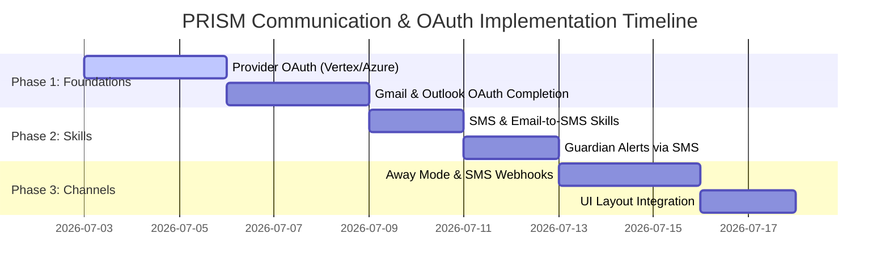

# PRISM Communications & OAuth Integration Roadmap

> [!IMPORTANT]
> This document outlines the architectural proposal, tab placement analysis, skill designs, and phased roadmap for introducing **OAuth LLM Provider authentication**, **Gmail & Outlook OAuth integration**, **SMS & SMS-via-Email Skills**, and **Remote Operator Channels ("Away Mode")**.

---

## 1. Due Diligence Questions & Verification
To ensure the implementation matches your exact intent, please review and answer the following questions:
1. **SMS Gateway Provider:** Which SMS API gateway do you prefer for direct SMS (e.g., Twilio, Plivo)? Or should we rely solely on SMTP email-to-SMS gateways (e.g., `number@txt.att.net`, `number@tmomail.net`) initially?
2. **Provider OAuth Scope:** Which LLM providers (e.g., Google Vertex AI, Azure OpenAI, Hugging Face) do you want to target for OAuth first? (Since OpenAI/Anthropic typically require API keys for API usage, whereas Google/Azure support OAuth/OIDC/Workload Identity).
3. **Away Mode Presence Trigger:** Should "Away Mode" activate automatically (e.g., after 10 minutes of operator dashboard inactivity or closed WebSocket session) or should it be an explicit toggle?
4. **OpenClaw Interface:** How does OpenClaw connect to the PRISM session? Is it via an authenticated HTTP webhook tunnel, or direct WebSocket relay?

---

## 2. Tab Placement Analysis (New Tab vs. Existing Tabs)

We have evaluated two architectural approaches for managing remote operator "Channels" and session communications:

### Option A: A New "Channels" Tab (Recommended if expanding to voice/chatbots)
* **Description:** A dedicated top-level dashboard tab named **"Channels"** (or **"Comms"**).
* **Content:**
  - **Presence Panel:** Away/Active toggle, session relay status, and active routing rules.
  - **Connection Cards:** Status of OAuth-linked channels (Gmail, Outlook, Twilio SMS, Slack, Discord).
  - **Live Remote Activity Feed:** Logs showing inbound/outbound SMS, emails, and agent relays while the operator is away.
* **Trade-offs:** 
  - *Pros:* Clear segregation of communication controls, high visibility for multi-channel workflows, easy to expand.
  - *Cons:* Adds tab bar density; configuration is separated from the "Provider & Settings" tab.

### Option B: Integration into Existing Tabs (Recommended for layout cleanliness)
* **Description:** Distribute the features into existing structures:
  - **Provider & Settings Tab:** Host OAuth connection status (Gmail, Outlook) alongside LLM configurations.
  - **Agentic Control Tab:** Add a **"Remote Operator Portal" (Channels)** collapsible section. This section holds the Away/Active toggle, active session relays, and mobile notification numbers.
  - **Tools & Plugins Tab:** SMS and Email tools appear in the standard Skills catalog.
* **Trade-offs:**
  - *Pros:* Zero tab bar bloat; maintains settings consolidation; ties presence states to Agentic orchestration.
  - *Cons:* Hides the remote communication channels inside collapsible panels.

---

## 3. Specifications & Architecture

### 3.1. OAuth for Providers (Settings Tab)
For each supported LLM provider in the **Provider Configuration** panel, we will introduce a toggle options UI directly above the API Key fields:

```
+-------------------------------------------------------------+
|  [ ] Use OAuth Authentication (Recommended)                |
|  [x] Use API Key Authentication                             |
|                                                             |
|  API Key: [ *************************************** ] [eye] |
+-------------------------------------------------------------+
```
* **Authorization Flow:** Clicking "Use OAuth Authentication" replaces the API key field with a **"🔒 Connect with [Provider]"** button. Clicking this redirects to the provider's OAuth consent screen, retrieves tokens, and secures them in PRISM's `OAuthTokenStore` (DPAPI-encrypted).
* **Providers Targeted:** Google Vertex AI (Google Cloud OAuth) and Microsoft Azure OpenAI (Microsoft Entra ID OAuth).

### 3.2. Communications Skills (Character, Operator, Guardian)
We will define two new system skills in `src/core/skills/`:
1. `skill.communication.send_sms`
   - **Params:** `toPhone` (E.164 format), `message` (string).
   - **Method:** Dispatch via Twilio/Plivo client.
2. `skill.communication.send_email_to_sms`
   - **Params:** `toPhone` (string), `carrier` (att | tmobile | verizon | sprint), `message` (string).
   - **Method:** Map carrier to SMTP gateway and send email via Gmail/Outlook OAuth SMTP transport.

These skills are registered in the `ToolRegistry` and exposed to:
* **Character Agent:** To send status updates, query approvals, or alert the Operator when remote.
* **Operator (CLI/UI):** For manual broadcasts.
* **Guardian Agent:** To alert the operator immediately if a critical security integrity failure is detected during background scans.

### 3.3. Remote Channels & "Away Mode"
* **Concept:** When the operator sets their status to **"Away"** (or disconnects from the dashboard), PRISM activates the remote channel loop.
* **Relay Logic:** 
  - If a Character Agent needs an operator decision (e.g. tier 3 tool execution approval), instead of waiting indefinitely in the UI queue, it formats the request and invokes `skill.communication.send_sms` (or email-to-sms).
  - The operator can reply to the SMS (e.g. "APPROVE" or "DENY"). The inbound SMS webhook handler processes the response, validates the phone signature, maps it to the pending CAC transaction, and advances the workflow.

---

## 4. Implementation Roadmap



### Phase 1: Provider & Channel OAuth Completion
1. Implement authorization code flow for Google Vertex AI and Microsoft Azure.
2. Integrate provider token exchange handlers into `routes/oauth-handler.ts`.
3. Complete UI settings wiring to toggle between API Key and OAuth options.

### Phase 2: Communication Skills
1. Create skill definitions for SMS and SMTP email-to-SMS.
2. Update the `GuardianAgent` to trigger SMS notifications on high-severity security integrity alerts.
3. Add unit test suites verifying token storage and SMTP transport fallback options.

### Phase 3: Away Mode & Webhook Channel
1. Implement the inbound webhook route `/api/webhooks/sms` to receive and parse remote operator replies.
2. Integrate with the `Orchestrator` approval queue to resolve pending CAC decisions from remote responses.
3. Incorporate the new controls into the dashboard UI (tab layout decision pending your review).

---

## 5. Next Steps
1. **Provide Feedback:** Please review the due diligence questions in Section 1 and state your tab preference in Section 2 (Option A vs. Option B).
2. **Approval:** Once you approve the strategy, we will update the master `docs/ROADMAP.md` and `docs/PRISM_PRD.md` with these specifications, ready for the coding phase.
