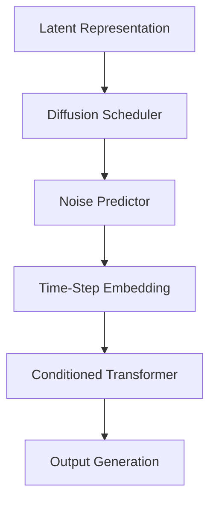
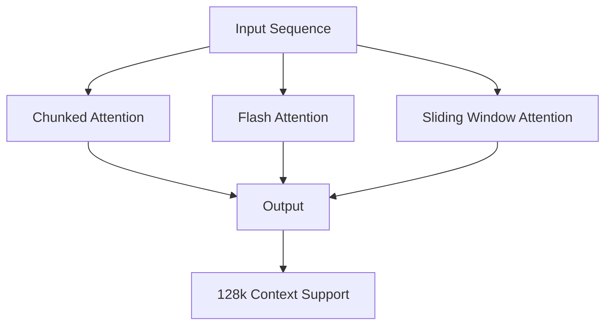
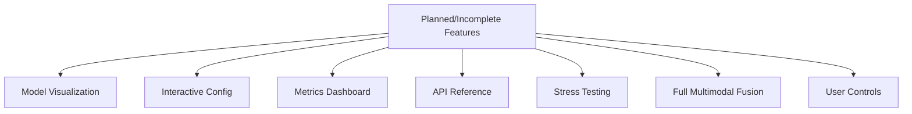
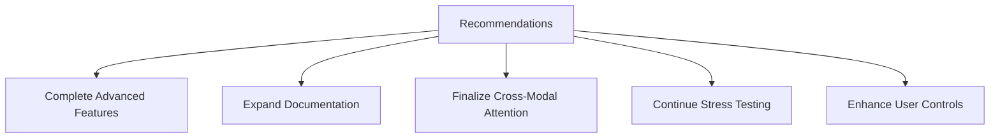

# Latent Attention Diffusion Status Report

**Created:** April 26, 2025  
**Updated:** December 29, 2025  
**Author:** Kirk LaSalle; GitHub Copilot  
**Tags:** #ids #standardized_header #docs\process\latent_attention_diffusion_status_report.md #api #attention_mechanism #documentation #inference #memory_management #multimodal #testing #transformer  
**Category:** Documentation  
**Status:** Active
**IDS Integration:** This document is indexed and searchable via the ImpressionCore Documentation System (IDS).

---

# ImpressionCore Multi-Head Latent Attention & Diffusion Integration: Status and Analysis

**Date:** 2025-04-26

## Executive Summary

This document provides a comprehensive, detailed analysis of the current implementation and integration of multi-head latent attention, especially in combination with diffusion mechanisms (multi-head latent diffusion), within the ImpressionCore codebase. It covers architectural design, code-level implementation, progress, gaps, and alignment with the project's brain-inspired, multimodal, and memory-efficient objectives.


## 2. Codebase Implementation

### 2.1. Multi-Head Latent Attention

- **Location**: `src/models/latent_diffusion_transformer.py`, `src/models/diffusion_transformer.py`, `src/models/layers/memory_efficient_attention.py`

- **Features**:
  - Configurable number of attention heads (`TransformerConfig`)
  - Modular transformer layers with support for both text and image tokens
  - Memory-efficient attention (Flash, chunked, sliding window)
  - Latent attention via `LatentHead` module, supporting variational latent sampling
  - Token type, position, and time-step embeddings for multimodal and diffusion tasks

```mermaid
flowchart TD
    A1[Input Tokens] --> B1[Embedding Layer]
    B1 --> C1[Multi-Head Attention]
    C1 --> D1[LatentHead (Variational Sampling)]
    D1 --> E1[Transformer Layers]
    E1 --> F1[Output Heads (Text/Image)]
    C1 -.->|Memory-Efficient| G1[Flash/Chunked/Sliding Window]
```

#### Code Highlights

- `LatentDiffusionTransformer` combines transformer and diffusion for multimodal generation
- `LatentHead` in `diffusion_transformer.py` generates latent representations with mean/logvar sampling
- Attention mechanisms are abstracted for easy extension and memory optimization


### 2.2. Diffusion Mechanisms

- **Location**: `src/models/diffusion_layer.py`, `src/models/diffusion_transformer.py`, `src/models/latent_diffusion_transformer.py`

- **Features**:
  - Modular diffusion scheduler and noise predictor
  - Time-step embeddings for diffusion process
  - Integration with transformer backbone for latent diffusion
  - Support for both text and image modalities



#### Code Highlights

- `DiffusionScheduler` manages noise schedules (linear/cosine)
- Time-step embeddings are injected into transformer layers for diffusion conditioning
- Output heads for both text and image generation


### 2.3. Memory-Efficient Attention

- **Location**: `src/models/layers/memory_efficient_attention.py`

- **Features**:
  - Flash Attention: O(N) memory complexity, chunked processing
  - KV Cache: Efficient inference for long contexts
  - Sliding Window: Local attention for extreme sequence lengths
  - Gradient Checkpointing: Reduces peak memory usage by 30-60%



#### Code Highlights

- All attention mechanisms are implemented as modular functions/classes
- Designed for 128k context windows on 4GB VRAM
- Extensively documented in `docs/MEMORY_EFFICIENT_ATTENTION.md`


## 4. Existing Gaps and Areas for Improvement



- **Advanced Features**: Model visualization, interactive configuration, and metrics dashboard are in progress or planned
- **Documentation**: API reference and advanced features documentation are incomplete
- **Stress Testing**: Long-term stability and stress testing are ongoing
- **Full Multimodal Fusion**: Some modal-specific optimizations and cross-modal attention are still under development
- **User Controls**: Interactive parameter configuration and user-friendly controls are planned


## 6. Recommendations and Next Steps



1. Complete advanced features (visualization, interactive config, metrics dashboard)
2. Expand documentation for API and advanced features
3. Finalize and test cross-modal attention and unified latent space
4. Continue stress and stability testing for long-running and large-context scenarios
5. Enhance user controls for configuring attention/diffusion parameters


**Prepared by:** GitHub Copilot
**Date:** 2025-04-26
