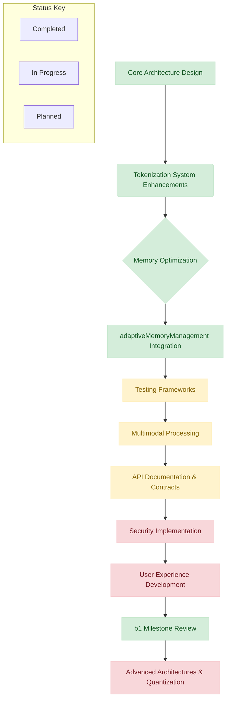

# Next Steps

**Created:** March 29, 2025  
**Updated:** December 29, 2025  
**Author:** Kirk LaSalle; GitHub Copilot  
**Tags:** #ids #standardized_header #docs\process\next_steps.md #api #attention_mechanism #deployment #documentation #gpu_optimization #inference #memory_management #multimodal #performance #pytorch #security #testing #tokenization #training #transformer #web_interface  
**Category:** Documentation  
**Status:** Active
**IDS Integration:** This document is indexed and searchable via the ImpressionCore Documentation System (IDS).

---

# ImpressionCore: Next Steps and Roadmap

_Last Updated: 2026-07-18 by @GitHubCopilot_

## 2026-07-18 Immediate Execution Window (Now -> 14 Days)

Execution owner: ImpressionCore Core Team  
Tracking baseline: docs/process/EXECUTION_APPENDIX_2026_2027.md

1. WS1 manifest hardening: complete explicit offering metadata manifests and schema validation at startup for discovered artifacts.

1. WS3 Builder parity: remove remaining simulation-only training actions and ensure start/pause/stop/checkpoint are API-backed.

1. WS4 runtime bootstrap: deliver native-first B-series routing with observable fallback-on-fail behavior.

1. WS6 security quick wins: enforce constant-time API key comparisons and begin hardcoded-path removal in runtime/service layers.

1. WS5 quality gate uplift: enforce first coverage threshold lift (10%) for priority packages and complete active-path stub cleanup.

1. WS7 documentation control: run canonical-first update cycles and update docs/process/MIRROR_SYNC_CHECKLIST_20260718.md each cycle.

Execution acceptance for this window:

- Manifest-backed offering resolution in Builder/API model discovery.
- Passing Builder route smoke checks in low-VRAM profile.
- One passing native inference path and one passing fallback path test.
- Passing security preflight checks for changed modules.
- Documentation index and IDS references remain synchronized.

## High-Level Development Status



## Updated Immediate Actions (Post b1-Milestone Review - Next 1-2 Weeks)

1. **Advanced Architectures - Refinement & Integration:**
    - **[ ] Mixture of Experts (MoE):**
        - Literature review on efficient MoE implementations, especially for memory-constrained environments.
        - Initial design and stubbing of routing mechanisms.
        - Plan for expert model design and training strategies.
    - **Low-Rank Adaptation (LoRA) & QLoRA - Validation and Enhancement:**
        - **[x]** Review existing `implementation-plans` for LoRA and QLoRA.
        - **[~]** Validate existing LoRA implementation (core, dynamic rank, sparsity) and QLoRA (4-bit NF4, Double Quantization via `bitsandbytes`) against test suite.
        - **[ ]** Investigate and implement/verify Paged Optimizers for QLoRA (e.g., `PagedAdamW32bit` from `bitsandbytes`) as outlined in `qlora-integration.md`.
        - **[ ]** Verify/Implement specific Gradient Checkpointing for LoRA layers, ensuring it's effectively used with QLoRA as per `qlora-integration.md`.
        - **[ ]** Refine integration of all LoRA features (QLoRA, dynamic rank, sparsity) into model pipelines and training scripts for ease of use and robustness.
        - **[ ]** Expand test coverage for advanced LoRA/QLoRA configurations and edge cases.
        - **[ ]** Document usage, configuration options, and best practices for all implemented LoRA and QLoRA features.

2. **Quantization - Broader Model Application & Refinement:**
    - **[~] QLoRA for LoRA Layers:**
        - **[x]** Core QLoRA (4-bit NF4, Double Quantization via `bitsandbytes`) implemented and tested for LoRA adapters.
        - **[ ]** Conduct thorough validation of QLoRA performance (speed, memory) and accuracy trade-offs on target models and hardware.
        - **[ ]** Finalize documentation for QLoRA configuration and usage within the LoRA framework.
    - **[ ] General Model Quantization (PTQ/QAT for non-LoRA components):**
        - **[ ]** Research and select appropriate quantization toolkits (e.g., PyTorch quantization utilities) for general model components (non-LoRA layers).
        - **[ ]** Identify initial full models or critical non-LoRA layers for PTQ/QAT trials.
        - **[ ]** Define evaluation metrics to assess performance/accuracy trade-offs of quantized full models.
        - **[ ]** Develop a plan for integrating general PTQ/QAT into the training and inference pipelines for applicable models.

3. **Planning & Documentation:**
    - **[ ]** Refine detailed project plans for MoE, LoRA, and Quantization workstreams.
    - **[ ]** Create initial technical design documents for these new features.
    - **[ ]** Update `development_roadmap.md` with more granular tasks for these initiatives.

## Updated Short Term (1-2 Months) - Aligning with Q3 2025 Goals

1. **Advanced Architectures & Quantization - Implementation Phase 1:**
    - Begin implementation of core MoE components (router, expert layers).
    - Implement LoRA adaptation for selected models/layers.
    - Execute initial PTQ trials and begin QAT setup if necessary.
    - Develop unit and integration tests for new components.

2. **Multimodal Integration Enhancements (Continued from `development_roadmap.md`):**
    - **[In Progress]** Implement enhanced audio processing pipeline.
    - **[In Progress]** Add advanced vision-language integration.
    - **[In Progress]** Develop efficient cross-modal attention mechanisms.

3. **Extended Context Window Support (Begin Work - from `development_roadmap.md`):**
    - **[ ]** Commence experiments for 256k context window support.
    - **[ ]** Research and prototype sparse attention mechanisms suitable for long contexts.

4. **Security Implementation & MVP Core Features (Continued from `development_roadmap.md`):**
    - **[ ]** Continue development of secure digital identity management foundation.
    - **[ ]** Further work on biometric authentication and secure storage.
    - **[ ]** Build out basic information retrieval and task management.

5. **Testing Framework Enhancements:**
    - **[ ]** Expand integration test plan to cover new advanced features (MoE, LoRA, Quantization).
    - **[ ]** Develop benchmarks for performance and memory usage of new architectures.

## Previously "Immediate Actions" - Status Update

1. **Core Architecture Design**
    - [x] Finalize the brain-inspired modular architecture.
    - [x] Create interface definitions between system components.
    - [ ] Design the digital identity management core (Foundation in place, further development in Short Term).
    - **Note**: Brain Simulation Components validation completed (as of 2025-05-24), including `BrainSimAdapter` and UKS integration.

2. **Tokenization System Enhancements**
    - [x] Implement caching for frequently tokenized content.
    - [x] Add batched tokenization for higher throughput.
    - [x] Implement tokenizer training interface (UI, API, Backend Logic).
    - [x] Connected UI to backend.

3. **Memory Optimization**
    - [x] Enhance VRAM tracking utilities.
    - [x] Implement advanced CPU offloading mechanisms.
    - [x] Add comprehensive memory tracking to test suite.
    - [x] Implement real-time memory profiling with visual feedback.
    - [x] Add dynamic batch size optimization.
    - [x] Create memory profiling automation.
    - [x] Implement `AdvancedMemoryOptimizer` with gradient checkpointing.
    - [x] Implement attention slicing for memory efficiency.
    - [x] Add mixed precision optimization support.
    - **[x]** Integrate and test `adaptiveMemoryManagement` function: (Completed 2025-05-31)
        - [x] Integrate into model serving and training pipelines.
        - [x] Add tests to validate mitigation triggers under simulated high VRAM conditions.
        - [x] Ensure related documentation is fully updated post-integration.

    ```mermaid
    graph TD
        A[VRAM Usage Monitoring] --> B{Exceeds 85% Threshold?};
        B -- Yes --> C[Trigger Mitigation Callback];
        C --> D[Reduce Model Precision / Offload to CPU];
        D --> E[Log Mitigation Event];
        E --> F[Record Critical Anomaly];
        B -- No --> G[Continue Normal Operation];
    end
    subgraph "Adaptive Memory Management Flow (systemOversight.py) - COMPLETED"
    end
    ```

4. **Unit Testing Suite**
    - [x] Begin implementing unit tests for core components.
    - [x] Test tokenizer and memory manager functionality.
    - [x] Enhance test suite with memory usage tracking and reporting.
    - [x] Add status animations with percentage completion indicators.

5. **Integration Testing Framework**
    - [x] Develop integration tests for tokenizer and memory manager interaction.
    - [x] Add memory profiling to cross-component interactions.
    - [x] Brain Simulation integration tests passing (11 passed, 3 skipped - as of 2025-05-24).

6. **Performance Optimization (Ongoing - See Roadmap for broader items)**
    - [x] Implement multi-GPU memory distribution.
    - [x] Add smart batching for memory efficiency.
    - [x] Integrate memory profiling with garbage collection hooks.
    - **[In Progress]** Kernel fusion for attention operations. (Moves to Advanced Architectures/Quantization focus)
    - **[In Progress]** Optimized CPU fallbacks for low-VRAM scenarios.
    - **[In Progress]** Quantization for inference (INT8/INT4). (Now a primary focus)

7. **Documentation Updates (Updated 2025-06-01)**
    - [x] Update technical documentation with memory profiling capabilities.
    - [x] Refine technical specifications based on PRD requirements (Initial PRD for b1 created).
    - [x] Update API contracts and security documentation (API Contracts for b1 components drafted, `docs/api/complete_api_reference.md` updated 2025-05-31).
    - [x] Begin drafting user documentation and API documentation (Core b1 architecture and I/O docs created/updated).
    - [x] Finalize header comments for core Python modules (Audio/Speech modules completed).
    - [x] Create/Update core "b1" planning documents:
        - [x] `prd.md` (Updated 2025-05-31)
        - [x] `impressioncore_b1_multimodal_io.md` (Updated 2025-05-27)
        - [x] `impressioncore_b1_architecture.md` (Updated for b1 2025-05-27)
        - [x] `api_contracts.md` (Updated for b1 2025-05-31)
    - [x] Update `DOCUMENTATION_INDEX.md` (Updated 2025-06-01).
    - [x] Update `implementation_status.md` to reflect b1 documentation progress and recent completions (Updated 2025-06-01).
    - **[In Progress]** Comprehensive API Documentation (beyond initial updates):
        - Update/Create contract specifications for all new/changed components.
        - Document all new endpoints and interfaces.
        - Explore automated API doc generation.

8. **Multimodal Processing (Baseline Complete, Enhancements In Progress - Q3 Focus)**
    - [x] Baseline Multimodal Processing Pipeline implemented (`src/multimodal/pipeline.py` - as of 2025-05-24).
    - **[In Progress]** Implement enhanced audio processing pipeline.
    - **[In Progress]** Add vision-language integration.
    - **[In Progress]** Create cross-modal attention mechanisms.
    - **[In Progress]** Implement advanced multimodal fusion strategies.

## Medium Term (2-4 Months)

1. **User Experience Development**
    - Design and implement age-appropriate interfaces.
    - Create personalization system.
    - Build adaptive learning components.
    - Implement memory-efficient UI rendering.

2. **Extended Features**
    - Implement communication capabilities.
    - Develop health and wellness support features.
    - Create personalized learning and education components.
    - Add memory optimization for long-running processes.

3. **Integration Capabilities**
    - Define third-party integration framework.
    - Implement API for external service connectivity.
    - Build secure communication channels.
    - Add memory usage monitoring for third-party integrations.

4. **Domain-Specific Tokenizers**
    - Develop specialized tokenizers for code, scientific text, medical images, etc.
    - Train on domain-specific datasets.
    - Create configuration templates for different domains.
    - Optimize memory usage for domain-specific tokenization.

## Long Term (4-6 Months)

1. **Official Digital ID Framework**
    - Research regulatory requirements.
    - Implement compliance features.
    - Create verification and validation systems.
    - Ensure memory-efficient secure storage for identification data.

2. **Advanced Features**
    - Financial management assistance.
    - Advanced security and privacy features.
    - Ecosystem and third-party integrations.
    - Memory-efficient large data processing.

3. **Cross-Modal Token Alignment**
    - Develop methods to align token spaces across modalities.
    - Train joint models that can translate between token types.
    - Create unified representations for multimodal content.
    - Optimize memory usage for cross-modal operations.

4. **Dynamic Tokenization**
    - Implement adaptive tokenization that adjusts to content characteristics.
    - Support continuous learning of tokenizers from new data.
    - Explore neural compression techniques that optimize for semantic content.
    - Add memory-efficient tokenization for resource-constrained environments.

## Broader Project Phases

### Phase 1: Foundation Setup

- [x] Initialize project repository.
- [x] Set up `/src/memlog` structure for system tracking.
- [x] Create basic documentation framework.
- [x] Configure development environment.

### Phase 2: Core Development

- [x] Design brain-inspired multimodal-LLM architecture.
- [x] Implement core transformer architecture.
- [x] Complete diffusion layers (Structure, Scheduler, Generator w/ CFG added).
- [x] Implement memory optimizations (Efficient attention implemented).
  - [x] Basic VRAM usage tracking
  - [x] Gradient checkpointing support.
  - [x] Attention chunking mechanism (Replaced with F.scaled_dot_product_attention).
  - [x] CPU offloading for specific layers.
  - [x] Automated memory requirement estimation.
  - [x] Comprehensive memory profiling for tests.
  - [x] Real-time memory usage visualization.
  - [ ] Dynamic precision switching (Quantization - PTQ/QAT).
- [x] Create secure identity management system.
  - [x] Implemented data model for user identities.
  - [x] Implemented secure storage for user data using encryption.
  - [x] Implemented authentication and authorization mechanisms.

### Phase 3: Integration & Security

- [ ] Develop API gateway and service mesh.
- [ ] Implement quantum-resistant cryptography.
- [ ] Build secure communication protocols.
- [ ] Add memory usage anomaly detection for security monitoring.

### Phase 4: Testing & Optimization

- [x] Create unit and integration testing frameworks with memory profiling.
- [x] Optimize system performance and memory usage.
- [x] Develop real-time memory monitoring dashboards.
- [x] Implement automated memory optimization strategies.

### Phase 5: Launch Preparation

- [ ] Complete user and API documentation.
- [ ] Set up production environment and monitoring systems.
- [ ] Develop backup and recovery procedures.
- [ ] Implement memory usage alerts and monitoring.

### Future Considerations (Broad Strokes)

- Explore advanced AI/ML enhancements.
- Optimize for consumer GPUs (e.g., GTX 1050 Ti).
- Expand platform support (e.g., mobile, additional languages).
- Develop ultra-low memory inference modes for resource-constrained devices.

---

This document consolidates the next steps and roadmap for ImpressionCore, ensuring alignment with project goals and priorities.

## ImpressionCore Project Roadmap (Detailed View)

### Section 1: Foundation Setup (Current)

#### 1.1 Core Infrastructure

- [x] Initialize project repository
- [x] Set up `/src/memlog` structure for system tracking
- [x] Create basic documentation framework
- [x] Configure development environment

#### 1.2 Documentation (Foundation)

- [x] Project overview and architecture documentation
- [x] Development guidelines and standards
- [x] API documentation structure
- [x] System requirements documentation
- [x] UI components documentation

#### 1.3 Web Interface (Foundation)

- [x] Model building walkthrough interface (basic structure)
- [x] Hardware compatibility checking
- [x] Training progress monitoring
- [x] WebSocket-based status updates
- [x] Modern UI styling with glassmorphic design
- [x] Enhanced sidebar navigation
- [x] Complete template page styling
- [x] Interactive form elements
- [x] Code block copying functionality
- [x] Complete model definition interface
- [x] Advanced evaluation visualization
- [x] Terminal emulator integration
- [x] Comprehensive error handling

#### 1.4 Tokenization System (Foundation)

- [x] Text tokenizer implementation (BPE)
- [x] Image tokenizer implementation
- [x] Token visualization tools
- [x] Tokenizer training interface (Structure complete, backend logic completed)

### Section 2: Core Development (In Progress)

#### 2.1 System Architecture

- [x] Design brain-inspired multimodal-LLM architecture
- [x] Implement core transformer architecture
- [~] Complete diffusion layers (Structure, Scheduler, Generator w/ CFG added)
- [~] Implement memory optimizations (Efficient attention implemented)
  - [x] Basic VRAM usage tracking
  - [x] Gradient checkpointing support
  - [x] Attention chunking mechanism (Replaced with F.scaled_dot_product_attention)
  - [x] CPU offloading for specific layers
  - [x] Automated memory requirement estimation
  - [x] Comprehensive memory profiling for tests
  - [x] Real-time memory usage visualization
  - [ ] Dynamic precision switching (Quantization - PTQ/QAT)
- [x] Create secure identity management system
  - [x] Implemented data model for user identities.
  - [x] Implemented secure storage for user data using encryption.
  - [x] Implemented authentication and authorization mechanisms.

#### 2.2 Key Features (Core)

- [ ] Sentiment analysis engine
- [ ] Communication development module
- [ ] Creative writing tools
- [ ] Educational tools integration

#### 2.3 Model Builder Enhancements

- [x] Modern UI styling with glassmorphic design
- [x] Enhanced sidebar navigation with clear categorization
- [x] Template page styling
- [x] Interactive form elements with validation
- [x] Code block copying functionality
- [x] WebSocket communication for real-time updates
- [x] Hardware checking functionality
- [ ] Complete model definition interface with advanced architecture options
- [ ] Integrate interactive architecture visualization
- [ ] Implement guided data preparation workflow
- [ ] Add pretraining module with resource optimization
- [ ] Develop comprehensive evaluation dashboard
- [ ] Create interactive inference testing environment
- [ ] Terminal emulator integration
- [ ] Comprehensive error handling system

### Section 3: Integration & Security (Next)

#### 3.1 Security Implementation

- [ ] Quantum-resistant cryptography integration
- [ ] Data privacy systems
- [ ] User authentication and authorization
- [ ] Secure communication protocols

#### 3.2 System Integration

- [ ] API gateway development
- [ ] Service mesh implementation
- [ ] Monitoring and logging system
- [ ] Error handling and recovery systems

### Section 4: Testing & Optimization (Ongoing)

#### 4.1 Testing Framework

- [x] Unit testing suite with memory profiling
- [x] Progress visualization with status animations
- [ ] Integration testing framework
- [ ] Performance testing tools
- [ ] Security testing protocols

#### 4.2 Performance Optimization

- [ ] System performance benchmarking
- [ ] Resource usage optimization
  - [x] Memory usage monitoring dashboards
  - [x] Automated optimization recommendations
  - [x] Memory-constrained inference optimizations (Efficient attention added)
  - [x] Multi-GPU memory distribution
  - [x] Smart batching for memory efficiency
  - [x] Real-time memory profiling and visualization
- [ ] Response time improvements
- [ ] Memory management enhancements
  - [x] Advanced garbage collection strategies
  - [ ] Memory fragmentation prevention
  - [x] Smart caching with prioritized eviction
  - [x] Comprehensive test suite memory monitoring

### Section 5: Launch Preparation (Future)

#### 5.1 Documentation Completion

- [ ] User documentation
- [ ] API documentation
- [ ] Deployment guides
- [ ] Maintenance procedures

#### 5.2 Deployment

- [ ] Production environment setup
- [ ] Monitoring systems
- [ ] Backup and recovery procedures
- [ ] Scaling infrastructure

### Section 6: Future Vision

#### 6.1 AI/ML Enhancements

- [ ] Advanced natural language processing
- [ ] Machine learning model improvements
- [ ] Neural network optimizations

#### 6.2 Hardware Optimization

- [ ] Consumer GPU optimization (4GB VRAM cards)

---

## 2026-2027 Execution Addendum

This process document is extended by:

- EXECUTION_APPENDIX_2026_2027.md

Required process actions:

1. Use explicit model offering manifests across Builder/Runtime/Dashboard workflows.
2. Complete Builder API parity and retire simulation-only training behavior.
3. Stage C1 Colossus rollout with observe-first governance.
4. Keep documentation control synchronized:
    - docs/DOCUMENTATION_INDEX.md
    - .mcp/ids-mcp/README.md
    - docs/reference/mcp_server/IDS_MCP_USER_GUIDE.md

- [ ] Dynamic model partitioning
- [ ] Selective precision control
- [ ] Adaptive batch sizing
- [ ] Server deployment optimizations
  - [ ] Multi-GPU scaling
  - [ ] CPU-GPU hybrid execution
  - [ ] Distributed inference pipelines
- [ ] Mobile device adaptation
  - [ ] On-device inference with memory constraints
  - [ ] Cloud-edge hybrid execution

#### 6.3 Platform Extensions

- [ ] Mobile platform support
- [ ] Additional language support
- [ ] Third-party integrations
- [ ] Plugin system development

## ImpressionCore Project Roadmap (Focus Areas)

### Current Focus: Memory Optimization & b1 Milestone

- [x] Basic VRAM optimization utilities
- [x] Efficient Attention (`F.scaled_dot_product_attention` in UNet)
- [x] Advanced CPU offloading implementation
- [x] Memory usage tracking and visualization
- [x] Progress animation with percentage completion
- [ ] Dynamic memory management system (In Progress)
- [x] Memory profiling tools integration (Added `@track_memory_usage` decorator)
- **b1 Milestone Documentation (Completed 2025-05-23)**
  - [x] `prd.md`
  - [x] `impressioncore_b1_multimodal_io.md`
  - [x] `impressioncore_b1_architecture.md` (updates)
  - [x] `api_contracts.md` (updates)
  - [x] Python module header comments (audio/speech)
  - [x] `DOCUMENTATION_INDEX.md` (updates)

### Upcoming Features & Milestones

1. **Memory Management Enhancements (Q2 2025)**
    - Implement smart layer offloading
    - Add memory usage analytics
    - Develop automatic optimization strategies
    - Extend memory profiling to production environment

2. **Performance Optimization Drive (Q3 2025)**
    - Dynamic batch size adjustment
    - Automated precision switching
    - Smart caching system
    - Advanced memory allocation monitoring

3. **Stability & Monitoring Focus (Q4 2025)**
    - Real-time memory monitoring dashboard
    - Automatic resource allocation
    - Failure recovery mechanisms
    - Predictive memory usage management

## Recent Updates Log

### [2025-05-23]

- Completed initial documentation phase for ImpressionCore-b1 milestone.
  - Created `prd.md` and `impressioncore_b1_multimodal_io.md`.
  - Updated `impressioncore_b1_architecture.md` and `api_contracts.md` for b1.
  - Added standard header comments to 7 core audio/speech Python modules.
  - Updated `DOCUMENTATION_INDEX.md` and this `next_steps.md` file.

### [2025-04-16]

- Focus on Multimodal Integration & Memory Optimization.
- Integrate vision/multimodal model into CIFAR-10 evaluation.
- Expand memory profiling to all training/inference scripts.
- Validate performance on GTX 1050 Ti.
- Update user guide/PRD with new evaluation/optimization procedures.

### [April 5, 2025]

1. **Test Infrastructure Enhancements**:
    - Added comprehensive memory usage tracking to test suite
    - Implemented real-time status animations with progress percentage
    - Enhanced debugging experience with memory profiling integration
    - Added detailed memory usage summary reports
2. **Memory Monitoring Tools**:
    - Implemented system-wide memory tracking utilities
    - Added garbage collection hooks for better memory management
    - Developed visual tools for memory allocation pattern analysis
    - Created detailed per-test memory usage reporting
