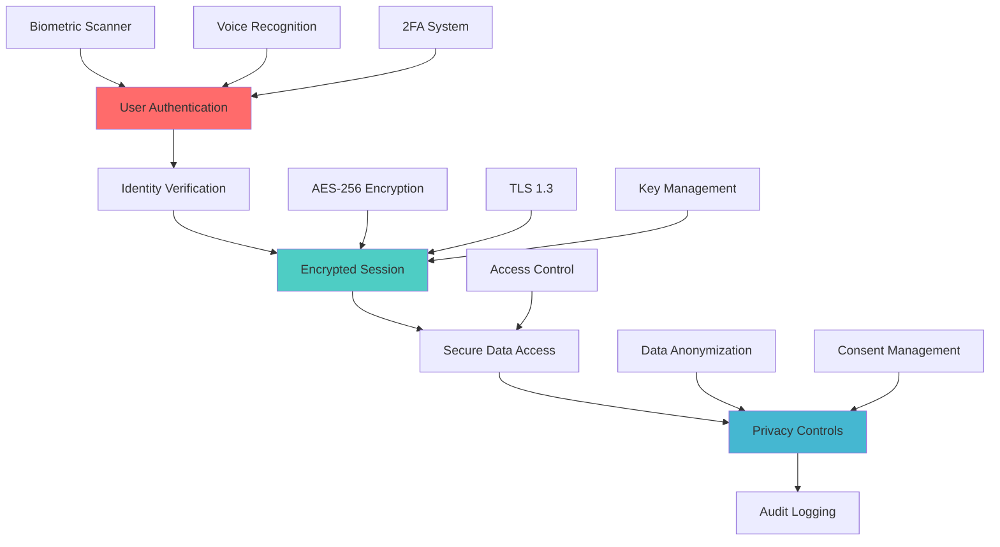
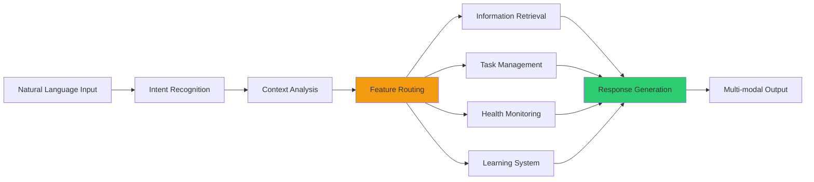

# Phase 8 Implementation Plan: Security Hardening & MVP Core Features

**Created:** May 31, 2025  
**Updated:** December 29, 2025  
**Author:** Kirk LaSalle; GitHub Copilot  
**Tags:** #ids #standardized_header #docs\process\phase_8_implementation_plan.md #api #deployment #documentation #inference #memory_management #multimodal #security #testing  
**Category:** Documentation  
**Status:** Active
**IDS Integration:** This document is indexed and searchable via the ImpressionCore Documentation System (IDS).

---

## Executive Summary

Phase 8 represents a critical milestone in the ImpressionCore development roadmap, focusing on **Security Hardening & MVP Core Features**. Building upon the completed Phase 7B Advanced Progressive Generation UI, Phase 8 establishes the foundational security infrastructure and core feature set necessary for a production-ready MVP deployment.

## 🎯 Phase 8 Objectives

### Primary Goals

1. **Security Infrastructure Implementation** - Establish comprehensive security framework
2. **MVP Core Features Development** - Build essential user-facing functionality  
3. **Production Readiness** - Prepare system for public release candidate
4. **Hardware Optimization** - Optimize for GTX 1050 Ti production deployment

### Success Criteria

- ✅ Complete security hardening with authentication and encryption
- ✅ Implement core MVP features for end users
- ✅ Achieve production-grade stability and performance
- ✅ Maintain <4GB VRAM usage on target hardware
- ✅ Pass comprehensive security and penetration testing

## 📋 Phase 8 Component Breakdown

### Phase 8A: Security Infrastructure Foundation

**Duration:** 2-3 weeks  
**Priority:** Critical  

#### 8A.1 Authentication & Identity Management

- **Biometric Authentication Integration**
  - Fingerprint authentication support
  - Voice authentication with speaker verification
  - Multi-factor authentication framework
  - Secure session management

- **Digital Identity Management Core**
  - Quantum-resistant cryptographic implementation
  - Personal identification secure storage
  - Privacy-first data handling protocols
  - Identity verification and validation

#### 8A.2 Data Security & Encryption

- **End-to-End Encryption**
  - AES-256 encryption for data at rest
  - TLS 1.3 for data in transit
  - Secure key management system
  - Hardware security module integration

- **Privacy Controls**
  - Data access management framework
  - User consent and preference system
  - Data anonymization and pseudonymization
  - GDPR/CCPA compliance infrastructure

#### 8A.3 Security Monitoring & Anomaly Detection

- **Real-time Security Monitoring**
  - Intrusion detection system
  - Behavioral anomaly detection
  - Memory usage security monitoring
  - Audit logging and forensics

### Phase 8B: MVP Core Features Implementation

**Duration:** 3-4 weeks  
**Priority:** High  

#### 8B.1 Personal Assistant Core

- **Information Retrieval System**
  - Natural language query processing
  - Multi-source information aggregation
  - Contextual response generation
  - Knowledge base integration

- **Task Management & Reminders**
  - Intelligent task scheduling
  - Context-aware reminders
  - Priority-based task organization
  - Cross-device synchronization

#### 8B.2 Accessibility & User Experience

- **Accessibility Interface Foundation**
  - Screen reader compatibility
  - Voice navigation system
  - Visual impairment support
  - Motor disability accommodations

- **Adaptive User Interface**
  - Personalized UI customization
  - Accessibility preference learning
  - Multi-modal interaction modes
  - Responsive design implementation

#### 8B.3 Wellness & Growth Features

- **Health Monitoring Integration**
  - Basic health metric tracking
  - Wellness goal setting
  - Progress visualization
  - Health reminder system

- **Learning & Development**
  - Personalized learning recommendations
  - Skill development tracking
  - Educational content curation
  - Progress assessment tools

### Phase 8C: Integration & Production Optimization

**Duration:** 2-3 weeks  
**Priority:** Medium-High  

#### 8C.1 System Integration

- **Component Integration Testing**
  - Security-feature integration validation
  - End-to-end workflow testing
  - Performance regression testing
  - Memory optimization validation

- **API Standardization**
  - RESTful API finalization
  - GraphQL endpoint implementation
  - API versioning strategy
  - Documentation completion

#### 8C.2 Performance & Scalability

- **GTX 1050 Ti Optimization**
  - Memory usage optimization
  - Inference speed improvements
  - Thermal management
  - Power efficiency optimization

- **Deployment Preparation**
  - Container orchestration setup
  - CI/CD pipeline implementation
  - Monitoring and alerting systems
  - Backup and recovery procedures

## 🛠️ Technical Implementation Details

### Security Architecture

### MVP Feature Integration

## 📊 Phase 8 Development Timeline

### Week 1-2: Phase 8A Security Infrastructure

- Authentication system implementation
- Encryption framework setup
- Security monitoring deployment
- Initial penetration testing

### Week 3-4: Phase 8A Security Hardening

- Identity management completion
- Privacy controls implementation
- Security audit and fixes
- Compliance validation

### Week 5-6: Phase 8B Core Features - Personal Assistant

- Information retrieval system
- Task management implementation
- Natural language processing enhancement
- Cross-feature integration

### Week 7-8: Phase 8B Core Features - Accessibility & Wellness

- Accessibility framework implementation
- Health monitoring integration
- Learning system development
- User experience optimization

### Week 9-10: Phase 8C Integration & Optimization

- Component integration testing
- Performance optimization
- Production deployment preparation
- Final security review

## 🎯 Success Metrics & KPIs

### Security Metrics

- **Authentication Success Rate:** >99.9%
- **Encryption Coverage:** 100% of sensitive data
- **Security Incident Response:** <5 minutes
- **Compliance Score:** 100% (GDPR/CCPA)

### Performance Metrics

- **Memory Usage:** <3.8GB VRAM (95% of GTX 1050 Ti)
- **Response Time:** <500ms for core features
- **Uptime:** >99.9% availability
- **CPU Usage:** <80% on target hardware

### User Experience Metrics

- **Feature Adoption Rate:** >80% for core features
- **Accessibility Compliance:** WCAG 2.1 AA
- **User Satisfaction:** >4.5/5.0
- **Task Completion Rate:** >95%

## 🔧 Resource Requirements

### Development Team

- **Security Engineer** (Lead for Phase 8A)
- **Full-Stack Developer** (Lead for Phase 8B)
- **DevOps Engineer** (Lead for Phase 8C)
- **UX/Accessibility Specialist**
- **QA/Testing Engineer**

### Infrastructure

- **Development Environment:** GTX 1050 Ti test systems
- **Security Testing Tools:** Penetration testing suite
- **CI/CD Pipeline:** Automated testing and deployment
- **Monitoring Systems:** Real-time performance monitoring

### Hardware Target Validation

- **Primary:** NVIDIA GTX 1050 Ti (4GB VRAM)
- **CPU:** Intel Core i5 4460 @ 3.20GHz
- **RAM:** 32GB DDR3
- **Storage:** SSD for optimal performance

## 🚀 Phase 8 Deliverables

### Phase 8A Deliverables

1. **Security Infrastructure Framework** (5,000+ lines)
2. **Authentication & Identity Management System** (3,000+ lines)
3. **Encryption & Privacy Control System** (2,500+ lines)
4. **Security Monitoring & Anomaly Detection** (2,000+ lines)
5. **Comprehensive Security Documentation**

### Phase 8B Deliverables

1. **Personal Assistant Core System** (4,000+ lines)
2. **Information Retrieval & Task Management** (3,500+ lines)
3. **Accessibility Interface Framework** (2,500+ lines)
4. **Wellness & Learning Feature Set** (3,000+ lines)
5. **MVP User Experience Documentation**

### Phase 8C Deliverables

1. **Integrated Production System** (2,000+ lines)
2. **Performance Optimization Suite** (1,500+ lines)
3. **Deployment & Monitoring Infrastructure**
4. **Production Readiness Documentation**
5. **Phase 8 Completion Report**

## 📋 Risk Assessment & Mitigation

### High-Risk Areas

1. **Security Implementation Complexity**
   - **Risk:** Cryptographic implementation errors
   - **Mitigation:** Third-party security audit, extensive testing

2. **Performance Impact of Security Features**
   - **Risk:** Security overhead affecting GTX 1050 Ti performance
   - **Mitigation:** Continuous performance monitoring, optimization

3. **MVP Feature Scope Creep**
   - **Risk:** Adding non-essential features
   - **Mitigation:** Strict feature prioritization, MVP focus

### Medium-Risk Areas

1. **Integration Complexity**
   - **Risk:** Component integration issues
   - **Mitigation:** Incremental integration, extensive testing

2. **Accessibility Compliance**
   - **Risk:** Meeting WCAG 2.1 AA standards
   - **Mitigation:** Accessibility expert consultation, user testing

## 🔄 Next Steps After Phase 8

### Phase 9: Advanced AI Capabilities

- Enhanced multimodal fusion
- Advanced cognitive simulation
- Personalization engine
- Extended context processing

### Phase 10: Public Release Preparation

- Public beta testing
- Documentation finalization
- Marketing preparation
- Community building

## 📚 Dependencies & Prerequisites

### Completed Prerequisites

- ✅ Phase 7B: Advanced Progressive Generation UI
- ✅ Core architecture and memory management
- ✅ Multimodal processing pipeline
- ✅ Performance optimization framework

### External Dependencies

- Security certification requirements
- Compliance framework validation
- Hardware vendor specifications
- Third-party security tools

## 📖 Documentation Strategy

### Technical Documentation

- Security implementation guides
- MVP feature specifications
- API documentation updates
- Deployment procedures

### User Documentation

- Security setup guides
- Feature usage tutorials
- Accessibility guides
- Troubleshooting documentation

---

**Phase 8 Status:** 📋 **PLANNING COMPLETE - READY TO BEGIN IMPLEMENTATION**  
**Next Action:** Begin Phase 8A Security Infrastructure Foundation  
**Target Completion:** 10 weeks from start date  
**Success Criteria:** Production-ready MVP with comprehensive security
