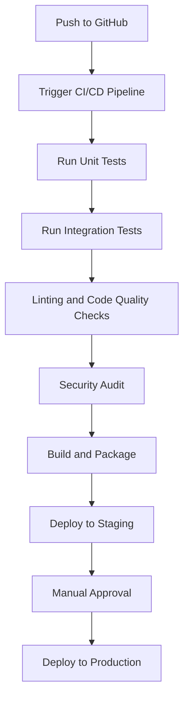

# Project Review Summary

**Created:** March 13, 2025  
**Updated:** December 29, 2025  
**Author:** Kirk LaSalle; GitHub Copilot  
**Tags:** #ids #standardized_header #docs\process\project_review_summary.md #documentation #gpu_optimization #inference #security #testing #training #web_interface  
**Category:** Documentation  
**Status:** Active
**IDS Integration:** This document is indexed and searchable via the ImpressionCore Documentation System (IDS).

---

# Project Review Summary

## 📌 Workspace and Documentation Analysis

### Strengths

- Clear, structured documentation with good examples.

### Areas for Improvement

- Explicit dependency management (e.g., `requirements.txt`).
- Concrete examples for data preparation, pretraining, and embedding extraction.

## 📌 Codebase Analysis

### Strengths

- Modular structure with clear separation of concerns.

### Areas for Improvement

- Consistency in naming conventions and coding standards.
- Enhanced inline documentation and comments.
- Improved error handling and logging.

## 📌 Specific Code Review Recommendations

### Training and Model Implementation

- Clearly define and document interfaces and behaviors of base classes (`BaseModel`, `ConfigMixin`).
- Provide detailed examples of custom model implementations and configurations.

### Checkpoint Management

- Enhance checkpoint management with clear versioning and metadata tracking.
- Provide scripts for automated checkpoint validation and cleanup.

### Web Server and Frontend

- Evaluate and enhance security practices (input validation, sanitization).
- Improve frontend modularity and maintainability.

## 📌 Testing and CI/CD Evaluation

### Recommendations

- Implement comprehensive unit and integration tests.
- Set up automated CI/CD pipelines (e.g., GitHub Actions).

### Recommended CI/CD Workflow



## 📌 Performance and Optimization

### Recommendations

- Profile training and inference workflows.
- Implement caching strategies.
- Explore distributed training or GPU optimization.

## 📌 Security and Error Handling

### Recommendations

- Implement comprehensive input validation and sanitization.
- Regularly audit dependencies for vulnerabilities.

## 🚀 Next Steps and Recommendations

### Immediate Actions

- Enhance documentation.
- Refactor codebase for consistency.
- Develop comprehensive testing strategies.

### Medium-Term Actions

- Optimize performance through profiling and caching.
- Improve security practices.
- Implement automated CI/CD pipelines.

## 📁 Proposed Documentation Structure

``` text
project-root/
├── docs/
│   ├── Walkthrough.html (existing, enhanced)
│   ├── dependencies.md (new)
│   ├── data_preparation.md (new)
│   ├── pretraining.md (new)
│   ├── embedding_extraction.md (new)
│   ├── testing_evaluation.md (new)
│   ├── inference.md (new)
│   └── checkpoint_management.md (enhanced)
├── src/
│   ├── models/
│   ├── training/
│   ├── web/
│   └── utils/
├── tests/ (new)
│   ├── unit/
│   └── integration/
├── scripts/ (new)
│   ├── data_preparation/
│   ├── pretraining/
│   └── checkpoint_management/
├── requirements.txt (new)
├── .github/
│   └── workflows/
│       └── ci-cd.yml (new)
└── README.md (enhanced)
```

This document summarizes the detailed analysis and recommendations provided during the review process.
