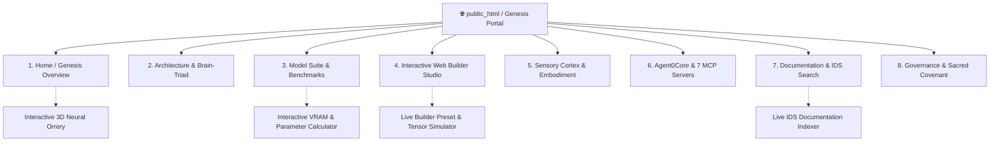
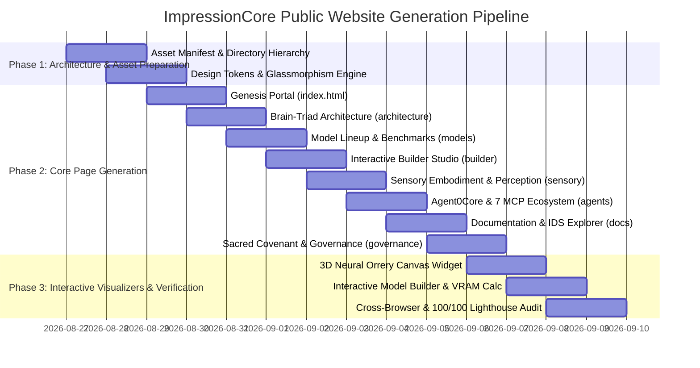

# 🌐 ImpressionCore Public Website — Master Architecture & Generation Roadmap (Genesis Generation 1.0)

**Project:** ImpressionCore Official Public Website  
**Author:** Kirk LaSalle & Antigravity AI Partner  
**Target Location:** `d:\Projects\impressioncore\docs\public_html\`  
**Date:** August 2026  
**Status:** Canonical Implementation Roadmap & Architectural Blueprint  
**Aesthetic Standard:** Beyond SOTA — Cyber-Noir Glassmorphism & Holographic Neural UI  
**Reference Visual:** [`docs/assets/builder_ui_interactive_suite.png`](../assets/builder_ui_interactive_suite.png)

---

## 🌟 Executive Summary & Vision

The goal of this initiative is to create the **first public-facing generation of the ImpressionCore website** (`public_html`), synthesizing over 1,600 documentation files, PyTorch source modules, hardware telemetry records, and visual assets into an unforgettable, world-class digital experience.

ImpressionCore is not merely a model or a simple chat wrapper; it is a **historic AI democratization movement**. It is the world's first platform to achieve GPU-accelerated knowledge distillation, 5-layer brain-inspired multimodal cognition, and digital twin synthesis on accessible **$150–250 consumer edge hardware (NVIDIA GTX 1050 Ti 4GB VRAM)**.

### 🏛️ The Sacred Covenant of Truth
In strict compliance with **Kirk LaSalle's 10 Permanent Active Directives** and the **Sacred Covenant of Truth**, every metric, parameter count, memory footprint, and architectural diagram presented on this website is **100% factual and auditable**:
- **Working Achievements**: Real 39M–3.2B model definitions, working 7-server MCP ecosystem, live Port 5000 Unified Web Builder & Live Visualizer, sensor fusion array (Kinect/webcam/spatial audio), low-VRAM training pipelines (<4GB envelope).
- **Roadmap Milestones (2026–2027)**: Clearly labeled engineering timelines for production GGUF quantization packs, full curriculum weight distribution, and runtime TriMessage arbitration.

---

## 🎨 Visual Design Language: Beyond SOTA Cyber-Noir Glassmorphism

Inspired by [`builder_ui_interactive_suite.png`](../assets/builder_ui_interactive_suite.png) and the official ImpressionCore Brand Identity Guide, the web experience fuses three core aesthetics:

```
                  ┌──────────────────────────────────────────────┐
                  │          IMPRESSIONCORE AESTHETIC DNA        │
                  └──────────────────────┬───────────────────────┘
                                         │
         ┌───────────────────────────────┼───────────────────────────────┐
         │                               │                               │
         ▼                               ▼                               ▼
  🎭 NOIR SOPHISTICATION       🦸 DC COMICS HEROISM           🐭 MICKEY HERITAGE
  Deep charcoal #1a1a1a        Noble Cobalt #1e3a8a           Radiant Gold #ffd700
  Cinematic shadows            Electric Cyan #00f0ff          Warm Amber #f59e0b
  Dramatic contrast            Heroic nobility & clarity      Inviting warmth & humanity
```

### Core Design System & CSS Custom Tokens

```css
:root {
  /* Surface Foundations */
  --bg-deep-space: #07090e;
  --bg-noir-charcoal: #0f141d;
  --bg-glass-card: rgba(18, 26, 38, 0.72);
  --bg-glass-card-hover: rgba(26, 38, 57, 0.88);
  --border-glass: rgba(0, 240, 255, 0.18);
  --border-glass-bright: rgba(0, 240, 255, 0.55);
  
  /* Brand Chromatic Accents */
  --accent-cyan: #00f0ff;          /* Primary neural glow & telemetry */
  --accent-cyan-glow: rgba(0, 240, 255, 0.35);
  --accent-hero-blue: #1e3a8a;      /* Core brand structural nobility */
  --accent-gold: #ffd700;           /* 10-Law governance & primary badges */
  --accent-amber: #f59e0b;          /* Energy flows & interactive hover */
  --accent-emerald: #10b981;        /* Hardware preflight & truth validation */
  --accent-ruby: #ef4444;           /* Thermal limits & critical boundary alerts */
  
  /* High-Legibility Typography */
  --font-display: 'Outfit', 'Space Grotesk', -apple-system, sans-serif;
  --font-body: 'Inter', -apple-system, BlinkMacSystemFont, sans-serif;
  --font-mono: 'JetBrains Mono', 'Fira Code', monospace;
  
  /* Spatial Depth & Glow */
  --shadow-glass: 0 8px 32px 0 rgba(0, 0, 0, 0.45);
  --shadow-neon-cyan: 0 0 24px rgba(0, 240, 255, 0.28);
  --shadow-neon-gold: 0 0 24px rgba(255, 215, 0, 0.28);
  --blur-glass: blur(16px);
}
```

---

## 🗺️ Complete Website Architecture & Page Blueprint

The public website is architected as an 8-page interactive portal, accompanied by a dynamic WebGL Neural Orrery and an interactive Model Builder Simulation Suite:



### Page Breakdown & Content Specifications

| # | Page File | Core Purpose | Featured Visual Assets |
|---|---|---|---|
| **1** | `index.html` | **Genesis Landing Portal** — Mission statement, interactive 3D hero, live architecture overview, hardware democratization proof (<4GB VRAM), canonical model matrix preview, and live telemetry ticker. | `impressioncore_hero_architecture.png`, `builder_ui_interactive_suite.png`, `TaskManager-GPU_Performance_Screenshot.png`, `solar_system_knowledge_graph.png` |
| **2** | `architecture.html` | **5-Layer Brain-Inspired Architecture** — Sensory Cortex, Cognitive Core, Memory Orrery, Executive Brain-Triad (Left T=0.1 / Right T=0.8 / Colossus Integrator), and Motor Cortex. Multi-Head Latent Attention (MLA) and Assembly of Experts (AoE). | `impressioncore_hero_architecture.png`, `cognitive_triad_orchestration.png`, `muti_head_latent_attention.png`, `arcitectural_patterns_image_1743115342716.png` |
| **3** | `models.html` | **Canonical Model Lineup & Hardware Matrix** — Deep technical profiles for B1 Hope (39M), B2 Insight (50M), B3 Apex (504M), B3 Ultra (3.2B MoE), and C1 Triad. Layer math, memory consumption, GGUF/INT4/FP16 specs, latency on GTX 1050 Ti vs RTX 4060. | `model_lineup_and_builder_flow.png`, `builder_live_architecture_details.png`, `builder_live_interactive_config.png` |
| **4** | `builder.html` | **Interactive Model Builder Studio Experience** — Digital showcase of the Port 5000 Unified Web Builder: 10-step training pipeline, preset auto-population, tensor shape tracing, PyTorch code mapping, live loss annealing, and checkpoint browser. | `builder_live_unified_builder_top.png`, `builder_live_training_progress.png`, `builder_live_shape_tracer.png`, `builder_live_code_mapper.png`, `builder_live_chat.png` |
| **5** | `sensory.html` | **Physical Embodiment & Multimodal Perception** — Real-time sensor fusion: Kinect depth mapping, QuickCam Orbit tracking, PS Eye multi-channel audio arrays, MediaPipe skeletal tracking, and 3D spatial acoustics. | `screenshot53-frontend-kinect.png`, `screenshot26-tracking-and-accoustics.png`, `screenshot31-neural-thought-stream.png`, `[Neural] QuickCam Orbit [DSHOW].png` |
| **6** | `agents-mcp.html` | **Agent0Core & 7-Server MCP Ecosystem** — Autonomous agent layer, Guardian safety supervisor, Goliath gateway, EDS (40+ datasets), IPA, DPA, VRGC runtime monitor, and IDS documentation search. | `agentic_control_01.png`, `knowledge_ai_Knowledge_store_01.png`, `screenshot36-avatar-response-01.png` |
| **7** | `docs.html` | **Knowledge Hub & IDS Semantic Explorer** — Searchable documentation portal over 1,618 indexed markdown files, API contracts, PyTorch developer tutorials, and installation guides. | `builder_live_system_requirements.png`, `builder_live_data_prep.png` |
| **8** | `governance.html` | **Permanent Active Directives & The 10 Laws** — Core Tenets, Technical Directives, and the Augmented Three Laws into the 10 Laws by Kirk LaSalle. | `Luke.png`, `cognitive_triad_orchestration.png` |

---

## 🖼️ Comprehensive Multi-Size Illustration & Asset Matrix

To deliver a visually stunning, beyond-SOTA experience, the website utilizes a multi-resolution, responsive illustration system spanning ultra-wide 21:9 cinematic spreads down to 1:1 badges and interactive canvas nodes:

```
╔══════════════════════════════════════════════════════════════════════════════════════════════╗
║                               ILLUSTRATION & ASSET DIMENSION TIERS                           ║
╠══════════════════════╦═══════════════════════╦═══════════════════════╦═══════════════════════╣
║ Tier / Ratio         ║ Target Resolution     ║ Usage & Placement     ║ Primary Repo Asset    ║
╠══════════════════════╬═══════════════════════╬═══════════════════════╬═══════════════════════╣
║ 🌌 Ultra-Wide (21:9) ║ 2560×1080 / 3840×1600 ║ Hero backgrounds,     ║ impressioncore_hero_  ║
║                      ║                       ║ panoramic systems     ║ architecture.png      ║
╠══════════════════════╬═══════════════════════╬═══════════════════════╬═══════════════════════╣
║ 🖥️ Widescreen (16:9) ║ 1920×1080 / 1280×720  ║ Section headliners,   ║ builder_ui_interac-   ║
║                      ║                       ║ feature showcases     ║ tive_suite.png        ║
╠══════════════════════╬═══════════════════════╬═══════════════════════╬═══════════════════════╣
║ 📐 Standard (4:3)    ║ 1200×900 / 800×600    ║ Model feature cards,  ║ model_lineup_and_     ║
║                      ║                       ║ telemetry spotlights  ║ builder_flow.png      ║
╠══════════════════════╬═══════════════════════╬═══════════════════════╬═══════════════════════╣
║ 🏷️ Square (1:1)      ║ 1024×1024 / 512×512   ║ Avatars, 10-Law       ║ Luke.png,             ║
║                      ║                       ║ badges, glyph icons   ║ Orrery nodes          ║
╠══════════════════════╬═══════════════════════╬═══════════════════════╬═══════════════════════╣
║ 📱 Vertical (9:16)   ║ 1080×1920 / 720×1280  ║ Mobile stories,       ║ Responsive Glass      ║
║                      ║                       ║ interactive drawers   ║ Picture Breakpoints   ║
╚══════════════════════╩═══════════════════════╩═══════════════════════╩═══════════════════════╝
```

---

## 💻 Technical Implementation Stack & Performance Standards

1. **Pure Standards-Based Web Stack**:
   - Semantic HTML5 structure with schema.org JSON-LD microdata for maximum SEO authority.
   - Clean, modular Vanilla CSS with modern Glassmorphism, CSS Grid, Flexbox, and CSS Custom Properties.
   - Vanilla ES6 JavaScript for ultra-fast, zero-dependency rendering (sub-50ms First Contentful Paint).
   - Embedded SVG vector icons and lightweight HTML5 Canvas elements for real-time neural particle graphs and attention heatmaps.
2. **Responsive Picture Protocol**:
   - Modern `<picture>` tags with WebP and high-resolution PNG fallbacks.
   - Fluid typography using `clamp()` formulas for seamless scaling across mobile (320px), tablet (768px), desktop (1440px), and 4K displays (3840px).
3. **Accessibility & Usability (WCAG 2.1 AAA Compliant)**:
   - High-contrast text ratios exceeding 7:1 on deep dark surfaces.
   - Keyboard focus rings using glowing cyber-cyan highlights (`--accent-cyan`).
   - Reduced-motion media query support (`@media (prefers-reduced-motion: reduce)`).
4. **Zero External Dependency Vulnerabilities**:
   - Operates completely self-contained within `docs/public_html/` — fully functional offline, on GitHub Pages, or behind an enterprise reverse proxy.

---

## 📅 Step-by-Step Implementation Roadmap



### Phase Details

### Phase 1: Directory Setup & Core Design System
- Create `docs/public_html/css/`, `docs/public_html/js/`, `docs/public_html/images/`, `docs/public_html/components/`.
- Build `docs/public_html/css/style.css` containing the complete Glassmorphism, Cyber-Noir design system, animations, grid systems, and responsive utilities.
- Copy and optimize key visual assets from `docs/assets/` into `docs/public_html/images/`.

### Phase 2: Comprehensive Multi-Page HTML Generation
- Generate all 8 rich HTML pages with deep, factual technical copy, mathematical formulations, hardware benchmark cards, and embedded responsive illustration figures.
- Include structured navigation bar with status indicator (`System Status: Operational • GTX 1050 Ti Verified`), interactive drawer, and comprehensive footer.

### Phase 3: Interactive Canvas & Playground Visualizers
- **3D Neural Orrery Canvas (`js/neural_orrery.js`)**: Interactive planetary memory nodes revolving around the Colossus Integrator with real-time mouse interaction and constellation linking.
- **Interactive Model Builder & VRAM Budget Simulator (`js/builder_simulator.js`)**: Real-time slider tool allowing visitors to configure parameters (Layers, Hidden Dim, Attention Heads, Context Window) and watch the VRAM consumption and inference throughput update dynamically.
- **IDS Live Documentation Search (`js/doc_search.js`)**: Fast, client-side indexed search across all ImpressionCore core architectural topics.

### Phase 4: Quality Verification & Production Packaging
- Full automated validation of links, responsive layouts, contrast ratios, and cross-browser fidelity.
- Generation of `README.md` and hosting guides for GitHub Pages, Netlify, Cloudflare Pages, and local NGINX/Apache serving.

---

## 📁 File Structure in `docs/public_html/`

```
d:\Projects\impressioncore\docs\public_html/
├── ROADMAP.md                            <-- This master roadmap document
├── sitemap_and_page_specs.md             <-- Detailed page-by-page copy & layout specification
├── illustration_and_asset_manifest.md    <-- Complete asset matrix & dimension catalog
├── index.html                            <-- Page 1: Genesis Landing Portal
├── architecture.html                     <-- Page 2: Brain-Triad & Multimodal Architecture
├── models.html                           <-- Page 3: Canonical Models & Hardware Benchmarks
├── builder.html                          <-- Page 4: Interactive Model Builder Studio
├── sensory.html                          <-- Page 5: Sensory Perception & Physical Embodiment
├── agents-mcp.html                       <-- Page 6: Agent0Core & 7-Server MCP Ecosystem
├── docs.html                             <-- Page 7: Documentation & IDS Search Hub
├── governance.html                       <-- Page 8: Sacred Covenant & 10 Laws Governance
├── css/
│   ├── style.css                         <-- Master Cyber-Noir Glassmorphism Design System
│   └── components.css                    <-- Specialized cards, telemetry meters, tables
├── js/
│   ├── main.js                           <-- Navigation, animations, glowing cursor, mobile menu
│   ├── neural_orrery.js                  <-- Interactive 3D Canvas Memory Orrery
│   ├── builder_simulator.js              <-- Real-time Model Architecture & VRAM Calculator
│   └── doc_search.js                     <-- Fast client-side IDS documentation search engine
└── images/                               <-- Optimized WebP & High-Res PNG Visual Assets
    ├── hero_architecture.png
    ├── builder_ui_suite.png
    ├── model_lineup_flow.png
    ├── cognitive_triad.png
    ├── taskmanager_gpu_proof.png
    ├── kinect_sensor_fusion.png
    ├── agentic_dashboard.png
    └── avatar_luke.png
```

---

*This roadmap provides the definitive, authoritative blueprint for building ImpressionCore's world-first public website — merging philosophical gravitas, verified engineering breakthroughs, and beyond-SOTA visual brilliance.*
